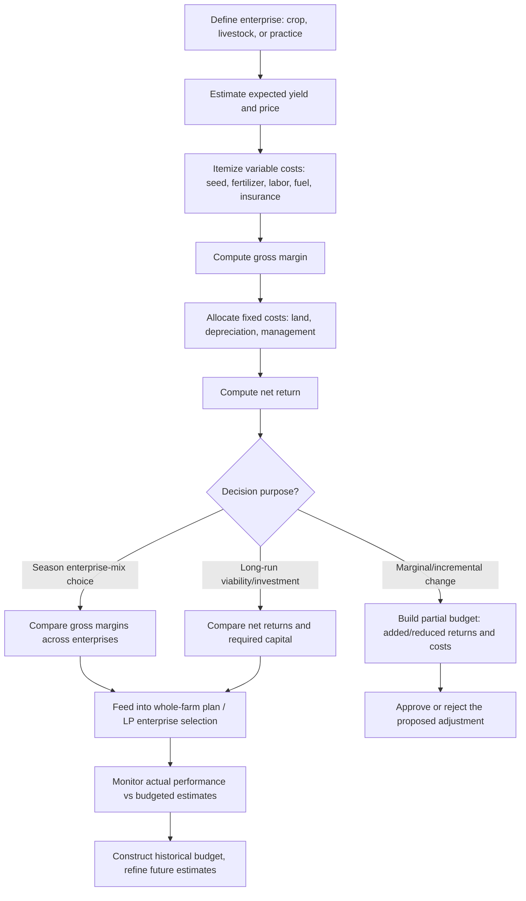

## Enterprise Budgeting

### Definition and Conceptual Foundation

Enterprise budgeting is the systematic estimation of revenue, costs, and returns associated with a single, well-defined production activity — one crop grown on one hectare, one head of livestock over a production cycle, or one distinct farm operation — expressed on a standardized per-unit basis. It is the foundational analytical building block underlying nearly all higher-level farm decision-making tools: farm business planning, multi-product enterprise-mix optimization, and profitability comparison across alternative technologies or practices all rely on enterprise budgets as their basic input data.

Unlike a full farm business plan, which integrates every enterprise plus financing, marketing, and risk management into a whole-farm view, an enterprise budget deliberately isolates **one** activity to answer a narrower but essential question: what does it cost to produce this specific output, and what return does it generate, per unit of the limiting resource?

### The Structure of an Enterprise Budget

An enterprise budget is organized into four sequential sections, each building toward a measure of profitability at increasing levels of cost inclusiveness.

#### 1. Revenue (Gross Income)

$$\text{Total Revenue} = (\text{Expected Yield} \times \text{Expected Price}) + \text{Byproduct Value} + \text{Government Payments (if any)}$$

Revenue estimation requires an expected yield (typically based on historical farm records, regional trial data, or agronomic recommendations for the specific input package assumed in the budget) and an expected price (from futures markets, historical seasonal averages, or contracted forward prices where applicable).

#### 2. Variable Costs (Operating Costs)

Costs that vary directly with the level of production and are incurred only if the enterprise is undertaken:

- Seed or planting stock
- Fertilizer and soil amendments
- Crop protection (herbicides, pesticides, fungicides)
- Fuel and lubricants for field operations
- Hired seasonal/casual labor
- Irrigation water and associated energy costs
- Crop insurance premiums
- Interest on operating capital (the cost of financing the variable inputs themselves, from purchase until sale)
- Marketing and transport costs directly tied to the harvested output

#### 3. Gross Margin

$$\text{Gross Margin} = \text{Total Revenue} - \text{Total Variable Costs}$$

Gross margin represents the enterprise's contribution toward covering the farm's fixed costs and, beyond that, toward profit. It is the single most widely used metric for **short-run, resource-allocation decisions** — deciding which enterprises to include in this season's plan given already-committed fixed resources — precisely because fixed costs do not change with the enterprise-mix decision in the short run, making gross margin the economically relevant comparison metric.

#### 4. Fixed (Overhead) Costs and Net Return

Costs that do not vary with the specific enterprise or its production level, typically allocated across enterprises on some reasonable basis (per hectare, per labor-hour):

- Depreciation on machinery and buildings
- Property taxes and insurance on fixed assets
- Land rent or the opportunity cost of owned land
- Permanent/salaried labor
- Interest on term (long-run) debt
- Management charge (the imputed value of the operator's own management time)

$$\text{Net Return (Net Farm Income from the enterprise)} = \text{Gross Margin} - \text{Allocated Fixed Costs}$$

Net return is the relevant metric for **long-run** decisions: whether to remain in an enterprise at all, whether to invest in additional fixed capacity, or whether the farm business as a whole is economically viable once all costs — including the opportunity cost of the operator's own land, labor, and management — are accounted for.

### Illustration: Enterprise Budget Waterfall Structure (svg_diagram)

<svg xmlns="http://www.w3.org/2000/svg" viewBox="0 0 520 320">
<text x="260" y="22" text-anchor="middle" font-size="15" font-weight="bold" fill="#222">Enterprise Budget Waterfall (svg_diagram)</text>
<line x1="60" y1="280" x2="480" y2="280" stroke="#333" stroke-width="1.2" />

<rect x="70" y="70" width="60" height="210" fill="#2c6e2c" />
<text x="100" y="65" text-anchor="middle" font-size="11">Revenue</text>
<text x="100" y="295" text-anchor="middle" font-size="10">$880</text>

<rect x="150" y="70" width="60" height="130" fill="#aa3322" />
<text x="180" y="65" text-anchor="middle" font-size="11">Variable</text>
<text x="180" y="78" text-anchor="middle" font-size="11">Costs</text>
<text x="180" y="215" text-anchor="middle" font-size="10">−$360</text>

<rect x="230" y="150" width="60" height="130" fill="#2255aa" />
<text x="260" y="145" text-anchor="middle" font-size="11">Gross</text>
<text x="260" y="158" text-anchor="middle" font-size="11">Margin</text>
<text x="260" y="295" text-anchor="middle" font-size="10">$520</text>

<rect x="310" y="150" width="60" height="80" fill="#aa6622" />
<text x="340" y="145" text-anchor="middle" font-size="11">Fixed</text>
<text x="340" y="158" text-anchor="middle" font-size="11">Costs</text>
<text x="340" y="235" text-anchor="middle" font-size="10">−$220</text>

<rect x="390" y="200" width="60" height="80" fill="#6a3fa0" />
<text x="420" y="195" text-anchor="middle" font-size="11">Net</text>
<text x="420" y="208" text-anchor="middle" font-size="11">Return</text>
<text x="420" y="295" text-anchor="middle" font-size="10">$300</text>
</svg>

### Worked Example: Full Enterprise Budget

**Example**

A one-hectare maize enterprise budget, per production cycle:

**Revenue**

- Expected yield: 4.0 tons/ha
- Expected price: $220/ton
- Total revenue: $4.0 \times 220 = \$880$

**Variable costs**

| Item | Cost |
| --- | --- |
| Seed | $60 |
| Fertilizer (basal + top-dress) | $150 |
| Herbicide/pesticide | $40 |
| Hired labor (planting, weeding, harvest) | $80 |
| Fuel and machinery operation | $30 |
| Interest on operating capital (10% of variable costs, half-season average) | $18 |
| **Total variable costs** | **$378** |

**Gross margin**: $880 - 378 = \$502$/ha

**Allocated fixed costs**

| Item | Cost |
| --- | --- |
| Land opportunity cost/rent | $120 |
| Machinery depreciation (allocated share) | $70 |
| Property tax and insurance | $15 |
| Management charge | $15 |
| **Total allocated fixed costs** | **$220** |

**Net return**: $502 - 220 = \$282$/ha

This structure allows the same maize enterprise to be directly compared against an alternative enterprise (e.g., soybean, or a different maize input package) at both the gross-margin level (for the current-season crop-mix decision) and the net-return level (for the longer-run viability assessment) — the same distinction and worked comparison introduced under farm business planning.

### Types of Enterprise Budgets

**Key Points**

- **Estimated (planning) budgets**: constructed *ex ante*, before the production cycle, using expected yields and prices — the standard tool for the tactical/seasonal planning decisions discussed under farm business planning.
- **Historical (actual) budgets**: constructed *ex post*, using realized yields, prices, and costs from a completed production cycle — used for performance review and to refine future estimated budgets (closing the monitor-review-revise loop of the farm planning cycle).
- **Whole-farm versus per-unit budgets**: budgets can be expressed either in whole-farm totals (useful for cash flow and financing decisions) or on a standardized per-hectare/per-head basis (essential for comparing enterprises of different scales or for benchmarking against regional or extension-published reference budgets).
- **Partial budgets**: distinct from a full enterprise budget, a **partial budget** evaluates only the *incremental* financial effect of a specific proposed change (e.g., switching 10 hectares from maize to soybean, or adding an irrigation system to an existing enterprise), comparing only the added revenues and reduced costs against the added costs and reduced revenues of the change — a more targeted tool than rebuilding a full enterprise budget when only a marginal adjustment is being evaluated.

### The Partial Budget Framework

A partial budget systematically organizes the four categories of financial change from a proposed adjustment:

| Positive effects | Negative effects |
| --- | --- |
| Added returns (new revenue gained) | Reduced returns (revenue lost) |
| Reduced costs (costs no longer incurred) | Added costs (new costs incurred) |

$$\text{Net Change in Profit} = (\text{Added Returns} + \text{Reduced Costs}) - (\text{Reduced Returns} + \text{Added Costs})$$

**Example**

A farmer considers replacing 5 hectares of a low-yielding pasture enterprise with irrigated vegetable production. Added returns from vegetable sales: $4,000; reduced costs from no longer maintaining pasture and livestock on that land: $300; reduced returns from lost pasture/grazing value: $500; added costs of irrigation equipment operation, seed, and labor: $2,800.

$$\text{Net Change} = (4{,}000 + 300) - (500 + 2{,}800) = 4{,}300 - 3{,}300 = \$1{,}000 \text{ gain}$$

The proposed change is projected to increase profit by $1,000, without requiring the farmer to rebuild complete enterprise budgets for either the old or new activity — only the components that actually change need to be quantified.

### Diagram: Enterprise Budget Development and Application Workflow

### Sensitivity Analysis and Break-Even Applications

Because enterprise budgets rely on estimated yields and prices that are inherently uncertain, applied use typically incorporates **sensitivity analysis** — recalculating gross margin and net return across a plausible range of yield and price assumptions rather than relying on a single point estimate.

$$\text{Break-even yield} = \frac{\text{Total Costs}}{\text{Price}}, \qquad \text{Break-even price} = \frac{\text{Total Costs}}{\text{Yield}}$$

A common presentation format is a **sensitivity table**, cross-tabulating gross margin or net return outcomes across a grid of yield and price scenarios, giving the decision-maker a direct visual sense of how robust the enterprise's profitability is to unfavorable realizations of either variable — directly operationalizing the break-even and risk concepts introduced under farm business planning and risk in agricultural production, but at the specific enterprise level rather than the whole-farm level.

### Common Data Sources for Enterprise Budget Construction

**Key Points**

- **University and government extension-published reference budgets**: many agricultural extension services publish standardized enterprise budgets by crop, region, and technology package, serving as a starting template that individual farms adjust to their own specific circumstances.
- **Farm's own historical production and financial records**: the most reliable source where available, since it reflects the specific farm's actual yield potential, cost structure, and management practices rather than a regional average.
- **Custom rate surveys**: published rates for hired machinery operations, informing the variable cost estimates for farms that do not own all equipment outright.
- **Input supplier price lists and current market price quotes**: for seed, fertilizer, and agrochemical cost line items.
- **Futures markets and marketing-year average price projections**: for output price estimates, particularly for commodities with active futures trading.

[Inference: the appropriate blend of extension reference data versus farm-specific historical data depends on how representative the reference budget's assumed technology package and yield potential are of the specific farm in question — a highly mechanized reference budget applied uncritically to a smallholder operation with different input access would produce a materially misleading estimate.]

### Applications in Agricultural Economics

1. **Enterprise selection and farm planning**: enterprise budgets are the direct input data for the multi-product decision-making and whole-farm LP frameworks, providing the gross margin figures used to rank and select the profit-maximizing enterprise combination.
2. **Loan applications and lender assessment**: lenders commonly require enterprise budgets supporting a proposed operating loan, to assess whether projected revenue is sufficient to service the requested credit.
3. **New technology or practice adoption evaluation**: partial budgeting is the standard tool for evaluating whether a proposed change (new variety, irrigation investment, reduced tillage) is likely to be profitable, without the overhead of reconstructing complete enterprise budgets.
4. **Extension program development**: publishing standardized reference enterprise budgets is a core extension service function, translating research trial results and regional cost data into a directly usable farm decision-support tool.
5. **Contract negotiation and pricing**: enterprise budgets inform a farmer's minimum acceptable contract price by revealing the break-even price required to cover variable (or full) costs.
6. **Land rental rate negotiation**: enterprise budget gross margins, particularly the residual return to land after all other costs are covered, provide an economically grounded basis for negotiating fair cash rental rates.
7. **Comparative technology package analysis**: constructing parallel enterprise budgets for alternative input packages (e.g., conventional versus conservation tillage, or different fertilizer regimes) to identify the most profitable practice under current price conditions.

### Common Pitfalls

- **Comparing net returns rather than gross margins when making a short-run enterprise-mix decision**, incorrectly treating already-committed fixed costs as if they were avoidable by the current-season choice.
- **Applying a generic extension reference budget without adjusting for farm-specific yield potential, input access, or cost structure**, producing profitability estimates that do not reflect the actual decision-maker's circumstances.
- **Omitting the interest cost on operating capital** as a variable cost line item, understating the true cost of production for enterprises with a substantial gap between input purchase and output sale.
- **Confusing a partial budget with a full enterprise budget**: using a partial budget to evaluate a decision that actually requires reconstructing the full cost and revenue structure (e.g., an entirely new enterprise with no comparable existing baseline), or conversely, unnecessarily rebuilding a full budget when only an incremental change needs evaluation.
- **Presenting only a single point-estimate outcome** without sensitivity analysis across plausible yield and price scenarios, understating the decision-maker's genuine exposure to the underlying production and price risk documented under risk in agricultural production.

### Related Topics

- Farm business planning
- Multi-product farm decision making
- Cost minimization and profit maximization
- Risk in agricultural production
- Linear programming methods in whole-farm planning
- Break-even analysis and enterprise viability assessment
- Agricultural credit and farm financial management
- Partial budgeting for technology adoption decisions
- Agricultural extension and reference budget development