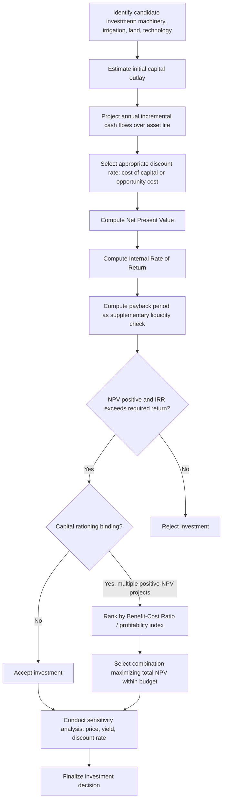

## Capital Budgeting and Investment Analysis

### Definition and Conceptual Foundation

Capital budgeting and investment analysis is the process of evaluating long-term farm investment decisions — purchasing machinery, developing irrigation infrastructure, acquiring land, constructing livestock housing, or adopting a major new technology — where the expenditure is made now but the returns are realized over many future periods. This distinguishes capital budgeting from the enterprise budgeting and partial budgeting tools covered under farm management, which typically evaluate a single production cycle or an incremental within-season change: capital budgeting explicitly incorporates the **time value of money**, since costs and benefits occurring in different years cannot be validly compared without adjustment.

The central conceptual challenge capital budgeting addresses is that a dollar received next year is worth less than a dollar received today (due to the opportunity cost of forgone alternative uses of capital, inflation, and risk), so simply summing undiscounted future cash flows to compare investment alternatives produces economically invalid rankings.

### The Time Value of Money

**Present value (PV)** converts a future cash flow into its equivalent value today, using a discount rate $r$ that reflects the opportunity cost of capital (commonly approximated by the farm's borrowing rate, or the return available on the next-best alternative investment):

$$PV = \frac{FV}{(1+r)^t}$$

**Future value (FV)** performs the reverse conversion, compounding a present sum forward:

$$FV = PV \times (1+r)^t$$

For a stream of cash flows $CF_t$ occurring over $t = 1, ..., n$ years:

$$PV_{\text{stream}} = \sum_{t=1}^{n} \frac{CF_t}{(1+r)^t}$$

**Choice of discount rate** is one of the most consequential and contested judgment calls in applied capital budgeting: too low a rate overstates the attractiveness of long-payoff investments; too high a rate understates it. Common practical choices include the farm's marginal cost of borrowed capital, a weighted average cost of capital (WACC) blending debt and equity costs, or an opportunity-cost rate reflecting the return available on the next-best alternative use of the farm's capital. [Inference: there is no single universally correct discount rate; the appropriate choice depends on the farm's specific financing structure and the risk profile of the investment being evaluated, and sensitivity analysis across plausible discount rates is standard practice given this uncertainty.]

### Illustration: Present Value Discounting of Future Cash Flows (svg_diagram)

<svg xmlns="http://www.w3.org/2000/svg" viewBox="0 0 520 260">
<text x="260" y="22" text-anchor="middle" font-size="15" font-weight="bold" fill="#222">Discounting Future Cash Flows to Present Value (svg_diagram)</text>
<line x1="60" y1="220" x2="480" y2="220" stroke="#333" stroke-width="1.5" />
<text x="485" y="238" font-size="12">Year</text>
<g font-size="11">
<text x="60" y="238" text-anchor="middle">0</text>
<text x="160" y="238" text-anchor="middle">1</text>
<text x="260" y="238" text-anchor="middle">2</text>
<text x="360" y="238" text-anchor="middle">3</text>
<text x="460" y="238" text-anchor="middle">4</text>
</g>

<rect x="145" y="140" width="30" height="80" fill="#8fc98f" />
<rect x="245" y="140" width="30" height="80" fill="#8fc98f" />
<rect x="345" y="140" width="30" height="80" fill="#8fc98f" />
<rect x="445" y="140" width="30" height="80" fill="#8fc98f" />
<text x="160" y="135" text-anchor="middle" font-size="10">$1,000</text>
<text x="260" y="135" text-anchor="middle" font-size="10">$1,000</text>
<text x="360" y="135" text-anchor="middle" font-size="10">$1,000</text>
<text x="460" y="135" text-anchor="middle" font-size="10">$1,000</text>

<rect x="145" y="170" width="30" height="50" fill="#2255aa" opacity="0.85" />
<rect x="245" y="180" width="30" height="40" fill="#2255aa" opacity="0.85" />
<rect x="345" y="188" width="30" height="32" fill="#2255aa" opacity="0.85" />
<rect x="445" y="194" width="30" height="26" fill="#2255aa" opacity="0.85" />
<text x="160" y="165" text-anchor="middle" font-size="9" fill="#fff">PV≈909</text>
<text x="260" y="175" text-anchor="middle" font-size="9" fill="#fff">PV≈826</text>
<text x="360" y="183" text-anchor="middle" font-size="9" fill="#fff">PV≈751</text>
<text x="460" y="189" text-anchor="middle" font-size="9" fill="#fff">PV≈683</text>

<text x="260" y="255" text-anchor="middle" font-size="11" fill="#333">Same nominal $1,000 is worth progressively less today, further in the future (r=10%)</text>

</svg>

### Net Present Value (NPV)

**Net Present Value** is the standard primary investment evaluation criterion: the sum of all discounted cash flows (both costs and revenues) over the investment's life, net of the initial investment outlay.

$$NPV = -C_0 + \sum_{t=1}^{n} \frac{CF_t}{(1+r)^t}$$

where $C_0$ is the initial capital outlay and $CF_t$ is the net cash flow in year $t$ (revenue minus operating costs, often adjusted for taxes and depreciation in a full analysis).

**Decision rule**: accept an investment if $NPV > 0$ (it adds value beyond the required return on capital); reject if $NPV < 0$; among mutually exclusive alternatives, choose the option with the highest positive NPV.

**Example**

A farm evaluates installing a drip irrigation system: initial cost $C_0 = \$15{,}000$, with an expected useful life of 8 years and incremental net cash flow (higher yield and water savings, net of maintenance) of $CF_t = \$3{,}000$/year. At a discount rate of $r = 8\%$:

$$NPV = -15{,}000 + \sum_{t=1}^{8} \frac{3{,}000}{(1.08)^t} = -15{,}000 + 3{,}000 \times 5.747 \approx -15{,}000 + 17{,}241 = \$2{,}241$$

(using the present-value-of-annuity factor for 8 years at 8%, $\approx 5.747$). Since $NPV = \$2{,}241 > 0$, the irrigation investment is projected to add value and should be accepted under the NPV criterion, given the assumed cash flows and discount rate.

### Internal Rate of Return (IRR)

The **Internal Rate of Return** is the discount rate at which NPV exactly equals zero — the break-even required return implicit in the investment's own cash flow stream:

$$0 = -C_0 + \sum_{t=1}^{n} \frac{CF_t}{(1+IRR)^t}$$

**Decision rule**: accept the investment if $IRR$ exceeds the farm's required rate of return (its cost of capital or discount rate); reject if it falls short.

**Relationship to NPV**: for conventional cash flow patterns (one initial outflow followed by a stream of positive inflows), NPV and IRR generally agree on accept/reject decisions for a single investment evaluated in isolation. However, when **ranking mutually exclusive alternatives** of different scale or cash flow timing, IRR can produce a different ranking than NPV — a well-documented limitation, since IRR implicitly assumes interim cash flows are reinvested at the IRR itself (often an unrealistically high rate), whereas NPV's reinvestment assumption uses the specified discount rate. **NPV is generally the theoretically preferred criterion** for ranking mutually exclusive investments of different scale, while IRR remains popular in practice for its intuitive percentage-return interpretation.

### Payback Period

The **payback period** measures the time required for cumulative undiscounted cash flows to recover the initial investment:

$$\text{Payback Period} = \text{years until } \sum_{t=1}^{T} CF_t = C_0$$

A **discounted payback period** variant applies the same logic to discounted cash flows, partially addressing the plain payback method's key weakness. The plain payback period is widely used in practice for its simplicity and directness in communicating liquidity risk, but has two well-known limitations: it ignores the time value of money entirely (unless discounted), and — more fundamentally — it ignores all cash flows occurring **after** the payback threshold is reached, potentially favoring a quick-payback but lower-total-value investment over a slower-payback but substantially higher-NPV alternative. [Inference: payback period is best used as a supplementary liquidity/risk screening tool alongside NPV or IRR, rather than as the primary profitability criterion, given this well-recognized limitation.]

### Summary Comparison of Investment Criteria

| Criterion | Accounts for time value of money | Accounts for full cash flow stream | Primary use case |
| --- | --- | --- | --- |
| Net Present Value (NPV) | Yes | Yes | Primary ranking criterion, especially for mutually exclusive alternatives |
| Internal Rate of Return (IRR) | Yes | Yes | Intuitive percentage-return communication; secondary check to NPV |
| Payback Period | No (unless discounted) | No (ignores flows after payback) | Quick liquidity/risk screening |
| Discounted Payback Period | Yes | No (still ignores flows after payback) | Liquidity screening with time-value adjustment |
| Benefit-Cost Ratio | Yes | Yes | Capital-rationing situations; ranking under a fixed budget constraint |

### Benefit-Cost Ratio and Capital Rationing

The **Benefit-Cost Ratio (BCR)** expresses the present value of benefits relative to the present value of costs:

$$BCR = \frac{PV(\text{Benefits})}{PV(\text{Costs})}$$

An investment is acceptable under this criterion if $BCR > 1$. BCR is particularly useful under **capital rationing** — when a farm faces a binding budget constraint and must choose among multiple positive-NPV investments that collectively exceed available capital — since ranking by BCR (or more precisely, by the **profitability index**, $PV(\text{net benefits})/C_0$) identifies which combination of investments maximizes total NPV per dollar of scarce capital, rather than simply selecting projects in order of absolute NPV.

### Depreciation and Its Role in Capital Budgeting

Capital assets (machinery, buildings, irrigation infrastructure) lose value over time through wear, obsolescence, and age — **depreciation** — which affects capital budgeting analysis in two related but distinct ways:

- **Tax depreciation**: an accounting allowance that reduces taxable income over the asset's useful life, affecting after-tax cash flows used in the NPV/IRR calculation. Specific depreciation schedules (straight-line, declining-balance, or accelerated methods) and their tax treatment vary substantially by jurisdiction and asset class. [Unverified: exact depreciation schedules and tax treatment are jurisdiction- and asset-specific and should be verified against current local tax regulation rather than assumed.]
- **Economic (replacement) depreciation**: the actual decline in the asset's market or replacement value over time, relevant to estimating the asset's salvage value at the end of the analysis period and to replacement-timing decisions (see machinery replacement analysis below).

### Machinery Replacement Analysis

A recurring capital budgeting application specific to farm management is deciding **when** to replace existing machinery, distinct from the initial purchase decision. The standard framework compares the **equivalent annual cost (EAC)** of keeping the current machine one more year against replacing it now:

$$EAC = \frac{NPV_{\text{costs over life}} \times r}{1-(1+r)^{-n}}$$

converting a lump-sum or multi-year cost stream into an equivalent constant annual cost, allowing direct comparison of machines with different remaining useful lives. The optimal replacement decision generally balances **rising maintenance and repair costs** as a machine ages (favoring earlier replacement) against **the opportunity cost of forgoing the current machine's remaining depreciation-adjusted value and incurring a new capital outlay** (favoring delayed replacement), with the specific optimal replacement age varying by machine type, usage intensity, and maintenance cost trajectory. [Inference: no universal optimal replacement age applies across all machinery types and farm contexts; the EAC-minimizing replacement interval must be estimated from the specific asset's maintenance cost history and market resale value trajectory.]

### Diagram: Capital Investment Evaluation Workflow

### Risk and Sensitivity Analysis in Capital Budgeting

Because capital budgeting projects cash flows many years into the future, the estimates are inherently more uncertain than the shorter-horizon enterprise budgets they build upon, and this uncertainty compounds directly with the risk-aversion considerations established under risk in agricultural production. Standard practice incorporates:

- **Sensitivity analysis**: recalculating NPV/IRR across plausible ranges for key uncertain variables (output price, yield increment, discount rate, asset useful life), identifying which variables the investment decision is most sensitive to.
- **Scenario analysis**: evaluating NPV under a small number of discrete, internally consistent scenarios (e.g., "optimistic," "base case," "pessimistic") rather than varying one variable at a time.
- **Risk-adjusted discount rates**: applying a higher discount rate to riskier investment cash flows, effectively penalizing more uncertain projects relative to safer ones within the standard NPV framework — a common practical simplification, though one that implicitly assumes risk increases proportionally over time, which may not hold for all agricultural investment risk profiles.
- **Break-even analysis on the investment itself**: solving for the minimum yield increment, price level, or years of operation required for the investment to achieve $NPV=0$, providing an intuitive risk benchmark analogous to the enterprise-level break-even yield/price concepts.

### Applications in Agricultural Economics

1. **Machinery and equipment purchase decisions**: NPV/IRR analysis comparing the incremental returns from a new or upgraded machine against its full capital and financing cost.
2. **Irrigation and land improvement investment**: evaluating infrastructure investments (drip irrigation, land leveling, drainage) with long useful lives and multi-year payback horizons.
3. **Perennial crop establishment decisions**: orchards, vineyards, and other perennial crops involve a multi-year establishment period with negative cash flows before positive returns begin, making them a classic and demanding capital budgeting application requiring careful multi-year cash flow projection.
4. **Land purchase versus lease analysis**: comparing the NPV of purchasing land (large upfront outlay, ongoing ownership benefits and appreciation potential) against leasing (lower upfront cost, no equity buildup) under different assumed holding periods and land value appreciation scenarios.
5. **Livestock housing and confinement system investment**: evaluating large fixed-capital livestock infrastructure investments against projected productivity or animal welfare/regulatory-compliance benefits over the facility's useful life.
6. **Precision agriculture technology adoption**: assessing whether the fixed setup cost of GPS guidance, variable-rate application systems, or farm management software is justified by the projected input savings and yield improvements over the technology's useful life — directly connecting to the scale-threshold discussion under economies of scale.
7. **Renewable energy investment on farms**: evaluating solar installations, biogas digesters, or wind capacity using standard NPV/IRR analysis, often incorporating specific incentive programs or accelerated depreciation provisions relevant to that asset class and jurisdiction.

### Common Pitfalls

- **Comparing undiscounted cash flow totals across investment alternatives**, ignoring the time value of money and producing invalid rankings, particularly when comparing investments with different cash flow timing patterns.
- **Using IRR alone to rank mutually exclusive investments of different scale**, when NPV is the theoretically preferred criterion for this purpose due to IRR's implicit and often unrealistic reinvestment-rate assumption.
- **Relying exclusively on payback period as the primary decision criterion**, ignoring all value created or destroyed by cash flows occurring after the payback threshold, and ignoring the time value of money unless a discounted variant is used.
- **Selecting an arbitrary or inconsistent discount rate** without connecting it to the farm's actual cost of capital or the specific risk profile of the investment being evaluated, undermining the reliability of the resulting NPV estimate.
- **Omitting sensitivity or scenario analysis on multi-year capital projects**, presenting a single point-estimate NPV as though it were certain, when the compounding of price, yield, and cost uncertainty over a long time horizon typically warrants explicit examination of how the accept/reject decision changes under less favorable assumptions.

### Related Topics

- Farm business planning
- Enterprise budgeting
- Risk in agricultural production
- Cost minimization and profit maximization
- Agricultural credit and farm financing structures
- Machinery replacement and equipment lifecycle economics
- Perennial crop establishment and long-horizon investment planning
- Land tenure economics: purchase versus lease decisions
- Depreciation, taxation, and after-tax cash flow analysis in farm investment