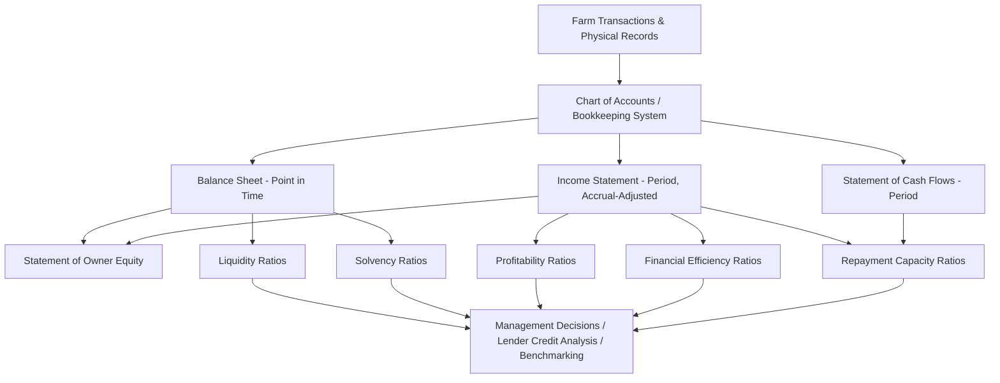

## Farm Financial Statements and Analysis

### Overview

Farm financial statements are the structured records that convert raw farm transactions and physical data into a standardized format usable for decision-making, credit evaluation, and performance benchmarking. Agricultural economics treats farm financial analysis as distinct from general business finance because of three sector-specific features: (1) the coexistence of business and personal household finances within a single farm operation, (2) the presence of significant non-cash elements such as inventory revaluation, depreciation of biological and mechanical assets, and accrual adjustments for growing crops or livestock, and (3) high income variability driven by weather, biological cycles, and commodity price volatility.

The Farm Financial Standards Council (FFSC), a US-based body of agricultural lenders, educators, and accountants, established the standardized framework most widely taught and used: four core statements (balance sheet, income statement, statement of cash flows, statement of owner equity) plus a set of derived ratios grouped into five categories (liquidity, solvency, profitability, repayment capacity, financial efficiency).

---

### The Four Core Farm Financial Statements

#### 1. Balance Sheet (Net Worth Statement)

**Key Points**

- Reports the farm's financial position at a single point in time (a "snapshot"), not over a period.
- Structured as: $\text{Assets} = \text{Liabilities} + \text{Owner Equity}$
- Assets and liabilities are each split into **current** and **non-current (long-term)** categories based on a 12-month time horizon.
- Two valuation methods are used side by side or separately:
  - **Cost basis**: assets valued at original cost minus accumulated depreciation. Favored for measuring true profitability over time since it excludes market speculation.
  - **Market basis**: assets valued at current fair market value. Favored by lenders for assessing collateral and current solvency.
- The difference between market-basis and cost-basis equity is captured in a **contra-equity account** called "retained earnings" vs. "valuation equity," which the FFSC recommends disclosing separately so that gains from inflation or land appreciation are not confused with gains from operational profit.

**Typical Structure**

| Assets | Liabilities |
| --- | --- |
| Current: cash, savings, crops/feed inventory held for sale, market livestock, accounts receivable, prepaid expenses, growing crops | Current: accounts payable, accrued interest, current portion of term debt, operating loans due within 12 months |
| Non-current: breeding livestock, machinery, equipment, buildings, land, investments in cooperatives | Non-current: term loans on machinery/equipment, real estate mortgages, deferred taxes on long-term assets |

$$\text{Owner Equity} = \text{Total Assets} - \text{Total Liabilities}$$

**Example**

A 500-acre grain farm reports $1,200,000 in total assets (market basis) and $450,000 in total liabilities. Owner equity is $1{,}200{,}000 - 450{,}000 = 750{,}000$. This equity figure becomes the numerator/denominator for solvency ratios discussed below.

#### 2. Income Statement (Profit and Loss / Statement of Operations)

**Key Points**

- Measures profitability over a period (typically one production year), not a snapshot.
- Distinguishes **cash-basis** accounting (recording revenue/expense when cash changes hands) from **accrual-basis** accounting (recording revenue/expense when economically earned/incurred, adjusted for inventory changes, accounts receivable/payable, and prepaid items).
- The FFSC strongly recommends **accrual-adjusted** income statements because cash-basis statements can mask true performance — a farmer can appear profitable simply by delaying input purchases into the next tax year or by selling old crop inventory, independent of the current year's production performance.
- Revenue includes: crop and livestock sales, government payments, crop insurance proceeds, custom work income, and gains on sale of culled breeding stock.
- Expenses split into **operating expenses** (seed, fertilizer, feed, fuel, labor, repairs) and **non-operating items** (interest expense, depreciation).

**Accrual Adjustment Formula**

$$\text{Accrual Revenue} = \text{Cash Receipts} + \Delta(\text{Inventory}) + \Delta(\text{Accounts Receivable})$$

$$\text{Accrual Expense} = \text{Cash Expenses} + \Delta(\text{Accounts Payable}) - \Delta(\text{Prepaid Expenses}) + \Delta(\text{Inventory of Purchased Inputs})$$

where $\Delta$ represents the change (ending minus beginning) in that balance sheet item over the accounting period.

**Key Profitability Measures Derived**

| Measure | Formula |
| --- | --- |
| Gross Revenue | Sum of all farm income sources |
| Net Farm Income from Operations | Gross Revenue − Total Operating Expenses − Depreciation − Interest |
| Net Farm Income | Net Farm Income from Operations + Gain/Loss on Sale of Capital Assets |

**Example**

A dairy operation has cash milk sales of $800,000. Accounts receivable rose by $15,000 and feed inventory fell by $20,000 over the year. Accrual-adjusted revenue is $800{,}000 + 15{,}000 - 20{,}000 = 795{,}000$ (the inventory drawdown means some of the cash received reflects prior-year production, not this year's).

#### 3. Statement of Cash Flows

**Key Points**

- Tracks the actual movement of cash in and out of the business, categorized into three activities:
  - **Operating activities**: cash from farm production sales and operating expense payments.
  - **Investing activities**: purchase/sale of machinery, land, breeding livestock.
  - **Financing activities**: loan proceeds, principal payments, owner withdrawals/contributions.
- Unlike the income statement, it ignores accrual adjustments like depreciation (non-cash) but includes principal loan payments (which the income statement excludes because principal is a balance-sheet transaction, not an expense).
- Essential for identifying **liquidity crunches** that a profitable-looking accrual income statement can hide — a farm can be profitable on paper while being cash-poor due to heavy loan principal repayments or capital purchases.

**Structure**

$$\text{Net Change in Cash} = \text{Net Operating Cash Flow} + \text{Net Investing Cash Flow} + \text{Net Financing Cash Flow}$$

#### 4. Statement of Owner Equity

**Key Points**

- Reconciles the change in owner equity between two balance sheet dates.
- Explains *why* equity changed: net income earned, minus withdrawals/dividends for family living expenses, plus/minus valuation changes from market-basis asset revaluation, plus any outside capital contributions.

$$\text{Ending Equity} = \text{Beginning Equity} + \text{Net Farm Income} - \text{Withdrawals} \pm \text{Valuation Changes} + \text{Contributed Capital}$$

**Example**

Beginning equity of $700,000, net farm income of $90,000, family living withdrawals of $60,000, and a $20,000 increase in land market value yields ending equity of $700{,}000 + 90{,}000 - 60{,}000 + 20{,}000 = 750{,}000$, matching the balance sheet example above.

---

### Financial Ratio Analysis (FFSC Sixteen Key Ratios)

The FFSC groups the standard ratio set into five categories. These are used for internal management, lender underwriting (credit scoring), and peer benchmarking (e.g., FINBIN, Kansas Farm Management Association data).

#### 1. Liquidity — ability to meet short-term (within 12 months) obligations without disrupting operations

| Ratio | Formula | Interpretation |
| --- | --- | --- |
| Current Ratio | $\dfrac{\text{Current Assets}}{\text{Current Liabilities}}$ | Above 1.0 desired; below indicates near-term cash strain |
| Working Capital | $\text{Current Assets} - \text{Current Liabilities}$ | Dollar-value cushion for operating expenses |
| Working Capital to Gross Revenue | $\dfrac{\text{Working Capital}}{\text{Gross Revenue}}$ | Normalizes cushion size relative to farm scale |

#### 2. Solvency — ability to meet all obligations if the business were liquidated; long-term financial risk

| Ratio | Formula | Interpretation |
| --- | --- | --- |
| Debt-to-Asset Ratio | $\dfrac{\text{Total Liabilities}}{\text{Total Assets}}$ | Lower is safer; above ~0.6 (60%) is generally considered high-risk in production agriculture |
| Equity-to-Asset Ratio | $\dfrac{\text{Total Equity}}{\text{Total Assets}}$ | Proportion of assets owned free of debt |
| Debt-to-Equity Ratio | $\dfrac{\text{Total Liabilities}}{\text{Total Equity}}$ | Leverage multiple; also called the "leverage ratio" |

#### 3. Profitability — return generated relative to resources employed

| Ratio | Formula | Interpretation |
| --- | --- | --- |
| Rate of Return on Farm Assets (ROA) | $\dfrac{\text{Net Farm Income from Operations} + \text{Interest Expense} - \text{Unpaid Family Labor Value}}{\text{Average Total Farm Assets}}$ | Return earned by total capital, debt and equity combined |
| Rate of Return on Farm Equity (ROE) | $\dfrac{\text{Net Farm Income from Operations} - \text{Unpaid Family Labor Value}}{\text{Average Total Farm Equity}}$ | Return to the owner's invested capital specifically |
| Operating Profit Margin | $\dfrac{\text{Net Farm Income from Operations} + \text{Interest Expense} - \text{Unpaid Labor Value}}{\text{Gross Revenue}}$ | Share of revenue converted to profit before financing |
| Net Farm Income | (see income statement above) | Absolute dollar profitability |

#### 4. Repayment Capacity — ability to service scheduled debt payments from farm and non-farm income

| Ratio | Formula | Interpretation |
| --- | --- | --- |
| Term Debt Coverage Ratio | $\dfrac{\text{Net Farm Income from Operations} + \text{Depreciation} + \text{Interest on Term Debt} + \text{Non-Farm Income} - \text{Family Withdrawals} - \text{Income Tax}}{\text{Annual Scheduled Term Debt Principal and Interest Payments}}$ | Above 1.0 required to meet obligations; lenders typically want a margin above 1.25 |
| Capital Replacement and Term Debt Repayment Margin | Same numerator minus scheduled term debt payments minus unfunded capital replacement | Cash remaining after all term obligations, indicating cushion for further borrowing or replacement of aging capital assets |

#### 5. Financial Efficiency — how effectively the farm converts assets and revenue into output

| Ratio | Formula | Interpretation |
| --- | --- | --- |
| Asset Turnover Ratio | $\dfrac{\text{Gross Revenue}}{\text{Average Total Farm Assets}}$ | Revenue generated per dollar of assets; typically low in land-intensive agriculture compared to other industries |
| Operating Expense Ratio | $\dfrac{\text{Operating Expenses} - \text{Depreciation}}{\text{Gross Revenue}}$ | Share of revenue consumed by operating costs |
| Depreciation Expense Ratio | $\dfrac{\text{Depreciation}}{\text{Gross Revenue}}$ | Capital-intensity indicator |
| Interest Expense Ratio | $\dfrac{\text{Interest Expense}}{\text{Gross Revenue}}$ | Debt-service burden relative to revenue |
| Net Farm Income Ratio | $\dfrac{\text{Net Farm Income from Operations}}{\text{Gross Revenue}}$ | Residual margin after all expense ratios are subtracted; the four expense-ratio components plus this one sum to 100% of gross revenue |

**Example — Applying the Ratios**

A farm has: Total Assets = $1,200,000; Total Liabilities = $450,000; Gross Revenue = $500,000; Net Farm Income from Operations = $85,000; Interest Expense = $25,000.

- Debt-to-Asset Ratio = $450{,}000 / 1{,}200{,}000 = 0.375$ (37.5%) — moderate leverage.
- Asset Turnover = $500{,}000 / 1{,}200{,}000 = 0.417$ — typical for a capital-intensive land-owning operation.
- Operating Profit Margin (ignoring unpaid labor) ≈ $(85{,}000 + 25{,}000)/500{,}000 = 0.22$ (22%).

[Inference] Specific lender thresholds (e.g., the commonly cited 40% "caution" debt-to-asset threshold) vary by lending institution, commodity sector, and prevailing interest rate environment, and should be treated as general benchmarks rather than fixed rules.

---

### Diagram: Flow from Transactions to Ratio Analysis

---

### Illustration: Balance Sheet Structure (svg_diagram)

<svg xmlns="http://www.w3.org/2000/svg" viewBox="0 0 700 380">
\<style\>
.title { font: bold 16px sans-serif; fill: #1a1a1a; }
.header { font: bold 13px sans-serif; fill: #ffffff; }
.label { font: 12px sans-serif; fill: #1a1a1a; }
.box { stroke: #333333; stroke-width: 1.5; }
\</style\>
<text x="350" y="24" text-anchor="middle" class="title">Farm Balance Sheet Structure (svg_diagram)</text>
<rect x="30" y="50" width="280" height="130" fill="#4a7c59" class="box" />
<text x="170" y="72" text-anchor="middle" class="header">CURRENT ASSETS</text>
<text x="45" y="95" class="label" fill="#ffffff">Cash, Savings</text>
<text x="45" y="115" class="label" fill="#ffffff">Crop/Feed Inventory</text>
<text x="45" y="135" class="label" fill="#ffffff">Market Livestock</text>
<text x="45" y="155" class="label" fill="#ffffff">Accounts Receivable</text>
<rect x="30" y="190" width="280" height="150" fill="#2f5233" class="box" />
<text x="170" y="212" text-anchor="middle" class="header">NON-CURRENT ASSETS</text>
<text x="45" y="235" class="label" fill="#ffffff">Breeding Livestock</text>
<text x="45" y="255" class="label" fill="#ffffff">Machinery &amp; Equipment</text>
<text x="45" y="275" class="label" fill="#ffffff">Buildings</text>
<text x="45" y="295" class="label" fill="#ffffff">Land</text>
<rect x="390" y="50" width="280" height="90" fill="#7c4a4a" class="box" />
<text x="530" y="72" text-anchor="middle" class="header">CURRENT LIABILITIES</text>
<text x="405" y="95" class="label" fill="#ffffff">Accounts Payable</text>
<text x="405" y="115" class="label" fill="#ffffff">Current Portion of Term Debt</text>
<rect x="390" y="150" width="280" height="90" fill="#5c3232" class="box" />
<text x="530" y="172" text-anchor="middle" class="header">NON-CURRENT LIABILITIES</text>
<text x="405" y="195" class="label" fill="#ffffff">Term Loans</text>
<text x="405" y="215" class="label" fill="#ffffff">Real Estate Mortgages</text>
<rect x="390" y="250" width="280" height="90" fill="#8a7639" class="box" />
<text x="530" y="272" text-anchor="middle" class="header">OWNER EQUITY</text>
<text x="405" y="295" class="label" fill="#ffffff">Retained Earnings</text>
<text x="405" y="315" class="label" fill="#ffffff">Valuation Equity</text>

<text x="350" y="365" text-anchor="middle" class="label" font-weight="bold">Assets = Liabilities + Owner Equity</text>

</svg>

---

### Common Pitfalls in Farm Financial Analysis

- **Commingling business and personal finances**: Failing to separate family living withdrawals from business expenses distorts both the income statement and equity statement.
- **Ignoring accrual adjustments**: Relying solely on cash-basis records (often driven by tax-minimization bookkeeping) misrepresents actual year-to-year profitability.
- **Inconsistent asset valuation**: Switching between cost and market basis without disclosure makes trend analysis and lender comparisons unreliable.
- **Overlooking unpaid family/operator labor**: Omitting an implicit charge for the operator's own labor and management overstates true economic profit, particularly in ROA/ROE calculations.
- **Single-year snapshot bias**: Agricultural income is inherently volatile due to weather and price cycles; the FFSC and most extension economists recommend analyzing 3–5 year rolling averages of ratios rather than single-year figures. [Inference] The specific number of years used varies by institution and enterprise type.

---

### Practical Example: Mini Case Analysis

A 1,000-acre corn-soybean farm reports the following (all accrual-adjusted, market-basis balance sheet):

| Item | Value |
| --- | --- |
| Total Farm Assets | $3,500,000 |
| Total Farm Liabilities | $1,050,000 |
| Gross Revenue | $900,000 |
| Total Operating Expenses (excl. depreciation, interest) | $650,000 |
| Depreciation | $70,000 |
| Interest Expense | $60,000 |
| Scheduled Term Debt Payment (P&I) | $95,000 |

**Output**

- Net Farm Income from Operations = $900{,}000 - 650{,}000 - 70{,}000 - 60{,}000 = 120{,}000$
- Debt-to-Asset Ratio = $1{,}050{,}000 / 3{,}500{,}000 = 0.30$ (30%) — moderate solvency position.
- Term Debt Coverage Ratio (simplified, ignoring taxes/withdrawals) = $(120{,}000 + 70{,}000 + 60{,}000)/95{,}000 \approx 2.63$ — comfortably above the 1.25 lender benchmark, indicating strong repayment capacity.
- Operating Expense Ratio = $650{,}000/900{,}000 \approx 0.72$ (72%), leaving roughly 28% of revenue to cover depreciation, interest, and net income combined.

**Conclusion**

This farm shows solid solvency (low leverage), strong repayment capacity, but a relatively thin operating margin typical of row-crop operations, meaning profitability is sensitive to commodity price and yield fluctuations even though the balance sheet is well-positioned to absorb short-term shocks.

---

### Related Topics

- Enterprise budgeting and whole-farm budgeting
- Cost of production analysis per unit (per bushel, per hundredweight, per acre)
- Break-even price and yield analysis
- Cash flow projection and sensitivity/scenario analysis
- Farm credit scoring models used by agricultural lenders (e.g., FCS, commercial ag banks)
- Trend analysis using multi-year rolling financial ratios
- Tax management strategies and their interaction with cash- vs. accrual-basis reporting
- Land valuation methods (income capitalization vs. market comparable approach)
- Risk management tools: crop insurance, forward contracting, and their balance sheet effects
- Benchmarking databases (e.g., FINBIN, state Farm Business Management Associations)