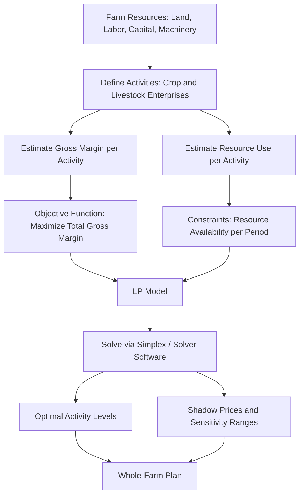

## Whole-Farm Planning and Linear Programming

### Overview

Whole-farm planning is the process of organizing all resources of a farm business — land, labor, capital, machinery, and management — into a coordinated plan that meets the operator's objectives, typically profit maximization, subject to the constraints the farm actually faces. Linear programming (LP) is the principal quantitative technique used to solve this problem: it selects the combination and level of farm enterprises (crops, livestock, agribusiness activities) that optimizes a stated objective function while satisfying a system of linear constraints.

**Key Points**

- Whole-farm planning treats the farm as an integrated system rather than a set of isolated enterprise decisions.
- Linear programming formalizes the planning problem into an objective function and constraint set solvable by optimization algorithms (notably the simplex method).
- The output is not just "the answer" — the shadow prices, ranges, and slack variables generated alongside the optimal solution are often more valuable for management decisions than the optimal plan itself.

---

### The Whole-Farm Planning Problem

#### Nature of the Problem

A farm operator must decide:

1. **What to produce** — which crop and livestock enterprises to include.
2. **How much of each** — the scale/area/herd size of each enterprise.
3. **How to combine resources** — allocation of land, labor, capital, and machinery across enterprises competing for the same finite resources.
4. **How enterprises interact** — competitive (compete for the same resource), complementary (one enterprise's byproduct benefits another, e.g., crop residue feeding livestock), or supplementary (use resources idle in one enterprise, e.g., off-season labor).

#### Traditional (Non-LP) Planning Tools

Before LP, and still used for simpler or illustrative cases:

- **Enterprise budgeting**: per-unit (per hectare, per head) revenue and cost accounting for a single enterprise.
- **Partial budgeting**: evaluates the effect of a small change to an existing plan (e.g., substituting one enterprise for another) by comparing added revenues/reduced costs against reduced revenues/added costs.
- **Whole-farm budgeting**: aggregates enterprise budgets into a farm-level profit and loss statement for one specific plan, but does not search across alternative plans.
- **Programming/planning budgets and simple graphical methods**: for two-enterprise problems, the optimal combination can be found graphically, which is pedagogically useful for introducing LP concepts before matrix formulation.

These tools describe a *given* plan; they do not systematically search the space of feasible plans for the best one. That search problem is what LP solves.

---

### Linear Programming: Formal Structure

#### Components

An LP model for whole-farm planning has three parts:

**1. Objective function** — typically maximize gross margin (or net farm income):

$$\max Z = \sum_{j=1}^{n} c_j x_j$$

where $x_j$ is the level of activity $j$ (e.g., hectares of maize, number of dairy cows), and $c_j$ is the net return (gross margin) per unit of activity $j$.

**2. Constraints** — resource and other limits, expressed as linear inequalities/equalities:

$$\sum_{j=1}^{n} a_{ij} x_j \le b_i \quad \text{for } i = 1, \dots, m$$

where $a_{ij}$ is the amount of resource $i$ required per unit of activity $j$, and $b_i$ is the total available amount of resource $i$.

**3. Non-negativity conditions**:

$$x_j \ge 0 \quad \text{for all } j$$

#### The Four Assumptions of LP

LP requires four assumptions to hold for the model to validly represent the real farm system:

| Assumption | Meaning | Agricultural implication |
| --- | --- | --- |
| Linearity (proportionality) | Returns and resource use grow proportionally with activity level | No economies/diseconomies of scale within the model; a doubling of maize area doubles both cost and return |
| Additivity | Total resource use/return is the simple sum across activities | No interaction effects between enterprises (e.g., no synergy or interference) unless explicitly modeled as a separate activity |
| Divisibility (continuity) | Activity levels can take any non-negative real value | Fractional hectares or fractional livestock units are permitted in the solution (a modeling simplification) |
| Certainty (determinism) | All coefficients ($c_j$, $a_{ij}$, $b_i$) are known with certainty | No allowance for price or yield risk within the base model; risk must be handled by extensions (see below) |

[Inference] In practice, the divisibility assumption is the one most often violated in a materially significant way for whole-farm models involving discrete livestock units or indivisible machinery investments, which is why integer or mixed-integer programming variants exist.

---

### Building a Whole-Farm LP Model

#### Step 1: Define Activities

Activities are the decision variables — each distinct way a resource can be used. A single crop grown under two different technologies (e.g., irrigated vs. rainfed maize) constitutes two separate activities, because their resource requirements and returns differ.

#### Step 2: Define the Objective Function

Gross margin per activity is generally used rather than net profit, because fixed costs (depreciation, rent, permanent labor) do not vary with the plan and are more easily subtracted after optimization:

$$\text{Gross Margin}_j = \text{Total Revenue}_j - \text{Variable Costs}_j$$

#### Step 3: Identify and Quantify Constraints

Common whole-farm constraints include:

- **Land**: total hectares available, often split by land class/quality (e.g., irrigated vs. non-irrigated land constraints), and by season if a rotation restricts sequential land use.
- **Labor**: available labor hours, typically split into monthly or seasonal periods because labor demand is highly seasonal in agriculture (e.g., separate constraints for planting-month labor vs. harvest-month labor).
- **Capital/cash flow**: operating capital available at specific points in the production calendar; often modeled as a sequence of period constraints with a rule that unspent capital carries forward.
- **Machinery capacity**: hours of tractor/equipment time available, especially binding during planting and harvest windows.
- **Market/institutional limits**: production quotas, contract ceilings, minimum delivery requirements.
- **Rotational/agronomic constraints**: minimum or maximum area of a crop relative to another (e.g., a legume must follow a cereal at least once every three years), often written as ratio constraints.
- **Risk/policy constraints**: minimum food-crop area for household consumption, or diversification floors imposed by the farmer's own preference.

#### Step 4: Solve

Small models (two or three activities) can be solved graphically. Realistic whole-farm models — commonly tens to hundreds of activities and dozens to hundreds of constraints — are solved using the **simplex method** or interior-point algorithms, implemented in software (see Software and Implementation below).

---

### Worked Example

A 40-hectare farm can grow maize and soybeans. Available resources: 40 ha of land, 300 hours of labor during the critical planting-to-harvest window, and $8,000 of operating capital.

| Resource | Per ha Maize | Per ha Soybean | Available |
| --- | --- | --- | --- |
| Land (ha) | 1 | 1 | 40 |
| Labor (hrs) | 10 | 6 | 300 |
| Capital ($) | 200 | 150 | 8,000 |
| Gross margin ($/ha) | 300 | 250 | — |

**Formulation**

Let $x_1$ = hectares of maize, $x_2$ = hectares of soybean.

$$\max Z = 300x_1 + 250x_2$$

Subject to:

$$x_1 + x_2 \le 40 \quad \text{(land)}$$

$$10x_1 + 6x_2 \le 300 \quad \text{(labor)}$$

$$200x_1 + 150x_2 \le 8000 \quad \text{(capital)}$$

$$x_1, x_2 \ge 0$$

**Solving by corner-point evaluation** (graphical method, valid for two variables):

Intersection of labor and capital constraints:

- From labor: $10x_1 + 6x_2 = 300$
- From capital: $200x_1 + 150x_2 = 8000 \Rightarrow 4x_1 + 3x_2 = 160$

Solving simultaneously: multiply the labor equation by 0.5 → $5x_1 + 3x_2 = 150$. Subtract from the capital-derived equation: $(4x_1 + 3x_2) - (5x_1 + 3x_2) = 160 - 150 \Rightarrow -x_1 = 10 \Rightarrow x_1 = -10$.

This negative result indicates labor and capital constraints do not intersect in the feasible (non-negative) region under this data set, so the binding pair must be checked among land, labor, and capital combined with the axes.

Checking land ∩ labor: $x_1 + x_2 = 40$ and $10x_1 + 6x_2 = 300$.

From the first: $x_2 = 40 - x_1$. Substitute: $10x_1 + 6(40 - x_1) = 300 \Rightarrow 10x_1 + 240 - 6x_1 = 300 \Rightarrow 4x_1 = 60 \Rightarrow x_1 = 15, x_2 = 25$.

Check capital at this point: $200(15) + 150(25) = 3000 + 3750 = 6750 \le 8000$ ✓ (capital is slack, not binding).

Evaluate $Z$ at candidate corner points:

- $(0,0)$: $Z = 0$
- $(0,40)$ — but check labor: $6(40)=240 \le 300$ ✓, capital: $150(40)=6000 \le 8000$ ✓: $Z = 250(40) = 10{,}000$
- $(15,25)$: $Z = 300(15) + 250(25) = 4500 + 6250 = 10{,}750$
- $(30,0)$ — labor: $10(30)=300$ ✓ binding; capital: $200(30)=6000$ ✓: $Z = 300(30) = 9000$

**Optimal solution**: $x_1 = 15$ ha maize, $x_2 = 25$ ha soybean, $Z = \$10{,}750$. Land and labor are both binding (fully used); capital has $1,250 of slack.

**Interpretation of slack and shadow price**:

- Because capital is not fully used (slack = $1,250), its shadow price is zero — an additional dollar of capital would not increase the optimal gross margin at this solution.
- Land and labor are fully used (binding), so each carries a positive shadow price — the increase in $Z$ from one additional unit of that resource. [Inference] Deriving the exact shadow price values requires the dual formulation or the final simplex tableau; for this problem the dual values can be obtained by solving the 2×2 system formed by the binding constraints' dual conditions, which is left to standard simplex/dual computation rather than hand estimation here.

---

### Duality and Shadow Prices

Every LP (the "primal") has an associated **dual problem**. For a resource-maximization primal, the dual variables represent the **shadow price** (marginal value product) of each constraint — the change in the objective function value from a one-unit relaxation of that constraint, holding the current basis optimal.

$$\text{Shadow price of resource } i = \frac{\partial Z^*}{\partial b_i}$$

**Agricultural management use of shadow prices:**

- A high shadow price on land signals that renting additional land (up to a price below the shadow price) would be profitable.
- A shadow price of zero on a resource (as with capital in the worked example) means that resource is in surplus — further investment in that resource yields no return until other constraints shift.
- Shadow prices are valid only within a **range** (the right-hand-side ranging), beyond which the set of binding constraints changes and a new shadow price applies. **Sensitivity analysis** reports for how much the availability of a resource can change before the current optimal basis is no longer optimal.

---

### Extensions of Basic LP for Farm Planning

#### Integer and Mixed-Integer Programming (IP/MIP)

Used when activities cannot take fractional values that make economic sense — indivisible livestock units, discrete machinery purchases, or yes/no investment decisions (binary variables). Solved via branch-and-bound rather than simplex alone.

#### Dynamic/Multi-Period LP

Extends the model across multiple production periods (e.g., a multi-year crop rotation or herd-growth plan), with activities in one period generating resources (e.g., carryover capital, breeding stock) available in later periods. This captures the time dimension that a single-period static LP omits.

#### Risk Programming

Because standard LP assumes certainty, several extensions address price/yield risk:

- **MOTAD (Minimization of Total Absolute Deviations)**: minimizes the sum of absolute deviations of gross margin from the mean across historical states of nature, as a linear proxy for variance.
- **Quadratic programming (E-V / mean-variance models)**: directly incorporates the variance-covariance matrix of enterprise returns (Markowitz-style portfolio logic applied to farm enterprises), trading expected return against risk (variance).
- **Target MOTAD**: minimizes deviations below a specified target income level, more closely matching farmers' downside-risk concerns than symmetric variance measures.

#### Goal Programming

Used when the farm has multiple, possibly conflicting objectives (profit, leisure/family labor time, risk minimization, food self-sufficiency) rather than a single profit-maximizing goal. The model minimizes weighted deviations from a set of target goals rather than maximizing a single objective function.

---

### LP Model Structure — Diagram

---

### Resource Allocation Diagram (svg_diagram)

<svg xmlns="http://www.w3.org/2000/svg" viewBox="0 0 620 420">
<text x="310" y="24" font-size="16" font-weight="bold" text-anchor="middle" fill="#1a1a1a">Feasible Region and Optimal Point (svg_diagram)</text>
<line x1="70" y1="360" x2="560" y2="360" stroke="#333" stroke-width="2" />
<line x1="70" y1="360" x2="70" y2="40" stroke="#333" stroke-width="2" />
<text x="560" y="378" font-size="12" text-anchor="middle">x1 (Maize ha)</text>
<text x="30" y="40" font-size="12" text-anchor="middle">x2 (Soybean ha)</text>
<polygon points="70,360 370,360 220,185 70,235" fill="#cde7d0" stroke="none" opacity="0.6" />
<line x1="70" y1="235" x2="370" y2="360" stroke="#c0392b" stroke-width="2" />
<text x="380" y="345" font-size="11" fill="#c0392b">Land: x1+x2≤40</text>
<line x1="100" y1="40" x2="370" y2="360" stroke="#2980b9" stroke-width="2" />
<text x="400" y="150" font-size="11" fill="#2980b9">Labor: 10x1+6x2≤300</text>
<line x1="140" y1="40" x2="500" y2="360" stroke="#8e44ad" stroke-width="2" />
<text x="440" y="90" font-size="11" fill="#8e44ad">Capital: 200x1+150x2≤8000 (slack)</text>
<circle cx="220" cy="185" r="6" fill="#e67e22" />
<text x="235" y="180" font-size="12" font-weight="bold" fill="#e67e22">Optimal: (15,25), Z=10,750</text>
<circle cx="70" cy="235" r="4" fill="#333" />
<text x="80" y="228" font-size="10">(0,40)</text>
<circle cx="370" cy="360" r="4" fill="#333" />
<text x="330" y="378" font-size="10">(30,0)</text>
<circle cx="70" cy="360" r="4" fill="#333" />
<text x="50" y="378" font-size="10">(0,0)</text>
</svg>

---

### Software and Implementation

| Tool | Type | Typical Use in Farm Planning |
| --- | --- | --- |
| Solver (Microsoft Excel add-in) | Spreadsheet LP/NLP | Widely used for teaching and small/medium whole-farm models due to accessibility |
| GAMS (General Algebraic Modeling System) | Algebraic modeling language | Large, complex multi-period or risk-programming farm models |
| LINDO/LINGO | LP/MIP solver | Commercial farm and agribusiness optimization |
| R (`lpSolve`, `Rglpk` packages) | Open-source scripting | Reproducible, programmable whole-farm and policy-scale models |
| Python (`PuLP`, `SciPy.optimize.linprog`, `Pyomo`) | Open-source scripting | Custom model-building, integration with data pipelines and simulation |

[Unverified] Specific version-level feature availability (e.g., particular solver algorithms bundled with a given Excel Solver release) should be checked against current vendor documentation, as add-in capabilities are periodically updated.

---

### Limitations of LP in Farm Planning

- **Certainty assumption** conflicts with the inherent price and yield risk of agriculture; base LP results should be interpreted as a deterministic benchmark, not a risk-adjusted recommendation.
- **Linearity** does not capture diminishing returns to inputs within a single activity (e.g., fertilizer response curves), though this can be partially addressed by defining multiple discrete activities at different input intensities to approximate a non-linear response, or by moving to non-linear programming.
- **Static, single-period models** ignore intertemporal effects (soil fertility carryover, herd demographic dynamics, debt structure) unless explicitly extended to multi-period form.
- **Data intensity**: accurate gross margins and resource coefficients for every candidate activity require substantial record-keeping or reliable secondary data, which may be unavailable to smallholder or informal farm operations. [Inference] This data burden is frequently cited as the main practical barrier to LP adoption for real-world farm advisory work, relative to its conceptual value in agricultural economics curricula.
- **Behavioral realism**: the model optimizes what is specified: a farm plan that appears "optimal" mathematically will not be adopted if it conflicts with the farmer's own risk tolerance, tradition, or non-monetary goals unless these are captured via constraints or goal programming.

---

**Next Steps**

- Simplex method mechanics and tableau construction
- Sensitivity analysis and post-optimality (ranging) analysis
- Quadratic and mean-variance (E-V) programming for risk-adjusted farm planning
- Multi-period and dynamic LP for crop rotation and herd-growth planning
- Goal programming for multi-objective farm decision-making
- Farm budgeting: enterprise, partial, and whole-farm budgets as LP model inputs
- Linear programming in agricultural policy analysis (regional and sector-level models)
- Integer and mixed-integer programming for indivisible farm investments