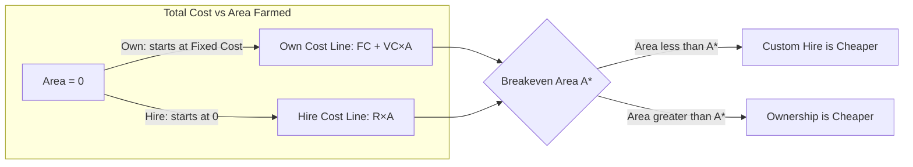

## Machinery and Equipment Economics

### Overview

Machinery and equipment economics is the analysis of cost, investment, and utilization decisions surrounding farm mechanization. Machinery is typically the second-largest capital investment on a farm after land, and it carries a distinctive cost structure — high fixed costs that must be spread over variable, often seasonally compressed, use. The central economic problems are: how much machinery capacity to own, whether to own or hire/lease, when to replace an existing machine, and how to allocate machinery costs correctly across enterprises for planning purposes.

**Key Points**

- Machinery costs split into fixed (ownership) costs, which accrue regardless of use, and variable (operating) costs, which accrue only when the machine runs.
- The **breakeven acreage** between owning and custom-hiring is the single most used decision tool in this domain.
- Optimal replacement timing balances rising repair/maintenance costs of an aging machine against the depreciation and opportunity cost of a newer one.
- Machinery decisions cannot be made enterprise-by-enterprise in isolation; they interact with the whole-farm plan (labor timeliness, capital constraints, and field-day availability).

---

### Cost Classification

#### Fixed (Ownership) Costs

Fixed costs are incurred by owning the machine, independent of hours used. Commonly summarized by the acronym **DIRTI-5**:

| Component | Description |
| --- | --- |
| **D**epreciation | Decline in machine value over time/use |
| **I**nterest | Opportunity cost of capital tied up in the machine (or actual loan interest) |
| **R**epairs (fixed portion, e.g., insurance-adjacent) | Some treatments allocate all repairs to variable cost; DIRTI-5 traditionally includes an insurance line, not repairs — see note below |
| **T**axes | Property tax on the machine, where applicable |
| **I**nsurance | Premiums to insure against loss/damage |

[Unverified] The exact composition of the "R" in DIRTI-5 varies across textbooks — some substitute "Repairs" for a component while treating routine repairs as variable cost elsewhere; farm management texts are not fully uniform on this point, so instructors should confirm which convention the reference text uses.

Housing and shelter cost is sometimes added as a sixth fixed-cost item.

#### Variable (Operating) Costs

Variable costs are incurred only when the machine is used, scaling with hours or area:

- Fuel and lubrication
- Repairs and maintenance directly tied to wear from use
- Labor for operation (sometimes classified separately as a labor cost rather than a machinery cost)

#### Total Cost Function

$$TC = FC + (VC \times h)$$

where $FC$ is total annual fixed cost, $VC$ is variable cost per hour (or per hectare), and $h$ is annual hours (or hectares) of use.

**Average cost per hour** declines as use increases, because fixed cost is spread over more hours:

$$AC(h) = \frac{FC}{h} + VC$$

This is the core economic reason that machinery cost per unit of output falls as annual use rises — the basis for most own-vs-hire and machine-sizing decisions.

---

### Depreciation Methods

Depreciation estimates the decline in a machine's value and is central to both fixed-cost calculation and tax planning. Two purposes must be distinguished: **economic depreciation** (actual market value decline, used for cost accounting and replacement decisions) and **tax depreciation** (statutory schedules used for tax reporting, which may not track real value decline).

#### Straight-Line Depreciation

$$D = \frac{P - S}{n}$$

where $P$ = purchase price, $S$ = estimated salvage value, $n$ = useful life in years. Produces equal annual depreciation charges.

#### Declining-Balance Depreciation

$$D_t = r \times BV_{t-1}$$

where $r$ is a fixed depreciation rate applied to the prior year's book value $BV_{t-1}$. Front-loads depreciation, better reflecting the steep early value loss typical of farm machinery.

#### Sum-of-the-Years'-Digits (SYD)

$$D_t = \frac{n - t + 1}{\text{SYD}} \times (P - S), \quad \text{SYD} = \frac{n(n+1)}{2}$$

Also front-loaded, between straight-line and declining-balance in pattern.

#### Remaining Value (Iowa State / ASABE-style) Formulas

[Unverified] Agricultural engineering references (e.g., ASABE standards) provide empirically derived remaining-value-percentage curves specific to machine type (tractor, combine, implement) as a function of age, distinct from accounting depreciation methods — these are commonly used for used-machinery valuation and replacement analysis and should be checked against the current ASABE standard (D497) for coefficient values, since these are periodically revised.

---

### Own vs. Custom Hire (Breakeven Analysis)

The most common applied problem: should the farm own a machine or pay a custom operator/contractor by the hectare?

**Setup**: Owning has high fixed cost but low marginal (per-hectare) cost. Custom hiring has zero fixed cost but a higher constant per-hectare rate.

$$TC_{own}(A) = FC + VC \times A$$

$$TC_{hire}(A) = R \times A$$

where $A$ = hectares farmed annually and $R$ = custom hire rate per hectare.

**Breakeven area** — the point where owning and hiring cost the same:

$$FC + VC \times A^* = R \times A^*$$

$$A^* = \frac{FC}{R - VC}$$

**Decision rule**:

- If actual annual area $A < A^*$: custom hire is cheaper (fixed cost of ownership is not spread over enough use).
- If $A > A^*$: owning is cheaper.

#### Worked Example

A farmer is deciding whether to buy a planter.

- Purchase price: $45,000; expected life 10 years; salvage $5,000.
- Annual fixed cost (depreciation + interest + insurance + taxes), calculated as $5,200/year.
- Variable cost: $8/ha (fuel, repairs).
- Custom planting rate: $28/ha.

$$A^* = \frac{5200}{28 - 8} = \frac{5200}{20} = 260 \text{ ha}$$

**Interpretation**: If the farmer plants fewer than 260 ha per year, custom hiring the planting operation is the lower-cost choice. Above 260 ha, ownership becomes cheaper. [Inference] This breakeven figure is sensitive to the assumed custom rate and annual fixed-cost estimate, both of which should be updated with current local rates before use in an actual decision, since custom rates and machinery prices shift with market conditions.

---

### Breakeven Diagram

---

### Breakeven Chart (svg_diagram)

<svg xmlns="http://www.w3.org/2000/svg" viewBox="0 0 600 400">
<text x="300" y="24" font-size="16" font-weight="bold" text-anchor="middle" fill="#1a1a1a">Own vs. Custom Hire Breakeven (svg_diagram)</text>
<line x1="70" y1="340" x2="560" y2="340" stroke="#333" stroke-width="2" />
<line x1="70" y1="340" x2="70" y2="40" stroke="#333" stroke-width="2" />
<text x="560" y="358" font-size="12" text-anchor="middle">Area farmed (ha)</text>
<text x="35" y="40" font-size="12" text-anchor="middle">Total Cost ($)</text>
<line x1="70" y1="300" x2="540" y2="90" stroke="#2980b9" stroke-width="2" />
<text x="420" y="130" font-size="11" fill="#2980b9">Own: FC + VC·A</text>
<line x1="70" y1="340" x2="540" y2="90" stroke="#c0392b" stroke-width="2" />
<text x="420" y="200" font-size="11" fill="#c0392b">Hire: R·A</text>
<circle cx="330" cy="200" r="6" fill="#e67e22" />
<text x="345" y="195" font-size="12" font-weight="bold" fill="#e67e22">A* = 260 ha</text>
<line x1="330" y1="200" x2="330" y2="340" stroke="#999" stroke-dasharray="4,4" />
<text x="90" y="330" font-size="11" fill="#555">Hire cheaper here</text>
<text x="420" y="330" font-size="11" fill="#555">Own cheaper here</text>
</svg>

---

### Machinery Replacement Decisions

#### The Replacement Trade-off

As a machine ages:

- **Ownership (capital recovery) cost per year tends to fall** initially then stabilize, since depreciation is heaviest in early years but the remaining basis shrinks.
- **Repair and maintenance cost per year tends to rise** as components wear, and **downtime/timeliness risk** increases.

The economically optimal replacement age is where the **sum of annual ownership cost and annual repair cost is minimized** — not simply "when it breaks down" and not simply "as soon as a newer model exists."

$$\text{Total Annual Cost}(t) = \text{Capital Recovery Cost}(t) + \text{Average Repair Cost}(t)$$

#### Capital Recovery Cost (Annualized Ownership Cost)

Capital recovery cost annualizes the difference between purchase price and salvage value plus the interest/opportunity cost of the capital, converting a lump-sum investment into an equivalent uniform annual cost:

$$CRC = (P - S) \times \frac{i(1+i)^n}{(1+i)^n - 1} + S \times i$$

where $i$ is the discount/interest rate, $n$ is the ownership period in years. This is the standard capital-recovery (annuity) factor applied to the depreciable base, plus interest on the salvage value retained.

#### Timeliness Cost

A distinct and often underweighted factor: an aging or undersized machine may delay planting or harvest beyond the agronomically optimal window, causing yield loss. **Timeliness cost** is the value of yield lost due to operations being performed later than optimal, and it rises with field size relative to machine capacity. Including timeliness cost often justifies earlier replacement or larger capacity than a pure repair-cost model would suggest.

[Inference] Timeliness cost is frequently the most significant, yet most commonly omitted, factor in replacement and machine-sizing decisions in practice, because it requires a yield-loss-per-day-of-delay estimate that is agronomy-specific and not always available to the farm manager.

---

### Machinery Sizing and Field Capacity

#### Effective Field Capacity

$$C_{eff} = \frac{W \times S \times E}{C}$$

where $W$ = working width (m), $S$ = travel speed (km/h), $E$ = field efficiency (accounts for turns, overlap, and idle time, expressed as a decimal), and $C$ is a units-conversion constant (commonly 10 when width is in meters, speed in km/h, and capacity is desired in ha/h).

#### Field Efficiency

Field efficiency $E$ is always less than 1.0 because of:

- Turning and maneuvering time at field ends
- Overlap between passes
- Time lost to refilling/unloading (planters, sprayers, combines)
- Operator breaks and machine adjustment time

[Unverified] Typical field efficiency ranges (e.g., 65-85% for tillage, 60-75% for combines) are commonly tabulated in agricultural engineering references such as ASABE standards; specific values depend on field shape, size, and operator skill, so any figure used in a model should be sourced from current ASABE data or calibrated to local field conditions rather than assumed universally.

#### Matching Machinery Capacity to Available Field Days

The number of suitable field days (days with workable soil moisture and weather) in the critical planting or harvest window constrains total achievable area:

$$\text{Achievable Area} = \text{Field Days} \times \text{Hours per Day} \times C_{eff}$$

If achievable area falls short of the farm's total cropped area, either capacity must increase (larger/additional machines) or timeliness losses will be incurred — directly linking machinery sizing to the timeliness cost concept above.

---

### Machinery Cost Allocation in Whole-Farm Planning

When a single machine (e.g., a tractor) serves multiple enterprises, its total annual cost must be allocated across those enterprises for accurate enterprise budgeting. Common allocation bases:

- **Hours of use** by enterprise (most common and generally most defensible)
- **Hectares served** by enterprise
- **Fuel consumption** by enterprise (proxy for intensity of use)

Misallocation distorts enterprise gross margins and can lead to incorrect enterprise-level expansion or contraction decisions even when the whole-farm plan remains sound.

---

### Ownership Alternatives

| Option | Fixed Cost | Flexibility | Typical Use Case |
| --- | --- | --- | --- |
| Full ownership | Highest | Lowest (locked into capacity) | Large, stable operations with high annual use |
| Leasing | Moderate | Moderate | Uncertain future need, tax/cash-flow management |
| Custom hire | None (pay per use) | Highest | Low annual use, specialized/infrequent operations |
| Machinery sharing/cooperative | Shared | Moderate | Neighboring farms with staggered timing needs |

**Trade-offs**:

- Ownership provides maximum control over timing (reducing timeliness risk) but carries the highest fixed-cost burden if underused.
- Custom hire eliminates fixed cost and capital tie-up but introduces scheduling dependency on the custom operator's availability during peak-demand periods — itself a timeliness risk.
- Leasing can improve cash flow and allow more frequent technology upgrades but may cost more over the machine's full life than ownership, depending on lease terms and residual value assumptions.

---

### Limitations and Practical Considerations

- **Depreciation vs. market value divergence**: book depreciation (straight-line or declining-balance) is an accounting convenience and may not match actual resale value, especially in periods of unusual used-equipment demand; replacement decisions should reference current market remaining-value data rather than book value alone.
- **Interest rate sensitivity**: capital recovery cost is sensitive to the assumed interest/discount rate; a materially different rate changes the computed optimal replacement age and the own-vs-hire breakeven.
- **Risk and uncertainty**: breakeven and replacement formulas above are deterministic; actual decisions should account for uncertainty in future custom hire rates, machine reliability, and crop prices. [Inference] Because these models are typically built on point estimates rather than distributions, sensitivity analysis (varying key assumptions like annual area, interest rate, and repair cost trajectory) is standard practice before committing to a large machinery investment.
- **Behavioral factors**: farmers may retain older machinery beyond the cost-minimizing replacement age due to risk aversion, cash constraints, or non-monetary attachment, which the economic model does not capture directly.

---

**Next Steps**

- Capital budgeting and investment analysis (NPV, IRR) applied to machinery purchases
- Machinery cost allocation methods in enterprise budgeting
- Custom rate survey data and regional benchmarking
- Precision agriculture technology adoption economics
- Farm labor economics and its interaction with machinery timeliness
- Whole-farm planning and linear programming (machinery as a constrained resource)
- Risk management in capital-intensive farm investment decisions
- Machinery leasing vs. ownership financial modeling