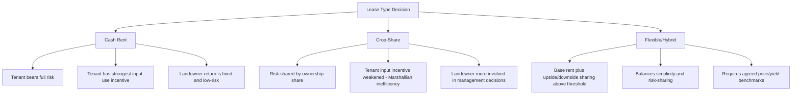

## Land Tenure and Leasing Arrangements

### Overview

Land tenure refers to the set of legal and customary rules governing how land is held, used, and transferred — who controls it, under what conditions, and for how long. Leasing arrangements are one major category of tenure, distinct from outright ownership, that allocate the rights to farm land between a landowner and an operator (tenant) under a contract. Tenure and leasing structures fundamentally shape farm management decisions, since they determine who bears production risk, who receives which share of returns, and who has incentive to make long-term investments in the land.

**Key Points**

- Tenure systems range from full ownership to various leasehold and customary arrangements, each with different risk and incentive implications.
- The three principal lease types — cash rent, crop-share, and flexible/hybrid leases — differ chiefly in how production and price risk are divided between landowner and tenant.
- Lease choice affects input-use incentives, investment behavior, and the willingness of either party to make land-improving investments (the "tenure security" problem).
- Land tenure economics draws on principal-agent theory to explain why share leases persist despite being informationally less efficient than cash rent in simple models.

---

### Classification of Land Tenure Systems

#### Ownership (Owner-Operator)

The farmer owns the land outright and bears full production, price, and asset-value risk, but also retains full control over management decisions and captures full appreciation/depreciation of land value. No principal-agent problem exists because the same party makes decisions and bears consequences.

#### Leasehold (Tenancy)

The operator (tenant) farms land owned by another party (landlord) under a lease contract, in exchange for rent paid in cash, a crop share, or a combination.

#### Customary/Communal Tenure

Land rights governed by traditional, community-based rules rather than statutory freehold or lease contracts — common in parts of the world where land is allocated by clan, village, or communal authority rather than individual title. [Unverified] The specific legal recognition, transferability, and bankability (usability as loan collateral) of customary tenure varies substantially by country and jurisdiction and should be verified against current national land law rather than assumed uniform.

#### Public/State Land Leasehold

Land owned by government and leased to farmers under long-term leasehold or usufruct arrangements, common in land-reform contexts and in countries where the state retains underlying land title (e.g., agricultural land under Certificate of Land Ownership Award-related leasebacks in agrarian reform settings). [Unverified] Country-specific agrarian reform program details and current leasehold terms should be checked against the relevant national land agency's current regulations, as these programs are periodically amended.

#### Tenure Security Spectrum

| Tenure Type | Security of Tenure | Investment Incentive | Typical Duration |
| --- | --- | --- | --- |
| Full ownership | Highest | Highest | Indefinite |
| Long-term lease (with renewal rights) | Moderate-high | Moderate | Multi-year to decades |
| Short-term/annual lease | Low-moderate | Low for long-term improvements | 1 year, often renewable |
| Informal/verbal arrangement | Lowest | Lowest | Variable, often insecure |
| Customary/communal | Variable by system | Variable | Often generational, non-transferable |

---

### Principal Lease Types

#### Cash Rent Lease

The tenant pays a fixed cash amount per hectare (or per farm) to the landowner, regardless of yield or price outcomes.

**Risk allocation**: The tenant bears essentially all production and price risk; the landowner receives a fixed, low-risk income stream.

**Landowner return**:

$$R_{owner} = \text{Cash Rent} \times \text{Area}$$

**Tenant residual return**:

$$R_{tenant} = (\text{Yield} \times \text{Price} \times \text{Area}) - \text{Variable Costs} - (\text{Cash Rent} \times \text{Area})$$

**Advantages**: Simple to administer; low monitoring cost for the landowner; tenant retains full marginal return on management effort and input decisions, so incentives to maximize yield and manage costs efficiently are strongest.

**Disadvantages**: Tenant bears full downside risk in a bad year; landowner does not benefit from unusually good years; cash rent must be renegotiated to track changing land productivity and commodity price expectations, which can lag actual conditions.

#### Crop-Share Lease

The landowner and tenant each receive a pre-agreed share of the harvested crop (e.g., a 50-50 or 60-40 split), and typically share specified input costs in the same proportion as the output split.

**Risk allocation**: Production and price risk are shared between both parties in proportion to their share.

$$R_{owner} = s \times (\text{Yield} \times \text{Price} \times \text{Area}) - s \times \text{Shared Costs}$$

$$R_{tenant} = (1-s) \times (\text{Yield} \times \text{Price} \times \text{Area}) - (1-s) \times \text{Shared Costs} - \text{Tenant-only Costs}$$

where $s$ is the landowner's share.

**Advantages**: Risk-sharing suits tenants and landowners with limited capacity to absorb full risk individually; landowner has an incentive to remain informed about, and sometimes contribute to, management decisions since their income depends on outcomes.

**Disadvantages**: Classic **principal-agent (moral hazard) problem** — because the tenant bears only $(1-s)$ of the marginal return to their own effort or input expenditure, but 100% of the marginal cost of inputs they alone finance, the tenant has a weaker incentive than under cash rent to apply the economically optimal (profit-maximizing) level of purchased inputs and effort. This is a well-established result in the agricultural share-tenancy literature (the "Marshallian inefficiency" of share tenancy).

**Standard input-sharing convention**: to partially correct the incentive problem, many crop-share leases require shared inputs (fertilizer, seed, chemicals) to be split in the same ratio as the output share, which aligns the tenant's incentive closer to (but still below) the full social/private optimum, since monitoring and enforcement of shared-cost contributions remain imperfect.

#### Flexible/Hybrid Cash Lease

Combines a base cash rent with a bonus or adjustment tied to yield and/or price outcomes exceeding a specified threshold — intended to capture some of cash rent's simplicity while sharing a portion of upside/downside risk.

$$R_{owner} = \text{Base Rent} \times \text{Area} + \max\left[0,\ f \times (\text{Actual Revenue} - \text{Threshold Revenue})\right]$$

where $f$ is the sharing fraction applied above the threshold.

**Advantages**: Reduces landlord's exposure to being locked into a rent that becomes unfavorable if prices or yields move sharply; provides some downside protection to the tenant relative to a high fixed cash rent, since a poor year does not increase the flex-share payment.

**Disadvantages**: More complex to administer and negotiate; requires agreed, verifiable yield and price benchmarks (often referencing local elevator prices or county yield data), and disputes can arise over which reference values apply.

---

### Comparing Lease Types

---

### Economic Analysis of Lease Type Choice

#### Principal-Agent Framing

The choice between cash rent and share lease is a classic application of principal-agent theory:

- **Cash rent** = full risk transfer to the agent (tenant); maximizes agent effort incentive but requires the agent to have sufficient risk-bearing capacity (working capital, credit access, risk tolerance).
- **Share lease** = risk-sharing between principal (landowner) and agent; sacrifices some efficiency (via the Marshallian effect) in exchange for reduced risk exposure to the tenant, which can be efficient overall if the tenant is more risk-averse or capital-constrained than the landowner.
- **Monitoring costs**: share leases theoretically require the landowner to monitor input use and harvest quantities to prevent under-reporting or under-investment by the tenant; cash rent requires no such monitoring, which is a structural reason it dominates in regions/commodities where monitoring is costly or impractical (e.g., row crops with easily verified yield-monitor data can support either arrangement, but harder-to-monitor enterprises tend toward cash rent or trusted long-term relationships).

#### Rent Determination

Cash rent levels are commonly benchmarked using:

1. **Percentage of gross revenue**: a rule-of-thumb rent set as a percentage (e.g., roughly a third, varying by region and crop) of expected gross crop revenue.
2. **Cost-plus/residual method**: rent set as the return to land after subtracting all other costs (labor, machinery, other inputs) from expected revenue, essentially treating rent as the residual claim on land's contribution to production.
3. **Comparable market rents**: surveys of rents paid for similar land quality/location in the local market (widely published in some countries via university extension cash-rent surveys).
4. **Capitalized land value approach**: rent benchmarked against a target rate of return on the land's market value:

$$\text{Cash Rent} \approx \text{Land Value} \times \text{Required Rate of Return}$$

[Inference] In practice, published extension cash-rent surveys (method 3) are the most commonly used reference point for negotiating actual rents, because they reflect realized local market outcomes rather than a theoretical residual or capitalization calculation, though the other methods remain useful as cross-checks, especially when comparable local data is sparse.

---

### The Underinvestment Problem and Tenure Security

A recurring issue across all leasehold arrangements: a tenant without secure, long-term rights has a weaker incentive to make investments whose payoff accrues over multiple years (soil conservation practices, drainage tile, perennial crop establishment, fencing) because the tenant may not remain on the land long enough to capture the full return.

**Mitigating mechanisms**:

- **Longer lease terms** or automatic renewal clauses that extend the tenant's effective planning horizon.
- **Improvement compensation clauses**: contractual provisions requiring the landowner to compensate the outgoing tenant for the unamortized value of tenant-funded improvements if the lease ends early.
- **Written, multi-year leases** rather than informal annual verbal agreements, which increase enforceability and reduce the risk of arbitrary non-renewal.
- **Shared-cost arrangements** for capital improvements, where landowner and tenant jointly fund and jointly benefit from a durable improvement.

This underinvestment problem is a specific application of the broader economic principle that **investment incentives require an alignment between the party bearing the cost and the party capturing the return** — a recurring theme across share-lease incentive problems, machinery-sharing arrangements, and multi-year cropping system decisions.

---

### Legal and Institutional Considerations

- **Written vs. verbal leases**: written leases reduce ambiguity and are generally more enforceable, though verbal annual leases remain common in some regions due to established landlord-tenant relationships and low transaction costs when trust is high.
- **Statutory tenant protections**: many jurisdictions impose minimum notice periods for lease termination, restrictions on eviction timing (to avoid mid-season disruption), or mandated minimum lease terms for certain land classes; these vary substantially by country and sometimes by sub-national jurisdiction. [Unverified] Specific statutory provisions should be verified against current national or state/provincial agricultural land law, as tenant-protection statutes are subject to legislative change and are not uniform even within a single country's regions.
- **Succession and inheritance**: land tenure interacts with inheritance law where farmland is divided among heirs, which can fragment landholding over generations or create fractional/co-owned parcels requiring lease arrangements even among family members.
- **Land reform contexts**: in countries with active or historical agrarian reform programs, tenure status may include transitional leasehold or amortization arrangements distinct from freehold or conventional leasing, with specific eligibility, transferability, and collateral-use restrictions defined by the relevant reform statute.

---

### Practical Farm Management Implications

| Decision Area | Cash Rent Tenant | Share-Lease Tenant | Owner-Operator |
| --- | --- | --- | --- |
| Input-use incentive | Full marginal incentive | Reduced by share fraction | Full marginal incentive |
| Exposure to yield/price risk | Full | Partial (by share) | Full |
| Access to landowner capital/expertise | Typically none | Often present | Not applicable |
| Incentive for long-term land investment | Weak unless contractually addressed | Weak unless contractually addressed | Strong |
| Working capital requirement | Higher (must cover full input cost and fixed rent) | Lower (shared input costs) | Highest (full ownership cost) |
| Suitability for a risk-averse/capital-constrained operator | Less suitable | More suitable | Not directly comparable |

---

**Next Steps**

- Farm financial risk management and enterprise diversification
- Capital budgeting for land purchase vs. lease decisions
- Agricultural credit and collateral requirements under different tenure types
- Land value determination and capitalization models
- Whole-farm planning and linear programming (land as a constrained, tenure-dependent resource)
- Agrarian reform and land redistribution policy analysis
- Contract theory and principal-agent models in agricultural economics
- Soil conservation investment incentives under different tenure arrangements