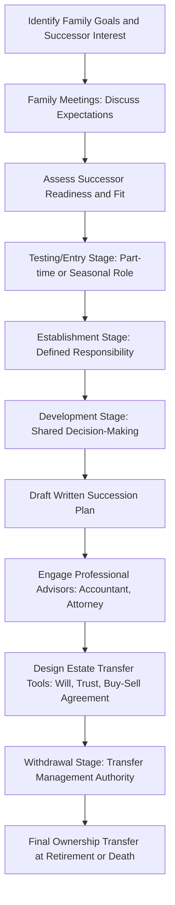

## Succession and Estate Planning

### Overview

Succession planning is the process of transferring management control of a farm business from one generation (or owner) to the next, while estate planning is the process of transferring ownership of farm assets — land, equipment, livestock, and business interests — at retirement or death, in a manner consistent with the owner's financial, tax, and family objectives. The two processes are related but distinct: succession is fundamentally about the transfer of management and decision-making authority over time, while estate planning is fundamentally about the legal transfer of asset title and the minimization of associated tax and administrative costs. Farm businesses face a distinctive version of this problem because farm wealth is typically concentrated in illiquid, capital-intensive assets (land, machinery) that are difficult to divide without threatening the operational viability of the business itself.

**Key Points**

- Succession planning addresses *who will manage* the farm and *when* control transfers; estate planning addresses *who will own* the assets and *how* transfer occurs at death or retirement.
- The central tension in most farm transfers is between **equitable treatment of all heirs** and **viability of the operating business**, since dividing farm assets equally among heirs (including non-farming heirs) can force a sale or fragmentation of a farm that only one heir intends to operate.
- Estate planning tools (wills, trusts, buy-sell agreements, gifting strategies) exist primarily to manage this tension and to reduce transfer costs (estate/inheritance taxes, probate costs, legal fees).
- Effective succession planning is a multi-year process, not a single event, typically involving a gradual transfer of both management responsibility and financial control.

---

### Succession Planning: Management Transfer

#### Stages of Management Transition

Succession is commonly modeled as a phased process rather than an abrupt handover:

1. **Testing/Entry stage**: the successor works on the farm, often part-time or seasonally, to assess interest and fit.
2. **Establishment stage**: the successor takes on a defined role with increasing responsibility (e.g., managing a specific enterprise or set of operations).
3. **Development stage**: the successor gains decision-making authority over larger areas of the operation, potentially with a formal partnership, LLC membership interest, or defined profit-sharing structure with the senior generation.
4. **Withdrawal/transfer stage**: the senior generation progressively reduces day-to-day involvement, transferring final management authority (and eventually ownership) to the successor.

[Inference] A gradual, staged transition is generally regarded in the farm management literature as reducing both financial risk (the senior generation retains a safety net during transition) and interpersonal conflict, compared to an abrupt handover, though the appropriate pace varies substantially by family circumstances and is not a fixed timeline that fits all farms.

#### Communication and Planning Process

A structured succession planning process typically includes:

- **Family meetings** to articulate goals, expectations, and concerns of all family members — including non-farming heirs, whose expectations regarding inheritance must be addressed even if they will not participate in farm operations.
- **Written succession plan** documenting management transition timeline, roles, and decision-making authority during the transition period.
- **Identification of successor(s)** — which may involve one heir, multiple heirs in a shared management structure, or a transition to a non-family manager/operator where no family successor exists.
- **Retirement income planning** for the senior generation, ensuring they have adequate income independent of continued farm labor once management authority transfers.
- **Professional advisory team**: typically includes an accountant, attorney specializing in agricultural estate law, and often a farm financial consultant, given the complexity of tax and legal issues involved.

---

### Succession Planning Process Flow

---

### Estate Planning: Asset Transfer

#### Core Legal Tools

| Tool | Function | Typical Use in Farm Transfer |
| --- | --- | --- |
| **Will** | Directs asset distribution at death; subject to probate | Baseline document; often used alongside other tools for assets not otherwise transferred |
| **Trust** (revocable/irrevocable) | Holds assets for beneficiaries under specified terms, can avoid probate | Used to control timing of transfer, provide for a surviving spouse, or protect a non-farming heir's interest while keeping land control with the operating heir |
| **Buy-Sell Agreement** | Contractually obligates a business (or co-owner) to purchase a deceased/withdrawing owner's interest at a defined valuation | Common in farm partnerships/corporations to prevent an outside party or estranged heir from becoming an unwanted co-owner |
| **Gifting (lifetime transfers)** | Transfers assets before death, often to use annual/lifetime gift tax exclusions | Gradual transfer of land or business interest to a successor over multiple years to reduce the eventual taxable estate |
| **Life insurance** | Provides liquid cash at death | Frequently used to fund equalization payments to non-farming heirs without forcing sale of farm assets |
| **Business entity structuring** (LLC, corporation, partnership) | Formalizes ownership shares and management roles | Facilitates gradual transfer of ownership percentage and clarifies decision-making authority during multi-generation operation |

#### The Equal vs. Equitable Distinction

A central and recurring conceptual issue in farm estate planning is the distinction between:

- **Equal distribution**: each heir receives an identical dollar value or identical assets.
- **Equitable distribution**: each heir receives a fair outcome given their differing roles, contributions, and needs — which for a farm family often means the farming heir receives the operating assets (land, equipment, breeding stock) needed to continue the business, while non-farming heirs receive other assets (cash, life insurance proceeds, non-farm investments, or a note payable over time) of comparable value.

[Inference] Attempting strict equal division of illiquid farm assets among heirs with different levels of involvement in the operation is widely identified in farm succession literature as a leading cause of forced farm liquidation or fragmentation after an owner's death, which is why equitable-but-unequal distribution structures are commonly recommended where one heir is the intended continuing operator.

---

### Valuation Issues

Farm estate planning requires defensible valuation of assets that often lack liquid, transparent markets:

- **Land valuation**: comparable sales approach is standard, but agricultural use value may diverge substantially from potential non-agricultural (development) value, which matters both for estate tax exposure and for special-use valuation elections where available under applicable tax law.
- **Business interest valuation** (for partnership/LLC/corporate shares): often requires a formal business valuation, particularly when a buy-sell agreement's purchase price must be defined in advance or when gifting fractional interests to use valuation discounts for lack of control or marketability.
- **Livestock and equipment valuation**: generally more straightforward given more active secondary markets, but breeding stock and specialized equipment may still require appraisal.

[Unverified] Specific valuation methods eligible for preferential tax treatment (such as special-use valuation for farmland under estate tax law) are governed by current tax statute and regulations, which vary by country and are subject to legislative change; applicability and current thresholds should be verified against current tax authority guidance rather than assumed from prior-year rules.

---

### Tax Considerations

[Unverified] Estate, inheritance, gift, and capital gains tax rules governing farm transfers differ substantially by country and are subject to frequent legislative revision (exemption thresholds, tax rates, and special agricultural provisions in particular change often); the concepts below are structural/conceptual and should be paired with current tax code research for any specific jurisdiction before being applied to an actual transfer plan.

#### General Categories of Tax Exposure

- **Estate/inheritance tax**: a tax on the transfer of assets at death, typically with an exemption threshold below which no tax applies; farm estates with substantial land holdings can exceed such thresholds even when the farm generates modest annual income, creating a "land rich, cash poor" liquidity problem at transfer.
- **Gift tax**: a tax on lifetime transfers, often with an annual per-recipient exclusion amount and a separate lifetime exemption; used strategically to move assets out of the taxable estate gradually.
- **Capital gains tax**: triggered when an asset is sold; the tax basis an heir receives in inherited property (versus gifted property) affects the capital gains consequence of a future sale, which is a key reason the timing and method of transfer (gift during life vs. inheritance at death) matters for overall tax efficiency.
- **Generation-skipping considerations**: relevant where assets are intended to pass to grandchildren or later generations, potentially subject to additional transfer tax rules in some jurisdictions.

#### The Liquidity Problem

Farm estates are frequently **asset-rich but cash-poor**: the taxable value of land and equipment can be high relative to the farm's annual liquid income, creating a risk that estate tax liability (where it applies) or equalization payments to non-farming heirs cannot be met without selling farm assets. Common mitigations:

- Life insurance proceeds to fund a liquidity need without touching operating assets.
- Installment payment provisions (where tax law permits deferred payment of estate tax attributable to a closely-held farm business).
- Gradual lifetime gifting to reduce the estate's taxable size before death.
- Structuring a buy-sell agreement funded by insurance to provide cash to an estate in exchange for a business interest.

---

### Business Structure and Governance Considerations

As a farm transitions across generations, its legal and governance structure often evolves:

| Structure | Governance Implication for Succession |
| --- | --- |
| Sole proprietorship | Simplest, but offers no built-in mechanism for shared or phased ownership transfer; typically must be restructured to accommodate multi-generation involvement |
| General partnership | Allows shared management and phased transfer of partnership interest, but generally exposes all partners to unlimited liability |
| Limited Liability Company (LLC) | Allows flexible allocation of ownership percentage, management authority, and profit distribution; commonly used to separate ownership share from management control (e.g., senior generation retains a smaller ownership share but defined voting/management rights during transition) |
| Corporation (C-corp or S-corp equivalent, jurisdiction-dependent) | Enables formal share structure, which facilitates gradual gifting of shares and clearer valuation for buy-sell purposes, but introduces additional corporate formalities and potential double-taxation considerations depending on jurisdiction and entity type |

[Unverified] The specific tax treatment and formation requirements of each entity type vary by country and, in federal systems, sometimes by sub-national jurisdiction; entity choice should be confirmed with a qualified local advisor against current law rather than generalized from another jurisdiction's rules.

---

### Common Obstacles to Effective Succession Planning

- **Avoidance/procrastination**: succession planning is frequently delayed because it requires the senior generation to confront mortality, loss of control, and potentially difficult family conversations; delay increases the risk of an unplanned transfer (sudden death or incapacity) occurring before any plan is in place.
- **Lack of communication**: unstated or divergent expectations among heirs about their role or inheritance are a leading source of post-transfer family conflict, independent of the technical adequacy of the legal documents used.
- **Absence of a clear successor**: where no family member wishes to continue farming, succession planning must instead address either a sale of the operating business, a lease-out of land with retained ownership, or transition to a non-family manager/operator structure.
- **Static plans**: a succession/estate plan drafted once and never revisited fails to reflect changes in family circumstances, asset values, tax law, or the successor's demonstrated readiness over time; periodic review is generally advised.
- **Undercapitalized successor**: a successor may lack sufficient personal capital to buy out retiring owners' equity or non-farming heirs' shares, which is a key reason gradual gifting, installment sale arrangements, and business entity restructuring (rather than a single lump-sum purchase) are widely used.

---

### Succession vs. Estate Planning — Summary Comparison

| Dimension | Succession Planning | Estate Planning |
| --- | --- | --- |
| Primary focus | Transfer of management and operational control | Transfer of legal ownership of assets |
| Typical timeframe | Multi-year, phased process during owner's lifetime | Documents take effect over time, fully at death (or at a triggering event) |
| Key tools | Family meetings, phased responsibility transfer, mentorship, written management agreements | Wills, trusts, buy-sell agreements, gifting strategies, business entity structuring |
| Central risk addressed | Successor unpreparedness; loss of institutional/operational knowledge | Excessive tax burden; forced asset liquidation; family conflict over distribution |
| Relationship between the two | Should generally precede or run concurrently with estate planning, since who will manage the farm affects how ownership transfer should be structured | Should be designed to support, not undermine, the succession plan's operational goals |

---

**Next Steps**

- Farm business entity structuring (LLC, partnership, corporation) for multi-generation operations
- Whole-farm planning and linear programming (successor decision-making on an inherited resource base)
- Land tenure and leasing arrangements (leaseback and retained-ownership structures in succession)
- Agricultural credit and financing for successor buy-in/buy-out transactions
- Farm risk management (life insurance and liquidity planning for estate transfer)
- Capital budgeting and investment analysis for successor-led farm expansion decisions
- Family business governance and conflict resolution
- Retirement income planning for the senior generation