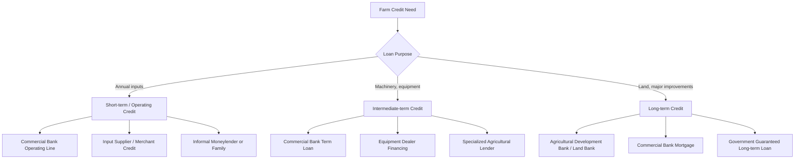

## Sources of Agricultural Credit

### Overview

Agricultural credit refers to borrowed funds used to finance farm operations, capital investment, and land acquisition. Because farm income is seasonal, weather-dependent, and often subject to significant price volatility, agricultural credit markets have developed distinct institutions and instrument types tailored to these risk characteristics, alongside the general commercial lending sector. Sources of agricultural credit are commonly classified by the type of institution providing the funds (formal vs. informal) and by the purpose/term of the loan (operating, intermediate-term, or long-term).

**Key Points**

- Credit sources are generally grouped into formal institutional lenders (banks, government-sponsored/specialized agricultural lenders, cooperatives) and informal sources (merchants, input suppliers, family, moneylenders).
- Loan purpose determines appropriate term structure: short-term (operating) loans finance annual input costs, intermediate-term loans finance depreciable assets like machinery, and long-term loans finance land and major fixed improvements.
- Government involvement in agricultural credit markets is common worldwide, through direct lending programs, loan guarantees, and interest subsidies, reflecting the perceived need to correct for credit market imperfections specific to agriculture.
- The choice among credit sources involves trade-offs in interest cost, collateral requirements, flexibility, and relationship/servicing considerations.

---

### Classification by Loan Term and Purpose

| Loan Category | Typical Term | Purpose | Typical Collateral |
| --- | --- | --- | --- |
| **Short-term (operating) credit** | Up to 1 year, often within a single production cycle | Seed, fertilizer, fuel, feed, hired labor, other annual input costs | Growing crop, livestock inventory, or unsecured based on relationship |
| **Intermediate-term credit** | 1-10 years (commonly 3-7) | Machinery, equipment, breeding livestock, farm vehicles | The financed asset itself (chattel mortgage/lien) |
| **Long-term credit** | 10-30+ years | Land purchase, major buildings, land improvement (drainage, irrigation infrastructure) | Real estate mortgage on the land |

This term structure matters because loan repayment schedules should align with the useful economic life and cash-flow-generating pattern of the financed asset — a principle sometimes called matching the loan term to the asset's productive life. Financing a long-lived asset (land) with a short-term loan creates repayment pressure that the asset's annual returns cannot support; conversely, financing a single season's inputs with a long-term loan creates unnecessary long-run interest exposure and lien encumbrance.

---

### Formal Institutional Sources

#### Commercial Banks

General-purpose commercial banks are a major source of agricultural credit in most countries, offering the full range of short-, intermediate-, and long-term products. Banks typically require conventional collateral and documented cash-flow projections, and their agricultural lending capacity/interest may vary with the bank's overall risk appetite and sectoral concentration limits.

**Advantages**: broad range of financial services beyond credit (deposit accounts, cash management); may offer more competitive rates where the farmer has an established banking relationship.

**Disadvantages**: [Inference] Commercial banks without dedicated agricultural lending expertise may be less able to properly evaluate farm cash-flow cycles or specialized collateral (growing crops, breeding livestock) compared with specialized agricultural lenders, which can affect loan terms or approval likelihood, though this varies significantly by individual bank and region.

#### Specialized/Government-Sponsored Agricultural Lenders

Many countries maintain dedicated agricultural credit institutions, cooperative credit systems, or government-owned agricultural development banks specifically structured around farm lending needs. [Unverified] The specific institutional names, structures, and current lending programs (e.g., a national land bank, agricultural development bank, or farm credit cooperative system) vary substantially by country and change over time with policy reform; current program details, eligibility, and interest rate structures should be verified against the relevant national agricultural finance authority's current published information rather than assumed from general description.

These institutions typically share common structural features across countries:

- Loan products specifically designed around seasonal farm cash flow (e.g., single-payment loans timed to harvest).
- Staff and underwriting processes with specific agricultural sector expertise.
- Often a cooperative or member-owned structure, where borrowers hold some ownership/governance stake in the lending institution.

#### Agricultural Cooperatives and Credit Unions

Farmer-owned cooperative credit institutions pool member savings/capital to provide credit to member-borrowers, often at more favorable terms than commercial banks due to their member-benefit (rather than profit-maximizing) orientation, though this is not universal.

**Advantages**: alignment of institutional incentives with farmer-members; often more localized knowledge of regional farming conditions.

**Disadvantages**: lending capacity may be constrained by the scale of member deposits/capital; may have narrower geographic or membership-based eligibility.

#### Input Suppliers and Merchant Credit

Agribusiness input suppliers (seed, fertilizer, chemical dealers) and farm equipment dealers frequently extend trade credit or dealer financing directly to farmers, allowing input purchase or equipment acquisition with deferred payment (often timed to harvest or a subsequent selling season).

**Advantages**: convenient, often faster and less documentation-intensive than a formal bank loan; may be bundled with input purchase discounts or manufacturer-subsidized financing rates on equipment.

**Disadvantages**: [Inference] Effective interest cost embedded in supplier credit terms is not always transparent or directly comparable to a stated bank interest rate, since the cost may be embedded in the input price itself rather than disclosed as a separate finance charge; farmers are generally advised to calculate the implied effective interest rate before assuming supplier credit is the lowest-cost option.

#### Contract Farming and Buyer-Provided Credit

Processors or buyers under a contract farming arrangement sometimes provide input credit or cash advances to contracted farmers, to be repaid or deducted from proceeds at delivery.

**Advantages**: directly ties credit to a committed output market, reducing the lender's (buyer's) risk and often simplifying access for farmers who might not qualify for conventional bank credit.

**Disadvantages**: ties the farmer's marketing flexibility to the specific buyer/contract; terms are set by the buyer and may be less transparent or negotiable than independent credit sources.

#### Government Direct Lending, Guarantee, and Subsidy Programs

Beyond dedicated agricultural development banks, governments commonly intervene in agricultural credit markets through:

- **Loan guarantee programs**: government guarantees a portion of a private lender's agricultural loan, reducing the lender's risk and encouraging credit extension to farmers who might not otherwise qualify.
- **Interest rate subsidies**: government subsidizes a portion of the interest cost on qualifying agricultural loans, reducing the farmer's effective borrowing cost.
- **Disaster/emergency lending programs**: specialized low-interest or deferred-repayment credit made available following declared agricultural disasters (drought, flood, pest outbreak).
- **Targeted programs for specific groups**: many countries maintain credit programs specifically targeted at smallholder farmers, young/beginning farmers, or other groups identified as facing particular credit access constraints.

[Unverified] Specific program names, eligibility criteria, guarantee percentages, and subsidy rates are set by current government policy and are revised periodically (including in response to budget cycles and changing agricultural policy priorities); current details should be verified against the relevant national or local agricultural agency's current published guidance.

---

### Informal Sources

#### Family and Personal Networks

Loans or capital contributions from family members remain a significant, though often unquantified, source of farm financing, particularly for beginning farmers or in regions with limited formal financial institution access.

**Advantages**: potentially lower or no interest cost; flexible repayment terms; no formal collateral or documentation requirements.

**Disadvantages**: can strain family relationships if repayment expectations are unclear or unmet; typically limited in scale relative to institutional credit; generally not a systematic or reliable long-run financing strategy for a growing operation.

#### Informal Moneylenders

In regions with limited formal financial institution penetration, informal moneylenders remain an active source of agricultural credit, particularly short-term/emergency credit.

**Advantages**: rapid access, minimal documentation, availability even to borrowers without formal collateral or credit history.

**Disadvantages**: [Inference] Interest rates charged by informal moneylenders are widely documented in agricultural economics literature as substantially higher than formal-sector rates, reflecting the lender's higher perceived risk and lack of competitive pressure in many such markets; this makes informal moneylending a costly financing source relative to formal alternatives where those alternatives are accessible.

#### Rotating Savings and Credit Associations (ROSCAs) and Self-Help Groups

Informal, community-based group savings and lending mechanisms, common in many smallholder farming contexts, where members contribute regularly to a shared pool that is disbursed to members in rotation or according to group-determined need.

**Advantages**: builds savings discipline and social capital; accessible without formal collateral; can serve members excluded from formal credit markets.

**Disadvantages**: total credit pool size is limited by member contributions; disbursement timing may not align with an individual member's specific financing need.

---

### Credit Source Comparison Framework

---

### Selecting Among Credit Sources: Key Decision Factors

| Factor | Consideration |
| --- | --- |
| **Effective interest cost** | Include all fees, embedded finance charges (as in some supplier credit), and compounding frequency, not just the stated nominal rate |
| **Collateral requirements** | Some sources (input supplier credit, contract farming advances) require less conventional collateral than a bank mortgage or chattel lien |
| **Repayment flexibility** | Alignment with the farm's cash-flow timing (e.g., single-payment loans timed to harvest vs. fixed monthly amortization) |
| **Loan term matching** | Term should match the useful life of the financed asset to avoid repayment mismatch |
| **Relationship and servicing** | Ongoing access to credit in future years, advisory support, and flexibility in the event of a bad production year |
| **Speed and documentation burden** | Informal and supplier credit sources are often faster and less document-intensive than formal institutional loans, which can matter for time-sensitive input purchase decisions |
| **Government program eligibility** | Guarantee or subsidy programs may make an otherwise higher-cost or higher-risk loan accessible on better terms for eligible borrowers |

---

### Credit Market Imperfections Specific to Agriculture

Agricultural credit markets are commonly cited in agricultural economics literature as subject to particular market imperfections that justify specialized institutions and government intervention:

- **Covariate (systemic) risk**: weather, pest, and price shocks tend to affect many borrowers in a region simultaneously, unlike idiosyncratic risk in typical commercial lending, making agricultural loan portfolios harder to diversify away from regional shocks.
- **Asymmetric information**: lenders often have limited ability to observe a farmer's actual management practices, effort, or true yield/price risk exposure, creating adverse selection and moral hazard concerns similar to those discussed in share-tenancy contexts.
- **Collateral limitations**: land collateral value may be difficult to realize quickly in default (illiquid land markets, legal protections for agricultural land, or unclear title in customary tenure systems), and growing crops or livestock are imperfect, perishable, or mobile collateral.
- **Seasonality and lumpy cash flow**: farm income arrives in large, infrequent installments (at harvest or sale) rather than smoothly throughout the year, requiring specialized loan structuring (e.g., single-payment notes) rather than standard amortizing consumer-loan structures.

[Inference] These structural features are generally cited as the underlying rationale for the widespread pattern, across many countries, of specialized agricultural lending institutions and government-supported credit programs existing alongside general commercial banking, rather than agriculture being served exclusively by ordinary commercial credit markets.

---

**Next Steps**

- Farm financial statement analysis and creditworthiness assessment
- Capital budgeting and investment analysis for financed asset decisions
- Risk management and crop insurance as credit risk mitigants
- Agricultural credit market failures and the rationale for government intervention
- Machinery and equipment economics (financing intermediate-term asset purchases)
- Land tenure and leasing arrangements (interaction between tenure security and creditworthiness/collateral)
- Loan amortization and repayment structuring for farm assets
- Microfinance and group-lending models in smallholder agricultural credit