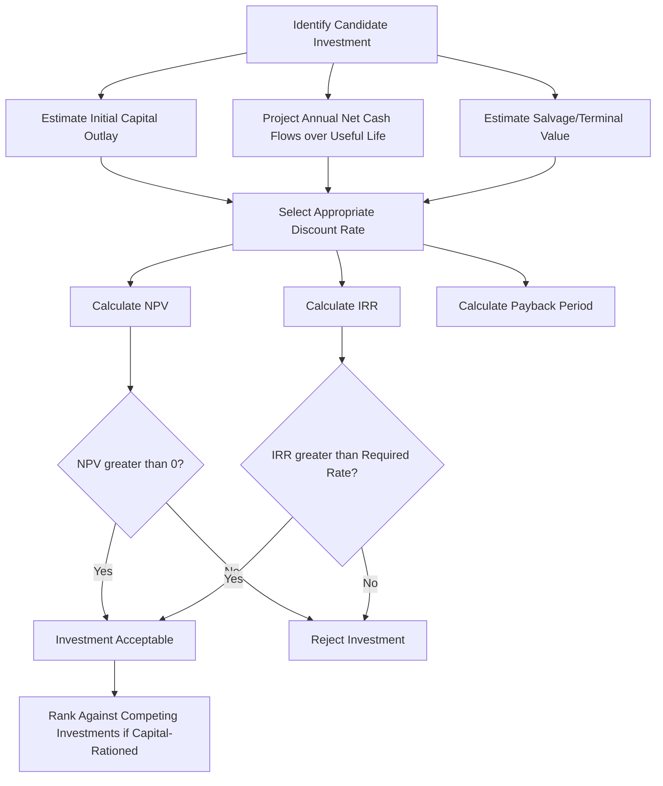

## Time Value of Money and Capital Investment

### Overview

The time value of money (TVM) is the foundational financial principle that a given sum of money is worth more today than the same sum at a future date, because money available now can be invested to earn a return over time. Capital investment analysis applies TVM principles to evaluate whether a proposed farm investment — land purchase, machinery acquisition, irrigation infrastructure, livestock facility construction — is expected to generate returns sufficient to justify the capital outlay, accounting for both the timing and risk of future cash flows. Together, these concepts underpin nearly all farm investment, financing, and lease-versus-buy decisions covered elsewhere in farm management.

**Key Points**

- TVM rests on the principle that a dollar today can earn interest, so future cash flows must be discounted to be compared meaningfully with present outlays.
- The discount rate used in capital investment analysis should reflect the opportunity cost of capital and the risk profile of the specific investment.
- Net Present Value (NPV), Internal Rate of Return (IRR), and Payback Period are the principal capital budgeting techniques used to evaluate farm investments, each with distinct strengths and limitations.
- Capital rationing (limited available capital across competing investment opportunities) requires ranking investments by capital efficiency, not just by absolute NPV.

---

### Core Time Value of Money Concepts

#### Future Value (Compounding)

Future value answers: what will a present sum grow to after $n$ periods at interest rate $i$?

$$FV = PV \times (1+i)^n$$

#### Present Value (Discounting)

Present value answers the inverse: what is a future sum worth today, given the same rate and time period?

$$PV = \frac{FV}{(1+i)^n}$$

#### Present Value of an Annuity

Many farm cash flows (equal annual loan payments, equal annual net returns from an investment) form an annuity — a series of equal periodic payments. The present value of an ordinary annuity (payments at the end of each period):

$$PV_{annuity} = PMT \times \left[\frac{1 - (1+i)^{-n}}{i}\right]$$

#### Future Value of an Annuity

$$FV_{annuity} = PMT \times \left[\frac{(1+i)^n - 1}{i}\right]$$

#### Capital Recovery Factor (Loan Amortization)

The inverse of the annuity present-value factor, used to calculate the equal periodic payment required to fully repay (amortize) a loan of present value $PV$ over $n$ periods at rate $i$:

$$PMT = PV \times \left[\frac{i(1+i)^n}{(1+i)^n - 1}\right]$$

This same capital recovery factor, applied to a net investment cost, is also used to annualize a machinery or equipment investment's ownership cost.

#### Nominal vs. Effective Interest Rates

When compounding occurs more frequently than annually (e.g., monthly loan payments), the effective annual rate exceeds the stated nominal annual rate:

$$i_{effective} = \left(1 + \frac{i_{nominal}}{m}\right)^m - 1$$

where $m$ is the number of compounding periods per year. Comparing loan or investment offers using effective rather than nominal rates is necessary whenever compounding frequency differs across the alternatives being compared.

---

### Choosing the Discount Rate

The discount rate applied to future farm cash flows should represent the **opportunity cost of capital** — the return the farmer could earn on the next-best alternative use of the same funds, adjusted for risk. Common approaches to setting this rate:

- **Cost of borrowed funds**: the actual interest rate on debt financing the investment, appropriate when the investment is financed entirely by that specific loan.
- **Weighted Average Cost of Capital (WACC)**: a blended rate reflecting the proportion of debt and equity capital used, weighted by their respective costs, appropriate when an investment draws on a mix of financing sources.
- **Risk-adjusted required rate of return**: a rate reflecting the farmer's own required return given the specific risk of the investment, often higher than the cost of debt to compensate for the added risk borne by equity capital and for project-specific uncertainty (price risk, technology risk, yield risk).

[Inference] Selecting too low a discount rate systematically biases capital budgeting results toward accepting marginal or overly risky investments, while too high a discount rate biases toward rejecting genuinely profitable long-term investments (such as land improvements or perennial crop establishment, whose returns are concentrated in later years); the appropriate rate is therefore one of the most consequential and most frequently misapplied inputs in farm investment analysis.

---

### Capital Budgeting Techniques

#### Net Present Value (NPV)

NPV sums the present values of all expected net cash flows (inflows minus outflows) over the investment's life, minus the initial investment cost:

$$NPV = \sum_{t=1}^{n} \frac{CF_t}{(1+i)^t} - C_0$$

where $CF_t$ is the net cash flow in period $t$, $i$ is the discount rate, $n$ is the investment's useful/analysis life, and $C_0$ is the initial capital outlay.

**Decision rule**: accept the investment if $NPV > 0$ (the investment earns more than the required rate of return); among mutually exclusive alternatives, prefer the one with the higher NPV.

#### Internal Rate of Return (IRR)

IRR is the discount rate at which NPV equals exactly zero — the break-even rate of return the investment itself generates:

$$0 = \sum_{t=1}^{n} \frac{CF_t}{(1+IRR)^t} - C_0$$

**Decision rule**: accept the investment if $IRR$ exceeds the farmer's required rate of return (cost of capital); among mutually exclusive alternatives, the NPV ranking is generally preferred over IRR ranking when the two methods disagree, because IRR can produce misleading rankings when comparing projects of different scale or cash-flow timing.

[Unverified] For cash flow series with multiple sign changes (e.g., a large negative cash flow partway through the investment's life, such as a major mid-life overhaul), the IRR equation can yield multiple mathematically valid roots, a well-documented limitation of the IRR method in capital budgeting theory generally, not specific to agricultural applications; NPV remains well-defined in these cases and is the more robust method to fall back on.

#### Payback Period

The payback period is the time required for cumulative net cash flows to equal the initial investment:

$$\text{Payback Period} = \text{Years until } \sum CF_t = C_0$$

**Advantages**: simple to calculate and communicate; provides a rough liquidity/risk screening measure (shorter payback generally implies lower exposure to long-run uncertainty).

**Disadvantages**: ignores the time value of money in its basic form (a discounted payback period variant corrects this), and ignores all cash flows occurring after the payback point — which can lead to rejecting a highly profitable long-lived investment (e.g., an orchard or land improvement) in favor of a lower-return but faster-paying-back alternative.

#### Comparison of Methods

| Method | Accounts for TVM | Accounts for Full Cash Flow Stream | Output Format | Key Weakness |
| --- | --- | --- | --- | --- |
| NPV | Yes | Yes | Dollar value | Requires a defensible discount rate estimate |
| IRR | Yes | Yes | Percentage rate | Can be undefined/multiple with non-conventional cash flows; scale-blind |
| Payback Period (simple) | No | No (ignores post-payback flows) | Time (years) | Ignores profitability entirely; only a rough risk/liquidity screen |
| Discounted Payback Period | Yes | No (still ignores post-payback flows) | Time (years) | Improves on simple payback but retains the post-payback blind spot |

---

### Capital Investment Decision Framework

---

### Worked Example

A farmer is evaluating a $60,000 investment in a grain drying and storage facility, expected to generate incremental net cash flow (reduced drying/storage fees plus improved marketing flexibility) of $14,000 per year for 8 years, with an estimated salvage value of $5,000 at the end of year 8. The farmer's required rate of return (opportunity cost of capital) is 8%.

**Step 1 — NPV of the annuity portion:**

$$PV_{annuity} = 14{,}000 \times \left[\frac{1 - (1.08)^{-8}}{0.08}\right] = 14{,}000 \times 5.7466 \approx 80{,}452$$

**Step 2 — Present value of salvage:**

$$PV_{salvage} = \frac{5{,}000}{(1.08)^8} = \frac{5{,}000}{1.8509} \approx 2{,}701$$

**Step 3 — Total present value of inflows:**

$$PV_{total} \approx 80{,}452 + 2{,}701 = 83{,}153$$

**Step 4 — NPV:**

$$NPV = 83{,}153 - 60{,}000 = 23{,}153$$

**Interpretation**: Since $NPV > 0$ at the 8% required rate, the investment is expected to earn more than the farmer's opportunity cost of capital and is financially acceptable on this basis. [Inference] This result depends entirely on the accuracy of the $14,000 annual net cash flow projection and the 8-year useful life assumption; because both are estimates rather than certainties, a sensitivity analysis varying these assumptions (and the discount rate itself) is standard practice before committing to an investment of this size, rather than relying on a single-point NPV estimate.

**Approximate IRR check**: since NPV is positive and substantial relative to the investment size at 8%, the IRR is meaningfully above 8%; precise IRR would require iterative calculation or financial software, but the magnitude of the NPV surplus indicates a comfortable margin above the required rate. [Unverified] An exact IRR figure is not derived by hand here; standard spreadsheet or financial calculator IRR functions should be used for a precise value in an actual investment decision.

---

### Capital Rationing and Investment Ranking

When available capital is insufficient to fund all positive-NPV investment opportunities (a common condition on real farms), investments must be ranked to select the combination that maximizes total value within the capital constraint, rather than accepting every individually acceptable project.

#### Profitability Index

$$PI = \frac{PV \text{ of Future Cash Flows}}{\text{Initial Investment}}$$

Ranking investments by profitability index (rather than absolute NPV) better reflects capital efficiency — the value generated per dollar of scarce capital — which matters when capital, not just profitability, is the binding constraint. This connects directly to the whole-farm linear programming framework, where capital is one of several constrained resources being allocated across competing uses (in that context, investment alternatives are formulated as competing activities subject to a capital constraint row).

---

### Inflation Considerations

Capital investment analysis must treat inflation consistently between cash flows and the discount rate:

- **Nominal cash flows** (including expected future price inflation) should be discounted using a **nominal discount rate** (which itself embeds expected inflation).
- **Real cash flows** (constant-dollar, inflation-excluded) should be discounted using a **real discount rate** (with inflation effects stripped out).

Mixing nominal cash flows with a real discount rate, or vice versa, systematically biases the NPV result and is a common analytical error. The approximate relationship between nominal and real rates:

$$(1 + i_{nominal}) = (1 + i_{real}) \times (1 + \text{inflation rate})$$

---

### Risk and Sensitivity Analysis in Capital Investment

Because farm investment cash flows depend on uncertain future prices, yields, and costs, capital budgeting results should generally be supplemented with:

- **Sensitivity analysis**: recalculating NPV/IRR under varied assumptions for key uncertain inputs (price, yield, discount rate) to identify which assumptions most affect the investment decision.
- **Scenario analysis**: evaluating NPV under explicitly defined optimistic, expected, and pessimistic scenarios.
- **Break-even analysis**: solving for the minimum price, yield, or cash flow level at which NPV equals zero, identifying the margin of safety in the base-case projection.

[Inference] Because single-point NPV/IRR estimates convey no information about the underlying uncertainty of the projection, sensitivity or scenario analysis is generally regarded as a necessary companion to, rather than an optional addition to, standard capital budgeting output for major farm investment decisions.

---

**Next Steps**

- Machinery and equipment economics (replacement and own-vs-hire analysis using capital recovery concepts)
- Whole-farm planning and linear programming (capital as a constrained resource across competing investments)
- Sources of agricultural credit (financing structures for capital investment)
- Risk and sensitivity analysis techniques in farm investment decisions
- Land valuation and capitalized value approaches
- Weighted average cost of capital estimation for farm businesses
- Lease vs. buy analysis using NPV comparison
- Inflation and real vs. nominal analysis in long-term agricultural planning