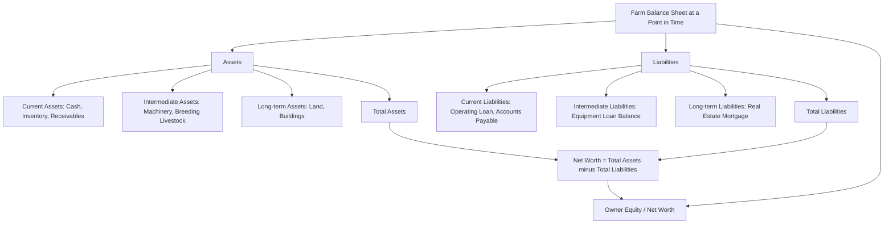

## Farm Balance Sheets and Cash Flow Analysis

### Overview

Farm balance sheets and cash flow analysis form the core of farm financial record-keeping and performance measurement. The balance sheet provides a snapshot of the farm's financial position — what it owns, what it owes, and the resulting net worth — at a specific point in time. Cash flow analysis tracks the actual movement of cash into and out of the business over a period, distinct from accrual-based profitability measures such as net farm income. Together with the income statement, these documents form the three primary farm financial statements used for management decision-making, lender evaluation, and performance benchmarking.

**Key Points**

- The balance sheet follows the fundamental accounting identity: Assets = Liabilities + Owner Equity (Net Worth).
- Farm balance sheets require careful classification of assets and liabilities by current vs. non-current (intermediate/long-term) categories to properly assess liquidity.
- Cash flow analysis distinguishes operating, investing, and financing activities, and separately, distinguishes cash flow from accrual-based net income.
- Financial ratios derived from these statements (liquidity, solvency, profitability, efficiency, repayment capacity) are the standard tools for assessing farm financial health and creditworthiness.

---

### The Farm Balance Sheet

#### Fundamental Structure

$$\text{Assets} = \text{Liabilities} + \text{Owner Equity (Net Worth)}$$

Equivalently:

$$\text{Net Worth} = \text{Total Assets} - \text{Total Liabilities}$$

Net worth represents the owner's residual claim on farm assets after all liabilities are satisfied, and its change from one period's balance sheet to the next is a primary measure of the farm's financial progress.

#### Asset Classification

| Category | Definition | Typical Farm Examples | Valuation Basis Commonly Used |
| --- | --- | --- | --- |
| **Current assets** | Cash or assets convertible to cash within 12 months | Cash, savings, accounts receivable, market livestock, harvested crop inventory, growing crops near completion, prepaid expenses | Market or cost, whichever is more relevant to liquidity assessment |
| **Intermediate (non-current) assets** | Assets with a useful life of roughly 1-10 years, not intended for immediate sale | Machinery, equipment, breeding livestock, vehicles | Cost less accumulated depreciation, or market value |
| **Long-term (fixed) assets** | Assets with a useful life exceeding roughly 10 years | Land, buildings, permanent structures, tile drainage | Cost basis or market value, depending on statement purpose |

#### Liability Classification

| Category | Definition | Typical Farm Examples |
| --- | --- | --- |
| **Current liabilities** | Obligations due within 12 months | Accounts payable, current portion of term debt, operating loan balance, accrued interest, accrued taxes |
| **Intermediate liabilities** | Obligations due in 1-10 years | Remaining balance on machinery/equipment loans |
| **Long-term liabilities** | Obligations due beyond 10 years | Remaining balance on real estate/land mortgages |

#### Cost Basis vs. Market Value Balance Sheets

A critical methodological choice in farm balance sheet preparation:

- **Cost-basis (historical cost) balance sheet**: assets valued at original purchase cost less accumulated depreciation. Reflects a more conservative, verifiable valuation, generally preferred for measuring the return generated by capital actually invested, and more consistent with standard accrual accounting principles.
- **Market-value balance sheet**: assets valued at current fair market value. Reflects the farm's actual current net worth and is generally preferred by lenders assessing collateral value and solvency, but can overstate financial strength during periods of asset price appreciation (e.g., a land value boom) and can be volatile, understating stability during downturns.

[Inference] Because these two approaches can produce materially different net worth and solvency figures for the same farm, especially where land or other assets have appreciated substantially since purchase, agricultural lenders and financial analysts commonly request or prepare both versions, or at minimum require disclosure of which valuation basis is used, to avoid misleading comparisons across farms or across time periods for the same farm.

---

### Balance Sheet Structure Diagram

---

### Key Solvency and Liquidity Measures from the Balance Sheet

#### Working Capital

$$\text{Working Capital} = \text{Total Current Assets} - \text{Total Current Liabilities}$$

Represents the cushion of liquid resources available to meet near-term obligations and absorb unexpected cash-flow shortfalls without disrupting operations.

#### Current Ratio

$$\text{Current Ratio} = \frac{\text{Total Current Assets}}{\text{Total Current Liabilities}}$$

A ratio above 1.0 indicates current assets exceed current liabilities; higher ratios generally indicate stronger short-term liquidity, though an excessively high ratio may indicate underutilized capital.

#### Debt-to-Asset Ratio

$$\text{Debt-to-Asset Ratio} = \frac{\text{Total Liabilities}}{\text{Total Assets}}$$

A measure of solvency — the proportion of total assets financed by debt rather than owner equity; lower values generally indicate lower financial risk and greater capacity to absorb losses without insolvency.

#### Equity-to-Asset Ratio

$$\text{Equity-to-Asset Ratio} = \frac{\text{Owner Equity}}{\text{Total Assets}} = 1 - \text{Debt-to-Asset Ratio}$$

#### Debt-to-Equity Ratio

$$\text{Debt-to-Equity Ratio} = \frac{\text{Total Liabilities}}{\text{Owner Equity}}$$

Expresses leverage relative to the owner's own capital stake rather than total assets; a ratio above 1.0 indicates the farm relies more on creditor capital than owner capital.

---

### Cash Flow Analysis

#### Purpose and Distinction from Net Income

A farm's cash flow statement tracks actual cash receipts and disbursements over a period, which can diverge substantially from accrual-based net farm income due to timing differences: depreciation is a non-cash expense reducing net income but not cash; loan principal payments reduce cash but are not an income statement expense (only the interest portion is); inventory changes affect accrual income but not necessarily cash in the same period. A farm can be profitable on an accrual basis yet face a cash shortfall, or vice versa, which is why lenders and managers examine both statements rather than relying on net income alone.

#### The Three Cash Flow Categories

| Category | Definition | Typical Farm Line Items |
| --- | --- | --- |
| **Operating activities** | Cash flows from normal farm production and sales | Cash receipts from crop/livestock sales, cash paid for seed, fertilizer, feed, labor, fuel, rent |
| **Investing activities** | Cash flows from buying/selling capital assets | Cash paid for machinery or land purchase, cash received from equipment or breeding stock sale |
| **Financing activities** | Cash flows from borrowing, repaying debt, and owner capital transactions | Loan proceeds received, loan principal repayments, owner capital contributions or withdrawals |

$$\text{Net Change in Cash} = \text{Operating Cash Flow} + \text{Investing Cash Flow} + \text{Financing Cash Flow}$$

#### Cash Flow Budget (Projected Cash Flow Statement)

Beyond a historical record, farms commonly prepare a **cash flow budget** — a forward-looking projection of expected cash inflows and outflows, typically on a monthly or quarterly basis, to:

- Identify periods of anticipated cash shortfall requiring operating credit.
- Time loan drawdowns and repayments to match the farm's seasonal cash flow pattern.
- Support loan applications by demonstrating projected debt repayment capacity to a lender.

[Inference] Because farm income is highly seasonal (concentrated around harvest or livestock sale periods) while expenses are often more evenly distributed or concentrated in a different part of the year (planting-season input purchases), a monthly cash flow budget is generally considered more useful for operating credit planning than an annual aggregate figure, since an annual figure can mask a mid-year shortfall that the annual total does not reveal.

---

### Cash Flow Analysis Diagram

---

### Reconciling Net Income and Cash Flow

A standard analytical exercise is reconciling accrual net farm income to net cash flow from operations, which highlights the non-cash and timing adjustments:

$$\text{Cash Flow from Operations} = \text{Net Farm Income} + \text{Depreciation} - \text{Increase in Inventory} + \text{Decrease in Accounts Receivable} - \dots$$

Key reconciling items:

- **Add back depreciation** (a non-cash expense subtracted in computing net income).
- **Adjust for inventory changes**: an increase in crop/livestock inventory increases accrual net income (if valued at market) but does not generate cash until sold.
- **Adjust for accounts receivable/payable changes**: income accrued but not yet collected, or expenses accrued but not yet paid, create timing differences between accrual income and cash flow.

[Inference] This reconciliation is particularly important on farms using market-value inventory adjustments in their accrual accounting, since unrealized inventory value gains can inflate reported net income well above the cash the farm actually has on hand in a given year, a divergence that a cash flow statement makes visible but an income statement alone does not.

---

### Repayment Capacity Analysis

Beyond static liquidity and solvency ratios, farm financial analysis often calculates repayment capacity measures that combine income statement and cash flow information to assess the farm's ability to service debt:

#### Term Debt Coverage Ratio

$$\text{Term Debt Coverage Ratio} = \frac{\text{Net Farm Income from Operations} + \text{Depreciation} + \text{Interest on Term Debt} - \text{Income Tax} - \text{Family Living Withdrawals}}{\text{Scheduled Principal and Interest Payments on Term Debt}}$$

A ratio above 1.0 indicates the farm generates sufficient funds to cover scheduled term debt payments after accounting for family living expenses and taxes; ratios comfortably above 1.0 (rather than marginally above) are generally sought by lenders as a buffer against income variability.

#### Capital Debt Repayment Capacity

A related measure used by lenders to assess how much additional term debt a farm could support given its demonstrated cash generation, calculated by capitalizing the margin available for debt service (after operating expenses, family living, and taxes) at a market interest rate over a typical loan term.

---

### Financial Statement Analysis: The Farm Financial Standards Council Framework

[Unverified] Many farm financial analysis frameworks organize the balance sheet, income statement, and cash flow statement into a standardized set of ratios grouped under five categories — liquidity, solvency, profitability, repayment capacity, and financial efficiency — a structure associated with farm financial standards guidance developed by agricultural finance industry groups in various countries; the specific named framework, exact ratio definitions, and benchmark values referenced in a given course or textbook should be confirmed against the current version of that framework, as such guidance is periodically revised.

| Category | Representative Ratio | What It Measures |
| --- | --- | --- |
| Liquidity | Current ratio, working capital | Ability to meet near-term obligations |
| Solvency | Debt-to-asset ratio, equity-to-asset ratio | Overall financial risk and leverage |
| Profitability | Return on assets, return on equity, operating profit margin | Efficiency of generating return on invested capital |
| Repayment capacity | Term debt coverage ratio | Ability to service scheduled debt payments |
| Financial efficiency | Asset turnover ratio, operating expense ratio | Efficiency of asset use in generating revenue |

---

### Using the Statements Together in Management Decisions

- **Trend analysis**: comparing balance sheets across multiple years reveals whether net worth is growing, stable, or declining, and whether that change is driven by retained earnings, asset appreciation, or debt reduction — each with different implications for financial strategy.
- **Lender evaluation**: lenders typically require both cost-basis and market-value balance sheets alongside a cash flow projection when evaluating a loan application, since solvency, liquidity, and repayment capacity each inform different aspects of credit risk.
- **Capital investment linkage**: cash flow projections feed directly into the capital budgeting analyses (NPV, IRR) discussed under time value of money and capital investment, since a project's viability depends on realistic projected cash inflows and outflows over its useful life.
- **Whole-farm planning linkage**: the balance sheet's capital constraint and the cash flow budget's periodic capital availability are the direct empirical basis for the capital constraint rows used in a whole-farm linear programming model.

---

**Next Steps**

- Farm financial ratio analysis and benchmarking
- Time value of money and capital investment (linking cash flow projections to NPV/IRR analysis)
- Sources of agricultural credit (repayment capacity and lender evaluation criteria)
- Income statement (accrual-adjusted net farm income) construction and analysis
- Farm record-keeping systems and accounting software
- Whole-farm planning and linear programming (capital constraints derived from cash flow analysis)
- Enterprise-level cost accounting and gross margin analysis
- Farm business trend and comparative financial analysis across multiple years