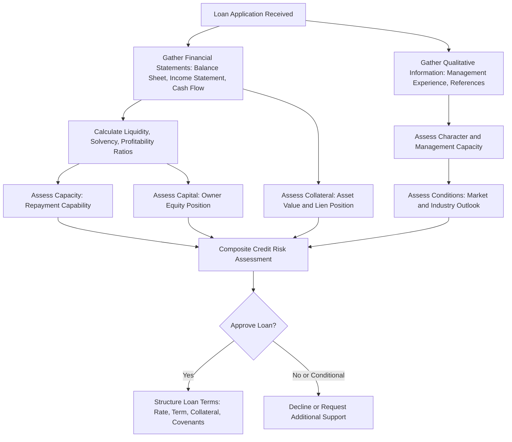

## Credit Analysis and Lending Institutions

### Overview

Credit analysis is the process by which a lender evaluates a farm borrower's creditworthiness — the likelihood that a loan will be repaid according to its terms — to determine whether to extend credit, and on what terms (interest rate, collateral requirements, loan structure). Lending institutions apply structured frameworks to this evaluation, combining financial statement analysis with qualitative judgment about management capacity and industry/market risk. This topic extends the balance sheet, cash flow, and credit source material covered elsewhere in this chapter into the specific analytical process a lender performs before approving an agricultural loan.

**Key Points**

- Credit analysis frameworks (commonly summarized as the "Five Cs of Credit") combine quantitative financial ratios with qualitative assessment of management and external conditions.
- Lending institutions differ in their credit analysis emphasis and risk tolerance depending on their structural mission — commercial banks, cooperative agricultural lenders, and government-backed programs each apply somewhat different underwriting standards.
- Loan structuring (term, collateral, covenants) is the mechanism by which a lender translates credit analysis conclusions into specific loan conditions that manage identified risks.
- Credit scoring and risk-rating systems increasingly formalize agricultural credit analysis, supplementing traditional ratio-based underwriting with structured risk classification.

---

### The Five Cs of Credit

A standard qualitative-quantitative framework used across lending institutions (not agriculture-specific, but widely applied to agricultural lending) to organize credit analysis:

| "C" | Definition | Agricultural Application |
| --- | --- | --- |
| **Character** | The borrower's integrity, repayment history, and management reputation | Prior loan repayment record, reputation in the farming community, business/personal credit history |
| **Capacity** | The borrower's ability to generate sufficient cash flow to repay the loan | Term debt coverage ratio, historical and projected cash flow, repayment capacity analysis |
| **Capital** | The borrower's own financial stake/net worth invested in the business | Owner equity, equity-to-asset ratio, down payment or owner contribution to the financed asset |
| **Collateral** | Assets pledged to secure the loan, providing the lender recourse in default | Land, machinery, livestock, growing crops, or other assets with lien value net of existing encumbrances |
| **Conditions** | External economic, market, and industry conditions affecting repayment ability | Commodity price outlook, weather/climate risk, input cost trends, general agricultural sector conditions |

[Inference] Character and Capacity are generally regarded in agricultural lending practice as the most heavily weighted factors for an operating relationship with an established borrower, since a borrower with strong repayment history and demonstrated cash-generating capacity presents lower risk even when collateral coverage or capital position is moderate; newer or higher-risk borrowers, by contrast, typically see greater weight placed on collateral and capital as compensating factors.

---

### Credit Analysis Framework Diagram

---

### Quantitative Credit Analysis: Key Ratio Categories

Building on the balance sheet, income statement, and cash flow measures covered previously, lenders typically organize agricultural credit ratios into five standard categories:

#### Liquidity

Measures ability to meet short-term (current) obligations:

$$\text{Current Ratio} = \frac{\text{Current Assets}}{\text{Current Liabilities}}$$

$$\text{Working Capital} = \text{Current Assets} - \text{Current Liabilities}$$

Lenders often express working capital as a percentage of gross revenue to normalize across farms of different sizes, since a fixed dollar amount of working capital represents a very different buffer for a small operation than a large one.

#### Solvency

Measures the farm's overall debt burden relative to its asset base:

$$\text{Debt-to-Asset Ratio} = \frac{\text{Total Liabilities}}{\text{Total Assets}}$$

$$\text{Equity-to-Asset Ratio} = \frac{\text{Owner Equity}}{\text{Total Assets}}$$

#### Profitability

Measures the return generated on assets and equity invested in the business:

$$\text{Rate of Return on Assets (ROA)} = \frac{\text{Net Farm Income from Operations} + \text{Interest Expense} - \text{Unpaid Family Labor Charge}}{\text{Average Total Assets}}$$

$$\text{Rate of Return on Equity (ROE)} = \frac{\text{Net Farm Income from Operations} - \text{Unpaid Family Labor Charge}}{\text{Average Owner Equity}}$$

$$\text{Operating Profit Margin} = \frac{\text{Net Farm Income from Operations} + \text{Interest Expense} - \text{Unpaid Family Labor Charge}}{\text{Value of Farm Production}}$$

#### Repayment Capacity

$$\text{Term Debt Coverage Ratio} = \frac{\text{Available Funds for Debt Service}}{\text{Scheduled Principal and Interest Payments}}$$

As covered under balance sheets and cash flow analysis, a ratio comfortably above 1.0 indicates adequate margin to service scheduled term debt after accounting for family living and tax obligations.

#### Financial Efficiency

Measures how effectively the farm converts assets and revenue into income:

$$\text{Asset Turnover Ratio} = \frac{\text{Value of Farm Production}}{\text{Average Total Assets}}$$

$$\text{Operating Expense Ratio} = \frac{\text{Operating Expenses (excluding interest and depreciation)}}{\text{Value of Farm Production}}$$

---

### Qualitative Credit Analysis Factors

Beyond the ratio-based quantitative analysis, lenders systematically evaluate:

- **Management experience and track record**: years of farming experience, prior enterprise performance, succession/continuity plans if the operator is nearing retirement.
- **Marketing and risk management practices**: whether the borrower employs forward contracting, crop insurance, or other price/yield risk mitigation, which affects the reliability of projected cash flows used in repayment capacity analysis.
- **Diversification**: enterprise diversification can reduce income volatility and therefore perceived credit risk, though it may also dilute management focus — lenders weigh this trade-off based on the specific operation.
- **Industry and regional conditions**: broader agricultural sector trends (commodity price cycles, input cost trends, regional weather patterns, trade policy exposure for export-dependent commodities) that could affect the borrower's specific operation even if the borrower's own historical performance has been sound.
- **Environmental and regulatory compliance**: land use restrictions, environmental permits, and regulatory compliance history, which can affect both operational continuity and collateral value.

---

### Lending Institution Types and Their Underwriting Emphasis

| Institution Type | Typical Underwriting Emphasis | Risk Tolerance/Approach |
| --- | --- | --- |
| **Commercial banks** | Standard commercial credit analysis (Five Cs), often with less agriculture-specific ratio benchmarking unless the bank has a dedicated agricultural lending unit | Varies widely; generally more conservative absent specialized agricultural underwriting expertise |
| **Specialized/cooperative agricultural lenders** | Agriculture-specific ratio benchmarks, seasonal cash flow structuring, deeper familiarity with regional farming conditions and commodity cycles | Often more willing to structure loans around seasonal repayment patterns and agriculture-specific collateral (growing crops, livestock) |
| **Government-guaranteed loan programs** | Standard lender underwriting plus program-specific eligibility criteria; government guarantee shifts a portion of default risk away from the primary lender | Enables lending to borrowers who might not otherwise qualify under a lender's standard risk tolerance, since the guarantee reduces the lender's net exposure |
| **Input suppliers/merchant creditors** | Often less formal financial statement analysis; may rely more heavily on relationship history and expected harvest proceeds as informal "collateral" | Generally faster approval, less rigorous formal credit analysis, but often higher effective cost |

[Unverified] Specific underwriting guidelines, required documentation, and program eligibility criteria for government-guaranteed agricultural loan programs vary by country and are periodically revised; current requirements should be verified against the relevant national agricultural lending agency's current published guidance rather than assumed static.

---

### Loan Structuring Based on Credit Analysis Outcomes

Once a lender completes credit analysis, the conclusions are translated into specific loan terms designed to manage the identified risk profile:

- **Loan-to-value (LTV) ratio**: the maximum loan amount relative to appraised collateral value; higher perceived risk generally results in a lower permitted LTV, requiring a larger owner equity contribution.
- **Interest rate and risk-based pricing**: stronger credit profiles (higher ratios across the five categories, longer track record) typically qualify for lower interest rates; weaker profiles may still receive credit but at a higher rate reflecting the lender's compensation for additional risk.
- **Loan covenants**: contractual conditions the borrower must maintain during the loan term (e.g., minimum working capital, maximum additional debt, insurance requirements), providing the lender an early warning mechanism and recourse if the farm's financial position deteriorates.
- **Collateral requirements and lien position**: the specific assets pledged and the lender's priority claim relative to other creditors, directly tied to the collateral analysis component of the Five Cs framework.
- **Repayment schedule structuring**: single-payment (harvest-timed) loans, seasonal draw-and-repay operating lines, or standard amortizing schedules, matched to the borrower's demonstrated cash flow pattern from the capacity analysis.

---

### Credit Scoring and Risk-Rating Systems

Many lending institutions supplement traditional ratio-based analysis with formal **credit scoring** or **risk-rating models** that assign a borrower to a defined risk category (e.g., a numeric or letter-grade risk rating) based on a weighted combination of the quantitative ratios and qualitative factors described above.

**Purpose and use**:

- Standardizes credit decisions across loan officers and branches, reducing inconsistency in underwriting judgment.
- Supports portfolio-level risk management, allowing the lending institution to monitor its aggregate exposure across risk categories.
- Often directly drives risk-based pricing (interest rate spread) and loan-loss reserve requirements under the lender's own regulatory or internal risk management framework.

[Unverified] Specific credit-scoring model architectures and weighting schemes are proprietary to individual lending institutions and vary considerably; general familiarity with the concept (that formal risk-rating supplements the Five Cs framework) is transferable, but no single universal scoring formula exists across agricultural lenders that can be presented as standard.

---

### The Ongoing Lending Relationship: Monitoring and Renewal

Credit analysis is not a one-time event at loan origination. For ongoing operating lines and multi-year term loans, lenders typically:

- **Review updated financial statements annually** (or more frequently for higher-risk borrowers) to reassess the Five Cs as the farm's financial position evolves.
- **Monitor covenant compliance**, with covenant violations potentially triggering renegotiation, additional collateral requirements, or in severe cases, loan acceleration.
- **Reassess collateral value periodically**, particularly important where land or commodity prices have moved substantially since origination, since collateral coverage can deteriorate even without any change in the borrower's operating performance.
- **Adjust loan terms at renewal** (for operating lines renewed annually) based on the updated credit analysis, potentially changing the interest rate, required working capital minimums, or credit limit.

---

### Credit Analysis and the Farmer's Perspective

Understanding lender credit analysis is directly useful to the farm manager, not only to the lender:

- **Preparing accurate, complete financial statements** (as covered under farm balance sheets and cash flow analysis) is the necessary precondition for favorable credit analysis outcomes.
- **Maintaining strong ratios proactively** — adequate working capital, reasonable leverage, demonstrated repayment capacity — improves borrowing terms and credit access before a specific financing need arises.
- **Understanding which "C" is weakest** in one's own financial position allows a farm manager to address that specific area (e.g., building working capital reserves if liquidity is the constraining factor, or strengthening documentation of management experience if character/track record is limited due to being a beginning farmer) before approaching a lender.
- **Anticipating lender documentation requirements** (multi-year balance sheets, cash flow projections, tax returns) allows a farm manager to prepare in advance of a loan application, reducing approval delays.

---

**Next Steps**

- Farm balance sheets and cash flow analysis (source data for credit analysis ratios)
- Sources of agricultural credit (institution types and typical products)
- Financial ratio analysis and industry benchmarking
- Loan structuring and amortization schedule design
- Risk management and crop insurance as factors in lender risk assessment
- Time value of money and capital investment (repayment capacity linkage to project cash flows)
- Farm business succession and estate planning (continuity risk in long-term lending relationships)
- Agricultural policy and government-guaranteed lending programs