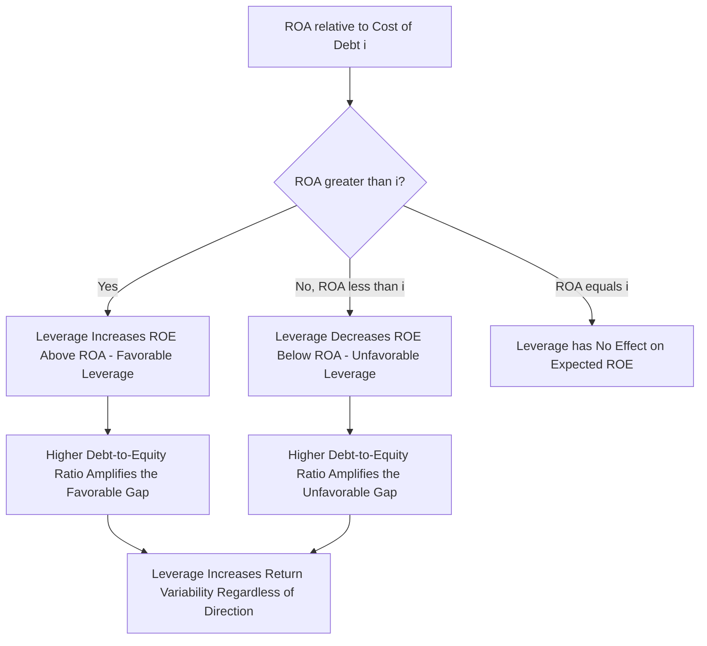

## Leverage and Capital Structure Decisions

### Overview

Capital structure refers to the mix of debt and equity a farm business uses to finance its assets, and leverage refers specifically to the use of borrowed funds (debt) to finance a portion of that asset base. Leverage decisions sit at the center of farm financial management because debt financing can amplify returns to owner equity when investments perform well, but equally amplifies losses and financial risk when they do not. This topic extends the balance sheet, credit analysis, and capital investment concepts covered elsewhere in this chapter into the specific question of how much debt a farm business should carry and how that decision should be evaluated.

**Key Points**

- Leverage amplifies both the potential return to owner equity and the financial risk borne by the owner — a relationship formalized by financial leverage analysis.
- The trade-off between the benefit of leverage (return amplification, tax deductibility of interest, capital preservation) and its cost (increased risk of insolvency, reduced flexibility, higher interest expense) defines the optimal capital structure question.
- Key metrics — debt-to-asset ratio, debt-to-equity ratio, and the relationship between return on assets and cost of borrowed capital — are used to evaluate whether increased leverage benefits or harms the farm's financial position.
- Capital structure decisions must account for risk tolerance, income variability, and the farm's stage in the business life cycle (e.g., a beginning farmer typically must accept higher leverage than an established operation).

---

### The Basic Leverage Relationship

#### Return on Assets vs. Return on Equity

The core leverage mechanism operates through the relationship between the return the farm's assets generate (Return on Assets, ROA) and the cost of the borrowed funds used to finance a portion of those assets (the interest rate on debt, $i$):

$$ROE = ROA + \left(\frac{D}{E}\right) \times (ROA - i)$$

where $ROE$ is return on equity, $D/E$ is the debt-to-equity ratio, $ROA$ is return on assets, and $i$ is the average interest rate paid on debt.

This relationship reveals the fundamental leverage principle:

- **When $ROA > i$** (assets earn more than the cost of borrowing): leverage increases ROE above ROA — borrowing to finance additional assets is profitable, because the return earned on the borrowed capital exceeds its cost, and the surplus accrues entirely to the owner's equity.
- **When $ROA < i$** (assets earn less than the cost of borrowing): leverage decreases ROE below ROA — the farm loses money on every dollar borrowed, and this loss is borne entirely by the owner's equity, since the lender must still be paid the contracted interest rate regardless of the asset's actual performance.
- **When $ROA = i$**: leverage has no effect on ROE; it is neither beneficial nor harmful in expectation, though it still increases variability of returns (see below).

This is often called **financial leverage** or the "leverage effect," and it is the same conceptual mechanism as leverage in general corporate finance, applied to the specific ROA-vs-cost-of-debt relationship relevant to a farm business.

---

### Worked Example: The Leverage Effect

Consider a farm with $1,000,000 in total assets generating a 9% return on assets (ROA = 9%). Compare two capital structures: low leverage (20% debt) and high leverage (60% debt), with an average interest rate of 6% on borrowed funds.

**Low leverage scenario**: Debt = $200,000, Equity = $800,000, so $D/E = 0.25$

$$ROE = 9\% + 0.25 \times (9\% - 6\%) = 9\% + 0.75\% = 9.75\%$$

**High leverage scenario**: Debt = $600,000, Equity = $400,000, so $D/E = 1.5$

$$ROE = 9\% + 1.5 \times (9\% - 6\%) = 9\% + 4.5\% = 13.5\%$$

**Interpretation**: because ROA (9%) exceeds the cost of debt (6%), higher leverage produces a higher ROE — the high-leverage scenario returns 13.5% to equity compared to 9.75% at low leverage, using the same underlying asset base and asset performance.

**Now consider a poor year where ROA falls to 3%** (below the 6% cost of debt), with the same two structures:

Low leverage: $ROE = 3\% + 0.25 \times (3\% - 6\%) = 3\% - 0.75\% = 2.25\%$

High leverage: $ROE = 3\% + 1.5 \times (3\% - 6\%) = 3\% - 4.5\% = -1.5\%$

**Interpretation**: in the poor-performance year, the high-leverage structure produces a *negative* return to equity (-1.5%), while the low-leverage structure, though also reduced, remains positive (2.25%). [Inference] This example illustrates the central risk-return trade-off of leverage: the same high-leverage structure that magnified gains in the favorable year magnifies losses by a correspondingly larger amount in the unfavorable year, which is why leverage decisions cannot be evaluated using a single expected-return scenario alone and require assessment across a plausible range of ROA outcomes, including unfavorable ones.

---

### Leverage Effect Diagram

---

### Benefits of Leverage

- **Return amplification**: as demonstrated above, when ROA exceeds the cost of borrowed capital, leverage increases the return to owner equity.
- **Capital preservation and growth capacity**: borrowing allows a farm to acquire more assets (land, machinery, livestock) than owner equity alone would permit, enabling faster growth or entry into farming for operators without substantial inherited capital.
- **Tax deductibility of interest**: in many tax systems, interest expense on business debt is deductible against taxable income, reducing the after-tax cost of debt relative to its stated interest rate. [Unverified] The specific tax treatment of interest deductibility varies by jurisdiction and by entity structure, and is subject to change under current tax law; applicability should be confirmed against current tax code rather than assumed universal.
- **Retained equity liquidity**: using debt to finance a portion of an asset purchase preserves owner cash/equity for other uses (working capital reserves, diversification, risk management), rather than concentrating all available capital into a single illiquid asset.

### Costs and Risks of Leverage

- **Increased financial risk**: as shown in the worked example, leverage magnifies losses in unfavorable years exactly as it magnifies gains in favorable years — it increases the variance of ROE without necessarily changing its expected value (which depends on the ROA-vs-cost-of-debt relationship holding on average).
- **Fixed repayment obligations**: unlike equity capital, debt requires scheduled principal and interest payments regardless of the farm's actual income in a given year, creating cash flow pressure during low-income periods that equity financing does not.
- **Reduced financial flexibility**: highly leveraged farms have less capacity to absorb an unexpected shock (weather event, price collapse, health emergency) without risking covenant violation, forced asset sale, or insolvency.
- **Collateral and refinancing risk**: highly leveraged positions are more exposed to declines in asset (particularly land) values, which can trigger loan-to-value covenant breaches or complicate refinancing even absent an operating income problem.
- **Higher cost of additional debt at high leverage levels**: lenders typically increase the interest rate charged, or decline additional credit entirely, as a borrower's existing leverage rises, reflecting the lender's own assessment of increasing default risk — meaning the effective cost of debt ($i$ in the ROE equation) is not necessarily constant as leverage increases, which can erode or reverse the favorable-leverage condition at higher debt levels.

---

### Measuring Capital Structure and Leverage

#### Debt-to-Asset Ratio

$$\text{Debt-to-Asset Ratio} = \frac{\text{Total Liabilities}}{\text{Total Assets}}$$

Indicates the proportion of the asset base financed by creditors rather than owner equity; a common solvency benchmark used both internally and by lenders.

#### Debt-to-Equity Ratio

$$\text{Debt-to-Equity Ratio} = \frac{\text{Total Liabilities}}{\text{Owner Equity}}$$

The ratio used directly in the ROE leverage formula above; expresses leverage relative to the owner's own capital stake.

#### Equity-to-Asset Ratio

$$\text{Equity-to-Asset Ratio} = \frac{\text{Owner Equity}}{\text{Total Assets}} = 1 - \text{Debt-to-Asset Ratio}$$

The complement of the debt-to-asset ratio; a higher equity-to-asset ratio indicates lower leverage and generally greater solvency cushion.

#### Interest Coverage / Term Debt Coverage

As covered under farm balance sheets and credit analysis, the term debt coverage ratio evaluates whether current cash flow is sufficient to service the fixed obligations created by the chosen capital structure — a direct link between the leverage decision and the repayment capacity concept central to lender credit analysis.

---

### Factors Influencing the Optimal Capital Structure Decision

There is no single "correct" leverage level applicable to all farms; the appropriate capital structure depends on several farm-specific factors:

| Factor | Implication for Appropriate Leverage Level |
| --- | --- |
| **Income variability** | Farms with more volatile income (weather-dependent, single-enterprise, price-volatile commodities) generally should carry lower leverage to maintain adequate buffer against a bad year |
| **Stage in business life cycle** | Beginning farmers typically must accept higher leverage out of necessity (limited accumulated equity), while established operators nearing retirement often deliberately reduce leverage to lower risk exposure heading into a lower-labor-capacity life stage |
| **Owner risk tolerance** | Farms operated by more risk-averse owners may deliberately maintain lower leverage than the theoretical ROE-maximizing level, trading expected return for reduced variability and psychological/financial security |
| **Diversification** | More diversified operations (multiple enterprises with imperfectly correlated returns) may be able to sustain somewhat higher leverage for a given risk tolerance, since diversification itself reduces overall income variability |
| **Access to risk management tools** | Farms with strong crop insurance coverage, forward contracting practices, or other risk mitigation may be able to support higher leverage than an otherwise-identical unhedged operation, since these tools reduce the probability of an ROA outcome low enough to trigger the unfavorable-leverage scenario |
| **Asset liquidity and collateral quality** | Farms with more liquid, readily-valued collateral may access debt on better terms, affecting the practical cost side of the leverage calculation |
| **Interest rate environment** | A lower prevailing interest rate environment widens the favorable gap between ROA and cost of debt (all else equal), making leverage more attractive; a higher-rate environment narrows or reverses this gap |

[Inference] Because the ROA a farm will actually achieve in any given year is uncertain rather than known in advance, capital structure decisions are properly evaluated not against a single expected ROA figure but against the full distribution of plausible ROA outcomes — meaning the leverage level a risk-averse operator should choose is generally lower than the level that would maximize expected ROE under a single best-guess ROA assumption, reflecting the asymmetric consequence of a bad outcome (potential insolvency) versus a good outcome (additional profit).

---

### Leverage and the Farm Life Cycle

Capital structure is not static; it typically evolves systematically across a farm's life cycle:

- **Entry/establishment phase**: highest leverage, often out of necessity, as the operator has limited accumulated equity and must finance land, machinery, and livestock largely with borrowed capital.
- **Growth phase**: leverage may remain elevated as the operator reinvests in expansion, but ideally accompanied by rising equity from retained earnings, gradually improving the equity-to-asset ratio even as absolute debt levels may continue to rise.
- **Consolidation/maturity phase**: leverage typically declines as accumulated retained earnings and asset appreciation build equity faster than new debt is incurred, and as the operator's risk tolerance may shift toward capital preservation.
- **Retirement/succession phase**: leverage often declines further as the operator reduces new investment and may begin transferring assets (see succession and estate planning), though this phase can also see a temporary leverage increase for a successor undertaking a buy-in/buy-out transaction.

This life-cycle pattern connects directly to the succession planning material covered elsewhere in this course, since a successor's entry into farm ownership frequently requires taking on substantial leverage precisely at the point where the departing generation may be seeking to reduce theirs.

---

### Practical Application: Evaluating a Leverage Decision

A farm manager evaluating whether to take on additional debt to finance an expansion should typically:

1. **Estimate the expected ROA** of the specific investment being financed (using capital budgeting techniques such as NPV/IRR from the time value of money framework), not merely the farm's historical overall ROA.
2. **Compare expected investment ROA to the cost of the specific financing** being considered, accounting for the effective (after-tax, where applicable) interest rate.
3. **Stress-test the decision against a pessimistic ROA scenario**, evaluating whether the resulting ROE and cash flow remain within a range the farm can sustain without breaching loan covenants or depleting working capital reserves.
4. **Assess the resulting capital structure ratios** (debt-to-asset, debt-to-equity, term debt coverage) against the farm's own risk tolerance and against typical lender benchmarks, recognizing that lenders' own risk tolerance for additional credit may become a binding constraint independent of the farm manager's own risk assessment.
5. **Consider the decision's interaction with the whole-farm plan**, since additional leverage for one investment affects the capital available (and the capital constraint's shadow price) for other competing uses within the broader whole-farm planning framework.

---

**Next Steps**

- Farm balance sheets and cash flow analysis (source ratios for leverage measurement)
- Credit analysis and lending institutions (lender-side view of leverage and risk tolerance)
- Time value of money and capital investment (estimating investment-specific ROA for leverage decisions)
- Risk management and crop insurance (tools that support sustaining higher leverage)
- Succession and estate planning (leverage implications of generational transfer and buy-in transactions)
- Whole-farm planning and linear programming (capital constraints and leverage interaction)
- Cost of capital estimation (weighted average cost of capital for mixed debt-equity financing)
- Farm business life cycle financial management