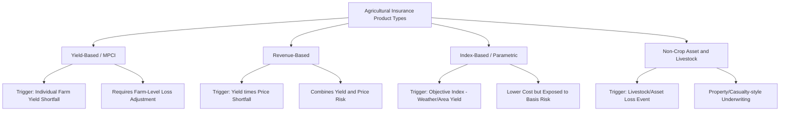
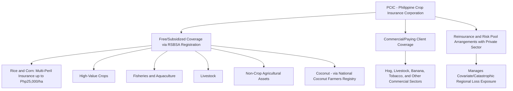

## Agricultural Insurance and Crop Insurance Programs

### Overview

Agricultural insurance is a risk management tool that transfers a portion of a farm's production, price, or asset risk to an insurer in exchange for a premium payment, providing indemnity compensation when specified insured perils cause a covered loss. Crop insurance is the most developed and widely studied branch of agricultural insurance, addressing the fundamental problem that farm income is exposed to weather, pest, and disease risks largely outside the farmer's control, risks that are frequently **covariate** (affecting many farmers in a region simultaneously) rather than idiosyncratic, which shapes both how these programs are designed and why government involvement is common worldwide.

**Key Points**

- Agricultural insurance programs are typically classified by the type of loss trigger: yield-based (indemnity), price-based (revenue), and index-based (parametric) insurance each allocate risk differently and require different verification mechanisms.
- Because agricultural risk is often covariate rather than idiosyncratic, private insurance markets alone frequently underprovide crop insurance, which is why government premium subsidy and reinsurance support is common internationally.
- Adverse selection and moral hazard are structural challenges specific to crop insurance markets, addressed through mechanisms such as mandatory participation pools, actuarially-based premium rating, and loss-adjustment procedures.
- In the Philippines, the Philippine Crop Insurance Corporation (PCIC) is the primary implementing agency for government-supported agricultural insurance, and its program parameters have changed materially in 2025-2026 — current figures should be verified against PCIC's own published guidance rather than treated as fixed.

---

### Types of Agricultural Insurance Products

#### Yield-Based (Multi-Peril Crop Insurance / MPCI)

Indemnifies the farmer when actual harvested yield falls below a guaranteed yield level (typically a percentage of the farmer's own historical average yield), regardless of the cause, as long as the cause is an insured peril (drought, flood, typhoon/windstorm, pest infestation, plant disease).

$$\text{Indemnity} = (\text{Guaranteed Yield} - \text{Actual Yield}) \times \text{Price Election} \times \text{Insured Area}$$

**Advantages**: covers the farmer's actual realized production shortfall directly, regardless of which specific peril caused it (a broader, multi-peril design rather than single-peril coverage).

**Disadvantages**: requires individual farm-level yield verification (loss adjustment), which is administratively costly and creates asymmetric-information vulnerabilities (moral hazard in reporting losses, and adverse selection if farmers with above-average risk disproportionately enroll).

#### Revenue-Based Insurance

Indemnifies the farmer when actual revenue (yield × price) falls below a guaranteed revenue level, combining yield risk and price risk protection into a single product. Particularly relevant where a farmer's greatest income risk is the joint occurrence of low yield and low price (or, in some designs, protects against a price decline even when yield is normal).

$$\text{Indemnity} = \max\left[0,\ (\text{Guaranteed Revenue} - \text{Actual Revenue})\right] \times \text{Insured Area}$$

[Unverified] Revenue-based crop insurance products are well established in some countries' agricultural insurance markets but are not universally available; availability and specific product design depend on the maturity of the local agricultural insurance and futures/price-discovery infrastructure in a given country, and should be confirmed against current local program offerings.

#### Index-Based (Parametric) Insurance

Indemnifies based on an objectively measurable index (rainfall at a reference weather station, an area-average yield, a satellite-derived vegetation index) that is correlated with, but not identical to, the individual farmer's actual loss, rather than on the individual farm's verified loss.

**Advantages**: substantially lower administrative/loss-adjustment cost than individual yield verification, since the trigger is an objective, third-party-measured index rather than a farm-specific inspection; reduces moral hazard because the payout is independent of the individual farmer's own actions.

**Disadvantages**: exposed to **basis risk** — the risk that the index does not accurately reflect the individual farmer's actual loss (e.g., a farmer suffers a real loss but the reference weather station records normal rainfall, so no payout is triggered, or the reverse). [Inference] Basis risk is widely identified in agricultural insurance literature as the primary barrier to farmer trust and sustained uptake of index-based products, even though their lower cost structure makes them theoretically attractive, particularly for smallholder contexts where individual loss verification would be prohibitively expensive relative to typical policy sizes.

#### Non-Crop Agricultural Asset and Livestock Insurance

Covers loss of livestock, aquaculture stock, machinery, equipment, and other agricultural infrastructure from insured perils (disease, natural disaster, accident), structured similarly to conventional property/casualty insurance but underwritten with agriculture-specific risk factors.

---

### Insurance Product Comparison

---

### Structural Challenges in Crop Insurance Markets

#### Covariate (Systemic) Risk

Unlike most conventional insurance lines (e.g., auto or fire insurance, where losses across policyholders are largely independent), agricultural losses are frequently **correlated across an entire region** — a drought, typhoon, or regional pest outbreak affects most farmers in the affected area simultaneously. This has two major consequences:

- **Diversification limits**: an insurer cannot rely on pooling large numbers of independent risks within a single region to manage exposure, as it could with idiosyncratic risks; a single severe event can trigger claims across the insurer's entire regional book simultaneously.
- **Reinsurance dependence**: because of this concentrated exposure, primary agricultural insurers typically require substantial **reinsurance** (risk transfer to global reinsurance markets or government-backed reinsurance facilities) to remain solvent through a severe regional loss event, rather than being able to self-insure through diversification alone.

#### Adverse Selection

Farmers with private knowledge of their own above-average risk exposure (e.g., land in a flood-prone area, a history of poor yields) have a stronger incentive to purchase insurance than lower-risk farmers, which, absent mitigation, can lead to a pool of insured farmers skewed toward higher risk than the general farming population — raising average claims costs and potentially destabilizing premium pricing.

**Mitigation approaches**: mandatory or near-universal enrollment (removing the voluntary selection margin), premium rating based on verified individual/regional historical loss experience, and group or area-based (rather than purely individual) risk pooling.

#### Moral Hazard

Once insured, a farmer may have reduced incentive to apply the same level of preventive effort (pest management, irrigation management, timely harvesting) as an uninsured farmer would, since a portion of the downside loss is now borne by the insurer rather than the farmer.

**Mitigation approaches**: deductibles and coinsurance provisions (the farmer retains a meaningful share of any loss, preserving some effort incentive), loss-adjustment procedures and field verification, and index-based product designs (where the payout is independent of the individual farmer's actions, structurally eliminating this specific moral hazard channel).

---

### The Rationale for Government Involvement

Because of the covariate risk and information-asymmetry challenges described above, agricultural insurance markets worldwide commonly feature substantial government involvement, through one or more of:

- **Premium subsidies**: government pays some or all of the farmer's premium, increasing affordability and participation rates, particularly important where covariate risk would otherwise make actuarially-fair premiums unaffordable for many farmers.
- **Government reinsurance or risk-pool backstops**: government absorbs a portion of catastrophic-level regional losses that would otherwise be difficult for private reinsurance markets to price and absorb affordably.
- **Direct provision through a state-owned or state-affiliated insurer**: some countries operate agricultural insurance primarily or exclusively through a government-owned corporation rather than relying on private insurers, given the market-failure characteristics described above.
- **Mandatory or automatic enrollment linked to agricultural credit**: some programs link crop insurance enrollment to receipt of agricultural credit, functioning simultaneously as a credit-risk mitigant for the lending institution and as a mechanism to broaden the insurance risk pool beyond a purely voluntary, adverse-selection-prone enrollment base.

[Inference] The specific mix of these mechanisms varies substantially by country, reflecting differences in government fiscal capacity, the structure of the domestic insurance/reinsurance industry, and agricultural policy priorities; general familiarity with the underlying market-failure rationale is broadly transferable across countries, but the specific institutional design is not.

---

### Philippines: Philippine Crop Insurance Corporation (PCIC)

The Philippine Crop Insurance Corporation is the government-owned-and-controlled corporation attached to the Department of Agriculture that serves as the country's primary implementing agency for agricultural insurance, with a mandate to provide insurance protection to farmers and fisherfolk against losses from natural calamities, pests, and plant diseases.

#### Recent Program Developments (as of early-to-mid 2026)

Under the 2026 General Appropriations Act, PCIC's budget was raised by 45 percent, from ₱4.5 billion to ₱6.5 billion, described as the highest allocation for the program to date. The Department of Agriculture-PCIC stated the expanded budget would translate into higher insurance cover for rice and corn and wider nationwide reach for its free insurance program. [da](https://www.da.gov.ph/pcic-gets-bigger-budget-to-shield-filipino-farmers/)[da](https://www.da.gov.ph/pcic-gets-bigger-budget-to-shield-filipino-farmers/)

Starting in 2026, insurance cover for rice and corn increased to ₱25,000 per hectare, up 25 percent from ₱20,000, representing the maximum payout for total crop loss caused by insured perils such as natural calamities, pests, and diseases under PCIC's multi-peril insurance. [da](https://www.da.gov.ph/pcic-gets-bigger-budget-to-shield-filipino-farmers/)

The expanded budget allows PCIC to insure around 2.93 million farmers and fishers in 2026, up nearly 25% from 2.35 million covered the prior year, and the total number of subsidized and non-subsidized insured farmers and fishers is projected to reach 3.68 million, up 12% from 3.29 million. [asiainsurancereview](https://www.asiainsurancereview.com/News/View-NewsLetter-Article/id/94257/Type/eDaily)

The free insurance program spans seven product lines: rice, corn, high-value crops, fisheries and aquaculture, livestock, and non-crop agricultural assets, while credit and life term insurance remain excluded from the free coverage. [da](https://www.da.gov.ph/pcic-gets-bigger-budget-to-shield-filipino-farmers/)

Funding for the free program comes through the government premium subsidy in the national budget, supporting farmers and fisherfolk listed in the Registry System for Basic Sectors in Agriculture (RSBSA), the government's official agricultural producer database. Registered coconut farmers under the National Coconut Farmers Registry System are also covered, backed by roughly ₱500 million from the Coconut Farmers and Industry Trust Fund, with about 714,000 coconut farmers expected to be insured in 2026, up from 640,000 in 2025. [da](https://www.da.gov.ph/pcic-gets-bigger-budget-to-shield-filipino-farmers/)[asiainsurancereview](https://www.asiainsurancereview.com/News/View-NewsLetter-Article/id/94257/Type/eDaily)

Beyond subsidized clients, PCIC also serves paying commercial clients from sectors such as hog, livestock, banana, and tobacco. [malaya](https://malaya.com.ph/business/business-news/pcic-seeks-p5-5b-for-2026-to-insure-600k-more-farmers)

PCIC has also been granted authority to engage the private sector through co-insurance, reinsurance, and risk pools, following a reinsurance mandate granted in late 2025 — a structural shift toward the reinsurance-dependence model described in the general framework above, allowing PCIC to share catastrophic-level regional exposure with private reinsurance capacity rather than bearing it entirely on the government balance sheet. [insuranceasianews](https://insuranceasianews.com/companies_category/philippine-crop-insurance-corporation)

[Unverified] PCIC's corporate charter is set to lapse in 2028, and the corporation has indicated intent to seek a 25-year charter extension once the next Congress convenes — this is a legislative matter still pending as of the most recent search results and should be checked for updated status before being cited as settled.

#### Eligibility and Enrollment

Eligibility for the free, government-subsidized insurance program requires farmers and fisherfolk to be listed in the Registry System for Basic Sectors in Agriculture (RSBSA). [Unverified] Specific enrollment procedures, documentation requirements, and coverage effective dates should be confirmed directly with PCIC or the local Department of Agriculture office, as program administration details are set by current PCIC circulars rather than fixed by the statutory framework alone. [da](https://www.da.gov.ph/pcic-gets-bigger-budget-to-shield-filipino-farmers/)

---

### PCIC Program Structure Diagram

---

### Insurance Decision Framework for the Farm Manager

Whether or not a specific government-subsidized program is available, farm managers evaluating agricultural insurance as part of a broader risk management strategy should generally consider:

| Consideration | Key Question |
| --- | --- |
| **Risk exposure profile** | Which perils (weather, pest, price, disease) pose the greatest threat to this specific farm's income stability? |
| **Coverage level and basis risk** | Does the available product (individual yield-based vs. index-based) closely match this farm's actual loss exposure, or is meaningful basis risk present? |
| **Premium cost vs. subsidy availability** | Is government premium subsidy available, and does the farm meet eligibility/registration requirements to access it? |
| **Interaction with credit** | Does maintaining crop insurance coverage improve loan terms or satisfy a lender's covenant requirement, as discussed under credit analysis? |
| **Interaction with capital structure** | Does insurance coverage reduce the downside-risk scenario sufficiently to justify carrying somewhat higher leverage than would be prudent without coverage, as discussed under leverage and capital structure? |
| **Complementary risk management tools** | Should insurance be combined with forward contracting, diversification, or on-farm risk mitigation practices rather than relied upon as the sole risk management strategy? |

[Inference] Agricultural insurance is generally most effective as one component of a broader farm risk management strategy rather than a complete substitute for diversification, financial reserves, and production risk management practices, since even well-designed insurance products typically leave some residual risk (deductibles, coverage caps, or basis risk) that the farm must still absorb directly.

---

**Next Steps**

- Farm risk management strategies and diversification
- Credit analysis and lending institutions (insurance as a lender risk-mitigation factor)
- Leverage and capital structure decisions (interaction between insurance coverage and sustainable debt levels)
- Time value of money and capital investment (incorporating insurance costs into investment cash flow projections)
- Index-based/parametric insurance design and basis risk measurement
- Government agricultural policy and premium subsidy program design
- Reinsurance markets and catastrophic risk pooling in agriculture
- Registry System for Basic Sectors in Agriculture (RSBSA) and program eligibility verification