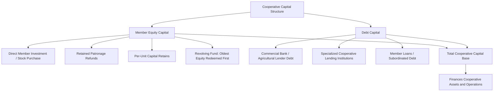

## Cooperative Finance Structures

### Overview

Cooperative finance structures refer to the distinctive ownership, capital-raising, and profit-distribution mechanisms used by agricultural cooperatives — member-owned businesses formed to provide farmers with collective bargaining power, shared infrastructure, or pooled financial services that individual farmers could not efficiently obtain alone. Unlike investor-owned firms, cooperatives are structured around user-ownership and user-control principles, which creates a fundamentally different capital structure problem: cooperatives must raise and maintain capital primarily from members who benefit from the cooperative's services rather than from external investors seeking a return on investment as their primary motive.

**Key Points**

- Cooperatives are distinguished from investor-owned firms by three core principles: user-ownership, user-control (typically one-member-one-vote), and user-benefit (patronage-based distribution of net earnings).
- Cooperative capital comes from a mix of member equity (direct investment, retained patronage refunds, per-unit retains) and external debt, with the member-equity structure creating a distinctive set of financing challenges not present in conventional corporate finance.
- The "cooperative capital problem" — the structural difficulty cooperatives face in attracting and retaining sufficient equity capital — arises from limited tradability of cooperative equity, the redemption obligation many cooperatives carry, and free-rider incentives among members.
- Agricultural credit cooperatives and credit unions represent a specific application of cooperative structure to the provision of farm credit itself, distinct from marketing, supply, or service cooperatives.

---

### Cooperative Principles and Their Financial Implications

#### The Three Core Cooperative Principles

| Principle | Definition | Financial Implication |
| --- | --- | --- |
| **User-ownership** | The cooperative is owned by the members who use its services (patrons), not by outside investors | Capital is raised primarily from the same people who transact business with the cooperative, linking capital contribution to patronage rather than pure investment return-seeking |
| **User-control** | Members control the cooperative's governance, typically on a one-member-one-vote basis (sometimes proportional to patronage volume in some structures) rather than one-share-one-vote | Weakens the direct link between capital contribution size and voting power, which can reduce the incentive for larger capital contributions relative to an investor-owned firm structure |
| **User-benefit** | Net earnings (savings/profit) are distributed to members based on their patronage (volume of business done with the cooperative), not based on capital invested | Distinguishes cooperative "patronage refunds" from conventional corporate dividends, which are paid based on shares owned rather than transaction volume |

[Inference] These three principles collectively distinguish cooperative finance from investor-owned firm finance at a structural level, not merely a stylistic one: because capital return in a pure cooperative structure is tied to patronage rather than investment size, the cooperative faces a fundamentally different set of incentives for attracting external or even internal capital compared to a conventional corporation, which is the root of most cooperative-specific capital financing challenges discussed below.

---

### Sources of Cooperative Capital

#### Member Equity Capital

Cooperatives raise equity capital from members through several distinct mechanisms:

- **Direct member investment**: members purchase common or preferred stock, or make a direct capital contribution, at the time of joining or as an ongoing membership requirement.
- **Retained patronage refunds**: rather than paying the member's full share of net earnings in cash, the cooperative retains a portion as additional member equity, issued as a "qualified" or "non-qualified" written notice of allocation (terminology and tax treatment vary by jurisdiction), effectively reinvesting member earnings back into the cooperative's capital base.
- **Per-unit capital retains**: the cooperative withholds a fixed amount per unit of product marketed or per unit of input purchased (e.g., a small deduction per bushel or per ton handled) as a mandatory capital contribution, separate from and in addition to patronage-refund retains.
- **Revolving fund equity redemption**: cooperatives commonly operate on a "revolving fund" principle, where retained member equity from a given year is eventually redeemed (paid out in cash) to the member after a specified number of years, on a rotating basis, so that the oldest retained equity is redeemed first as new equity is added from current-year earnings.

#### Debt Capital

Like any business, cooperatives also raise debt capital from conventional and specialized sources:

- **Commercial bank and specialized agricultural lender debt**: cooperatives borrow through the same institutional channels available to other agribusinesses, as covered under sources of agricultural credit.
- **Cooperative-specific lending institutions**: in some countries, dedicated banking institutions exist specifically to provide wholesale credit to agricultural cooperatives, structured similarly to how specialized agricultural lenders serve individual farm borrowers.
- **Member loans and subordinated debt**: some cooperatives raise additional capital through member-subscribed debt instruments (loans or subordinated notes from members), which sit between pure equity and conventional third-party debt in the capital structure.

---

### Cooperative Capital Structure Diagram

---

### Patronage Refunds vs. Corporate Dividends

A central distinguishing feature of cooperative finance is how net earnings (called "savings" in cooperative terminology, roughly equivalent to net income) are distributed:

$$\text{Patronage Refund}_i = \text{Net Earnings from Patronage-Based Business} \times \frac{\text{Member } i\text{'s Volume of Business}}{\text{Total Member Volume of Business}}$$

**Key distinctions from a conventional corporate dividend**:

- Distribution is based on **how much business the member did with the cooperative** during the year (e.g., bushels marketed through the cooperative, dollars of input purchased), not on how many shares the member owns.
- Patronage refunds are typically distributed as a mix of **cash** and **retained equity** (a written notice of allocation representing the member's additional ownership stake), rather than entirely in cash — this is the mechanism by which retained patronage refunds function simultaneously as earnings distribution and as a capital-raising tool.
- [Unverified] The tax treatment of patronage refunds — including the distinction between "qualified" (taxable to the member when allocated, deductible to the cooperative) and "non-qualified" (taxable to the member only when eventually redeemed in cash) written notices of allocation — is governed by tax statute that varies by country and is subject to legislative change; specific tax treatment should be confirmed against current tax law in the relevant jurisdiction rather than assumed uniform.

---

### The Cooperative Capital Problem

Agricultural economics literature on cooperative finance identifies a recurring structural challenge often termed the **cooperative capital problem** or "vaguely defined property rights" problem, arising from several interrelated features of the cooperative equity structure:

#### Limited Tradability (Illiquidity of Member Equity)

Unlike shares of an investor-owned corporation, cooperative member equity is generally **not freely tradable** on an open market; equity is typically transferable only to another eligible member (or back to the cooperative itself), and often only at book (par) value rather than a market-determined price reflecting the cooperative's actual current value or earnings potential.

[Inference] This illiquidity means a member cannot realize capital appreciation by selling their equity stake to a third party the way a shareholder in an investor-owned firm could, which removes a significant capital-attraction incentive present in conventional corporate equity markets and is widely cited as a root cause of cooperative undercapitalization relative to comparably-sized investor-owned firms.

#### The Redemption Obligation and Horizon Problem

Because retained member equity is generally expected to be redeemed (paid out in cash) eventually under the revolving fund principle, the cooperative carries an implicit future cash obligation to its members — distinct from a conventional corporation, which has no obligation to redeem shareholder equity. This creates a **horizon problem**: a member's economic interest in a given year's retained earnings is tied to how long that member expects to remain a patron before likely receiving redemption, which can create divergent capital-investment time horizons among members of different ages or expected tenure with the cooperative, and can bias the cooperative's own investment decisions toward projects with faster expected payback relative to what might be optimal for the cooperative as a long-lived entity.

#### The Free-Rider Problem

Because cooperative benefits (services, pricing advantages) are often available to all members regardless of the size of their individual capital contribution (particularly where governance is one-member-one-vote rather than contribution-weighted), individual members may have a reduced incentive to voluntarily contribute additional capital beyond the minimum required, since they can benefit from capital contributed by other members without proportionally increasing their own contribution — a collective-action problem analogous to free-riding in other shared-resource contexts.

#### Common Responses to the Cooperative Capital Problem

| Response | Mechanism |
| --- | --- |
| **Mandatory per-unit capital retains** | Removes voluntary discretion, ensuring capital contribution scales with actual patronage volume regardless of individual member preference |
| **Base capital plans** | Requires each member to maintain an equity investment proportional to their current patronage level, periodically adjusted, rather than relying solely on historical retained earnings accumulation |
| **New Generation Cooperative (NGC) structures** | Requires substantial up-front member equity investment tied to a specific delivery right/obligation, and often permits equity to be transferred at a market-negotiated (rather than fixed book) price among eligible members, partially addressing the illiquidity problem |
| **Preferred stock issuance** | Raises additional equity capital from members (or in some structures, non-member investors) through preferred stock with a defined dividend, without diluting the one-member-one-vote common-stock control structure |
| **Strategic alliances, joint ventures, and subsidiary structures** | Allows the cooperative to access capital or share risk on a specific large investment without requiring the full capital burden to be raised through the traditional member-equity mechanisms alone |

---

### Agricultural Credit Cooperatives and Credit Unions

A distinct application of cooperative structure is to the *provision of credit itself*, as introduced under sources of agricultural credit — farmer-owned cooperative financial institutions that pool member savings/capital to provide loans to member-borrowers.

**Key structural features**:

- Member-depositors/capital-contributors are simultaneously the cooperative's owners and (frequently) its borrowers, aligning the institution's incentives with member financial welfare rather than external shareholder profit maximization.
- Governance follows the same one-member-one-vote cooperative principle, regardless of the size of an individual member's deposits or borrowing.
- Net earnings are typically returned to members through some combination of reduced loan interest rates, increased deposit interest rates, or patronage-based dividends, rather than external shareholder dividends.
- [Unverified] The specific regulatory framework governing agricultural credit cooperatives and credit unions (capital adequacy requirements, deposit insurance eligibility, permitted lending activities) varies substantially by country and is subject to ongoing regulatory change; current requirements should be confirmed against the relevant national financial regulatory authority.

---

### Cooperative vs. Investor-Owned Firm Capital Structure Comparison

| Dimension | Agricultural Cooperative | Investor-Owned Firm |
| --- | --- | --- |
| Ownership basis | Member-patrons (users of the cooperative's services) | Shareholders (investors, who may or may not use the firm's products/services) |
| Voting control | Typically one-member-one-vote, regardless of capital contributed | Typically one-share-one-vote, proportional to capital invested |
| Earnings distribution basis | Patronage volume (business done with the cooperative) | Shares owned |
| Equity tradability | Limited; typically transferable only to eligible members, often at fixed book value | Freely tradable on open markets (for publicly traded firms), at market-determined price |
| Capital appreciation potential to investor | Limited or none (equity value typically fixed at par/book value) | Direct exposure to firm value appreciation via share price |
| Primary capital-raising challenge | Attracting sufficient member equity given limited tradability, free-rider incentives, and the redemption obligation | Balancing cost of equity vs. debt, and managing dilution of existing shareholder control |

---

### Cooperative Finance in the Broader Farm Financial Context

Cooperative membership and capital investment decisions interact with several other topics in this chapter:

- **Balance sheet treatment**: a farmer's investment in cooperative equity (stock, retained patronage allocations, per-unit retains) appears as an asset on the farmer's own balance sheet, typically classified based on expected time to redemption, and its valuation (book value vs. estimated realizable value) is subject to the same cost-basis vs. market-value considerations discussed under farm balance sheets.
- **Cash flow timing**: retained (non-cash) patronage refunds increase a farmer's accrual-based net income in the year allocated but do not provide cash until eventually redeemed by the cooperative, creating exactly the kind of accrual-income-vs-cash-flow divergence discussed under farm balance sheets and cash flow analysis.
- **Credit analysis implications**: a farmer's cooperative equity holdings may be considered by a lender in assessing overall net worth (the "Capital" component of the Five Cs of Credit), though its limited tradability and uncertain redemption timing may lead a lender to discount its value relative to more liquid assets when assessing collateral or solvency.
- **Whole-farm and investment decisions**: a farmer's decision to increase patronage with, or make additional capital contributions to, a cooperative can itself be evaluated using capital budgeting concepts (expected patronage refund benefit vs. capital tied up), though the illiquidity and redemption-timing uncertainty discussed above complicate a standard NPV analysis relative to a conventional investment with clearer cash-flow timing.

---

**Next Steps**

- Sources of agricultural credit (cooperative lending institutions as one credit channel)
- Farm balance sheets and cash flow analysis (valuation and cash-timing treatment of cooperative equity)
- Credit analysis and lending institutions (treatment of cooperative equity in creditworthiness assessment)
- Agricultural marketing cooperatives and collective bargaining
- New Generation Cooperative structures and closed-membership models
- Cooperative governance and one-member-one-vote decision-making
- Time value of money and capital investment (evaluating member capital contribution decisions)
- Comparative organizational economics: cooperative vs. investor-owned firm structures