## Sources of Agricultural Risk

### Overview

Agricultural risk refers to the exposure of farm income, assets, and viability to uncertain outcomes arising from factors largely or entirely outside the farm operator's direct control. Understanding the distinct sources of agricultural risk is the foundation for the risk management, insurance, and financial structuring topics covered elsewhere in this course, since the appropriate risk management tool depends fundamentally on the specific type of risk being addressed. Agricultural economics literature commonly classifies farm business risk into five interrelated categories: production, price/market, financial, institutional, and human/personal risk.

**Key Points**

- Production risk arises from the biological and environmental unpredictability of farming; price/market risk arises from output and input price volatility.
- Financial risk is distinct from production and price risk — it specifically concerns the farm's capacity to meet financial obligations and is amplified by leverage, as discussed under leverage and capital structure decisions.
- Institutional (or legal/policy) risk and human/personal risk are frequently underweighted in formal risk analysis relative to production and price risk, despite being significant sources of farm income variability.
- Many of these risk sources are correlated rather than independent (e.g., a regional drought simultaneously creates production risk and, through reduced regional supply, can affect local price risk), which complicates simple risk-category-by-category management approaches.

---

### The Five Categories of Agricultural Risk

#### Production Risk

Production risk arises from the biological nature of agriculture and its exposure to uncontrollable environmental and biological factors affecting the quantity and quality of output.

**Sources**:

- **Weather variability**: drought, excess rainfall, temperature extremes, frost, hail, and windstorm/typhoon damage.
- **Pest and disease pressure**: insect infestations, weed pressure, plant diseases, and livestock disease outbreaks, whose severity varies year to year and is not fully controllable even with best-practice management.
- **Input performance variability**: variability in seed germination, feed conversion efficiency, or fertilizer response under differing environmental conditions.
- **Technology and management risk**: uncertainty in the actual field performance of a new technology, crop variety, or management practice relative to its expected performance, particularly relevant when adopting an unfamiliar practice.

[Inference] Production risk is generally the most extensively studied and most directly addressed risk category in agricultural economics, in part because it is the most amenable to formal actuarial and insurance-based risk transfer (as covered under agricultural insurance and crop insurance programs), whereas some of the other risk categories below are comparatively harder to insure against directly.

#### Price (Market) Risk

Price risk arises from the volatility of both output prices (the price received for crops, livestock, or other farm products) and input prices (the cost of seed, fertilizer, feed, fuel, and other purchased inputs), with the farm's net margin depending on the relationship between these two, often correlated, price streams.

**Sources**:

- **Output price volatility**: driven by global and domestic supply/demand conditions, weather affecting other producing regions, exchange rate movements (for internationally-traded commodities), and speculative trading activity in commodity futures markets.
- **Input price volatility**: particularly significant for inputs with volatile underlying cost drivers, such as fertilizer (tied to energy and natural gas prices) and fuel.
- **Basis risk**: the risk that the local cash price a farmer actually receives diverges from the futures market price used as a hedging reference, relevant for farmers using futures or options as a price risk management tool.
- **Timing/marketing risk**: the risk that the farmer's chosen timing of sale (or purchase of inputs) produces a worse outcome than an alternative timing would have, given price volatility across the marketing/production season.

#### Financial Risk

Financial risk is the risk that the farm business cannot generate sufficient cash flow to meet its financial obligations (debt service, cash operating expenses, family living withdrawals), and is distinct from — though closely interrelated with — production and price risk, because it specifically concerns the farm's *capital structure and liquidity position* rather than the underlying operating performance itself.

**Sources**:

- **Leverage**: as demonstrated under leverage and capital structure decisions, higher debt levels amplify the variability of return to equity for any given variability in underlying return on assets, meaning two farms with identical production and price risk exposure can face very different financial risk depending on their capital structure.
- **Interest rate risk**: exposure to rising interest rates on variable-rate debt, or refinancing risk if fixed-rate debt matures during a period of higher prevailing rates.
- **Liquidity risk**: insufficient working capital or access to operating credit to bridge the gap between when expenses are paid and when farm income is received, particularly acute given the seasonal cash flow pattern discussed under farm balance sheets and cash flow analysis.
- **Credit access risk**: the risk that a lender reduces, declines to renew, or tightens the terms of a farm's operating line or term debt, potentially due to factors outside the farm's own performance (e.g., a lender's broader change in agricultural sector risk tolerance).

#### Institutional (Legal and Policy) Risk

Institutional risk arises from changes in government policy, regulation, or legal frameworks that affect farm operations, income, or asset values, occurring independently of the farm's own production or market decisions.

**Sources**:

- **Trade policy changes**: tariffs, export restrictions, or trade agreement changes affecting the prices or market access for farm commodities, particularly significant for export-oriented or import-competing agricultural sectors.
- **Regulatory changes**: environmental regulations, pesticide/input approval or restriction changes, food safety requirements, and land-use zoning changes.
- **Subsidy and support program changes**: changes to government price support, insurance premium subsidy, or direct payment programs that farmers may have factored into their operating plans.
- **Tax policy changes**: changes to agricultural tax treatment (depreciation rules, capital gains treatment, property tax assessment methods) affecting after-tax farm returns and estate/succession planning assumptions.
- **Land tenure and property rights risk**: changes affecting land tenure security, particularly relevant in contexts with active land reform programs or evolving customary tenure recognition, as discussed under land tenure and leasing arrangements.

[Unverified] The specific magnitude and frequency of institutional risk affecting any given farm depends heavily on the country's particular policy environment and the specific commodities/sectors involved; general awareness of this risk category as structurally distinct from production and price risk is broadly applicable, but assessing its current relevance requires monitoring current policy developments in the farmer's specific jurisdiction and sector.

#### Human/Personal Risk

Human or personal risk arises from factors related to the health, life circumstances, and decision-making capacity of the farm operator and other key personnel (family labor, hired managers) involved in the operation.

**Sources**:

- **Health and disability risk**: the operator's or a key family member's illness, injury, or disability affecting the farm's labor and management capacity, particularly significant on farms where a single individual or small family group provides most management and labor input.
- **Death of a key operator**: the sudden loss of a principal operator or manager, creating both an immediate operational gap and (as discussed under succession and estate planning) a potential forced transfer of assets or management authority before an orderly succession plan has been implemented.
- **Family relationship risk**: divorce, family conflict, or disagreement among co-owners/family members regarding farm management or succession decisions, which can disrupt operations and, in severe cases, force asset partition or sale.
- **Management/decision-making risk**: risk arising simply from an operator's own management decisions being suboptimal given the information available at the time — distinct from unfavorable production or price outcomes that occur despite sound decision-making, since this category specifically concerns the quality of the decision-making process itself.

[Inference] Human/personal risk is frequently the least formally analyzed of the five risk categories in academic and applied farm risk management frameworks, likely because it is harder to quantify statistically and less amenable to market-based risk transfer instruments (such as insurance or futures contracts) compared to production and price risk, despite being identified in farm management literature as a significant and sometimes underappreciated source of farm business disruption.

---

### The Five Sources of Agricultural Risk — Diagram

```mermaid
flowchart TD
    A[Sources of Agricultural Risk] --> B[Production Risk]
    A --> C[Price / Market Risk]
    A --> D[Financial Risk]
    A --> E[Institutional / Policy Risk]
    A --> F[Human / Personal Risk]

    B --> B1[Weather Variability]
    B --> B2[Pest and Disease Pressure]
    B --> B3[Technology Performance Uncertainty]

    C --> C1[Output Price Volatility]
    C --> C2[Input Price Volatility]
    C --> C3[Basis Risk]

    D --> D1[Leverage-Amplified Return Variability]
    D --> D2[Interest Rate Risk]
    D --> D3[Liquidity and Credit Access Risk]

    E --> E1[Trade Policy Changes]
    E --> E2[Regulatory and Tax Policy Changes]
    E --> E3[Land Tenure and Property Rights Risk]

    F --> F1[Health and Disability Risk]
    F --> F2[Death of Key Operator]
    F --> F3[Family Relationship Risk]
```

---

### Interdependence and Correlation Among Risk Sources

A critical analytical point is that these five risk categories are **not independent** of one another; a single underlying event frequently propagates across multiple categories simultaneously:

- A regional drought (production risk) can simultaneously reduce regional supply and raise local output prices (price risk in the farmer's favor) while also reducing the farmer's own harvested volume (production risk working against the farmer) — the net income effect depends on the farmer's specific yield loss relative to the regional price response, and on whether the farmer's own farm was affected as severely as the broader region driving the price change.
- A trade policy change (institutional risk) directly transmits into output price risk for export-oriented commodities.
- Production or price risk realized as a bad year directly creates or intensifies financial risk, since reduced revenue strains the farm's capacity to service existing debt obligations — this is the mechanism by which the leverage effect discussed under leverage and capital structure decisions translates underlying operating risk into equity-level financial risk.
- A key operator's health crisis (human/personal risk) can simultaneously reduce production efficiency (production risk) and delay marketing or financial decisions during a critical window (compounding price and financial risk).

[Inference] Because of this interdependence, agricultural risk management is generally most effective when approached as an integrated whole-farm problem — considering how a given risk management tool (insurance, diversification, marketing contracts, leverage reduction) affects the farm's total risk exposure across all five categories jointly — rather than addressing each risk category with an isolated, single-purpose tool without considering cross-category interactions.

---

### Risk Source Characteristics Comparison

| Risk Category | Degree of Farmer Control | Typical Time Horizon | Primary Management Tools |
| --- | --- | --- | --- |
| Production | Low (weather, pests) to Moderate (management practices) | Single season to multi-year | Crop insurance, diversification, irrigation, pest management practices |
| Price/Market | Very low (farmer is generally a price-taker) | Single marketing season to multi-year contracts | Forward contracts, futures/options hedging, marketing plans, revenue insurance |
| Financial | Moderate to High (capital structure is a farmer choice) | Multi-year, tied to loan terms | Leverage management, working capital reserves, loan covenant management |
| Institutional | Very low (external policy decisions) | Unpredictable, can be sudden or gradual | Diversification across markets/commodities, policy monitoring, industry association engagement |
| Human/Personal | Moderate (health/lifestyle choices) to Low (accidents, sudden illness) | Unpredictable | Life/disability insurance, succession planning, cross-training of family/staff, health management |

---

### Practical Implications for Risk Assessment

Effective farm risk assessment generally involves identifying, for a specific farm operation:

1. **Which risk sources are most material** given the farm's specific enterprise mix, geographic location, capital structure, and family/management situation — since the relative importance of each category varies substantially across farm types (e.g., a single-enterprise, highly-leveraged, weather-exposed farm faces a very different risk profile than a diversified, low-leverage operation).
2. **Which risk sources are correlated** for this specific farm, so that risk management tools are chosen with awareness of compounding effects rather than treating each category in isolation.
3. **Which risk sources are insurable or hedgeable** through market-based instruments (crop insurance, futures/options) versus which require non-market risk management approaches (diversification, financial reserves, succession planning, health/life insurance).
4. **How the farm's risk tolerance and financial capacity to absorb loss** should inform the intensity of risk management investment across categories, recognizing that risk management itself carries a cost (insurance premiums, hedging costs, reduced expected return from diversification) that must be weighed against the value of the risk reduction achieved.

---

**Next Steps**

- Risk management strategies and tools in agriculture
- Agricultural insurance and crop insurance programs (production and revenue risk transfer)
- Price risk management: forward contracts, futures, and options
- Leverage and capital structure decisions (financial risk amplification mechanism)
- Succession and estate planning (mitigating human/personal risk continuity gaps)
- Diversification and enterprise combination for risk reduction
- Agricultural policy analysis and institutional risk monitoring
- Whole-farm risk assessment and integrated risk management planning