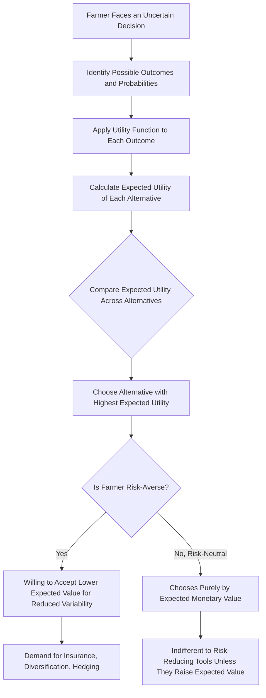

## Expected Utility Theory and Risk Preferences

### Overview

Expected utility theory is the foundational economic framework for modeling decision-making under uncertainty, providing the analytical basis for understanding why farmers facing identical risk exposures may choose different production, marketing, and financing strategies. Rather than assuming farmers simply maximize expected (average) monetary outcomes, expected utility theory recognizes that decision-makers evaluate uncertain outcomes according to their personal utility (satisfaction) function, which can differ systematically based on individual risk preferences. This framework underlies the analytical rationale for risk management tools — insurance, diversification, hedging — covered elsewhere in this chapter, since these tools are valuable precisely because most farmers are not risk-neutral expected-value maximizers.

**Key Points**

- Expected utility theory evaluates uncertain choices by the expected value of a utility function applied to outcomes, not the expected value of the outcomes themselves.
- The curvature of an individual's utility function determines their risk preference classification: risk-averse (concave), risk-neutral (linear), or risk-seeking (convex).
- The Arrow-Pratt measures of absolute and relative risk aversion provide standard quantitative tools for characterizing and comparing risk preferences.
- Empirical evidence in agricultural economics generally finds most farmers exhibit risk-averse behavior, which is the underlying justification for the widespread demand for crop insurance, diversification, and other risk-reducing strategies even when they reduce expected income.

---

### The Expected Value Decision Rule and Its Limitation

#### Expected Monetary Value

A simple decision rule under uncertainty is to choose the option with the highest expected monetary value:

$$E[X] = \sum_{i=1}^{n} p_i \times X_i$$

where $p_i$ is the probability of outcome $X_i$.

#### Why Expected Value Alone Is Insufficient

Consider a classic illustration: a farmer is offered a choice between (A) a certain payment of $500, or (B) a gamble with a 50% chance of $1,000 and a 50% chance of $0. Both options have identical expected value ($E[A] = 500$, $E[B] = 0.5(1000) + 0.5(0) = 500$), yet most individuals, and most farmers in empirical studies, prefer the certain $500 over the equal-expected-value gamble.

[Inference] This systematic preference for the certain outcome over an equal-expected-value gamble cannot be explained by expected monetary value maximization alone, since both options yield the same expected value by construction; it requires a framework — expected utility theory — that accounts for how the *variability* of outcomes, not just their average, affects the decision-maker's welfare.

---

### The Expected Utility Framework

#### The Von Neumann-Morgenstern Utility Function

Expected utility theory proposes that individuals do not maximize expected monetary value directly, but instead maximize the **expected value of a utility function** applied to monetary outcomes:

$$E[U(X)] = \sum_{i=1}^{n} p_i \times U(X_i)$$

where $U(\cdot)$ is the individual's utility function, mapping monetary outcomes to a subjective utility value. Under the von Neumann-Morgenstern axioms (completeness, transitivity, continuity, and independence of preferences over lotteries), a decision-maker's preferences over uncertain outcomes can be represented by such a utility function, and the decision-maker chooses the option maximizing expected utility rather than expected monetary value.

#### Utility Function Shape and Risk Preference

The **curvature (second derivative)** of the utility function determines the individual's risk preference classification:

| Risk Preference | Utility Function Shape | Mathematical Condition | Behavioral Implication |
| --- | --- | --- | --- |
| **Risk-averse** | Concave | $U''(X) < 0$ | Prefers a certain outcome over an equal-expected-value gamble; requires a **risk premium** to accept uncertainty |
| **Risk-neutral** | Linear | $U''(X) = 0$ | Indifferent between a certain outcome and an equal-expected-value gamble; maximizes expected monetary value directly |
| **Risk-seeking (risk-loving)** | Convex | $U''(X) > 0$ | Prefers an equal-expected-value gamble over the certain outcome; would pay a premium for additional variability |

#### The Certainty Equivalent and Risk Premium

Two key concepts formalize how risk aversion is measured in monetary terms:

**Certainty Equivalent (CE)**: the certain (guaranteed) amount of money that provides the same utility as a given uncertain gamble:

$$U(CE) = E[U(X)]$$

**Risk Premium (RP)**: the difference between the gamble's expected value and its certainty equivalent — the amount a risk-averse individual would be willing to forgo (pay) to eliminate the uncertainty and receive the certain, lower amount instead:

$$RP = E[X] - CE$$

For a risk-averse individual, $CE < E[X]$, so $RP > 0$ — the individual is willing to accept less than the expected value with certainty, rather than face the actual uncertain outcome. This risk premium concept is the direct theoretical foundation for why a risk-averse farmer is willing to pay an insurance premium that exceeds the insurer's actuarially fair expected payout (since the insurer must also cover administrative costs and its own required return), as covered under agricultural insurance and crop insurance programs.

---

### Utility Function Shapes Diagram (svg_diagram)

<svg xmlns="http://www.w3.org/2000/svg" viewBox="0 0 640 420">
<text x="320" y="24" font-size="16" font-weight="bold" text-anchor="middle" fill="#1a1a1a">Utility Function Shapes and Risk Preference (svg_diagram)</text>
<line x1="70" y1="370" x2="580" y2="370" stroke="#333" stroke-width="2" />
<line x1="70" y1="370" x2="70" y2="40" stroke="#333" stroke-width="2" />
<text x="580" y="390" font-size="12" text-anchor="middle">Wealth / Income (X)</text>
<text x="35" y="40" font-size="12" text-anchor="middle">Utility U(X)</text>
<path d="M 90 350 Q 300 150 550 70" fill="none" stroke="#2980b9" stroke-width="3" />
<text x="420" y="100" font-size="12" fill="#2980b9">Risk-Averse (Concave)</text>
<line x1="90" y1="350" x2="550" y2="90" stroke="#27ae60" stroke-width="3" />
<text x="440" y="200" font-size="12" fill="#27ae60">Risk-Neutral (Linear)</text>
<path d="M 90 350 Q 300 320 550 90" fill="none" stroke="#c0392b" stroke-width="3" />
<text x="380" y="330" font-size="12" fill="#c0392b">Risk-Seeking (Convex)</text>
</svg>

---

### The Arrow-Pratt Measures of Risk Aversion

To quantify the degree (not merely the direction) of risk aversion, economists use the **Arrow-Pratt coefficient of absolute risk aversion**:

$$R_A(X) = -\frac{U''(X)}{U'(X)}$$

and the **coefficient of relative risk aversion**:

$$R_R(X) = -X \times \frac{U''(X)}{U'(X)} = X \times R_A(X)$$

#### Interpreting Absolute Risk Aversion (ARA)

The behavior of $R_A(X)$ as wealth $X$ changes characterizes how an individual's risk-taking behavior evolves with wealth:

| Pattern | Definition | Behavioral Interpretation |
| --- | --- | --- |
| **Decreasing Absolute Risk Aversion (DARA)** | $R_A(X)$ falls as $X$ rises | Wealthier individuals are willing to risk a larger absolute (dollar) amount as their wealth grows — generally regarded as the most empirically realistic pattern for most individuals and farm operators |
| **Constant Absolute Risk Aversion (CARA)** | $R_A(X)$ is constant regardless of $X$ | The individual risks the same absolute dollar amount regardless of wealth level — a common simplifying assumption in theoretical models (e.g., models using an exponential utility function) despite being less empirically realistic |
| **Increasing Absolute Risk Aversion (IARA)** | $R_A(X)$ rises as $X$ increases | Wealthier individuals become less willing to risk the same absolute dollar amount as wealth grows — generally regarded as the least empirically common pattern |

[Inference] DARA is widely treated in agricultural economics literature as the most behaviorally realistic assumption for farm operators, implying that a wealthier or more highly capitalized farm should generally be willing to accept a larger absolute-dollar risk exposure (e.g., a bigger potential loss on an investment) than a less-capitalized farm, even if both farms have similar relative risk tolerance — this has direct relevance to the differing leverage capacity discussed under leverage and capital structure decisions across farms at different equity levels.

#### Interpreting Relative Risk Aversion (RRA)

Relative risk aversion measures risk tolerance in proportional (percentage-of-wealth) rather than absolute-dollar terms, useful for comparing risk attitudes toward gambles whose size scales with the individual's wealth (e.g., a farmer deciding what percentage of total acreage to allocate to a riskier but higher-expected-return crop, rather than a fixed-dollar-amount gamble).

---

### Measuring Risk Preferences: Applied Methods

Because an individual's precise utility function is not directly observable, agricultural economists and farm advisors use several practical elicitation and estimation approaches:

#### Direct Elicitation Methods

- **Certainty equivalent method**: presenting the individual with a series of gambles and asking what certain amount they would consider equally preferable, allowing estimation of the risk premium and, from repeated trials at different wealth/outcome levels, the shape of the underlying utility function.
- **Probability equivalence method**: fixing the gamble's outcomes and the certain alternative, and varying the probability until the individual is indifferent, providing an alternative route to the same underlying utility information.

#### Behavior-Based Inference

- **Revealed preference from actual farm decisions**: inferring risk attitude from observed choices such as insurance purchase behavior, crop diversification patterns, or leverage levels chosen, on the logic that more risk-averse farmers should systematically choose lower-variance strategies (more insurance, more diversification, lower leverage) even at some cost to expected return.
- **Survey-based risk attitude scales**: standardized questionnaire instruments asking farmers to rate their general willingness to take risks or to choose among hypothetical gambles, widely used in applied agricultural economics research as a lower-cost alternative to formal certainty-equivalent elicitation.

[Unverified] The specific instruments, elicitation protocols, and statistical estimation techniques used in current agricultural economics research to measure farmer risk preferences are an active area of ongoing methodological development; a full accounting of current best-practice elicitation methodology should be drawn from current agricultural economics research literature rather than treated as fixed by any single canonical method.

---

### Expected Utility and Risk Management Decision-Making

---

### Worked Example: Certainty Equivalent and Risk Premium

Suppose a farmer's utility function is $U(X) = \sqrt{X}$ (a standard example of a concave, risk-averse utility function), and the farmer faces a gamble with a 50% chance of $40,000 income and a 50% chance of $10,000 income.

**Expected monetary value**:

$$E[X] = 0.5(40{,}000) + 0.5(10{,}000) = 25{,}000$$

**Expected utility**:

$$E[U(X)] = 0.5\sqrt{40{,}000} + 0.5\sqrt{10{,}000} = 0.5(200) + 0.5(100) = 150$$

**Certainty equivalent** — solving $U(CE) = 150$:

$$\sqrt{CE} = 150 \Rightarrow CE = 150^2 = 22{,}500$$

**Risk premium**:

$$RP = E[X] - CE = 25{,}000 - 22{,}500 = 2{,}500$$

**Interpretation**: this farmer would be willing to accept a certain $22,500 rather than face the actual 50/50 gamble between $40,000 and $10,000, even though the gamble's expected value ($25,000) is higher. The $2,500 gap is the farmer's risk premium — conceptually, the maximum amount this farmer would be willing to pay (in expected-value terms) to eliminate this specific income uncertainty, which directly parallels the economic logic of why a risk-averse farmer purchases crop insurance at a premium cost that reduces expected income in exchange for reduced income variability.

---

### Empirical Evidence and Applications in Agricultural Economics

[Inference] A substantial body of agricultural economics research has used experimental, survey, and revealed-preference methods to study farmer risk preferences, and the general (though not universal) finding across this literature is that most farmers exhibit risk-averse behavior, consistent with the widespread real-world demand for crop insurance and other risk-reducing tools even where actuarially fair or better-than-fair pricing is not guaranteed; however, the specific degree of risk aversion, and whether it follows DARA, CARA, or another pattern, varies across studies, farm types, and cultural/regional contexts, so a single universal risk-aversion parameter should not be assumed applicable to all farmers.

**Applications of expected utility theory in this chapter's broader risk management context**:

- **Insurance demand**: expected utility theory formally explains why a risk-averse farmer rationally purchases crop insurance even at a premium above the actuarially fair value, since the utility gain from reduced income variability can exceed the expected monetary cost of the premium.
- **Diversification decisions**: a risk-averse farmer's willingness to accept a lower expected return from a diversified enterprise mix, in exchange for reduced income variability, is a direct application of the risk-return trade-off embedded in a concave utility function.
- **Leverage decisions**: the worked example under leverage and capital structure decisions, showing that a risk-averse operator should generally choose leverage below the level that maximizes expected ROE, is a direct practical application of expected utility reasoning to a real farm financing decision.
- **Technology adoption**: expected utility theory is commonly used to help explain why farmers may be slower to adopt a new technology or practice with higher expected returns but greater outcome variability (or greater subjective uncertainty due to unfamiliarity) than an established, lower-variance alternative.

---

### Limitations of Expected Utility Theory

- **Behavioral economics challenges**: empirical research in behavioral economics (e.g., prospect theory and related frameworks) has documented systematic deviations from strict expected utility predictions, such as loss aversion (weighting losses more heavily than equivalent gains) and probability weighting (over-weighting small probabilities and under-weighting large ones), suggesting expected utility theory, while foundational, does not capture every empirically observed pattern in risk-related decision-making.
- **Utility function specification uncertainty**: because an individual's actual utility function is not directly observable, applied analyses must assume a specific functional form (e.g., power, exponential, quadratic utility), and conclusions can be sensitive to this choice, particularly regarding whether the assumed function exhibits DARA, CARA, or another pattern.
- **State-dependent and dynamic complications**: basic expected utility theory typically treats outcomes and probabilities as fixed and known, which understates the additional complexity of farm decision-making under genuine uncertainty (where probabilities themselves may not be reliably known) as opposed to risk (where probabilities are assumed known), a distinction with a long history in economic theory regarding the difference between measurable risk and true (unmeasurable) uncertainty.

---

**Next Steps**

- Sources of agricultural risk (the underlying risk exposures that expected utility theory helps evaluate)
- Agricultural insurance and crop insurance programs (expected utility as the demand-side rationale for insurance)
- Risk management strategies and tools in agriculture (diversification, hedging, and contracting)
- Leverage and capital structure decisions (risk-averse leverage choice under expected utility)
- Behavioral economics and prospect theory as extensions/critiques of expected utility theory
- Stochastic dominance and alternative decision criteria under risk
- Farm-level risk attitude elicitation methods and survey instruments
- Whole-farm planning and linear programming under risk (MOTAD and quadratic risk programming extensions)