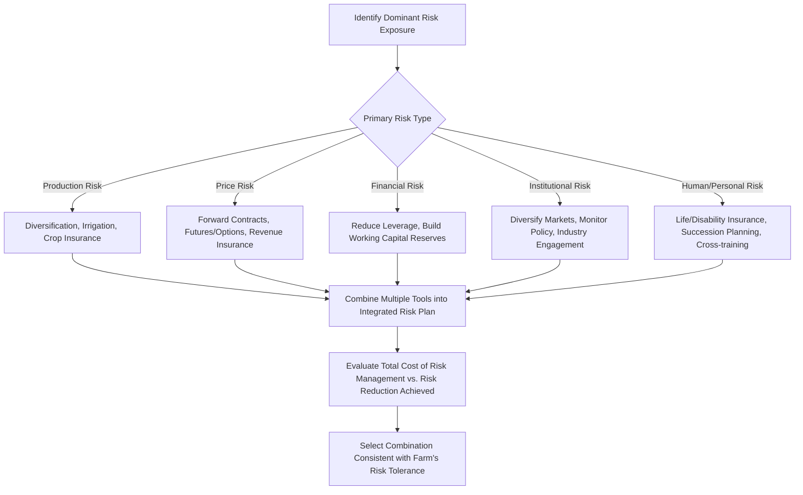

## Risk Management Strategies

### Overview

Risk management strategies are the practical tools and approaches farmers use to reduce, transfer, or otherwise manage exposure to the production, price, financial, institutional, and human/personal risks introduced under sources of agricultural risk. Rather than a single tool, effective farm risk management typically combines multiple complementary strategies, selected based on the farm's specific risk exposure profile and the operator's risk preferences, as formalized under expected utility theory and risk preferences. This topic synthesizes those foundations into an applied framework for classifying and selecting risk management strategies.

**Key Points**

- Risk management strategies are commonly classified into on-farm (production/business) strategies and off-farm (market-based/contractual) strategies, corresponding respectively to risk *reduction* and risk *transfer*.
- No single strategy addresses all five risk categories; a comprehensive risk management plan typically layers multiple tools, each targeted at specific risk sources.
- Every risk management tool carries a cost (reduced expected return, premium payment, transaction cost, reduced flexibility), meaning the risk management decision is itself an expected-utility trade-off, not a costless improvement.
- Diversification, insurance, contracting/hedging, and financial reserves represent the four most widely used strategy categories, each operating through a distinct risk-reduction or risk-transfer mechanism.

---

### Classification Framework: On-Farm vs. Off-Farm Strategies

| Category | Mechanism | Primary Risk Categories Addressed |
| --- | --- | --- |
| **On-farm (production/business) strategies** | Reduce the underlying variability of farm outcomes through operational and business decisions | Production, financial, human/personal |
| **Off-farm (market-based/contractual) strategies** | Transfer risk to a counterparty (insurer, buyer, lender) willing to bear it, typically for a fee/premium | Price/market, production (via insurance), financial |

This distinction matters because on-farm strategies generally *reduce* the actual variability the farm experiences, while off-farm strategies generally *transfer* a given variability to another party without necessarily reducing the underlying uncertainty itself — a distinction with implications for cost, flexibility, and how completely a given risk can be addressed.

---

### On-Farm (Production and Business) Strategies

#### Diversification

Diversification spreads risk across multiple enterprises, varieties, markets, or time periods whose returns are not perfectly correlated, so that a poor outcome in one component is partially offset by better outcomes in others.

**Forms of diversification**:

- **Enterprise diversification**: growing multiple crops or raising multiple livestock types rather than a single commodity, so weather, price, or disease shocks specific to one enterprise do not affect the entire farm income.
- **Varietal/genetic diversification**: planting multiple varieties or hybrids with differing maturity dates, disease resistance profiles, or drought tolerance, reducing the risk that a single adverse condition affects the entire crop.
- **Geographic diversification**: farming land parcels in different locations or microclimates, reducing exposure to a single localized weather event (relevant primarily for larger operations with land in multiple areas).
- **Temporal diversification**: staggering planting dates or marketing timing across a season, rather than concentrating all planting or all sales at a single point in time.
- **Enterprise diversification into off-farm income**: engaging in off-farm employment or non-farm business activity to reduce reliance on farm income alone.

[Inference] The risk-reduction benefit of diversification depends specifically on the degree of correlation between the diversified components' returns; diversifying into two enterprises whose returns are highly positively correlated (e.g., two crops that respond similarly to the same weather pattern) provides much less risk reduction than diversifying into enterprises with low or negative return correlation, meaning the choice of *which* enterprises to combine, not simply how many, determines the actual risk-reduction achieved.

**Trade-off**: diversification typically sacrifices some expected return relative to full specialization in the single highest-expected-return enterprise, and can increase management complexity and dilute the operator's expertise across more activities.

#### Financial Reserves and Working Capital

Maintaining liquid financial reserves (cash, readily-available credit lines, marketable securities) provides a buffer to absorb an adverse income shock without being forced into distressed asset sales, loan default, or foregone investment opportunities.

**Connection to other topics**: this strategy directly corresponds to the working capital and liquidity ratios discussed under farm balance sheets and cash flow analysis, and interacts with the leverage decision discussed under leverage and capital structure decisions — a farm carrying lower leverage and/or larger reserves has greater capacity to absorb a bad year without financial distress.

#### Flexible Cost Structure

Favoring variable costs (which can be scaled down in a bad year, e.g., custom-hired machinery services) over fixed costs (which continue regardless of income, e.g., owned machinery with associated debt service) reduces the farm's exposure to a low-revenue year, directly connecting to the own-vs-hire breakeven analysis discussed under machinery and equipment economics.

#### Production Practices That Reduce Yield Variability

Irrigation (reducing drought-year yield variability), integrated pest management, and other agronomic practices that reduce the *variance* of yield outcomes — not necessarily the *average* yield — are themselves risk management tools, distinct from practices aimed purely at maximizing average yield.

---

### Off-Farm (Market-Based and Contractual) Strategies

#### Insurance

As covered in depth under agricultural insurance and crop insurance programs, insurance transfers production and/or revenue risk to an insurer in exchange for a premium, with yield-based, revenue-based, and index-based products addressing different specific risk exposures.

#### Forward Contracting

A forward contract is a private agreement between the farmer and a buyer (or between the farmer and an input supplier) to fix a price for a specified quantity of a commodity (or input) to be delivered (or purchased) at a future date, locking in price certainty for both parties before the actual transaction occurs.

**Advantages**: eliminates price risk for the contracted quantity; simple, direct, and does not require futures market access or expertise.

**Disadvantages**: eliminates upside price potential as well as downside protection (the farmer forgoes any price increase above the contracted price); carries **counterparty risk** (the risk the buyer/seller fails to honor the contract); typically less liquid/flexible than an exchange-traded futures position, since exiting or modifying a forward contract requires bilateral renegotiation.

#### Futures and Options Hedging

Farmers can use exchange-traded futures contracts and options to manage price risk without necessarily having a direct forward agreement with a specific buyer.

- **Futures hedging**: taking an offsetting position in the futures market (e.g., selling a futures contract for a crop the farmer expects to harvest and sell later) to lock in a price, leaving the farmer exposed only to **basis risk** (the difference between the local cash price and the futures price) rather than full price-level risk.
- **Options hedging**: purchasing a put option (for a seller/producer) establishes a price floor while preserving some upside potential if prices rise above the option's strike price, in exchange for an upfront premium cost — unlike a futures hedge or forward contract, which typically eliminates both downside and upside.

| Tool | Locks In Price? | Preserves Upside? | Upfront Cost | Counterparty/Basis Risk |
| --- | --- | --- | --- | --- |
| Forward contract | Yes | No | None (implicit in contract terms) | Counterparty risk with buyer |
| Futures hedge | Yes (net of basis) | No | Margin requirements, not a premium | Basis risk |
| Put option | Establishes floor only | Yes, above strike | Option premium paid upfront | Basis risk (if hedging a cash position) |

[Unverified] Access to futures and options markets, and the specific exchanges/contracts available for a given commodity, vary by country and by the maturity of that commodity's price-discovery infrastructure; farmers in markets without well-developed futures exchanges for their specific commodity may have access to forward contracting and insurance-based tools but not exchange-traded futures/options hedging, and availability should be confirmed against the current market infrastructure in the farmer's specific commodity and region.

#### Contract Farming / Production Contracts

Beyond simple forward price contracts, some farmers enter production contracts with processors or integrators that specify not only price but also production practices, input provision, and guaranteed purchase, transferring both price risk and, in some structures, a portion of production risk to the contracting firm in exchange for reduced management autonomy and typically a lower expected margin than fully independent production and marketing.

#### Vertical Integration

Farmers (or farmer cooperatives, as covered under cooperative finance structures) may integrate forward into processing or marketing activities, capturing margin that would otherwise accrue to a separate processor/marketer and gaining more direct control over the timing and terms of sale, though this requires additional capital investment and management capacity, and introduces new business risks specific to the processing/marketing activity itself.

---

### Risk Management Strategy Selection Framework

---

### Evaluating the Cost-Effectiveness of Risk Management

Every risk management strategy imposes a cost, whether explicit (insurance premium, option premium) or implicit (forgone upside from a forward contract, reduced expected return from diversification, opportunity cost of holding liquid reserves rather than investing them). Applying the expected utility framework introduced earlier in this chapter, a risk-averse farmer's optimal risk management choice balances:

$$\text{Value of Risk Reduction (in utility terms)} \gtrless \text{Cost of the Risk Management Tool}$$

**Practical implications of this trade-off**:

- A highly risk-averse farmer, or one with limited financial reserves and high leverage, will generally find a given risk management tool's cost more worthwhile than a less risk-averse or more financially resilient farmer facing the identical risk exposure, consistent with the expected-utility-based reasoning developed earlier in this chapter.
- Layering multiple risk management tools targeting the *same* risk (e.g., both crop insurance and a forward contract for the same crop) can lead to redundant cost without proportional additional risk reduction, and in some cases can create unintended interactions (e.g., a forward contract combined with crop insurance may leave the farmer exposed if a production shortfall forces buying grain on the open market to fulfill the forward contract at a price above both the contract price and the insurance-guaranteed price).
- [Inference] Because different risk management tools address different, only partially overlapping, risk sources, an economically efficient risk management plan generally aims for complementary coverage across the farm's specific risk exposures rather than maximum coverage of any single risk source, reflecting the same diminishing-marginal-value logic that governs other resource allocation decisions in whole-farm planning.

---

### Integrating Risk Management with Whole-Farm and Financial Planning

Risk management strategies do not operate in isolation from the other farm management and finance topics covered in this course:

- **Whole-farm planning and linear programming**: risk programming extensions (MOTAD, quadratic/mean-variance programming, target MOTAD) formally incorporate risk management trade-offs directly into the whole-farm enterprise selection problem, rather than treating risk management as a separate add-on decision after the production plan is fixed.
- **Leverage and capital structure decisions**: a farm's risk management strategy and its capital structure decision are interdependent — stronger risk management (insurance, hedging, diversification) can support a somewhat higher sustainable leverage level for a given risk tolerance, since it reduces the probability of the unfavorable-ROA scenario that makes high leverage dangerous.
- **Credit analysis and lending institutions**: lenders explicitly consider a borrower's risk management practices (insurance coverage, marketing plan, diversification) as part of the "Conditions" and "Capacity" components of the Five Cs of Credit framework, since sound risk management directly supports the reliability of projected repayment capacity.
- **Succession and estate planning**: succession plans should explicitly address human/personal risk management (life insurance funding for equalization payments, contingency management arrangements for operator incapacity) as a formal component of the broader estate plan, rather than treating succession purely as a asset-transfer exercise.

---

### Common Pitfalls in Farm Risk Management

- **Over-insurance or redundant coverage**: purchasing multiple overlapping risk transfer tools for the same risk without evaluating whether the marginal risk reduction justifies the combined cost.
- **Under-diversification disguised as specialization efficiency**: pursuing single-enterprise specialization for its production efficiency benefits without adequately weighing the increased income variability this creates, particularly when combined with high leverage.
- **Basis risk underestimation**: assuming a futures hedge or index-based insurance product fully eliminates the underlying risk, when in fact meaningful basis risk may remain between the hedging/insurance instrument and the farmer's actual local cash position or individual farm outcome.
- **Neglecting human/personal risk**: focusing risk management planning exclusively on production and price risk while leaving health, disability, and management-continuity risk largely unaddressed, despite these being significant potential sources of farm business disruption as discussed under sources of agricultural risk.
- **Static risk management plans**: failing to revisit and adjust the risk management strategy as the farm's leverage, enterprise mix, family circumstances, or the broader price/policy environment change over time.

---

**Next Steps**

- Sources of agricultural risk (the risk categories these strategies are designed to address)
- Expected utility theory and risk preferences (the decision-theoretic basis for risk management value)
- Agricultural insurance and crop insurance programs (detailed treatment of insurance-based risk transfer)
- Futures and options markets for agricultural commodity price risk management
- Whole-farm planning and linear programming under risk (MOTAD and quadratic programming)
- Leverage and capital structure decisions (interaction between risk management and sustainable leverage)
- Contract farming and vertical integration in agricultural marketing
- Succession and estate planning (human/personal risk management integration)