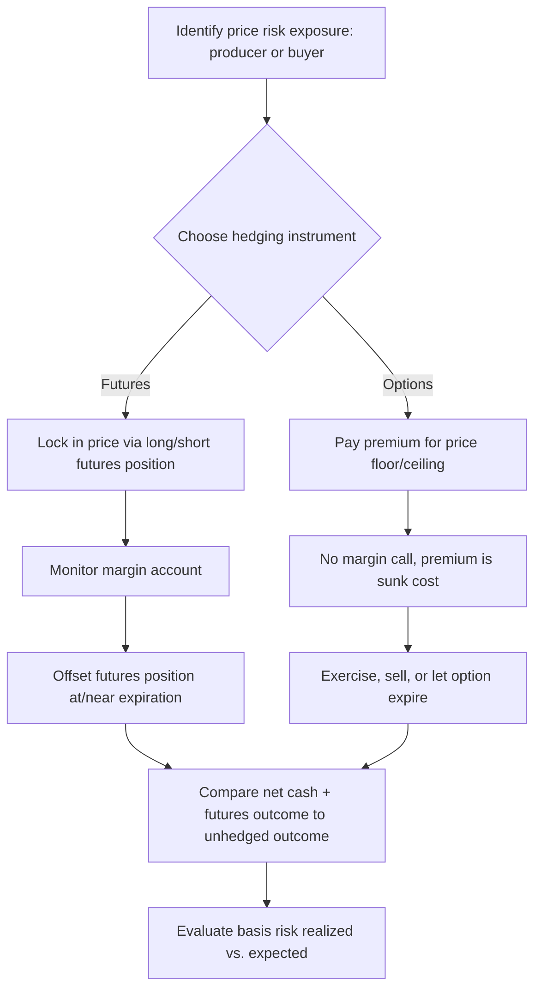

## Futures and Options Markets for Hedging

### Overview

Futures and options markets are risk-transfer mechanisms that allow agricultural producers, processors, and other supply chain participants to manage price risk arising from the time gap between production decisions and final sale. Rather than eliminating price risk from the market, these instruments allow it to be shifted from those who wish to avoid it (hedgers) to those willing to bear it in exchange for potential profit (speculators).

Agricultural commodity prices are subject to significant volatility due to weather shocks, biological production lags, inelastic short-run supply and demand, and global trade disruptions. Because a farmer commits inputs (seed, fertilizer, land, labor) months before knowing the eventual sale price of the harvest, price risk is one of the central sources of income variability in the sector.

### Core Concepts and Terminology

**Futures Contract**

A standardized, exchange-traded legal agreement to buy or sell a specified quantity and quality of a commodity at a predetermined price on a specified future date. Standardization covers contract size, delivery month, quality/grade specifications, and delivery location, which is what makes the contract fungible and tradable on an exchange.

**Options Contract**

A contract that grants the buyer the *right, but not the obligation*, to buy (call option) or sell (put option) an underlying futures contract at a specified price (the strike price) on or before a specified expiration date. The buyer pays a premium for this right; the seller (writer) receives the premium and takes on the obligation if the option is exercised.

**Underlying Asset**

In agricultural derivatives markets, options are typically written on futures contracts (not on the physical/cash commodity directly), so exercising an option results in a futures position, not immediate physical delivery.

**Long and Short Positions**

- Long: an obligation or right to buy (agreeing to purchase the commodity/futures contract).
- Short: an obligation or right to sell (agreeing to deliver/sell the commodity/futures contract).

**Basis**

$$\text{Basis} = \text{Cash Price} - \text{Futures Price}$$

Basis reflects local supply/demand conditions, transportation costs, storage costs, and quality differentials relative to the exchange-delivery specification. Hedging with futures does not eliminate risk entirely — it converts *price risk* into *basis risk*, since the cash and futures prices do not always move in perfect lockstep.

**Margin**

Futures trading requires posting margin (a performance bond), consisting of:

- Initial margin: deposit required to open a position.
- Maintenance margin: minimum balance that must be maintained; if account equity falls below this due to adverse price movement, a margin call requires additional funds.

Options buyers pay only the premium upfront and have no margin call risk (their maximum loss is the premium paid). Options sellers (writers), however, do face margin requirements because their potential loss is open-ended (for call writers) or substantial (for put writers).

### Hedging Mechanics

**The Fundamental Hedging Principle**

A hedge works because cash and futures prices for the same commodity tend to move together over time (they converge as the futures contract approaches expiration, since arbitrage forces the futures price toward the spot price at delivery). A loss in the cash market is expected to be offset by a gain in the futures/options market, and vice versa.

**Short Hedge (Selling Hedge)**

Used by producers who own or will own the physical commodity and are worried about *falling* prices before they sell.

*Example:*

A corn farmer expects to harvest 10,000 bushels in October and is worried the price will fall from the current level of $5.00/bushel.

- **Step 1 (Spring):** Farmer sells (goes short) October corn futures at $5.00/bushel.
- **Step 2 (Harvest, if price falls to $4.50):**
  - Cash market: sells physical corn at $4.50/bushel → $0.50/bushel lower revenue than planned.
  - Futures market: buys back (offsets) the short futures position at $4.50/bushel → $0.50/bushel gain (since sold at $5.00, bought back at $4.50).
  - Net effective price: $\$4.50 + \$0.50 = \$5.00$/bushel (approximately, before basis and transaction costs).

**Long Hedge (Buying Hedge)**

Used by processors, feedlot operators, or exporters who will need to purchase the commodity in the future and are worried about *rising* prices.

*Example:*

A livestock feeder knows in January that they will need to buy 5,000 bushels of corn in June to feed cattle. Current June futures price: $5.00/bushel.

- **Step 1 (January):** Feeder buys (goes long) June corn futures at $5.00/bushel.
- **Step 2 (June, if price rises to $5.60):**
  - Cash market: buys physical corn at $5.60/bushel → $0.60/bushel higher cost than planned.
  - Futures market: sells (offsets) the long futures position at $5.60/bushel → $0.60/bushel gain (bought at $5.00, sold at $5.60).
  - Net effective cost: $\$5.60 - \$0.60 = \$5.00$/bushel (approximately).

### Options-Based Hedging Strategies

Unlike futures hedges, which lock in a price and remove both downside risk *and* upside potential, options-based hedges can preserve upside potential in exchange for paying a premium.

**Put Option Hedge (Price Floor for Sellers)**

A producer buys a put option to establish a minimum ("floor") selling price while retaining the ability to benefit if cash prices rise.

*Example:*

Corn futures at $5.00/bushel. Farmer buys a put option with a $5.00 strike price, paying a $0.20/bushel premium.

- If futures fall to $4.30: the put option gains intrinsic value ($5.00 − $4.30 = $0.70), farmer exercises or sells the option for a $0.70 gain, minus the $0.20 premium = $0.50 net gain, offsetting most of the cash market loss. Effective floor price ≈ $5.00 − $0.20 = $4.80/bushel.
- If futures rise to $5.60: the put option expires worthless (farmer would not exercise a right to sell at $5.00 when the market price is higher), so the farmer loses only the $0.20 premium but sells corn in the cash market at the higher price. Effective price ≈ $5.60 − $0.20 = $5.40/bushel.

This creates an asymmetric payoff: downside is capped (floor established), while upside participation remains largely intact, minus the fixed premium cost.

**Call Option Hedge (Price Ceiling for Buyers)**

A processor/buyer purchases a call option to establish a maximum ("ceiling") purchase price while retaining the benefit of lower cash prices if they occur.

*Example:*

Soybean meal futures at $400/ton. Feed mill buys a call option with a $400 strike, paying a $15/ton premium.

- If futures rise to $450: call option gains $50 intrinsic value; net gain after premium = $35/ton, offsetting the higher cash market cost. Effective ceiling ≈ $400 + $15 = $415/ton.
- If futures fall to $370: call expires worthless, buyer loses only the $15 premium but purchases physical soybean meal at the lower cash price.

**Comparison: Futures Hedge vs. Options Hedge**

| Feature | Futures Hedge | Options Hedge (Put/Call) |
| --- | --- | --- |
| Upfront cost | None (margin required) | Premium paid upfront |
| Downside protection | Full (locks price) | Full below/above strike |
| Upside participation | None (price is locked) | Retained (minus premium) |
| Margin calls | Yes, possible | No (for option buyer) |
| Maximum loss (buyer) | Potentially large (adverse move) | Limited to premium paid |
| Flexibility | Rigid, locked-in price | Flexible, asymmetric payoff |

### Payoff Diagrams

**(svg_diagram) Put Option Payoff for a Hedging Producer**

<svg xmlns="http://www.w3.org/2000/svg" viewBox="0 0 620 380" font-family="Helvetica, Arial, sans-serif">

<text x="310" y="24" text-anchor="middle" font-size="16" font-weight="bold" fill="`#1a1a1a`">Put Option Payoff — Effective Selling Price (svg_diagram)</text>

<line x1="70" y1="320" x2="580" y2="320" stroke="#333" stroke-width="2" />
<line x1="70" y1="60" x2="70" y2="320" stroke="#333" stroke-width="2" />

<text x="580" y="345" font-size="12" fill="#333">Futures Price at Expiration</text>

<text x="30" y="60" font-size="12" fill="#333" transform="rotate(-90 30,60)">Effective Price ($/bu)</text>

<line x1="70" y1="240" x2="580" y2="240" stroke="#999" stroke-dasharray="4,4" />
<text x="580" y="238" font-size="11" fill="#666">Strike ($5.00)</text>
<path d="M 70 240 L 250 240 L 580 60" fill="none" stroke="#c0392b" stroke-width="3" />
<text x="120" y="230" font-size="11" fill="#c0392b">Floor locked (~$4.80 net)</text>
<text x="420" y="120" font-size="11" fill="#c0392b">Upside retained</text>
<line x1="250" y1="320" x2="250" y2="240" stroke="#999" stroke-dasharray="2,2" />
<text x="240" y="335" font-size="11" fill="#666">Strike price point</text>
<circle cx="250" cy="240" r="4" fill="#c0392b" />
</svg>

### Basis Risk and Its Implications

Because hedging locks in a futures price rather than the actual local cash price, the effectiveness of a hedge depends on the stability of the basis (cash price minus futures price).

- **Basis strengthening** (becoming less negative or more positive) benefits a short hedger (seller).
- **Basis weakening** benefits a long hedger (buyer).

Basis is generally far less volatile than outright price levels because both cash and futures respond to the same broad supply/demand fundamentals, but local factors (transportation bottlenecks, local surplus/shortage, storage costs) still leave residual risk. This is why hedging is described as substituting basis risk for price risk rather than eliminating risk altogether. [Inference] The degree of basis risk reduction versus outright price risk varies by commodity, region, and delivery point, and empirical hedging effectiveness should be evaluated using historical local basis data rather than assumed uniformly.

### Process Flow of a Hedge Decision

### Costs and Practical Considerations

**Key Points**

- Transaction costs: brokerage commissions and bid-ask spreads reduce net hedge effectiveness.
- Contract size standardization: exchange contracts are fixed in size (e.g., 5,000 bushels for CBOT corn), which can create an imperfect hedge ratio for producers whose actual production volume does not divide evenly.
- Cross-hedging: when no futures contract exists for a specific commodity, a related commodity's futures contract may be used (e.g., hedging hay with a related feed grain contract), which introduces additional basis risk between the two distinct commodities.
- Liquidity: thinner markets (specific crop varieties, smaller regional exchanges) may have wider spreads and higher execution costs.
- Rolling hedges: since futures contracts have finite expirations, a hedge covering a horizon longer than the nearest available contract may require "rolling" the position from an expiring contract into a more distant one, incurring additional transaction costs and roll-basis risk.

### Optimal Hedge Ratio

Because futures contracts are standardized and cash-market price sensitivity to futures price changes is not always one-to-one, producers may use a hedge ratio below 100% coverage. A common analytical approach is the minimum-variance hedge ratio:

$$h^* = \rho_{S,F} \times \frac{\sigma_S}{\sigma_F}$$

Where $h^*$ is the optimal hedge ratio, $\rho_{S,F}$ is the correlation between cash (spot) and futures price changes, $\sigma_S$ is the standard deviation of cash price changes, and $\sigma_F$ is the standard deviation of futures price changes. [Inference] This formulation assumes a linear relationship and constant variance/correlation over the hedge horizon; in practice, correlation and volatility can shift with market conditions, so many operations periodically re-estimate this ratio rather than treating it as fixed.

### Related Topics

- Basis calculation and regional basis tables for specific commodities
- Crop insurance products (e.g., revenue protection) as a complement to market-based hedging
- Cross-hedging strategies for commodities without direct futures contracts
- Options strategies: collars, straddles, and spread strategies for cost-reduced hedging
- Margin call management and liquidity planning for hedging operations
- Forward contracting versus exchange-traded futures/options
- Government price support and deficiency payment programs interacting with private hedging
- Speculators' role in providing market liquidity for hedgers