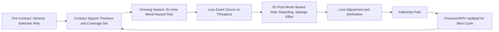

## Crop Insurance Design and Moral Hazard

### Overview

Crop insurance is a risk-management mechanism that transfers a portion of production and/or revenue risk from farmers to insurers (often with government reinsurance or subsidy backing). Its design must simultaneously address two distinct market failure problems: **adverse selection** (farmers with private knowledge of their own higher-than-average risk are more likely to buy insurance) and **moral hazard** (once insured, farmers have reduced incentive to exert costly effort to prevent losses, or may take on riskier practices, because the insurer bears part of the downside). Understanding how contract design features counteract these two problems is central to agricultural risk economics.

### Core Concepts and Terminology

**Moral Hazard**

A situation in which one party to a contract (the insured farmer) can take hidden actions after the contract is signed that affect the probability or size of a loss, and the other party (the insurer) cannot costlessly observe or verify those actions. Because the insurer pays out on losses regardless of the farmer's effort level, the farmer's private incentive to invest in loss-prevention (irrigation management, pest control, optimal planting dates, fertilization) is weakened relative to the no-insurance case.

**Adverse Selection**

A pre-contract information asymmetry problem: farmers know their own risk type (e.g., land quality, microclimate exposure, historical yield variability) better than the insurer does. If the insurer prices a policy based on an average risk pool, higher-risk farmers find the policy more attractive (a better deal relative to their true risk) and are more likely to enroll, while lower-risk farmers may opt out, worsening the risk pool over time — a dynamic known as adverse selection death spiral if left uncorrected.

**Indemnity**

The payment made by the insurer to the farmer following a covered loss, generally calculated as:

$$\text{Indemnity} = (\text{Trigger Level} - \text{Realized Outcome}) \times \text{Price Election} \times \text{Insured Units}$$

where the "Trigger Level" and "Realized Outcome" are expressed in yield or revenue terms depending on policy type.

**Actual Production History (APH)**

A farm-specific historical yield record (commonly based on 4–10 years of production data) used to individualize the guarantee level and reduce (though not eliminate) informational asymmetry between insurer and farmer.

### Types of Crop Insurance Products

**Yield-Based Insurance**

Indemnifies the farmer when actual harvested yield falls below a guaranteed percentage (commonly 50–85%) of their APH yield, regardless of price movements.

$$\text{Yield Guarantee} = \text{APH Yield} \times \text{Coverage Level (\%)}$$

*Example:*

A farmer's APH yield is 150 bushels/acre; they select 75% coverage. Guaranteed yield = $150 \times 0.75 = 112.5$ bushels/acre. If actual yield falls to 90 bushels/acre, the shortfall of 22.5 bushels/acre is indemnified at the elected price per bushel.

**Revenue-Based Insurance**

Indemnifies the farmer when actual revenue (yield × price) falls below a guaranteed revenue level, protecting against a combination of yield shortfalls and/or price declines. The guarantee is typically based on the higher of a projected price (set before planting) or a harvest price (determined at harvest), providing some protection against price increases that would otherwise raise the cost of purchasing replacement grain.

*Example:*

Projected price at planting: $5.00/bushel. APH yield: 150 bu/acre. Coverage level: 80%.

Revenue Guarantee = $150 \times \$5.00 \times 0.80 = \$600$/acre.

If harvest price falls to $4.20/bushel and actual yield is 140 bu/acre, actual revenue = $140 \times \$4.20 = \$588$/acre, triggering an indemnity of $12/acre.

**Area-Based (Index) Insurance**

Payouts are triggered by a county-level or regional index (average county yield, or a weather index such as cumulative rainfall) rather than the individual farmer's own realized outcome. This design structurally reduces moral hazard because an individual farmer's own effort decisions have a negligible effect on a county-wide average, but it introduces **basis risk** at the individual level — a farmer may suffer a personal loss without the county index triggering a payout, or vice versa.

### Moral Hazard: Mechanisms and Manifestations

**Ex Ante Moral Hazard (Hidden Action Before Loss)**

Reduced incentive to invest in loss-prevention inputs and practices once coverage is in place — for example, reduced pest scouting frequency, delayed replanting decisions, or reduced irrigation management effort, because the marginal private benefit of loss-prevention is diluted by the indemnity safety net.

**Ex Post Moral Hazard (Hidden Action After Loss Realization)**

Incentive to under-invest in harvest/salvage effort once a loss appears likely, since a lower realized yield increases the indemnity payment. This can include reduced effort to salvage a partially damaged crop or strategic timing of harvest reporting.

**Loss Reporting and Verification Hazard**

Because insurers cannot costlessly verify every field's actual planted acreage, input use, or true cause of loss (e.g., distinguishing weather-related loss from poor management), there is scope for misreporting that is costly for insurers to fully audit.

### Contract Design Mechanisms to Mitigate Moral Hazard

**Deductibles and Coverage Level Limits**

Requiring the farmer to bear the first portion of any loss (e.g., insurance only covers losses beyond a 25–50% yield shortfall) preserves a private stake in loss outcomes, maintaining some incentive for loss-prevention effort. Full (100%) coverage would eliminate this residual incentive entirely, which is why most subsidized programs cap the maximum coverage level below full indemnification.

**Coinsurance**

Structuring indemnity payments so the insurer pays only a fraction (e.g., 80%) of the calculated loss beyond the deductible, so the farmer continues to internalize part of any additional loss at the margin.

**Experience Rating (APH-Based Premiums)**

Basing premiums and guarantee levels on the farmer's own historical yield record ties the contract terms to the individual's demonstrated risk profile, which:

1. Reduces adverse selection (premiums better reflect true individual risk), and
2. Indirectly discourages moral hazard, because a poor yield history (which could partly result from low effort) raises future premiums or lowers future guarantees — creating an inter-temporal incentive to maintain good practices.

**Area-Yield / Index-Based Triggers**

As discussed above, tying payouts to an aggregate index rather than individual-farm outcomes structurally removes most ex ante and ex post moral hazard, since no single farmer's actions materially move the county or regional index. The tradeoff is increased basis risk for the individual policyholder.

**Good Farming Practices (GFP) Requirements**

Insurance contracts commonly require farmers to follow locally recognized "good farming practices" (appropriate planting dates, seeding rates, pest/weed control) as a condition of eligibility for indemnity payment. Violations discovered during loss adjustment can result in reduced or denied payouts, creating a contractual (rather than purely economic) deterrent against negligence.

**Loss Adjustment and Auditing**

Field inspections, yield verification via combine monitors or elevator receipts, and random/targeted audits raise the probability that misreporting or negligence is detected, which — combined with penalties for violations — raises the expected cost of moral hazard behavior and partially restores the farmer's incentive to exert effort.

### Diagram: Information Asymmetry Timeline

### Illustration: Effort Incentive Under Increasing Coverage

**(svg_diagram) Farmer Effort vs. Coverage Level**

<svg xmlns="http://www.w3.org/2000/svg" viewBox="0 0 620 380" font-family="Helvetica, Arial, sans-serif">

<text x="310" y="24" text-anchor="middle" font-size="16" font-weight="bold" fill="`#1a1a1a`">Loss-Prevention Effort vs. Insurance Coverage Level (svg_diagram)</text>

<line x1="70" y1="320" x2="580" y2="320" stroke="#333" stroke-width="2" />
<line x1="70" y1="60" x2="70" y2="320" stroke="#333" stroke-width="2" />

<text x="580" y="345" font-size="12" fill="#333">Coverage Level (%)</text>

<text x="30" y="60" font-size="12" fill="#333" transform="rotate(-90 30,60)">Farmer Effort Level</text>

<path d="M 90 100 C 250 140, 400 220, 560 300" fill="none" stroke="#2874a6" stroke-width="3" />
<text x="380" y="160" font-size="11" fill="#2874a6">Effort declines as coverage rises</text>
<line x1="325" y1="320" x2="325" y2="60" stroke="#999" stroke-dasharray="4,4" />
<text x="330" y="75" font-size="11" fill="#666">Typical max subsidized coverage (~85%)</text>
</svg>

Effort tends to decline as coverage approaches full indemnification, which is the central rationale for capping subsidized coverage levels below 100% and layering in deductibles, coinsurance, and GFP requirements rather than relying on any single design lever alone.

### Empirical and Policy Considerations

- **Program Examples:** The U.S. Federal Crop Insurance Program (administered through the Risk Management Agency, RMA) and its Multi-Peril Crop Insurance (MPCI) products embed many of the above mechanisms, combining APH-based experience rating, deductibles, GFP requirements, and government-subsidized premiums to expand enrollment while attempting to contain moral hazard costs.
- **Subsidy Tradeoff:** Government premium subsidies increase enrollment and risk-pooling benefits (broadening the risk pool counteracts adverse selection) but can partially offset the deductible/coinsurance incentive effects by lowering the farmer's effective cost of coverage. [Inference] The net effect of subsidy levels on aggregate moral hazard behavior is empirically contested and likely varies by crop, region, and the specific subsidy design, so this tradeoff is best evaluated using region- and program-specific data rather than assumed to be uniform.
- **Behavior may vary:** Actual farmer response to any given contract design depends on local agronomic conditions, risk aversion, credit constraints, and enforcement intensity; the mechanisms above describe general economic incentives rather than guaranteed behavioral outcomes in every setting.

### Related Topics

- Federal Crop Insurance Corporation (FCIC) and Risk Management Agency (RMA) program structure
- Weather-index and satellite-based parametric insurance for smallholder agriculture
- Adverse selection death spirals and risk pool stability
- Whole-Farm Revenue Protection (WFRP) as a diversified-risk product
- Reinsurance arrangements between private insurers and government backstops
- Behavioral economics of farmer risk perception and insurance take-up
- Interaction between crop insurance and futures/options hedging strategies
- Catastrophic (CAT) coverage versus buy-up coverage tiers