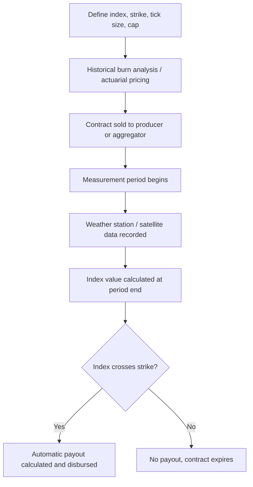

## Weather Derivatives and Climate Risk Instruments

### Overview

Weather derivatives and climate risk instruments are financial contracts whose payouts are tied to a measurable weather or climate variable (rainfall, temperature, wind speed, drought indices) rather than to the farmer's own realized yield or revenue. They are designed to address a gap left by traditional crop insurance and futures/options hedging: many agricultural losses are driven by localized weather events that are difficult or costly to verify at the individual-farm level, and traditional indemnity-based insurance requires expensive loss adjustment. Weather derivatives instead pay out automatically based on an objective, third-party-verified index, which reduces transaction costs and largely eliminates moral hazard and claims-adjustment disputes, at the cost of introducing basis risk.

### Core Concepts and Terminology

**Weather Derivative**

A financial contract whose payoff is contingent on a specified weather index measured at a defined weather station (or gridded/satellite data source) over a defined period, rather than on an insurable interest in physical property or yield loss.

**Index (Parametric) Insurance**

An insurance-like contract that pays a predetermined indemnity when an objectively measured index crosses a specified threshold, regardless of the policyholder's actual individual loss. Weather derivatives are a subset of the broader parametric insurance category.

**Basis Risk (Index Context)**

The risk that the index-based payout does not match the farmer's actual loss — the farmer may suffer a real loss without the index triggering payment, or receive a payout despite limited actual damage. This is structurally larger for weather derivatives than for individual-yield insurance, because payouts depend entirely on a station or grid measurement that may not represent conditions on a specific farm.

**Strike (Trigger) Level**

The threshold value of the weather index (e.g., cumulative rainfall below 200mm during a defined growth stage) above or below which payments begin to accrue.

**Tick Size**

The dollar (or local currency) payout per unit that the index moves beyond the strike, up to a specified cap (maximum payout) or lump-sum structure.

### Common Structures

**Rainfall Index Contracts**

Payout tied to cumulative rainfall (or rainfall deficit) recorded at a reference weather station over a specified period aligned with a critical crop growth stage (e.g., flowering or grain-fill).

$$\text{Payout} = \min\left[\max\left(0, (\text{Strike} - \text{Actual Rainfall}) \times \text{Tick Size}\right), \text{Payout Cap}\right]$$

*Example:*

Strike = 200mm cumulative rainfall over the flowering window. Tick size = $5 per mm shortfall. Payout cap = $500/acre.

If actual rainfall recorded is 150mm: shortfall = 50mm. Payout = $50 \times \$5 = \$250$/acre.

If actual rainfall recorded is 80mm: shortfall = 120mm; uncapped payout would be $120 \times \$5 = \$600$/acre, but the payout cap limits it to $500/acre.

**Degree-Day (Temperature) Contracts**

Common in energy markets but also used in agriculture for heat-stress risk (e.g., livestock heat stress, crop heat damage during pollination). Based on cumulative degree-days above or below a reference temperature over the contract period.

$$\text{HDD} = \max(0, T_{\text{ref}} - T_{\text{avg}}) \quad \quad \text{CDD} = \max(0, T_{\text{avg}} - T_{\text{ref}})$$

where HDD/CDD are heating/cooling degree-days, $T_{\text{avg}}$ is the daily average temperature, and $T_{\text{ref}}$ is a reference temperature (commonly 65°F/18°C, though agricultural contracts often use crop-specific biological thresholds).

**Area-Yield Index Insurance**

Payout triggered when a county- or region-wide average yield (rather than a weather station reading) falls below a specified threshold, blending features of weather-index products with traditional yield insurance. Structurally similar moral-hazard-reducing properties apply, since no single farmer's actions materially move a regional average.

**Satellite/NDVI-Based Vegetation Index Insurance**

Uses remotely sensed vegetation health indices (e.g., Normalized Difference Vegetation Index) as a proxy for crop condition over a defined area, allowing coverage in regions lacking dense weather station networks — a design particularly relevant for smallholder agriculture in developing regions.

### Contrast with Traditional Crop Insurance

| Feature | Traditional (Indemnity) Crop Insurance | Weather Derivatives / Index Insurance |
| --- | --- | --- |
| Payout trigger | Verified individual farm loss | Objective index measurement |
| Loss adjustment | Field inspection required | Automatic, based on published data |
| Moral hazard | Present (requires deductibles, GFP rules) | Minimal (payout independent of farmer behavior) |
| Basis risk | Lower (tied to own yield/revenue) | Higher (tied to regional/station proxy) |
| Administrative cost | Higher (claims processing) | Lower (data-driven settlement) |
| Payout speed | Slower (post-harvest adjustment) | Faster (index available shortly after period end) |
| Suitability | Farms near a verifiable APH record | Regions with sparse insurance infrastructure or high adjustment costs |

### Pricing Principles

Weather derivatives are typically priced using actuarial/statistical approaches (historical burn analysis, index modeling) rather than the no-arbitrage option-pricing frameworks used for financial derivatives, because the underlying weather index is not a traded asset and cannot be replicated through a dynamic hedging portfolio in the way a stock option can.

**Burn Analysis (Historical Simulation)**

The most common practical pricing approach: apply the proposed contract structure retroactively to a multi-decade historical weather record at the reference station, calculate what the payout would have been in each historical year, and set the premium based on the average historical payout plus a risk loading.

$$\text{Fair Premium} \approx \frac{1}{N}\sum_{i=1}^{N} \text{Payout}_i + \text{Risk Loading}$$

where $N$ is the number of historical years used and $\text{Payout}_i$ is the simulated payout in year $i$ under the contract's strike/tick structure.

[Inference] Burn analysis assumes the historical weather distribution is representative of future risk; under a shifting climate, this stationarity assumption becomes less reliable over longer historical windows, which is why some providers increasingly weight recent years or blend in climate-model-adjusted distributions rather than relying on unweighted historical averages alone.

### Diagram: Payout Structure

**(svg_diagram) Rainfall Index Payout Function**

<svg xmlns="http://www.w3.org/2000/svg" viewBox="0 0 620 380" font-family="Helvetica, Arial, sans-serif">

<text x="310" y="24" text-anchor="middle" font-size="16" font-weight="bold" fill="`#1a1a1a`">Rainfall Deficit Payout Structure (svg_diagram)</text>

<line x1="70" y1="320" x2="580" y2="320" stroke="#333" stroke-width="2" />
<line x1="70" y1="60" x2="70" y2="320" stroke="#333" stroke-width="2" />

<text x="580" y="345" font-size="12" fill="#333">Cumulative Rainfall (mm)</text>

<text x="30" y="60" font-size="12" fill="#333" transform="rotate(-90 30,60)">Payout ($/acre)</text>

<line x1="380" y1="60" x2="380" y2="320" stroke="#999" stroke-dasharray="4,4" />
<text x="385" y="75" font-size="11" fill="#666">Strike (200mm)</text>
<path d="M 90 100 L 200 100 L 380 320 L 580 320" fill="none" stroke="#c0392b" stroke-width="3" />
<text x="100" y="90" font-size="11" fill="#c0392b">Payout capped</text>
<text x="420" y="315" font-size="11" fill="#c0392b">No payout above strike</text>
</svg>

### Diagram: Contract Lifecycle

### Applications and Use Cases

**Key Points**

- **Smallholder agriculture:** Widely piloted in developing economies (e.g., index-based livestock insurance in pastoral regions, rainfall index products for smallholder grain farmers) where dense agent networks for individual loss adjustment are cost-prohibitive.
- **Aggregator and portfolio hedging:** Grain elevators, input suppliers, and agricultural lenders can use weather derivatives to hedge portfolio-level exposure to regional weather risk affecting many client farmers simultaneously (a systemic risk that traditional diversification does not address, since a drought affects most farms in a region at once).
- **Complementary layering:** Often used alongside traditional MPCI-style crop insurance as a secondary layer covering basis risk gaps or providing faster liquidity than indemnity-based claims processing allows.
- **Reinsurance and capital markets:** Large weather risk exposures are sometimes further transferred to reinsurers or securitized via catastrophe bonds, spreading regional agricultural weather risk into global capital markets.

### Limitations and Risks

- **Basis risk dominance:** The central limitation — payout and actual loss can diverge meaningfully, undermining farmer trust and take-up if a "bad year" does not trigger payment.
- **Data infrastructure dependency:** Requires reliable, long-history weather station data or validated satellite/gridded products; sparse or low-quality data networks reduce contract credibility and pricing accuracy.
- **Model/pricing risk:** Because there is no liquid secondary market for most agricultural weather derivatives, pricing relies heavily on historical simulation assumptions rather than observable market prices, introducing model risk for both issuers and buyers.
- **Climate non-stationarity:** [Inference] As climate patterns shift, historical burn-analysis pricing based on past decades may systematically under- or overprice future risk; providers must periodically recalibrate strike levels and premiums, and behavior/performance of any single contract may vary from historical simulation results.

### Related Topics

- Index-based livestock insurance (IBLI) in pastoral risk management
- Catastrophe bonds and insurance-linked securities in agricultural risk transfer
- Satellite remote sensing (NDVI, soil moisture) for parametric triggers
- Basis risk quantification methods for index insurance products
- Reinsurance markets for aggregated agricultural weather exposure
- Integration of weather derivatives with traditional MPCI/revenue insurance
- Climate change adjustment methods for actuarial weather models
- Micro-insurance distribution channels for smallholder farmers