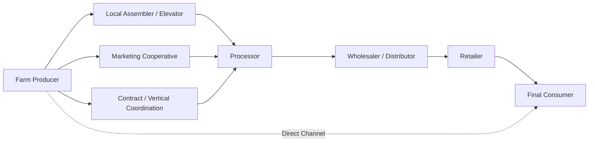

## Marketing Functions and Channels

### Overview

Agricultural marketing encompasses the full set of activities involved in moving a commodity from the point of production to the final consumer, adding value at each stage through form, place, time, and possession utility. Because agricultural production is geographically dispersed, seasonal, biologically perishable in many cases, and produced by a large number of relatively small individual units, marketing functions and channel structures play a disproportionately large role in agricultural economics compared to many other sectors, where production and consumption are more directly and immediately matched.

### Core Concepts and Terminology

**Marketing**

All business activities involved in the flow of goods and services from the point of initial production until they are in the hands of final consumers, including the exchange, physical, and facilitating functions described below.

**Marketing Margin**

The difference between the price paid by the final consumer and the price received by the primary producer, reflecting the cost of all intermediate marketing functions plus the profit margins of intermediaries.

$$\text{Marketing Margin} = \text{Retail Price} - \text{Farm Gate Price}$$

**Marketing Channel**

The sequence of intermediaries (or the direct path) through which a product moves from producer to final consumer, also referred to as a distribution channel.

**Utility Creation**

Marketing creates economic value by transforming a raw commodity in ways consumers are willing to pay for, categorized into four types:

- *Form utility*: converting raw commodities into more usable/desirable forms (e.g., wheat into flour).
- *Place utility*: moving product from surplus production regions to deficit consumption regions.
- *Time utility*: storing product from harvest periods for consumption across the year.
- *Possession utility*: transferring ownership/title, enabling exchange to occur.

### The Three Categories of Marketing Functions

**1. Exchange Functions**

*Buying (Assembly)*

Aggregating small, dispersed lots of production from numerous individual farms into commercially viable volumes for further processing or transport.

*Selling*

Activities involved in locating buyers and transferring ownership, including grading, standardization, advertising, and negotiating sale terms.

**2. Physical Functions**

*Storage*

Holding commodities between harvest and consumption periods (or between production and processing), creating time utility. Storage costs include physical warehousing, spoilage/shrinkage risk, interest on inventory value, and insurance.

$$\text{Storage Cost} = \text{Physical Storage} + \text{Interest Opportunity Cost} + \text{Risk/Spoilage Cost}$$

*Transportation*

Physical movement of the commodity from production to consumption points, creating place utility. Mode choice (truck, rail, barge, ocean vessel) depends on distance, volume, perishability, and infrastructure availability, with agricultural bulk commodities often relying heavily on rail and waterway transport for long distances due to lower per-unit-mile costs relative to trucking.

*Processing*

Transformation of the raw commodity into a more consumable or storable form (e.g., milling, canning, slaughtering, packaging), creating form utility and often extending shelf life.

**3. Facilitating Functions**

*Standardization and Grading*

Establishing uniform quality classifications (e.g., USDA grades for grain, meat, and produce) that allow buyers and sellers to transact without physical inspection of every lot, substantially reducing transaction costs and enabling commodity fungibility (a prerequisite for futures market trading, as covered under hedging).

*Financing*

Providing the working capital needed to bridge the time gap between purchasing inputs/inventory and receiving payment from final sale, often extended by input suppliers, processors, or specialized agricultural lenders.

*Risk-Bearing*

Absorbing price and quality risk during the marketing process; assumed by different parties at different channel stages (e.g., a grain elevator holding unsold inventory bears price risk until sold or hedged).

*Market Information*

Collection and dissemination of price, supply, and demand information (e.g., USDA market reports, exchange price data) that allows participants throughout the channel to make informed production, storage, and marketing decisions.

### Marketing Channel Structures

**Direct-to-Consumer Channels**

Producer → Consumer, with no intermediaries. Includes farmers' markets, community-supported agriculture (CSA) arrangements, farm-gate sales, and on-farm processing/retail. Captures the largest share of the retail dollar for the producer but requires the farm to internalize marketing, transportation, and often processing functions itself, and is generally feasible only at limited volume.

**Traditional (Multi-Intermediary) Channels**

Producer → Local Assembler/Elevator → Processor → Wholesaler → Retailer → Consumer. Each stage performs specific functions (assembly, storage, processing, distribution) and each intermediary's margin reflects the cost of the functions performed plus a return to capital and risk-bearing.

**Vertically Coordinated / Contract Channels**

Producer → Processor (via production contract or marketing contract), bypassing open-market spot transactions at one or more stages. Common in poultry, hog, and some fruit/vegetable production, where the processor specifies production practices, inputs, or delivery terms in advance, reducing price and quantity uncertainty for both parties but reducing the producer's flexibility to sell into alternative channels.

**Cooperative Channels**

Producer → Marketing Cooperative → Further Processing/Distribution. Producers pool resources through a cooperative structure to achieve scale economies in marketing functions (storage, transportation, grading, negotiating power) that individual farms could not achieve alone, with net proceeds returned to members after cooperative operating costs.

**Export Channels**

Producer → Domestic Assembler/Exporter → International Buyer/Importer → Foreign Distribution. Involves additional facilitating functions such as export documentation, quality certification for international standards, currency risk management, and international transportation logistics (ocean freight, port handling).

### Diagram: Generalized Marketing Channel Flow

### Illustration: Marketing Margin Decomposition

**(svg_diagram) Farm-to-Retail Price Spread**

<svg xmlns="http://www.w3.org/2000/svg" viewBox="0 0 620 380" font-family="Helvetica, Arial, sans-serif">

<text x="310" y="24" text-anchor="middle" font-size="16" font-weight="bold" fill="`#1a1a1a`">Marketing Margin: Farm Gate to Retail (svg_diagram)</text>

<rect x="140" y="60" width="120" height="260" fill="#a9dfbf" />
<text x="200" y="330" text-anchor="middle" font-size="11" fill="#333">Farm Gate Price</text>
<rect x="280" y="140" width="120" height="180" fill="#f9e79f" />
<text x="340" y="330" text-anchor="middle" font-size="11" fill="#333">Processing/Transport</text>
<rect x="420" y="90" width="120" height="230" fill="#f5b7b1" />
<text x="480" y="330" text-anchor="middle" font-size="11" fill="#333">Wholesale/Retail Margin</text>
<line x1="80" y1="60" x2="560" y2="60" stroke="#999" stroke-dasharray="3,3" />
<text x="565" y="64" font-size="11" fill="#666">Retail price</text>
<line x1="80" y1="320" x2="560" y2="320" stroke="#333" stroke-width="2" />
</svg>

### Determinants of Marketing Margin Size

**Key Points**

- **Perishability:** Highly perishable commodities (fresh produce, dairy) generally carry larger marketing margins due to costlier cold-chain logistics, higher spoilage risk, and time-sensitive handling requirements.
- **Processing intensity:** Commodities requiring extensive transformation (e.g., wheat into packaged bread versus raw grain) carry larger margins reflecting the added form-utility functions performed.
- **Market structure and competition:** The degree of concentration among processors, wholesalers, and retailers affects how competitively marketing margins are set; highly concentrated intermediary markets can result in margins that do not fall purely to competitive cost-plus-normal-profit levels. [Inference] The extent to which concentration translates into non-competitive margin behavior is empirically debated and varies by commodity and market, and should be assessed with market-specific concentration and price-transmission data rather than assumed uniformly.
- **Transportation distance and infrastructure:** Longer supply chains and less-developed logistics infrastructure increase the physical function costs embedded in the margin.
- **Volume and scale economies:** Larger, more standardized volumes generally allow lower per-unit marketing costs, which is part of the economic rationale for assembly/aggregation functions and cooperative marketing structures.

### Related Topics

- Price transmission and market concentration analysis along agricultural supply chains
- Agricultural cooperatives: structure, governance, and economic rationale
- Vertical coordination and production/marketing contracts
- Cold chain logistics for perishable commodity marketing
- USDA grading and quality standardization systems
- International agricultural trade logistics and export marketing
- Direct marketing models: farmers' markets, CSAs, and farm-to-table channels
- Market information systems and price discovery mechanisms