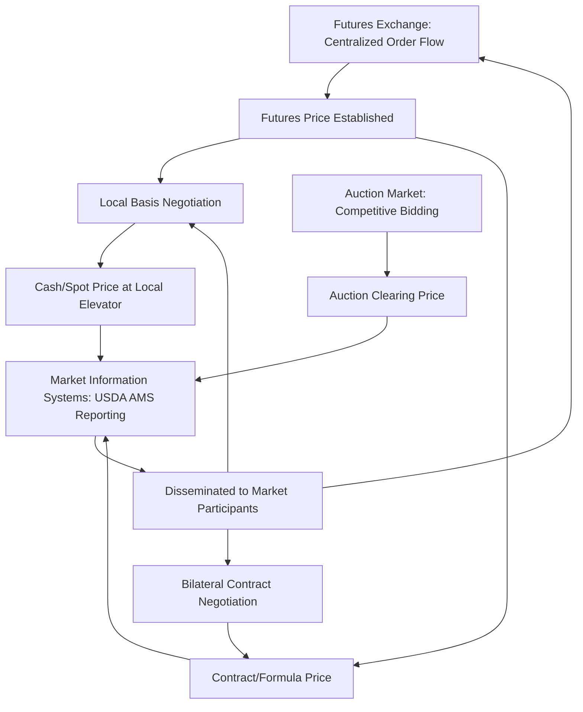

## Price Discovery Mechanisms

### Overview

Price discovery is the process by which buyers and sellers, through their interactions in a market, arrive at a transaction price that reflects the aggregate supply, demand, and available information relevant to a commodity at a given time and place. In agricultural markets, price discovery is complicated by seasonal production timing, geographic dispersion of production and consumption, biological production lags, and heterogeneous quality across lots — factors that make it harder for any single transaction to instantaneously reflect all relevant market information. Understanding the mechanisms through which agricultural prices are discovered is foundational to interpreting cash markets, futures markets, and the basis relationships that link them.

### Core Concepts and Terminology

**Price Discovery**

The process of determining the appropriate price of a commodity through the interaction of buyers and sellers in a marketplace, incorporating available information about supply, demand, quality, and expectations about future conditions.

**Price Transmission**

The extent and speed with which a price change at one level of the marketing channel (e.g., farm gate) is reflected at another level (e.g., retail), or between geographically separated markets.

**Law of One Price (LOP)**

In a fully efficient, frictionless market, identical goods should sell for the same price everywhere once transportation and transaction costs are accounted for; persistent deviations indicate market frictions, information asymmetries, or market power.

$$P_A = P_B + T_{AB}$$

where $P_A$ and $P_B$ are prices in two spatially separated markets and $T_{AB}$ is the transportation/transaction cost between them. Deviations beyond $T_{AB}$ signal an arbitrage opportunity or a market inefficiency.

**Market Efficiency (Informational)**

A market is informationally efficient if prices fully and rapidly reflect all available and relevant information, such that no participant can systematically profit from publicly available information alone.

### Mechanisms of Price Discovery

**1. Open Outcry and Electronic Futures Exchanges**

Centralized exchange trading (historically open outcry, now predominantly electronic) aggregates the buy and sell orders of a very large number of participants — hedgers, speculators, and arbitrageurs — into a single continuously updated price. Because futures markets are highly liquid and centralized, they are generally considered the primary price discovery venue for major storable agricultural commodities (corn, soybeans, wheat, live cattle, hogs), with local cash markets subsequently pricing off the futures price via basis (cash price = futures price ± basis, as established in futures/options hedging).

**2. Cash (Spot) Market Transactions**

Direct negotiated transactions between buyers (elevators, processors, feedlots) and sellers (farmers) at a specific time and location. Cash prices are influenced by, and help inform, the local basis relative to the futures market, and reflect very localized supply/demand conditions (harvest pressure, local storage capacity, transportation bottlenecks) that the broader futures market does not capture directly.

**3. Auction Markets**

Prices are determined through a competitive bidding process among multiple buyers for a specific lot, commonly used for livestock (terminal markets, video/satellite auctions), specialty produce, and some perishable commodities. Auction formats include:

- *English (ascending-bid) auctions*: bidders openly increase bids until only the highest bidder remains.
- *Dutch (descending-bid) auctions*: the auctioneer starts at a high price and lowers it until a buyer accepts, common in some European flower and produce markets.
- *Sealed-bid auctions*: buyers submit confidential bids simultaneously, common in some government commodity procurement and specialty grain sales.

**4. Negotiated/Contract Pricing**

Bilateral price negotiation embedded within production or marketing contracts (see vertical coordination under marketing channels), where price may be fixed in advance, tied to a formula referencing a futures or cash market benchmark, or determined through a base-price-plus-premium/discount grid structure (common in cattle and hog procurement based on quality grades).

**5. Formula and Basis Pricing**

Rather than negotiating an outright price, many agricultural transactions use a formula that ties the cash price to a reference futures price plus or minus an agreed local basis, determined at a later date the seller chooses ("basis contracts"). This mechanism separates the *futures price discovery* function (handled by the exchange) from the *local basis discovery* function (handled by direct negotiation between the local buyer and seller).

$$\text{Cash Price} = \text{Futures Reference Price} \pm \text{Negotiated Local Basis}$$

**6. Government and Third-Party Market Information Systems**

Public reporting systems — such as USDA's Agricultural Marketing Service (AMS) mandatory price reporting for livestock and meat, and voluntary reporting for many other commodities — collect and disseminate transaction price data to improve transparency and reduce information asymmetry between large, well-informed buyers and more dispersed, less-informed sellers.

### Diagram: Price Discovery Pathways

### Factors Affecting the Quality of Price Discovery

**Key Points**

- **Market thinness:** Markets with few transactions or few active participants (thin markets) produce less reliable price signals, since a small number of trades can disproportionately move the observed price without reflecting broad supply/demand conditions.
- **Information asymmetry:** When one side of the market (often large buyers/processors) has systematically better information about supply/demand conditions than the other side (often numerous smaller sellers/producers), price discovery can be distorted in favor of the better-informed party.
- **Market concentration:** A small number of large buyers (oligopsony) in a local market for a given commodity (common in some livestock procurement regions) can reduce the competitiveness of price discovery, since fewer independent bids are being aggregated into the observed price.
- **Speed of information flow:** Electronic trading and real-time public reporting generally accelerate price discovery relative to historical open-outcry or purely local negotiated systems, reducing the window during which prices can diverge from underlying fundamentals.
- **Quality heterogeneity:** Because agricultural commodities vary in grade, moisture, protein content, and other quality attributes, price discovery must also incorporate quality-adjustment premiums/discounts, adding complexity relative to fully homogeneous financial assets.

### Illustration: Price Discovery Efficiency Spectrum

**(svg_diagram) Relative Transparency Across Price Discovery Mechanisms**

<svg xmlns="http://www.w3.org/2000/svg" viewBox="0 0 620 360" font-family="Helvetica, Arial, sans-serif">

<text x="310" y="24" text-anchor="middle" font-size="16" font-weight="bold" fill="`#1a1a1a`">Price Discovery Mechanisms by Transparency (svg_diagram)</text>

<line x1="80" y1="300" x2="560" y2="300" stroke="#333" stroke-width="2" />
<text x="90" y="325" font-size="11" fill="#333">Low Transparency</text>
<text x="440" y="325" font-size="11" fill="#333">High Transparency</text>
<circle cx="140" cy="260" r="8" fill="#c0392b" />
<text x="105" y="245" font-size="10" fill="#333">Bilateral private contract</text>
<circle cx="260" cy="220" r="8" fill="#e67e22" />
<text x="220" y="205" font-size="10" fill="#333">Local cash negotiation</text>
<circle cx="380" cy="170" r="8" fill="#f1c40f" />
<text x="345" y="155" font-size="10" fill="#333">Auction market</text>
<circle cx="500" cy="110" r="8" fill="#27ae60" />
<text x="440" y="95" font-size="10" fill="#333">Centralized futures exchange</text>
</svg>

### Empirical Considerations

- **Price transmission asymmetry:** Empirical agricultural economics research has frequently documented that retail prices respond faster to farm-level price *increases* than to *decreases* in some supply chains, a pattern sometimes attributed to asymmetric market power along the channel. [Inference] The consistency and magnitude of this asymmetric transmission finding varies substantially across commodities, countries, and time periods studied, and should not be treated as a universal law applicable to every agricultural supply chain.
- **Convergence at expiration:** Futures and local cash prices are expected to converge as a futures contract approaches expiration and delivery, since arbitrage opportunities are progressively eliminated; persistent, uncorrected divergence at expiration can signal delivery constraints or localized market frictions specific to that contract or region.
- **Behavior may vary:** The relative dominance of any one price discovery mechanism (futures vs. auction vs. negotiated contract) differs substantially by commodity — for example, live cattle markets historically relied heavily on negotiated cash and formula pricing alongside futures, prompting ongoing regulatory and industry discussion (e.g., USDA mandatory price reporting rules) about maintaining adequate negotiated cash trade volume to support robust price discovery.

### Related Topics

- Basis behavior and local basis forecasting
- USDA Agricultural Marketing Service mandatory and voluntary price reporting programs
- Market power and oligopsony in livestock procurement
- Futures market liquidity and its role in price discovery quality
- Formula and grid pricing structures in cattle and hog procurement
- Spatial price transmission and the Law of One Price testing methods
- Auction theory applied to agricultural commodity markets
- Vertical price transmission asymmetry in food supply chains