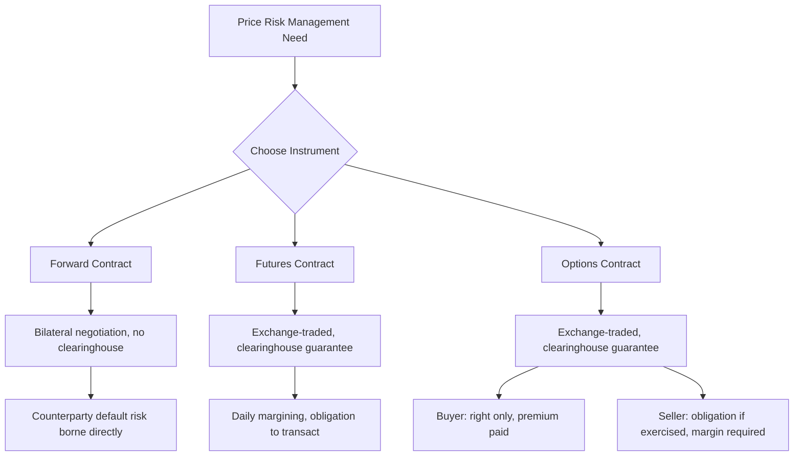

## Futures, Forward Contracts, and Options

### Overview

Futures, forward contracts, and options are the three principal derivative instruments used in agricultural marketing to manage price risk and to fix, in advance, the terms under which a commodity will be bought or sold. While related, they differ fundamentally in standardization, counterparty structure, flexibility, and default risk. Understanding their structural differences — rather than only their use as hedging tools — is essential to agricultural marketing, since the choice of instrument affects liquidity, customization, basis exposure, and counterparty risk exposure for producers and buyers alike.

### Core Concepts and Terminology

**Derivative**

A financial contract whose value is derived from the price of an underlying asset — here, an agricultural commodity or a futures contract on that commodity — rather than being a direct claim on physical delivery at the time of contracting.

**Standardization**

The degree to which a contract's terms (quantity, quality, delivery location, delivery date) are fixed by an exchange versus freely negotiated between two parties.

**Counterparty Risk**

The risk that the other party to a contract fails to perform its obligations. This risk differs sharply across instrument types depending on whether a contract is exchange-cleared or privately negotiated.

### Forward Contracts

**Definition**

A forward contract is a private, bilaterally negotiated agreement between two specific parties (e.g., a farmer and a local grain elevator) to buy or sell a specified quantity and quality of a commodity at an agreed price on a specified future date.

**Key Characteristics**

- *Customization:* Quantity, quality specifications, delivery location, and delivery date are all individually negotiable, unlike standardized exchange contracts.
- *No exchange, no clearinghouse:* Forward contracts are traded over-the-counter (OTC) directly between the two parties, with no centralized exchange or clearinghouse guaranteeing performance.
- *Counterparty risk:* Because there is no clearinghouse guarantee, each party bears the risk that the other defaults (e.g., the buyer becomes insolvent before payment, or the seller cannot deliver due to a crop failure).
- *No daily margining:* Unlike futures, forward contracts typically do not require daily mark-to-market margin payments; gains and losses are realized only at settlement/delivery.
- *Illiquidity:* Because forward contracts are customized and privately held, they generally cannot be easily offset or resold to a third party before maturity, unlike standardized futures contracts.

*Example:*

A wheat farmer negotiates a forward contract directly with a local mill in April: 20,000 bushels of hard red winter wheat, delivered at the mill's facility in August, at a fixed price of $6.20/bushel. Regardless of what the futures or cash market does between April and August, both parties are obligated to transact at $6.20/bushel upon delivery (subject to any quality adjustment clauses in the contract).

### Futures Contracts

**Definition**

A standardized, exchange-traded contract to buy or sell a specified quantity and quality of a commodity at a predetermined price on a specified future date, as detailed under futures and options market hedging mechanics.

**Key Characteristics**

- *Standardization:* Contract size, delivery months, and quality/grade specifications are fixed by the exchange (e.g., CBOT corn futures: 5,000 bushels per contract, specific delivery months, No. 2 Yellow Corn grade with defined discount/premium schedules for other grades).
- *Clearinghouse guarantee:* A central clearinghouse becomes the counterparty to every trade (buyer to every seller, seller to every buyer), which substantially reduces counterparty default risk compared to a private forward contract.
- *Daily mark-to-market and margining:* Futures positions are marked to market daily, with gains and losses settled each day through the margin account; this requires ongoing liquidity management and creates margin call risk under adverse price movements.
- *Liquidity and offset:* Standardization allows a futures position to be closed out (offset) at any time before expiration by taking an equal and opposite position, without needing to find the original counterparty — a major flexibility advantage over forward contracts.
- *Physical delivery is rare in practice:* Although futures contracts technically specify a delivery mechanism, the vast majority of agricultural futures positions are offset before the delivery period rather than settled through actual physical delivery; delivery exists primarily to enforce convergence between futures and cash prices near expiration.

### Options Contracts

**Definition**

A contract granting the buyer the right, but not the obligation, to buy (call) or sell (put) an underlying futures contract at a specified strike price, in exchange for an upfront premium paid to the seller (writer).

**Key Characteristics**

- *Asymmetric obligation:* The buyer's maximum loss is limited to the premium paid; the buyer will only exercise the option if it is financially favorable to do so. The seller (writer), by contrast, faces an obligation to perform if exercised and bears margin requirements reflecting this open-ended exposure.
- *Premium as the price of flexibility:* The option buyer pays for the right to benefit from favorable price movement while being protected from unfavorable movement (see put/call hedging strategies), which is why options are often described as insurance-like relative to the more rigid price lock of a futures or forward hedge.
- *Exchange-traded and standardized:* Like futures, most agricultural options are exchange-traded, standardized (in strike price intervals and expiration dates), and cleared through a clearinghouse, providing similar counterparty risk protection.
- *American-style exercise (typical for US agricultural options):* Most US agricultural commodity options can be exercised at any time up to expiration, rather than only on the expiration date itself (European-style).

### Comparative Summary

| Feature | Forward Contract | Futures Contract | Options Contract |
| --- | --- | --- | --- |
| Standardization | None (fully negotiated) | Full (exchange-set terms) | Full (exchange-set strikes/expirations) |
| Counterparty | Specific private party | Clearinghouse | Clearinghouse |
| Default/counterparty risk | Present, uninsured | Minimal (clearinghouse guarantee) | Minimal (clearinghouse guarantee) |
| Margining | Typically none | Daily mark-to-market | Buyer: none beyond premium; Seller: margin required |
| Liquidity/offset before maturity | Difficult (must find same counterparty) | Easy (offset via exchange) | Easy (offset via exchange) |
| Upfront cost | None (beyond negotiation) | None (margin, not a cost) | Premium (nonrefundable cost) |
| Flexibility for buyer | None (binding obligation) | None (binding obligation) | High (right, not obligation) |
| Customization | High | None | Limited to available strikes/expirations |
| Typical use case | Direct producer-buyer arrangement, local delivery | Price hedging, speculation, arbitrage | Asymmetric hedging (floors/ceilings), speculation |

### Diagram: Instrument Relationships and Obligation Structure

### Illustration: Payoff Symmetry Comparison

**(svg_diagram) Obligation vs. Right: Futures/Forward vs. Options Payoff**

<svg xmlns="http://www.w3.org/2000/svg" viewBox="0 0 640 380" font-family="Helvetica, Arial, sans-serif">

<text x="320" y="24" text-anchor="middle" font-size="16" font-weight="bold" fill="`#1a1a1a`">Payoff Shape: Locked Price vs. Optional Right (svg_diagram)</text>

<line x1="80" y1="200" x2="280" y2="200" stroke="#333" stroke-width="1" />
<line x1="180" y1="100" x2="180" y2="300" stroke="#333" stroke-width="1" />
<path d="M 90 260 L 270 140" stroke="#2874a6" stroke-width="3" fill="none" />
<text x="90" y="320" font-size="11" fill="#2874a6">Futures/Forward: symmetric obligation</text>
<line x1="380" y1="200" x2="580" y2="200" stroke="#333" stroke-width="1" />
<line x1="480" y1="100" x2="480" y2="300" stroke="#333" stroke-width="1" />
<path d="M 390 220 L 480 220 L 580 140" stroke="#c0392b" stroke-width="3" fill="none" />
<text x="380" y="320" font-size="11" fill="#c0392b">Call Option: capped loss, open upside</text>
</svg>

### Selection Considerations for Agricultural Market Participants

**Key Points**

- **Producers/sellers concerned about local delivery logistics** and wanting full customization of terms often favor forward contracts with a known local buyer, accepting counterparty risk in exchange for logistical simplicity and no margin call exposure.
- **Producers/buyers wanting liquidity and flexibility to adjust positions** as market conditions evolve generally favor exchange-traded futures, accepting margin call risk and the need for cash flow management in exchange for the ability to offset positions at any time.
- **Producers/buyers wanting downside protection while preserving upside potential**, and who are willing to pay an upfront premium for that asymmetry, favor options.
- **Basis risk applies across all three instruments** relative to the specific commodity, grade, and location a given producer or buyer actually needs, since futures and options are written on standardized underlying specifications that rarely match a specific transaction exactly.
- [Inference] The relative popularity of these instruments varies by commodity and region; for instance, forward contracting is often more prevalent for commodities or regions with thinner futures market liquidity or no directly corresponding futures contract, while deep, liquid futures markets (corn, soybeans, wheat) see heavier use of futures and options relative to pure bilateral forward contracting.

### Related Topics

- Basis contracts and deferred-pricing agreements
- Clearinghouse mechanics and novation in exchange-traded derivatives
- Margin call management and liquidity planning for futures positions
- Options pricing models (e.g., Black-76) for futures options
- Counterparty credit risk assessment in over-the-counter agricultural contracts
- Cross-hedging when no direct futures contract exists for a commodity
- Production contracts versus marketing contracts in vertical coordination
- Regulatory oversight of agricultural derivatives (CFTC role)