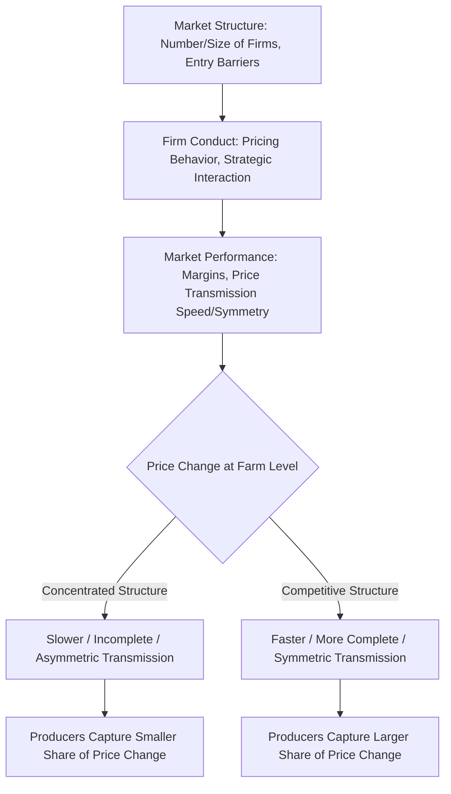

## Market Structure and Price Transmission

### Overview

Market structure refers to the organizational characteristics of a market — the number and size distribution of buyers and sellers, barriers to entry, product differentiation, and the degree of vertical integration — that determine how competitive or concentrated a market is. Price transmission refers to how price changes at one level of the marketing channel (e.g., farm gate) or in one geographic market are passed through to another level or location. The two concepts are tightly linked in agricultural economics: the structure of a market strongly shapes the speed, completeness, and symmetry with which prices transmit along the supply chain, which in turn determines how much of a given price change is ultimately captured by producers versus intermediaries versus consumers.

### Core Concepts and Terminology

**Market Structure**

The set of characteristics describing the competitive environment of an industry, traditionally classified along a spectrum from perfect competition to monopoly/monopsony, based on the number of firms, product homogeneity, entry barriers, and information availability.

**Structure-Conduct-Performance (SCP) Paradigm**

A traditional industrial organization framework proposing that market *structure* (concentration, entry barriers) influences firm *conduct* (pricing behavior, strategic interaction), which in turn determines market *performance* (efficiency, profit margins, price transmission). While later IO literature has qualified the strict causal chain of SCP, it remains a widely used organizing framework in agricultural market structure analysis.

**Concentration Ratio (CR4)**

The combined market share of the four largest firms in an industry, a common (though imperfect) measure of market concentration:

$$CR4 = \sum_{i=1}^{4} s_i$$

where $s_i$ is the market share of the $i$-th largest firm.

**Herfindahl-Hirschman Index (HHI)**

A more information-rich concentration measure summing the squared market shares of all firms in a market:

$$HHI = \sum_{i=1}^{n} s_i^2 \times 10{,}000$$

where $s_i$ is expressed as a decimal market share. U.S. antitrust guidelines generally treat markets with $HHI > 2500$ as highly concentrated, though specific enforcement thresholds and interpretations are set by antitrust authorities and can be revised over time. [Unverified] Readers should confirm current numerical thresholds against the most recent DOJ/FTC Horizontal Merger Guidelines rather than relying on a fixed historical figure, since these thresholds have been subject to periodic revision.

**Oligopoly / Oligopsony**

- *Oligopoly*: a market with a small number of sellers facing many buyers, giving sellers some influence over price.
- *Oligopsony*: a market with a small number of buyers facing many sellers (common in livestock procurement and some processed commodity markets), giving buyers some influence over the price paid to numerous, more dispersed sellers.

### Market Structure Types Relevant to Agriculture

**Perfect Competition (Idealized Benchmark)**

Many small buyers and sellers, homogeneous product, free entry/exit, full information — no single participant can influence price. Primary agricultural commodity production (grain farming) is often used as a textbook approximation of this structure at the farm level, though downstream processing and distribution stages typically deviate substantially from this benchmark.

**Monopolistic Competition**

Many firms, but with some product differentiation (branding, quality claims, geographic proximity) giving each firm limited pricing power — common in some value-added food product markets and direct-to-consumer agricultural marketing.

**Oligopoly/Oligopsony**

A small number of large firms dominate a stage of the supply chain — widely documented in meatpacking, grain processing, and some input supply markets (seed, agricultural chemicals), where a handful of large firms account for a majority of national procurement or processing capacity.

**Monopoly/Monopsony (Rare in Practice)**

A single dominant buyer or seller — rare in unregulated agricultural markets at a national level, though can occur at a highly localized level (e.g., a single grain elevator or processing plant serving as the only practical buyer within economic hauling distance of a group of farms).

### Price Transmission Concepts

**Vertical Price Transmission**

The passthrough of price changes between different stages of the same supply chain (farm → wholesale → retail).

$$\Delta P_{\text{retail}} = \beta \times \Delta P_{\text{farm}} + \varepsilon$$

where $\beta$ (the transmission elasticity) measures the degree to which a farm-level price change is reflected in the retail price; $\beta = 1$ would indicate full, proportional pass-through, while $\beta < 1$ indicates that intermediaries absorb part of the price change (or that fixed marketing margin components dilute pass-through).

**Spatial Price Transmission**

The passthrough of price changes between geographically separated markets for the same or a closely substitutable commodity, tested against the Law of One Price (as established under price discovery mechanisms) adjusted for transportation costs.

**Asymmetric Price Transmission**

A frequently studied empirical phenomenon in which price changes transmit through the supply chain at different speeds or magnitudes depending on the *direction* of the change — commonly, retail prices are found in some studies to rise quickly in response to farm-level price increases but fall more slowly in response to farm-level price decreases ("rockets and feathers" pattern).

$$\Delta P_{\text{retail}}^{+} \neq |\Delta P_{\text{retail}}^{-}|$$

for equivalent-magnitude farm-level price increases and decreases. [Inference] The presence, direction, and magnitude of asymmetric transmission findings vary considerably across commodities, countries, sample periods, and econometric specifications used in the literature; it is a documented pattern in numerous studies but not a universal law that applies uniformly to every supply chain.

### Diagram: Market Structure and Transmission Linkage

### Illustration: Concentration and Transmission Relationship

**(svg_diagram) Market Concentration vs. Farm Share of Retail Price Changes**

<svg xmlns="http://www.w3.org/2000/svg" viewBox="0 0 620 380" font-family="Helvetica, Arial, sans-serif">

<text x="310" y="24" text-anchor="middle" font-size="15" font-weight="bold" fill="`#1a1a1a`">Concentration vs. Producer Share of Price Transmission (svg_diagram)</text>

<line x1="80" y1="320" x2="580" y2="320" stroke="#333" stroke-width="2" />
<line x1="80" y1="60" x2="80" y2="320" stroke="#333" stroke-width="2" />

<text x="560" y="345" font-size="12" fill="#333">Market Concentration (HHI)</text>

<text x="35" y="60" font-size="12" fill="#333" transform="rotate(-90 35,60)">Producer Share of Transmission</text>

<path d="M 100 100 C 250 150, 400 250, 560 300" fill="none" stroke="#c0392b" stroke-width="3" />
<text x="330" y="200" font-size="11" fill="#c0392b">Illustrative inverse relationship</text>
</svg>

Note: this illustrates a commonly hypothesized directional relationship in the SCP-tradition literature rather than a precisely estimated or universally observed empirical function; actual relationships must be estimated using commodity- and market-specific data.

### Empirical Measurement Approaches

**Key Points**

- **Error Correction Models (ECM):** Widely used to test both the speed and symmetry of price transmission between market levels, since farm and retail (or two spatial markets) prices are typically cointegrated (move together in the long run despite short-run deviations).
- **Threshold Autoregressive (TAR) Models:** Used to test for asymmetric adjustment, allowing the speed of price convergence to differ depending on whether the price gap is above or below a threshold, directly modeling the "rockets and feathers" hypothesis.
- **Rockets and Feathers terminology:** Refers to the metaphor that prices "rocket" up quickly but fall like a "feather" slowly, used descriptively in much of the applied literature on asymmetric transmission, particularly in retail fuel and some food markets.
- **Merger and concentration analysis:** Antitrust reviews of agricultural processing and input-supply mergers frequently rely on HHI calculations and historical price transmission studies to assess likely competitive effects of increased concentration.

### Factors Influencing Market Structure Outcomes in Agriculture

- **Economies of scale in processing:** Large capital investments required for modern meatpacking, milling, or crushing facilities favor a smaller number of large-scale processors, contributing to concentrated downstream market structures even where the farm-production stage remains relatively unconcentrated.
- **Perishability and thin local markets:** Perishable commodities requiring rapid processing after harvest/slaughter limit the practical number of buyers accessible to a given producer within an economically viable transport radius, contributing to localized oligopsony power even in nationally competitive industries.
- **Vertical integration and contracting:** Extensive use of production and marketing contracts (see marketing channels) can substitute for open spot-market transactions, altering how price signals are transmitted and complicating the interpretation of observed cash market prices as representative of the full transaction universe.
- **Regulatory and policy environment:** Antitrust enforcement, mandatory price reporting requirements (e.g., USDA AMS Livestock Mandatory Reporting), and merger review standards directly shape the evolution of market structure over time and the resulting quality of observable price transmission data.

### Related Topics

- Structure-Conduct-Performance paradigm and its critiques in agricultural IO
- USDA Livestock Mandatory Price Reporting and market transparency policy
- Error correction and threshold autoregressive models for price transmission testing
- Merger review and antitrust analysis in agricultural processing industries
- Oligopsony power in meatpacking and livestock procurement
- Vertical integration and its effects on observed cash market thinness
- Law of One Price testing in spatial agricultural markets
- Retail food price asymmetry ("rockets and feathers") empirical literature