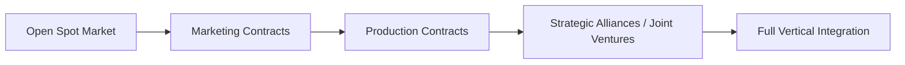
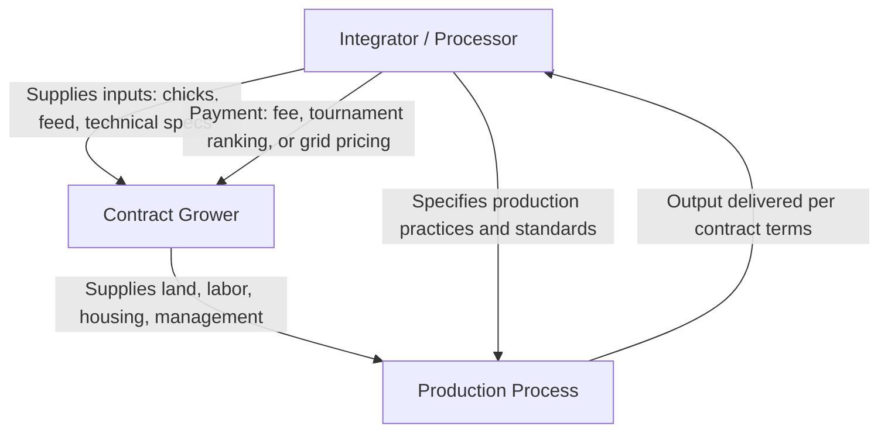

## Vertical Coordination and Contracting

### Overview

Vertical coordination refers to the mechanisms that align successive stages of the agricultural supply chain — from input supply through production, processing, and distribution — beyond what occurs through independent, arm's-length spot market transactions at each stage. It exists on a spectrum ranging from open spot markets at one extreme to full vertical integration (single-firm ownership of multiple stages) at the other, with various forms of contracting occupying the middle ground. Understanding this spectrum, and the specific contract types used along it, is central to explaining why so much of modern agricultural production — particularly poultry, hogs, and many specialty crops — no longer moves primarily through open cash markets.

### Core Concepts and Terminology

**Vertical Coordination**

The broad set of mechanisms — informal relationships, formal contracts, or common ownership — that link successive stages of production and marketing to reduce the transaction costs, price risk, and quality/quantity uncertainty that arise from relying purely on independent spot market transactions at each stage.

**Vertical Integration**

The most complete form of vertical coordination, in which a single firm owns and directly controls multiple stages of the supply chain (e.g., a poultry processor also owning breeding, hatchery, and feed-milling operations), eliminating market transactions between those stages entirely.

**Transaction Cost Economics (TCE)**

The theoretical framework (associated with Oliver Williamson) explaining vertical coordination choices as a response to minimizing the costs of using the market — search costs, negotiation costs, contract enforcement costs, and the risk of opportunistic behavior — relative to the costs of coordinating internally or contractually.

**Asset Specificity**

The degree to which an investment (e.g., specialized livestock housing built to a specific processor's specifications, or a dedicated cold-storage facility) has significantly less value in any alternative use. Higher asset specificity increases the risk of "hold-up" (one party exploiting the other's sunk, non-redeployable investment) and is a primary driver of the demand for tighter vertical coordination.

### The Coordination Spectrum

**Open Spot Markets**

Independent producers sell into an open cash market with no advance agreement on price, quantity, or delivery terms, and independently bear full price and production risk. Represents the least coordinated end of the spectrum.

**Marketing Contracts**

An agreement establishing the terms of *sale* — typically price (or a pricing formula) and quantity — before delivery, while the producer generally retains full ownership of the commodity and control over production decisions/practices until the point of sale. The producer bears production risk (yield/quality outcomes) but has price risk reduced or eliminated by the contract terms.

*Example:*

A vegetable grower signs a marketing contract with a processor specifying delivery of 500 tons of processing tomatoes at an agreed price per ton, with quality specifications and a delivery window, but the grower independently decides planting dates, irrigation scheduling, and input use.

**Production Contracts**

An agreement in which the contracting firm (integrator) specifies detailed production practices, inputs, or technology to be used, and often supplies key inputs (e.g., day-old chicks and feed in poultry production) directly, while the producer (grower) supplies land, labor, housing/equipment, and management of the specified practices, typically in exchange for a fee or payment structure rather than an open-market sale price.

*Example:*

A poultry grower enters a production contract with an integrator: the integrator supplies chicks, feed, and veterinary support, and specifies exact housing, ventilation, and feeding protocols. The grower is paid a fee based on a "tournament" system comparing feed conversion efficiency across a cohort of growers, rather than selling the birds at an independently negotiated market price.

**Strategic Alliances / Joint Ventures**

Closer, often longer-term cooperative arrangements involving shared decision-making, shared risk, and sometimes shared equity investment between otherwise independent firms at different supply chain stages, without full common ownership.

**Full Vertical Integration**

A single firm owns and operates multiple supply chain stages directly, internalizing all coordination decisions within firm management rather than through any external contract or market transaction.

### Diagram: Risk and Control Allocation Across Coordination Forms

**(svg_diagram) Producer Risk vs. Producer Control Across the Coordination Spectrum**

<svg xmlns="http://www.w3.org/2000/svg" viewBox="0 0 640 380" font-family="Helvetica, Arial, sans-serif">

<text x="320" y="24" text-anchor="middle" font-size="15" font-weight="bold" fill="`#1a1a1a`">Producer Risk and Control by Coordination Form (svg_diagram)</text>

<line x1="80" y1="320" x2="580" y2="320" stroke="#333" stroke-width="2" />
<line x1="80" y1="60" x2="80" y2="320" stroke="#333" stroke-width="2" />
<text x="500" y="345" font-size="11" fill="#333">Coordination Tightness →</text>
<text x="35" y="60" font-size="11" fill="#333" transform="rotate(-90 35,60)">Level (Risk / Control)</text>
<path d="M 100 280 C 250 260, 400 180, 560 90" fill="none" stroke="#c0392b" stroke-width="3" />
<text x="380" y="170" font-size="11" fill="#c0392b">Producer price/production risk (declines)</text>
<path d="M 100 90 C 250 130, 400 220, 560 290" fill="none" stroke="#2874a6" stroke-width="3" />
<text x="330" y="250" font-size="11" fill="#2874a6">Producer operational control (declines)</text>
</svg>

As coordination tightens from open spot markets toward full vertical integration, the producer's exposure to price and production risk generally declines, but so does the producer's independent operational control and managerial autonomy — a central tradeoff in the economics of vertical coordination.

### Economic Rationale for Vertical Coordination

**Risk Reduction and Shifting**

Contracts allow price and/or production risk to be allocated to the party better positioned to manage or absorb it, and can substitute for or complement the futures/options hedging and crop insurance mechanisms discussed elsewhere.

**Quality and Consistency Control**

Integrators/processors increasingly require precise, consistent product specifications (uniform bird size, specific fat content, particular varietal traits) that are more reliably achieved through direct specification of production practices than through open-market purchases of heterogeneous, independently produced output.

**Reduction of Transaction Costs**

Repeated dealing with the same counterparty under a standing contract reduces the search, negotiation, and monitoring costs that would otherwise be incurred in a new spot-market transaction for every batch of output.

**Addressing Asset Specificity and Hold-Up Risk**

When either party must make a large, relationship-specific investment (specialized livestock housing, dedicated processing equipment calibrated to a specific supplier's input), tighter contractual or ownership linkages protect that investment from opportunistic renegotiation by the other party once the investment is sunk.

**Traceability and Food Safety Requirements**

Modern food safety and traceability regulations, along with buyer/retailer specifications (e.g., non-GMO, animal welfare, or sustainability certifications), often require verifiable control over specific production practices that spot-market purchases cannot reliably guarantee, pushing supply chains toward tighter contractual coordination.

### Diagram: Production Contract Relationship Structure

### Key Considerations and Criticisms

**Key Points**

- **Reduced producer bargaining power:** In markets dominated by a small number of integrators (an oligopsony structure, as discussed under market structure and price transmission), individual growers may have limited alternative buyers, raising concerns about contract terms being dictated largely by the integrator.
- **Tournament system critiques:** Payment systems that rank growers relative to each other (common in poultry production contracts) have been criticized because a grower's pay can be affected by factors outside their control (e.g., variation in chick quality supplied by the integrator to different growers), raising questions about the fairness of risk allocation embedded in contract design.
- **Loss of managerial independence:** Production contracts, in particular, shift many operational decisions from the producer to the integrator, which some producers view as a loss of the independent decision-making traditionally associated with farm ownership, even while reducing their price and production risk exposure.
- **Capital investment lock-in:** Producers who make large, integrator-specific capital investments (specialized housing built to a particular integrator's specifications) may face limited alternative uses for that capital if the contract is not renewed, reinforcing the asset-specificity/hold-up dynamic described above.
- **Regulatory oversight:** In the United States, contract fairness and competitive practices in livestock and poultry production contracting fall partly under the Packers and Stockyards Act, reflecting long-standing policy attention to bargaining power imbalances in vertically coordinated livestock supply chains. [Inference] The specific scope and enforcement emphasis of such regulatory frameworks can change with rulemaking and administrative priorities over time, so current specifics should be verified against the latest USDA/Agricultural Marketing Service or Packers and Stockyards Division guidance rather than assumed static.

### Related Topics

- Transaction cost economics and asset specificity (Williamson framework)
- Packers and Stockyards Act and livestock contract fairness regulation
- Tournament-based compensation systems in poultry contract production
- Vertical integration case studies: poultry, hog, and specialty crop supply chains
- Relationship between production contracts and traditional crop insurance/hedging
- Oligopsony power and its interaction with contract bargaining leverage
- Food safety traceability requirements and their effect on supply chain coordination
- Cooperative marketing as an alternative coordination mechanism for producers