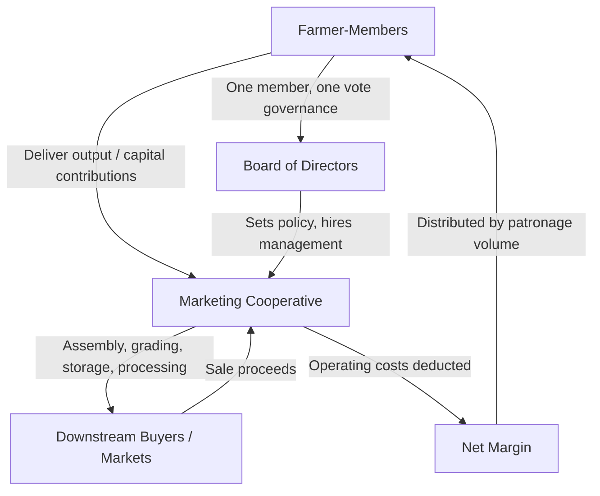

## Cooperative Marketing Organizations

### Overview

Cooperative marketing organizations are member-owned businesses through which agricultural producers pool their output, capital, and/or purchasing power to jointly perform marketing functions — assembly, storage, processing, transportation, and sale — that individual farms could not efficiently perform alone. Cooperatives occupy a distinctive position in agricultural marketing because they are simultaneously a marketing channel intermediary (as introduced under marketing functions and channels) and a form of vertical/horizontal coordination controlled by the producers themselves, rather than by an external processor or integrator, distinguishing them structurally from investor-owned firms (IOFs) and integrator-driven production contracts.

### Core Concepts and Terminology

**Agricultural Cooperative**

A business organization owned and democratically controlled by the farmer-members who use its services, operated to provide services (marketing, purchasing, processing) to members at cost, with any net margins returned to members based on use rather than distributed to outside investors based on capital contribution.

**The Three Cooperative Principles ("Rochdale Principles," as commonly applied to agricultural cooperatives)**

1. *User-owner principle:* those who own the cooperative are those who use it.
2. *User-control principle:* control is exercised by members, traditionally on a one-member-one-vote basis (rather than one-share-one-vote as in investor-owned corporations), though some agricultural cooperatives use modified voting structures based on patronage volume.
3. *User-benefit principle:* benefits are distributed to members in proportion to their use (patronage) of the cooperative, not in proportion to capital invested.

**Patronage Refund (Patronage Dividend)**

The distribution of a cooperative's net margins (revenue minus operating costs) back to members, calculated in proportion to each member's volume of business done with the cooperative during the period, rather than in proportion to equity ownership as with a conventional dividend.

$$\text{Patronage Refund}_i = \text{Total Net Margin} \times \frac{\text{Member } i\text{'s Patronage Volume}}{\text{Total Cooperative Patronage Volume}}$$

**At-Cost Operation Principle**

Cooperatives are typically operated to provide services at cost over time; margins collected during the year that exceed operating costs are returned to members as patronage refunds rather than retained as investor profit, distinguishing the cooperative's basic economic objective from that of an investor-owned firm maximizing return to external shareholders.

### Types of Agricultural Cooperatives

**Marketing Cooperatives**

Aggregate, grade, store, process, and/or sell members' output collectively, capturing scale economies in marketing functions and, in some cases, increasing members' collective bargaining power relative to buyers.

**Supply (Purchasing) Cooperatives**

Jointly purchase farm inputs (seed, fertilizer, fuel, equipment) on behalf of members, achieving volume discounts and reducing per-unit input costs relative to individual purchasing.

**Service Cooperatives**

Provide shared services such as credit (e.g., Farm Credit System institutions organized on cooperative principles), crop insurance administration support, or specialized technical/consulting services.

**New Generation Cooperatives (NGCs)**

A more recent structural variant, often used for value-added processing ventures (e.g., producer-owned ethanol plants, specialty grain processing), characterized by tradable delivery rights tied to defined equity shares and up-front capital commitments proportional to the volume a member intends to deliver, addressing some of the investment and free-rider limitations of traditional open-membership cooperatives (see below).

### Diagram: Cooperative Structure and Patronage Flow

### Economic Rationale for Cooperative Formation

**Countervailing Market Power**

In markets where buyers/processors are concentrated (an oligopsony structure, as discussed under market structure and price transmission), cooperatives allow individually small producers to aggregate volume and negotiate collectively, potentially offsetting some buyer market power that would otherwise be exercised against dispersed, individually weak sellers.

**Scale Economies in Marketing Functions**

Storage, transportation, grading, and processing all typically exhibit economies of scale; individual farms below the efficient scale threshold can achieve near-optimal marketing costs by pooling volume through a cooperative rather than investing individually in underutilized facilities.

**Vertical Integration Retained by Producers**

Cooperatives allow producers to capture value-added margins from processing or further-stage marketing (that would otherwise accrue to an independent investor-owned processor) while retaining producer ownership and control over that stage of the supply chain, rather than ceding it to an external integrator through production contracting.

**Reduced Market Access Risk**

In thin local markets with few alternative buyers, a cooperative can provide a guaranteed outlet for member production, reducing the risk that an individual producer faces no viable buyer in a given period.

### Cooperative Governance and Finance

**Governance Structure**

Member-elected boards of directors set policy and hire professional management, with the traditional one-member-one-vote principle intended to prevent large-volume members from dominating governance decisions in the way large shareholders would in an investor-owned firm — though many agricultural cooperatives have modified this toward proportional or weighted voting tied to patronage volume, reflecting practical tensions between democratic control and capital-contribution incentives.

**Capitalization Challenges (The "Property Rights" or "Free-Rider" Problem in Traditional Cooperatives)**

Because equity in a traditional open-membership cooperative is typically tied to patronage (allocated equity is redeemed as new members enter and volume shifts) rather than being a freely tradable, appreciating asset, cooperatives can face structural capitalization constraints:

- *Horizon problem:* members near retirement have reduced incentive to support long-term capital investment whose benefits will accrue mainly to future members.
- *Free-rider problem:* new members can gain access to cooperative benefits without having contributed to the capital investments that created them, weakening existing members' incentive to invest.
- *Portfolio problem:* members cannot easily diversify their cooperative equity holdings the way they could with freely tradable investor-owned stock.

New Generation Cooperative structures (tradable delivery rights tied to up-front capital commitments) were developed partly as a direct institutional response to these three classic capitalization limitations.

### Illustration: Cooperative vs. Investor-Owned Firm Governance/Profit Distribution

**(svg_diagram) Governance and Benefit Distribution Comparison**

<svg xmlns="http://www.w3.org/2000/svg" viewBox="0 0 640 380" font-family="Helvetica, Arial, sans-serif">

<text x="320" y="24" text-anchor="middle" font-size="15" font-weight="bold" fill="`#1a1a1a`">Cooperative vs. Investor-Owned Firm: Key Contrasts (svg_diagram)</text>

<rect x="60" y="60" width="240" height="280" fill="#eafaf1" stroke="#27ae60" stroke-width="2" />
<text x="180" y="90" text-anchor="middle" font-size="13" font-weight="bold" fill="#1a1a1a">Cooperative</text>
<text x="80" y="130" font-size="11" fill="#333">Owned by user-members</text>
<text x="80" y="160" font-size="11" fill="#333">One member, one vote (traditional)</text>
<text x="80" y="190" font-size="11" fill="#333">Margins refunded by patronage</text>
<text x="80" y="220" font-size="11" fill="#333">Operates near-at-cost</text>
<text x="80" y="250" font-size="11" fill="#333">Equity often non-tradable</text>
<rect x="340" y="60" width="240" height="280" fill="#fdedec" stroke="#c0392b" stroke-width="2" />
<text x="460" y="90" text-anchor="middle" font-size="13" font-weight="bold" fill="#1a1a1a">Investor-Owned Firm</text>
<text x="360" y="130" font-size="11" fill="#333">Owned by outside shareholders</text>
<text x="360" y="160" font-size="11" fill="#333">One share, one vote</text>
<text x="360" y="190" font-size="11" fill="#333">Profit distributed by equity share</text>
<text x="360" y="220" font-size="11" fill="#333">Operates to maximize profit</text>
<text x="360" y="250" font-size="11" fill="#333">Equity typically freely tradable</text>
</svg>

### Limitations and Ongoing Debates

**Key Points**

- **Capital constraints on growth:** The horizon, free-rider, and portfolio problems described above can limit a traditional cooperative's ability to raise growth capital as competitively as an investor-owned firm with access to public equity markets, motivating hybrid and New Generation Cooperative structures.
- **Governance-scale tension:** As cooperatives grow larger and more geographically dispersed, maintaining meaningful democratic member control becomes more administratively complex, and boards increasingly rely on professional management with delegated authority.
- **Member heterogeneity:** As membership grows and diversifies (different farm sizes, enterprises, or risk preferences), reaching consensus on cooperative strategy and investment priorities can become more difficult than in smaller, more homogeneous founding memberships.
- **Competitive performance versus IOFs:** [Inference] Whether cooperatives systematically outperform, underperform, or match investor-owned firms in efficiency and member returns is an empirically contested question that varies substantially by sector, commodity, and specific cooperative, and should not be generalized from any single case example.
- **Antitrust treatment:** In the United States, agricultural cooperatives receive limited statutory exemption from certain antitrust provisions under the Capper-Volstead Act, reflecting a long-standing policy judgment that collective producer marketing serves a countervailing-power function distinct from ordinary horizontal collusion; the scope of this exemption has been subject to legal interpretation and periodic litigation over time.

### Related Topics

- Capper-Volstead Act and antitrust treatment of agricultural cooperatives
- New Generation Cooperative structures and tradable delivery rights
- Farm Credit System as a cooperative-based agricultural lending institution
- Horizon, free-rider, and portfolio capitalization problems in cooperative finance
- Comparative governance: patronage-based versus equity-based control
- Cooperative mergers, consolidations, and the evolution of scale in agricultural cooperatives
- Countervailing market power theory in agricultural marketing
- International cooperative models outside the U.S. agricultural context