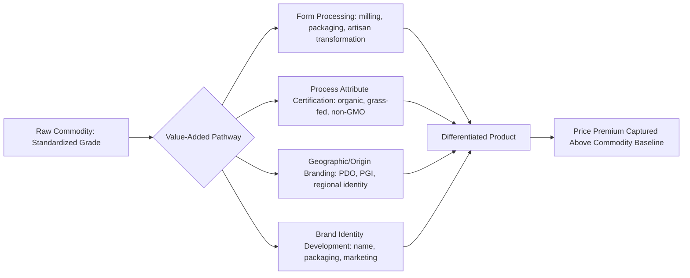

## Branding and Value-Added Marketing

### Overview

Branding and value-added marketing are strategies through which agricultural producers and processors differentiate an otherwise largely homogeneous commodity in order to capture a price premium above the undifferentiated commodity price. Where traditional bulk commodity marketing (as introduced under marketing functions and channels) relies on standardized grading to enable fungible, low-transaction-cost trade, branding and value-added strategies move in the opposite direction — deliberately creating perceived or real differentiation that allows a portion of the product to escape pure commodity price competition and instead be priced based on attributes, identity, or processing that consumers are willing to pay extra for.

### Core Concepts and Terminology

**Commodity vs. Differentiated Product**

A commodity is a good treated as economically interchangeable regardless of producer identity (e.g., No. 2 Yellow Corn meeting standard grade specifications). A differentiated product is one for which the buyer perceives meaningful differences between sellers' offerings (by brand, origin, production method, or embedded attributes), allowing sellers some independent influence over price rather than being pure price-takers.

**Value-Added Agriculture**

Any process that increases the market value of a raw agricultural commodity by transforming its form, changing its production method, or attaching verified attributes, prior to sale — ranging from simple physical processing (milling, packaging) to attribute-based differentiation (organic certification, geographic origin) that does not necessarily change the physical product itself.

**Price Premium**

The additional amount a differentiated product commands above the price of the undifferentiated commodity baseline, reflecting the value consumers place on the product's brand, certified attributes, or processing.

$$\text{Price Premium} = P_{\text{differentiated}} - P_{\text{commodity baseline}}$$

**Willingness to Pay (WTP)**

The maximum price a consumer is willing to pay for a differentiated attribute, which determines the theoretical ceiling on the price premium a given branding or value-added strategy can sustainably capture.

### Categories of Value-Added and Branding Strategies

**Form-Based Value Addition**

Physical transformation of a raw commodity into a more processed, convenient, or shelf-stable form (e.g., raw milk into artisan cheese, raw grain into packaged specialty flour). This captures processing margin and often allows exit from strict commodity grading systems into product-specific pricing.

**Process-Attribute Differentiation**

Differentiation based on *how* the product was produced rather than a change in the physical end product itself — organic certification, non-GMO verification, grass-fed or pasture-raised claims, animal welfare certifications, and sustainability/regenerative-agriculture claims. These attributes are typically credence attributes (see below), verified through third-party certification rather than directly observable by the consumer at purchase.

**Geographic and Origin-Based Differentiation**

Branding tied to a specific region or origin, ranging from informal "locally grown" marketing to formal legal protections such as Protected Designation of Origin (PDO) or Protected Geographical Indication (PGI) systems used in the EU and analogous appellation systems (e.g., wine appellations), which restrict use of a regional name to products meeting defined production criteria within that region.

**Brand Identity and Marketing Communication**

Development of a distinct brand name, packaging, and marketing narrative that builds consumer recognition and loyalty independent of any underlying physical or process difference, relying on advertising, packaging design, and consistent quality signaling to build the brand equity itself as a differentiating asset.

**Direct Marketing and Relationship-Based Differentiation**

Farmers' markets, CSAs, farm-to-table restaurant relationships, and on-farm sales (introduced under marketing channels) often combine direct producer-consumer contact with an implicit or explicit "story" of production origin, building differentiation through relationship and narrative rather than formal certification.

### The Economics of Information: Search, Experience, and Credence Attributes

**Search Attributes**

Attributes a consumer can verify before purchase through inspection (e.g., visible size, color, or physical blemishes on produce).

**Experience Attributes**

Attributes only verifiable after purchase and consumption (e.g., taste, tenderness).

**Credence Attributes**

Attributes that remain unverifiable to the consumer even after purchase and consumption, without reliance on a trusted third party (e.g., whether a product was genuinely organically grown, humanely raised, or produced with a specific environmental practice). Most modern value-added and sustainability-based branding strategies rely heavily on credence attributes, which is precisely why third-party certification and labeling regulation play such an outsized economic role in this category — without external verification, a market for credence-attribute products is vulnerable to information asymmetry and potential adverse selection between honestly and dishonestly labeled products (a "market for lemons" dynamic).

### Diagram: Value-Added Pathway from Commodity to Branded Product

### Illustration: Demand Curve Shift from Successful Differentiation

**(svg_diagram) Effect of Branding on Demand and Price**

<svg xmlns="http://www.w3.org/2000/svg" viewBox="0 0 620 380" font-family="Helvetica, Arial, sans-serif">

<text x="310" y="24" text-anchor="middle" font-size="15" font-weight="bold" fill="`#1a1a1a`">Demand Shift from Successful Differentiation (svg_diagram)</text>

<line x1="80" y1="320" x2="580" y2="320" stroke="#333" stroke-width="2" />
<line x1="80" y1="60" x2="80" y2="320" stroke="#333" stroke-width="2" />
<text x="560" y="345" font-size="12" fill="#333">Quantity</text>
<text x="35" y="60" font-size="12" fill="#333" transform="rotate(-90 35,60)">Price</text>
<path d="M 100 300 L 500 100" fill="none" stroke="#999" stroke-width="2" />
<text x="420" y="130" font-size="11" fill="#666">D0: Commodity demand</text>
<path d="M 160 300 L 560 60" fill="none" stroke="#c0392b" stroke-width="3" />
<text x="460" y="90" font-size="11" fill="#c0392b">D1: Branded/differentiated demand</text>
<line x1="80" y1="180" x2="330" y2="180" stroke="#2874a6" stroke-dasharray="3,3" />
<line x1="80" y1="230" x2="230" y2="230" stroke="#2874a6" stroke-dasharray="3,3" />
<text x="90" y="175" font-size="10" fill="#2874a6">Higher price at same quantity</text>
</svg>

Successful branding or attribute differentiation shifts the demand curve outward/upward (consumers willing to pay more at any given quantity), reflected as $D_0 \rightarrow D_1$, allowing the seller to capture a higher price than the undifferentiated commodity baseline at a comparable output level, subject to the costs of certification, marketing, and any yield/processing tradeoffs incurred to produce the differentiated attribute.

### Costs and Risks of Value-Added and Branding Strategies

**Key Points**

- **Certification and compliance costs:** Organic, non-GMO, and other third-party-verified certifications require ongoing documentation, inspection fees, and often transition periods (e.g., multi-year organic transition) during which the producer bears added cost without yet capturing the certified price premium.
- **Marketing and brand-building investment:** Building genuine brand recognition requires sustained investment in packaging, advertising, and distribution relationships, which can be a substantial fixed cost relative to the scale of many individual farm or small-processor operations.
- **Premium sustainability risk:** Price premiums for differentiated products are not guaranteed to persist; as attribute-based products (e.g., organic) scale up and supply expands, premiums can compress over time as the differentiated segment itself becomes more competitive.
- **Verification and reputational risk:** Because many value-added claims rely on credence attributes, any documented mislabeling or certification failure (by the individual firm or by others in the same certified category) can damage consumer trust across the broader category, not just the specific violator — a collective reputational risk inherent to credence-based branding strategies.
- **Scale mismatch:** [Inference] Value-added and branding strategies often favor smaller, more flexible operations able to serve niche or premium segments, but the fixed costs of certification and marketing can also create a scale threshold below which the strategy is not economically viable; the specific breakeven scale depends heavily on the certification, product category, and target market, and should be assessed case by case rather than assumed to favor any single farm size uniformly.

### Measuring Value-Added Marketing Success

**Hedonic Pricing Models**

A common empirical approach in agricultural economics for estimating the implicit price consumers place on specific product attributes (organic status, origin, package size) by regressing observed transaction prices on a vector of product characteristics.

$$P = \beta_0 + \beta_1 X_1 + \beta_2 X_2 + \dots + \beta_n X_n + \varepsilon$$

where $P$ is the observed price, and each $X_i$ represents a specific product attribute (e.g., a binary indicator for organic certification), with $\beta_i$ interpreted as the implicit marginal price attributable to that attribute, holding other attributes constant.

**Willingness-to-Pay (WTP) Elicitation Methods**

Experimental auctions, choice experiments, and contingent valuation surveys are commonly used in agricultural marketing research to estimate consumer willingness to pay for specific credence attributes prior to a product's actual market launch, informing pricing and positioning strategy.

### Related Topics

- Credence goods economics and third-party certification systems
- Hedonic pricing models for estimating attribute-based price premiums
- Protected Designation of Origin (PDO) and Geographical Indication (PGI) systems
- Organic certification standards and transition economics
- Direct-to-consumer marketing channels: farmers' markets, CSAs, farm-to-table
- Consumer willingness-to-pay elicitation methods (experimental auctions, choice experiments)
- Adverse selection and the "market for lemons" in credence-attribute markets
- Farm-level economics of transitioning from commodity to value-added production