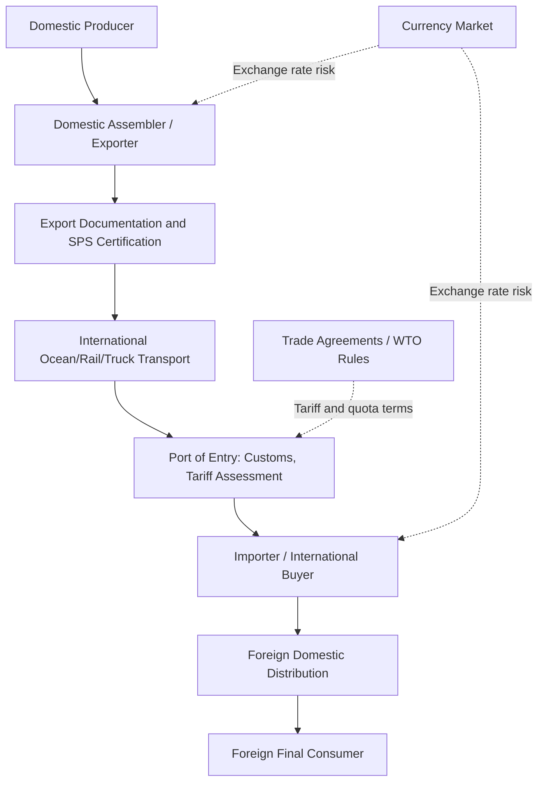

## International Commodity Marketing

### Overview

International commodity marketing extends the domestic marketing functions and channel structures already covered to the additional complexity of cross-border transactions: currency risk, tariff and non-tariff trade barriers, international logistics, differing quality/regulatory standards, and the influence of trade agreements and policy on the flow of agricultural commodities across national boundaries. Because agricultural production is geographically concentrated by climate and comparative advantage while consumption is globally dispersed, international trade plays an outsized role in balancing regional surpluses and deficits for many major commodities (grains, oilseeds, meat, dairy, and specialty crops).

### Core Concepts and Terminology

**Comparative Advantage**

The economic principle that countries benefit from specializing in producing and exporting the goods they can produce at relatively lower opportunity cost, and importing goods other countries can produce relatively more efficiently, forming the basic economic rationale for international agricultural trade.

**Terms of Trade**

The ratio of a country's export prices to its import prices, reflecting the purchasing power of a country's exports in the international market.

**Exchange Rate Risk (Currency Risk)**

The risk that fluctuations in currency exchange rates between the time a contract is signed and the time payment is settled alter the effective price received or paid by one of the parties, since international commodity transactions typically require converting between the buyer's and seller's currencies (or settlement in a common reference currency, most often US dollars for major grain and oilseed trade).

$$\text{Domestic Currency Value} = \text{Foreign Currency Price} \times \text{Exchange Rate}$$

A depreciation of the exporter's domestic currency relative to the buyer's currency (holding the foreign-currency price fixed) increases the domestic-currency revenue received by the exporter, all else equal — a mechanism that links macroeconomic currency movements directly to agricultural export competitiveness.

**Tariff**

A tax imposed by an importing country on goods entering from abroad, raising the effective price faced by consumers/buyers in the importing country and generally reducing import volume relative to a free-trade baseline.

**Tariff-Rate Quota (TRQ)**

A trade policy mechanism combining a quota and a tariff: a specified quantity may be imported at a lower ("in-quota") tariff rate, while quantities above that threshold face a substantially higher ("over-quota") tariff rate, commonly used in agricultural trade agreements to provide limited market access while still protecting domestic producers from unlimited import competition.

**Non-Tariff Barriers (NTBs)**

Trade restrictions other than tariffs, including sanitary and phytosanitary (SPS) measures, technical regulations, labeling requirements, and import licensing procedures — often economically significant in agricultural trade because biological products are subject to legitimate disease/pest risk regulation that can also, in some cases, be used as a de facto trade barrier.

### Institutional and Policy Framework

**World Trade Organization (WTO) Agreement on Agriculture**

The principal multilateral framework governing agricultural trade rules among WTO member countries, organized around three main pillars: market access (tariff reduction commitments and TRQs), domestic support (rules classifying and limiting trade-distorting domestic subsidies), and export competition (disciplines on export subsidies).

**Regional and Bilateral Trade Agreements**

Agreements between two or more countries (e.g., regional free trade agreements) that establish preferential tariff treatment and trade rules between signatory countries, often exceeding the market access commitments made multilaterally through the WTO.

**Sanitary and Phytosanitary (SPS) Measures**

Regulations intended to protect human, animal, or plant health from disease, pest, or contamination risk associated with imported agricultural products, governed under the WTO SPS Agreement, which requires that such measures be based on scientific risk assessment rather than used as disguised trade protection.

**Export Credit and Food Aid Programs**

Government-backed export credit guarantees and concessional food aid programs (e.g., historically, U.S. Public Law 480/Food for Peace-type programs) that have historically been used both to support humanitarian objectives and to facilitate market development for exporting countries' agricultural products, subject to WTO export competition disciplines.

### International Marketing Channel Structure

### Key Marketing and Risk Management Considerations

**Basis and Price Discovery in International Trade**

International commodity trade typically prices off major reference futures exchanges (e.g., US grain futures serving as a global price benchmark for many internationally traded grains and oilseeds), with international basis reflecting freight costs, quality differentials, and local supply/demand conditions in the destination market — extending the basis concept introduced under futures/options hedging to a global scale.

**Currency Hedging**

Exporters and importers exposed to currency risk can hedge using currency forward contracts, currency futures, or currency options, structurally analogous to the commodity futures/options hedging instruments already covered, but applied to the exchange rate rather than the commodity price itself.

**Letters of Credit and International Payment Security**

Because international counterparties often have limited direct legal recourse across jurisdictions, letters of credit (a bank's conditional guarantee of payment upon presentation of specified shipping and quality documents) are widely used to reduce counterparty payment risk in international commodity transactions, serving a role analogous to (though distinct from) the clearinghouse guarantee in domestic futures trading.

**Quality Certification and Phytosanitary Compliance**

International shipments generally require certified inspection documentation (phytosanitary certificates, quality/grade certification, sometimes country-of-origin verification) to satisfy the importing country's SPS and customs requirements, adding a facilitating-function layer specific to cross-border trade beyond domestic grading standards.

### Illustration: Exchange Rate Effect on Export Competitiveness

**(svg_diagram) Currency Depreciation and Export Price Competitiveness**

<svg xmlns="http://www.w3.org/2000/svg" viewBox="0 0 620 360" font-family="Helvetica, Arial, sans-serif">

<text x="310" y="24" text-anchor="middle" font-size="15" font-weight="bold" fill="`#1a1a1a`">Currency Depreciation Effect on Export Competitiveness (svg_diagram)</text>

<rect x="80" y="80" width="200" height="220" fill="#eafaf1" stroke="#27ae60" stroke-width="2" />
<text x="180" y="110" text-anchor="middle" font-size="12" font-weight="bold">Before Depreciation</text>
<text x="100" y="150" font-size="11">Export price: $200/ton</text>
<text x="100" y="180" font-size="11">Exchange rate: 1.0</text>
<text x="100" y="210" font-size="11">Buyer's local cost: 200</text>
<rect x="340" y="80" width="200" height="220" fill="#fdedec" stroke="#c0392b" stroke-width="2" />
<text x="440" y="110" text-anchor="middle" font-size="12" font-weight="bold">After Depreciation</text>
<text x="360" y="150" font-size="11">Export price: $200/ton</text>
<text x="360" y="180" font-size="11">Exchange rate: 0.85</text>
<text x="360" y="210" font-size="11">Buyer's local cost: 170</text>
<line x1="290" y1="190" x2="330" y2="190" stroke="#333" stroke-width="2" marker-end="url(#arrow)" />
</svg>

A depreciation in the exporting country's currency (relative to the importing buyer's currency) lowers the effective cost faced by foreign buyers even if the exporter's domestic-currency price is unchanged, generally improving export price competitiveness — one of the key macro-linkages between currency markets and agricultural trade flows.

### Risk Factors Specific to International Commodity Marketing

**Key Points**

- **Policy risk:** Trade policy changes — new tariffs, retaliatory measures, export bans, or shifts in trade agreement terms — can alter market access with limited advance notice, representing a risk category largely absent from purely domestic marketing.
- **Currency risk:** Exchange rate volatility directly affects the domestic-currency value of foreign-currency-denominated sales or purchases, requiring separate hedging consideration alongside commodity price risk.
- **Logistics and infrastructure risk:** International shipments depend on port capacity, ocean freight availability, and multimodal transport reliability, introducing delivery timing risk beyond domestic transportation considerations.
- **Sovereign and counterparty risk:** Cross-border legal enforcement is generally more complex and costly than domestic contract enforcement, reinforcing reliance on instruments like letters of credit and export credit insurance to manage payment risk.
- **Regulatory divergence:** Differing food safety, labeling, and technical standards across importing countries can require costly product or documentation adaptation, and disputes over whether specific SPS measures are scientifically justified or effectively protectionist remain a recurring source of trade friction. [Inference] The frequency and resolution of such disputes vary by commodity, country pair, and prevailing trade policy climate, and current specifics should be verified against up-to-date WTO dispute records or relevant national trade authority guidance rather than assumed static over time.

### Related Topics

- WTO Agreement on Agriculture: market access, domestic support, and export competition pillars
- Sanitary and Phytosanitary (SPS) measures and international dispute resolution
- Currency hedging instruments for agricultural exporters and importers
- Letters of credit and international trade finance mechanisms
- Regional and bilateral free trade agreements affecting agricultural market access
- Tariff-rate quota administration and allocation methods
- Global commodity benchmark pricing and international basis behavior
- Export credit guarantee and food aid program structures