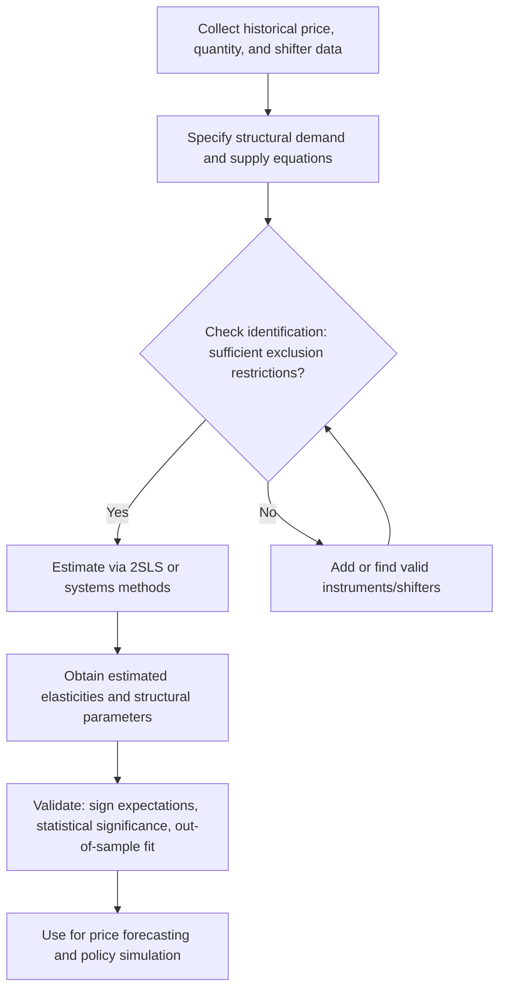

## Supply and Demand Estimation

### Overview

Supply and demand estimation is the empirical foundation of agricultural price analysis and forecasting: the process of statistically quantifying the relationships between quantity supplied, quantity demanded, price, and their underlying determinants (input costs, income, weather, substitute prices, policy variables) using historical data. Because agricultural commodity prices are jointly determined by the simultaneous interaction of supply and demand — rather than one curve being fixed while the other moves freely — estimating these relationships requires specific econometric techniques to avoid a classic identification problem that arises whenever price and quantity are both endogenously determined in market equilibrium.

### Core Concepts and Terminology

**Demand Function**

A mathematical relationship describing the quantity of a commodity that buyers are willing to purchase as a function of its own price and other determinants (income, prices of substitutes/complements, population, preferences).

$$Q_d = f(P, P_s, P_c, Y, \text{Pop}, \text{Preferences})$$

where $Q_d$ is quantity demanded, $P$ is own price, $P_s$/$P_c$ are substitute/complement prices, $Y$ is income, and Pop is population.

**Supply Function**

A mathematical relationship describing the quantity producers are willing to supply as a function of own price and other determinants (input costs, technology, weather, policy, expected future prices).

$$Q_s = g(P, P_i, T, W, \text{Policy}, P^e)$$

where $Q_s$ is quantity supplied, $P_i$ is input price, $T$ is a technology shifter, $W$ is a weather variable, and $P^e$ is expected future price (particularly relevant in agriculture due to the production lag between planting decisions and harvest).

**Elasticity**

The percentage responsiveness of quantity to a percentage change in a determinant, most commonly own-price elasticity of demand/supply:

$$\varepsilon_{Q,P} = \frac{\partial Q}{\partial P} \times \frac{P}{Q}$$

Agricultural commodities at the farm level are widely characterized as having relatively inelastic short-run own-price demand and supply (small percentage quantity response to a given percentage price change), a structural feature that helps explain the high price volatility often observed in response to relatively modest supply or demand shocks.

**Market Equilibrium**

The price-quantity combination at which quantity supplied equals quantity demanded ($Q_s = Q_d$), representing the theoretical point toward which observed market prices are expected to converge absent further shocks.

### The Identification Problem

**Simultaneity Bias**

Because observed market price and quantity data represent the *equilibrium* intersection of supply and demand — not independent observations of either curve in isolation — a simple ordinary least squares (OLS) regression of quantity on price using observed market data will generally produce biased and inconsistent estimates of either the supply or demand curve's true slope, since price is correlated with the error term in each equation (price is endogenous, not exogenously given).

**Instrumental Variables and Exclusion Restrictions**

The classical solution is to identify at least one variable that shifts one curve (e.g., demand) but plausibly does not directly affect the other curve (supply) except through its effect on equilibrium price and quantity — an "exclusion restriction." For example, a demand-side shifter like population growth or income should not directly affect farmers' production decisions except through the price signal it generates, making it a candidate instrument for identifying the supply curve; conversely, weather variables affecting yield are commonly used as supply-side shifters that plausibly do not directly affect consumer demand, making them candidates for identifying the demand curve.

**Simultaneous Equations Model (Structural Form)**

$$Q_d = \alpha_0 + \alpha_1 P + \alpha_2 Y + \alpha_3 P_s + \varepsilon_d$$

$$Q_s = \beta_0 + \beta_1 P + \beta_2 W + \beta_3 P_i + \varepsilon_s$$

$$Q_d = Q_s = Q \quad \text{(market clearing condition)}$$

This system is estimated using methods such as Two-Stage Least Squares (2SLS) or full-information maximum likelihood, rather than single-equation OLS, precisely because of the simultaneity described above.

### Diagram: Structural Estimation Workflow

### Estimation Methods

**Two-Stage Least Squares (2SLS)**

The most common applied approach: in the first stage, price is regressed on all exogenous variables in the system (both supply and demand shifters); the fitted (predicted) price values from this first stage, which are purged of correlation with the structural error terms, are then used in place of actual price in the second-stage demand and supply equations.

**Reduced-Form Estimation**

An alternative or complementary approach in which quantity and price are each expressed purely as functions of the exogenous shifters (without directly estimating structural supply/demand slope parameters), useful for forecasting purposes even when full structural identification of both curves is not the primary objective.

**Time Series and Dynamic Specifications**

Because agricultural supply typically responds to *past* price signals (production decisions made before observing the eventual harvest-time price) rather than the contemporaneous price, dynamic and lagged specifications — such as the Nerlove partial-adjustment supply response model — are commonly used to more realistically capture the biological production lag:

$$Q_t^* = \gamma_0 + \gamma_1 P_{t-1} + \gamma_2 Z_t + \varepsilon_t$$

where $Q_t^*$ is desired/planned production in period $t$, $P_{t-1}$ is the price observed at planting decision time (lagged), and $Z_t$ represents other contemporaneous supply shifters (weather realized during the growing season).

### Illustration: Identification via Shifters

**(svg_diagram) Using Supply and Demand Shifters to Trace Out Each Curve**

<svg xmlns="http://www.w3.org/2000/svg" viewBox="0 0 640 400" font-family="Helvetica, Arial, sans-serif">

<text x="320" y="24" text-anchor="middle" font-size="15" font-weight="bold" fill="`#1a1a1a`">Identifying Supply via Demand-Side Shifters (svg_diagram)</text>

<line x1="80" y1="340" x2="580" y2="340" stroke="#333" stroke-width="2" />
<line x1="80" y1="60" x2="80" y2="340" stroke="#333" stroke-width="2" />
<text x="560" y="365" font-size="11" fill="#333">Quantity</text>
<text x="35" y="60" font-size="11" fill="#333" transform="rotate(-90 35,60)">Price</text>
<path d="M 100 90 L 500 300" fill="none" stroke="#2874a6" stroke-width="3" />
<text x="440" y="290" font-size="10" fill="#2874a6">Supply (stable)</text>
<path d="M 100 320 L 400 100" fill="none" stroke="#999" stroke-width="2" stroke-dasharray="4,4" />
<text x="330" y="130" font-size="10" fill="#666">Demand (income level A)</text>
<path d="M 160 320 L 460 100" fill="none" stroke="#c0392b" stroke-width="2" stroke-dasharray="4,4" />
<text x="400" y="90" font-size="10" fill="#c0392b">Demand (income level B)</text>
<circle cx="255" cy="205" r="5" fill="#333" />
<circle cx="315" cy="180" r="5" fill="#333" />
<text x="200" y="230" font-size="10" fill="#333">Equilibria trace out the stable supply curve</text>
</svg>

As an observable demand shifter (e.g., income) moves the demand curve while the supply curve remains structurally stable, the resulting sequence of observed equilibrium points traces out points along the supply curve itself — the core logic underlying instrumental variable identification of supply (and, symmetrically, of demand using supply-side shifters).

### Practical Data and Specification Considerations

**Key Points**

- **Functional form choice:** Common specifications include linear, log-linear (constant elasticity), and semi-log forms; log-linear specifications are frequently favored in agricultural demand/supply estimation because their estimated coefficients can be directly interpreted as constant elasticities.
- **Aggregation level:** Estimation can be conducted at farm level, regional level, national level, or international level, with data availability, aggregation bias risk, and the specific policy or forecasting question all influencing the appropriate level of analysis.
- **Structural breaks:** Long historical time series used for estimation may span periods with significant structural changes (major policy reforms, technology shifts, trade regime changes), which can bias parameter estimates if not explicitly modeled (e.g., via structural break tests or regime-switching specifications).
- **Weak instruments:** [Inference] The validity of any instrumental variable approach depends on both the exclusion restriction holding economically and the instrument being sufficiently correlated with the endogenous variable (avoiding "weak instrument" bias); the practical strength of commonly used agricultural shifters (weather, income) as instruments varies by commodity, market, and time period, and should be tested empirically (e.g., via first-stage F-statistics) rather than assumed adequate by default.
- **Data quality and measurement error:** Agricultural production and price data often involve reporting lags, revisions, and measurement error (especially for smallholder or informal-market data in some regions), which can attenuate estimated elasticities toward zero if not addressed through appropriate econometric correction.

### Applications in Agricultural Economics

- **Policy impact simulation:** Estimated structural elasticities allow simulation of the likely price and quantity effects of proposed policy changes (tariffs, subsidies, quota changes) before implementation.
- **Price forecasting inputs:** Reduced-form and structural estimates feed directly into the price forecasting models covered under related forecasting topics, providing the underlying behavioral relationships that link fundamental market conditions to expected future prices.
- **Welfare analysis:** Estimated demand and supply elasticities are used to calculate consumer and producer surplus changes resulting from price shocks or policy interventions, a standard tool in agricultural policy evaluation.
- **Market outlook and USDA-style baseline projections:** Long-run supply and demand estimates underpin baseline agricultural outlook projections used by government agencies and private analysts to project future production, consumption, and trade balances under specified policy and macroeconomic assumptions.

### Related Topics

- Two-stage least squares and simultaneous equations estimation methods
- Nerlove partial-adjustment supply response models
- Price elasticity of demand/supply and its policy applications
- Structural break testing in long agricultural time series
- Welfare analysis using estimated demand and supply curves
- USDA baseline projections and agricultural outlook modeling
- Weak instrument diagnostics in applied econometrics
- Reduced-form versus structural forecasting approaches in commodity markets