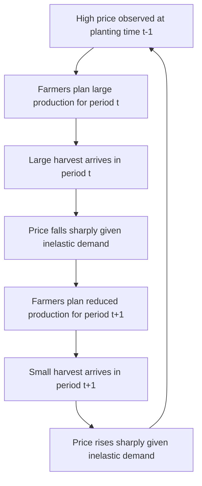

## Price Elasticity and Cross-Elasticity Analysis

### Overview

Price elasticity analysis quantifies how responsive quantity demanded or supplied is to changes in price, while cross-elasticity analysis extends this to measure how quantity of one good responds to price changes in a *different* good. In agricultural economics, elasticity estimates are central to price forecasting, policy impact analysis, and understanding why agricultural commodity markets exhibit the price volatility patterns they do — since the degree of elasticity directly determines how large a price change is required to restore equilibrium following a given supply or demand shock, building directly on the supply and demand estimation methods used to generate these parameters empirically.

### Core Concepts and Terminology

**Own-Price Elasticity of Demand**

The percentage change in quantity demanded resulting from a one-percent change in the good's own price, holding other determinants constant:

$$\varepsilon_{d} = \frac{\%\Delta Q_d}{\%\Delta P} = \frac{\partial Q_d}{\partial P} \times \frac{P}{Q_d}$$

Because demand curves generally slope downward, $\varepsilon_d$ is typically negative; agricultural economists often report its absolute value when discussing elasticity magnitude.

**Own-Price Elasticity of Supply**

$$\varepsilon_s = \frac{\%\Delta Q_s}{\%\Delta P} = \frac{\partial Q_s}{\partial P} \times \frac{P}{Q_s}$$

Typically positive, reflecting the standard upward-sloping supply relationship.

**Elasticity Classification**

| Elasticity Value | Classification | Interpretation |
| --- | --- | --- |
| $\vert \varepsilon \vert > 1$ | Elastic | Quantity responds more than proportionally to price |
| $\vert \varepsilon \vert = 1$ | Unit elastic | Quantity responds exactly proportionally |
| $\vert \varepsilon \vert < 1$ | Inelastic | Quantity responds less than proportionally |
| $\varepsilon = 0$ | Perfectly inelastic | No quantity response to price |
| $\varepsilon \to \infty$ | Perfectly elastic | Infinitesimal price change causes unlimited quantity response |

**Cross-Price Elasticity of Demand**

The percentage change in quantity demanded of good A resulting from a one-percent change in the price of good B:

$$\varepsilon_{A,B} = \frac{\%\Delta Q_A}{\%\Delta P_B} = \frac{\partial Q_A}{\partial P_B} \times \frac{P_B}{Q_A}$$

- $\varepsilon_{A,B} > 0$: goods A and B are **substitutes** (e.g., a rise in beef price increases quantity demanded of pork).
- $\varepsilon_{A,B} < 0$: goods A and B are **complements** (e.g., a rise in the price of hamburger buns could reduce quantity demanded of ground beef, though the magnitude in food categories is often small).
- $\varepsilon_{A,B} \approx 0$: goods are largely unrelated in consumption.

**Income Elasticity of Demand**

$$\varepsilon_Y = \frac{\%\Delta Q_d}{\%\Delta Y} = \frac{\partial Q_d}{\partial Y} \times \frac{Y}{Q_d}$$

Used to classify goods as normal ($\varepsilon_Y > 0$) or inferior ($\varepsilon_Y < 0$), and further as luxury ($\varepsilon_Y > 1$) or necessity ($0 < \varepsilon_Y < 1$) within the normal-good category — many staple agricultural food commodities are empirically found to have relatively low (though still typically positive) income elasticities, consistent with their classification as necessities, a pattern generally associated with Engel's Law.

### Why Agricultural Commodities Are Typically Inelastic

**Demand-Side Reasons**

- Food commodities generally lack close substitutes at the aggregate category level (though substitution between specific proteins or grains can be more significant at a narrower level).
- Food expenditure represents a relatively small and stable share of most consumers' budgets in higher-income countries, reducing sensitivity to price changes for any single commodity.
- Basic caloric/nutritional needs impose a biological floor on how much total food consumption can contract in response to price increases.

**Supply-Side Reasons**

- Biological production lags mean that, within a single growing season or production cycle, farmers cannot rapidly adjust output in response to price changes after planting/breeding decisions are made — short-run supply is often far more inelastic than long-run supply, where land use, herd size, and technology adoption can adjust.
- Fixed land base and specialized capital investments (irrigation systems, livestock housing) limit the speed of resource reallocation between commodities even across multiple seasons.

### The "Cobweb" Price-Quantity Dynamic

Because agricultural production decisions are typically based on the price observed *before* planting/breeding (a lagged price expectation), while consumption responds to the *contemporaneous* harvest-time price, the interaction of an inelastic, lagged supply response with more elastic contemporaneous demand can generate cyclical price-quantity dynamics known as the cobweb model.

$$Q_t^s = f(P_{t-1}) \quad \quad Q_t^d = g(P_t) \quad \quad Q_t^s = Q_t^d$$

[Inference] Whether this cobweb pattern is convergent (dampening toward equilibrium), divergent (increasingly unstable), or exactly cyclical depends on the relative magnitude of the supply and demand elasticities involved — specifically, convergence generally requires supply to be more elastic than demand in absolute value — and the actual empirical stability of any given commodity's cobweb dynamics should be assessed using that commodity's specific estimated elasticities rather than assumed universally convergent or divergent.

### Illustration: Elastic vs. Inelastic Demand Response to a Supply Shock

**(svg_diagram) Price Volatility Under Inelastic vs. Elastic Demand**

<svg xmlns="http://www.w3.org/2000/svg" viewBox="0 0 640 400" font-family="Helvetica, Arial, sans-serif">

<text x="320" y="24" text-anchor="middle" font-size="15" font-weight="bold" fill="`#1a1a1a`">Price Response to Supply Shock: Elasticity Comparison (svg_diagram)</text>

<line x1="80" y1="180" x2="280" y2="180" stroke="#333" stroke-width="1" />
<line x1="180" y1="80" x2="180" y2="340" stroke="#333" stroke-width="1" />
<path d="M 90 100 L 270 320" stroke="#c0392b" stroke-width="3" fill="none" />
<path d="M 160 340 L 160 100" stroke="#999" stroke-width="2" stroke-dasharray="3,3" />
<path d="M 200 340 L 200 100" stroke="#2874a6" stroke-width="2" stroke-dasharray="3,3" />
<text x="90" y="365" font-size="10" fill="#333">Inelastic demand: large price swing</text>
<line x1="380" y1="180" x2="580" y2="180" stroke="#333" stroke-width="1" />
<line x1="480" y1="80" x2="480" y2="340" stroke="#333" stroke-width="1" />
<path d="M 390 200 L 570 220" stroke="#27ae60" stroke-width="3" fill="none" />
<path d="M 440 340 L 440 100" stroke="#999" stroke-width="2" stroke-dasharray="3,3" />
<path d="M 520 340 L 520 100" stroke="#2874a6" stroke-width="2" stroke-dasharray="3,3" />
<text x="390" y="365" font-size="10" fill="#333">Elastic demand: small price swing</text>
</svg>

For an identical percentage supply shift, a market with inelastic demand experiences a substantially larger equilibrium price change than a market with elastic demand — the core structural explanation for observed agricultural price volatility magnitudes relative to many manufactured goods markets.

### Estimation Approaches

**Log-Linear (Constant Elasticity) Specification**

The most common applied form, since coefficients can be interpreted directly as elasticities:

$$\ln(Q) = \beta_0 + \beta_1 \ln(P) + \beta_2 \ln(Y) + \beta_3 \ln(P_s) + \varepsilon$$

Here $\beta_1$ is directly interpretable as the own-price elasticity, $\beta_2$ as the income elasticity, and $\beta_3$ as the cross-price elasticity with respect to substitute good price — assuming the constant-elasticity functional form is an adequate approximation over the relevant price range.

**Point vs. Arc Elasticity**

- *Point elasticity* uses the instantaneous derivative at a specific price-quantity point (requires an estimated continuous demand/supply function).
- *Arc elasticity* is calculated using the percentage change between two observed discrete points, useful when working directly with historical data without a fully estimated functional form:

$$\varepsilon_{\text{arc}} = \frac{(Q_2 - Q_1)/[(Q_2+Q_1)/2]}{(P_2 - P_1)/[(P_2+P_1)/2]}$$

*Example:*

If the price of wheat rises from $6.00 to $6.60/bushel (a 10% increase) and quantity demanded falls from 100 to 96 million bushels (a 4% decrease), the arc own-price elasticity of demand is approximately $-0.4 / 0.1 \times (-1) $, i.e., $\varepsilon_d \approx -0.4$, classified as inelastic.

### Applications in Agricultural Economics

**Key Points**

- **Policy incidence analysis:** Relative elasticities of supply and demand determine how the burden (incidence) of a tax or the benefit of a subsidy is shared between producers and consumers — the more inelastic side of the market bears a proportionally larger share of a tax burden or captures a proportionally larger share of a subsidy benefit.
- **Revenue impact projections:** Because total revenue response to a price change depends directly on elasticity ($\%\Delta \text{Revenue} \approx \%\Delta P \times (1 + \varepsilon_d)$ for small changes), understanding whether demand is elastic or inelastic is essential for projecting how a price change (from a supply shock, policy, or marketing strategy) will affect total producer revenue.
- **Cross-commodity substitution modeling:** Cross-elasticity estimates (e.g., between corn and soybean acreage response, or between competing protein sources like beef, pork, and poultry) are used to model how a price or policy shock in one commodity market spills over into related markets.
- **International trade elasticity analysis:** Import demand and export supply elasticities are central inputs to modeling how tariff or exchange rate changes affect international agricultural trade volumes.
- **Estimates are context-specific:** [Inference] Reported elasticity estimates vary meaningfully by country, time period, level of aggregation, and specific econometric specification used; a specific numerical elasticity value from one study should not be assumed to generalize automatically to a different market, time period, or level of aggregation without further verification.

### Related Topics

- Tax and subsidy incidence analysis using relative elasticities
- Cobweb model dynamics and price cycle stability conditions
- Engel's Law and income elasticity patterns in food demand
- Import demand and export supply elasticity estimation in trade models
- Log-linear versus translog demand system specifications
- Short-run versus long-run elasticity differences in agricultural supply response
- Cross-commodity acreage response models (e.g., corn-soybean substitution)
- Welfare analysis using elasticity-derived consumer and producer surplus