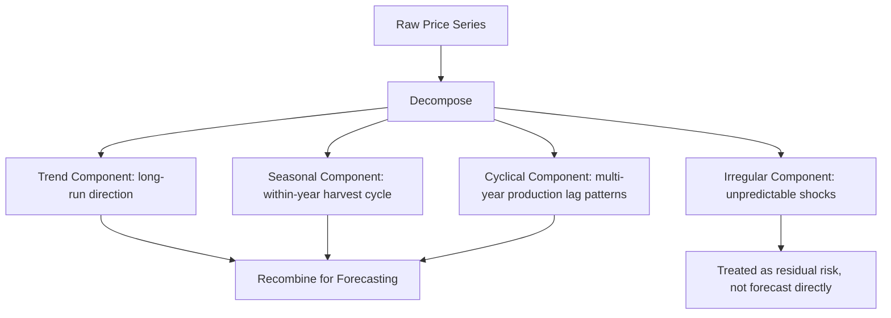

## Commodity Price Behavior and Volatility

### Overview

Commodity price behavior and volatility analysis examines the statistical and structural properties of agricultural commodity price series over time — trends, seasonality, cyclicality, and the magnitude and clustering of price fluctuations — building directly on the inelastic supply and demand structure already established as the fundamental driver of agricultural price volatility. Where prior topics established *why* agricultural prices are volatile (structurally inelastic short-run supply and demand), this topic addresses *how* that volatility manifests statistically and how its components are decomposed and modeled for forecasting and risk management purposes.

### Core Concepts and Terminology

**Price Volatility**

A statistical measure of the dispersion or variability of price changes over time, most commonly quantified using the standard deviation or variance of price returns (percentage changes) over a specified period.

$$\sigma = \sqrt{\frac{1}{n-1}\sum_{t=1}^{n}(r_t - \bar{r})^2}$$

where $r_t$ is the price return in period $t$ (commonly calculated as $r_t = \ln(P_t/P_{t-1})$) and $\bar{r}$ is the mean return.

**Trend**

The long-run, gradual directional movement in a price series over an extended period, generally driven by slow-moving structural factors — long-run productivity growth, secular shifts in demand (e.g., population growth, changing dietary patterns), and long-run input cost trends.

**Seasonality**

A regular, predictable within-year pattern in prices tied to the biological production cycle — for example, grain prices are commonly observed to be lowest around harvest (when supply is most abundant) and to rise through the storage/marketing year as available supply is progressively drawn down, reflecting the storage cost and time-utility concepts introduced under marketing functions.

**Cyclicality**

Longer, often multi-year price patterns distinct from single-season seasonality, frequently associated with production-adjustment lags — the cobweb-type dynamics discussed under elasticity analysis, or longer livestock production cycles (e.g., the multi-year cattle cycle driven by the multi-year biological lag in herd rebuilding).

**Irregular/Random Component**

Unpredictable price movements arising from unanticipated shocks — weather events, geopolitical disruptions, sudden policy changes, or unexpected demand shifts — that cannot be attributed to trend, seasonal, or cyclical patterns.

### Classical Decomposition Framework

Agricultural price series are traditionally decomposed into four components, either additively or multiplicatively:

$$P_t = T_t + S_t + C_t + I_t \quad \text{(additive)}$$

$$P_t = T_t \times S_t \times C_t \times I_t \quad \text{(multiplicative)}$$

where $T_t$ is trend, $S_t$ is seasonal, $C_t$ is cyclical, and $I_t$ is the irregular component. The multiplicative form is often preferred in commodity price analysis because seasonal and cyclical fluctuations frequently scale proportionally with the price level rather than remaining a constant absolute magnitude across different price regimes.

### Sources of Agricultural Price Volatility

**Weather and Biological Production Risk**

Unanticipated weather deviations (drought, excess rainfall, frost, extreme heat during pollination) directly affect realized yield relative to expected yield, and because short-run supply is highly inelastic (established under elasticity analysis), even modest yield surprises can generate disproportionately large price responses.

**Stock-to-Use Ratio and Buffer Stock Levels**

The ratio of carryover stocks to total annual usage is a widely used indicator of a commodity market's vulnerability to price spikes: low stock-to-use ratios mean there is little buffer inventory to absorb an unexpected supply shortfall or demand surge, historically associated with periods of sharply elevated price volatility.

$$\text{Stock-to-Use Ratio} = \frac{\text{Ending Stocks}}{\text{Total Annual Use}}$$

**Policy and Trade Shocks**

Sudden changes in trade policy (export bans, new tariffs), domestic support program changes, or biofuel mandate adjustments can shift effective demand or supply availability abruptly, adding a policy-driven volatility source distinct from underlying weather/production fundamentals.

**Macroeconomic and Financial Market Linkages**

Exchange rate movements, energy price changes (affecting fertilizer and transportation costs, and linking to biofuel feedstock demand), and broader macroeconomic conditions (interest rates affecting storage/carrying costs) can transmit volatility into agricultural commodity markets from outside the immediate agricultural supply-demand balance.

**Speculative and Financial Market Activity**

The participation of financial market participants (index funds, speculative traders) in futures markets is a widely studied and debated potential contributor to short-run commodity price volatility, alongside its more established role in providing market liquidity (as discussed in the futures/options hedging context). [Inference] The empirical evidence on whether and how much speculative activity independently amplifies volatility beyond what fundamentals alone would generate remains a genuinely contested question in the applied agricultural economics and finance literature, with study findings varying by commodity, sample period, and methodology; this should be treated as an active research area rather than a settled empirical conclusion.

### Statistical Modeling of Volatility

**Volatility Clustering**

A well-documented empirical property of many commodity price series in which large price changes (of either sign) tend to be followed by further large changes, and small changes tend to be followed by further small changes — i.e., volatility itself is autocorrelated over time, rather than constant.

**ARCH/GARCH Models**

Autoregressive Conditional Heteroskedasticity (ARCH) and Generalized ARCH (GARCH) models are the standard econometric framework for explicitly modeling volatility clustering, treating the conditional variance of price returns as a function of past squared return shocks and past conditional variances.

$$\sigma_t^2 = \omega + \sum_{i=1}^{p}\alpha_i \varepsilon_{t-i}^2 + \sum_{j=1}^{q}\beta_j \sigma_{t-j}^2$$

where $\sigma_t^2$ is the conditional variance at time $t$, $\varepsilon_{t-i}^2$ are past squared shocks, and $\sigma_{t-j}^2$ are past conditional variances, with $p$ and $q$ denoting the respective lag orders (a GARCH(1,1) specification, using one lag of each, is a commonly used baseline).

**Implied Volatility from Options Prices**

Because options prices (as covered under futures/options hedging) directly embed the market's collective expectation of future price volatility over the option's remaining life, implied volatility backed out from observed options premiums (via an options pricing model) is widely used as a forward-looking volatility measure, complementing the backward-looking historical volatility calculated directly from past price data.

### Illustration: Historical vs. Seasonal vs. Cyclical Price Pattern

**(svg_diagram) Decomposed Grain Price Pattern Over Multiple Years**

<svg xmlns="http://www.w3.org/2000/svg" viewBox="0 0 640 380" font-family="Helvetica, Arial, sans-serif">

<text x="320" y="24" text-anchor="middle" font-size="15" font-weight="bold" fill="`#1a1a1a`">Illustrative Price Pattern: Trend, Season, and Shock (svg_diagram)</text>

<line x1="60" y1="320" x2="600" y2="320" stroke="#333" stroke-width="2" />
<line x1="60" y1="60" x2="60" y2="320" stroke="#333" stroke-width="2" />
<text x="580" y="345" font-size="11" fill="#333">Time</text>
<text x="20" y="60" font-size="11" fill="#333" transform="rotate(-90 20,60)">Price</text>
<path d="M 60 280 L 600 200" fill="none" stroke="#999" stroke-width="2" stroke-dasharray="6,3" />
<text x="480" y="190" font-size="10" fill="#666">Long-run trend</text>
<path d="M 60 260 Q 120 220 180 260 T 300 260 T 420 260 T 540 260 T 600 220" fill="none" stroke="#2874a6" stroke-width="2" />
<text x="150" y="290" font-size="10" fill="#2874a6">Seasonal harvest-cycle pattern</text>
<path d="M 320 260 L 350 120 L 380 240" fill="none" stroke="#c0392b" stroke-width="3" />
<text x="330" y="105" font-size="10" fill="#c0392b">Weather shock (irregular)</text>
</svg>

### Volatility Measurement and Risk Management Applications

**Key Points**

- **Value-at-Risk (VaR) style measures:** Volatility estimates feed directly into risk assessment tools that quantify potential adverse price movement over a defined horizon at a given confidence level, informing hedging decisions covered under futures/options and weather derivatives.
- **Hedge ratio calculation:** As established under futures/options hedging, the minimum-variance hedge ratio calculation directly depends on estimated price volatility (and its correlation with the hedging instrument), linking volatility measurement directly to practical hedging decisions.
- **Crop insurance and derivative pricing:** Historical volatility (via burn analysis, as covered under weather derivatives) and implied volatility both feed into the actuarial and financial pricing of insurance and derivative instruments used to manage agricultural price and weather risk.
- **Stock-to-use monitoring:** Market analysts and policymakers commonly monitor projected stock-to-use ratios (published in outlook reports) as a leading indicator of potential future price volatility risk, given the historical association between low buffer stocks and heightened price spike vulnerability.
- **Volatility regime shifts:** [Inference] The overall level of commodity price volatility is not necessarily stable across long historical periods; structural changes (changes in stockholding policy, evolving trade patterns, shifts in the scale of financial market participation) may alter the underlying volatility regime over time, meaning volatility models estimated on a given historical window should be periodically reassessed for structural stability rather than assumed permanently valid.

### Related Topics

- ARCH/GARCH volatility modeling and estimation
- Stock-to-use ratios and buffer stock policy analysis
- Implied volatility extraction from agricultural options prices
- Cattle cycle and other multi-year agricultural production cycles
- Speculative trading activity and commodity market volatility debates
- Value-at-Risk (VaR) applications in agricultural risk management
- Seasonal price pattern analysis for storage and marketing timing decisions
- Structural break detection in long commodity price time series