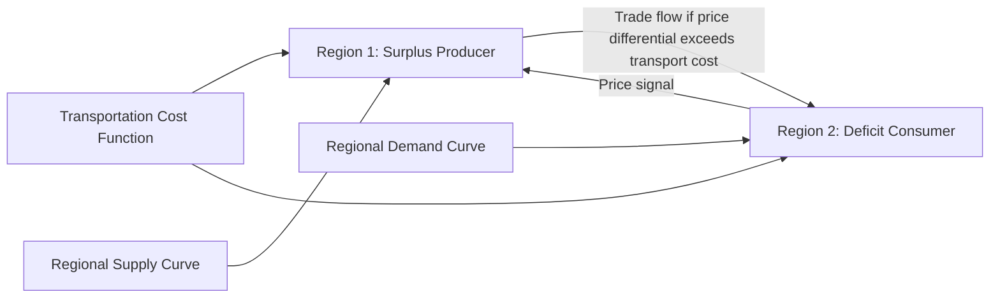

## Spatial Price Relationships and Market Integration

### Overview

Spatial price relationships and market integration analysis examines how prices for the same or closely substitutable commodity behave across geographically separated markets, and the extent to which those markets function as a single, integrated economic system versus a collection of segmented, weakly connected local markets. This extends the Law of One Price concept introduced under price discovery mechanisms into a formal empirical and theoretical framework, addressing a question central to agricultural marketing efficiency: does a price shock in one region transmit properly to other regions (allowing commodities to flow toward where they are most valued), or do transportation costs, trade barriers, infrastructure limitations, or market power prevent that transmission from occurring efficiently?

### Core Concepts and Terminology

**Market Integration**

The degree to which prices in two or more geographically separated markets move together over time, reflecting the extent to which arbitrage (the purchase of a commodity in a low-price market for resale in a high-price market) effectively links those markets into a single economic system.

**Spatial Equilibrium**

A theoretical condition in which the price difference between any two markets equals the cost of transporting the commodity between them — the spatial extension of the Law of One Price:

$$P_j - P_i = T_{ij}$$

where $P_i$ and $P_j$ are prices in markets $i$ and $j$, and $T_{ij}$ is the per-unit transportation/transaction cost between them. When $P_j - P_i > T_{ij}$, an arbitrage opportunity exists (a trader can profit by buying in market $i$ and selling in market $j$), and this arbitrage activity itself should, in a well-functioning market, close the gap back toward equality over time.

**Spatial Price Differential**

The observed difference in price between two markets at a given point in time, which under spatial equilibrium theory should not systematically exceed the relevant transportation/transaction cost for an extended period.

**Cointegration**

A statistical property in which two or more non-stationary time series (such as prices in two separate markets, each of which may wander persistently over time) share a long-run equilibrium relationship, such that a specific linear combination of them is stationary (does not wander persistently) even though the individual series do. Cointegration testing is the primary modern empirical tool for assessing market integration.

### The Enke-Samuelson-Takayama-Judge Spatial Equilibrium Model

The classical theoretical framework for spatial price analysis (developed by Enke, and formalized by Samuelson, and later Takayama and Judge) models multiple regional markets connected by transportation costs, solving simultaneously for the equilibrium price, quantity produced, quantity consumed, and interregional trade flows that maximize total economic surplus (the sum of consumer and producer surplus net of transportation costs) across the connected system.

Under this framework, the equilibrium condition holds that trade flows between any two regions until the price differential is driven down to exactly equal the transportation cost, at which point further arbitrage is no longer profitable, and the interregional system reaches a stable spatial equilibrium.

### Measuring Market Integration Empirically

**Correlation Analysis (Simple, but Limited)**

The simplest historical approach compares the correlation coefficient between price series in two markets; however, high correlation alone can be a misleading indicator of true integration, since two markets can exhibit high correlation due to a shared common trend (e.g., general inflation or a shared global commodity cycle) without genuinely efficient arbitrage linking them at the margin.

**Cointegration and Error Correction Models**

The modern standard approach: testing whether two price series are cointegrated (share a stable long-run relationship), and if so, estimating an error correction model (ECM) that captures both the long-run equilibrium relationship and the short-run dynamic adjustment process by which deviations from that equilibrium are corrected over time.

$$\Delta P_{i,t} = \lambda(P_{i,t-1} - \delta P_{j,t-1}) + \sum \phi_k \Delta P_{i,t-k} + \varepsilon_t$$

where $\lambda$ (the error correction/adjustment coefficient) measures the speed at which market $i$'s price adjusts back toward the long-run equilibrium relationship with market $j$ following a deviation, and $\delta$ captures the long-run equilibrium price ratio/relationship between the two markets.

**Threshold Cointegration and Transaction Cost Bands**

Because transportation and transaction costs create a "neutral band" within which price differentials can persist without triggering profitable arbitrage (the price gap must exceed the transport cost before trade becomes worthwhile), threshold cointegration models allow the speed of price adjustment to differ depending on whether the price differential is inside or outside this transaction-cost band, providing a more economically realistic test than assuming continuous, linear adjustment at all times.

### Illustration: Spatial Equilibrium with Transportation Cost Band

**(svg_diagram) Price Differential and the Transaction Cost Neutral Band**

<svg xmlns="http://www.w3.org/2000/svg" viewBox="0 0 640 380" font-family="Helvetica, Arial, sans-serif">

<text x="320" y="24" text-anchor="middle" font-size="15" font-weight="bold" fill="`#1a1a1a`">Spatial Price Differential and Transaction Cost Band (svg_diagram)</text>

<line x1="80" y1="200" x2="580" y2="200" stroke="#333" stroke-width="2" />
<line x1="80" y1="60" x2="80" y2="340" stroke="#333" stroke-width="2" />
<text x="560" y="225" font-size="11" fill="#333">Time</text>
<text x="30" y="60" font-size="11" fill="#333" transform="rotate(-90 30,60)">Price Differential</text>
<rect x="80" y="150" width="500" height="100" fill="#eafaf1" opacity="0.6" />
<text x="90" y="145" font-size="10" fill="#27ae60">Transaction cost neutral band: no profitable arbitrage</text>
<path d="M 100 190 C 200 130, 300 260, 400 170 C 480 130, 540 220, 570 195" fill="none" stroke="#c0392b" stroke-width="3" />
<text x="430" y="120" font-size="10" fill="#c0392b">Differential exceeds band: arbitrage triggers correction</text>
</svg>

### Determinants of Market Integration Quality

**Key Points**

- **Transportation infrastructure:** The density and quality of road, rail, and port infrastructure directly determines the effective transportation cost between regions, and thus the width of the neutral band within which price differentials can persist without triggering arbitrage.
- **Trade policy and barriers:** Tariffs, quotas, and non-tariff barriers (as covered under international commodity marketing) add to the effective cost of interregional or international arbitrage, widening the neutral band and weakening measured integration between markets separated by a policy barrier relative to markets connected purely by physical transport cost.
- **Market power and intermediary concentration:** A small number of large intermediaries controlling trade flow between two regions (an oligopoly/oligopsony structure, as discussed under market structure and price transmission) can prevent full arbitrage from occurring even when a profitable price differential exists, if those intermediaries have incentive to restrict flow rather than compete it away.
- **Information availability:** Traders' access to timely price information in both origin and destination markets is a prerequisite for arbitrage activity to occur; historically, the expansion of market information systems and, more recently, mobile communication technology has been associated with improved measured market integration in many developing-country agricultural market studies.
- **Storage and perishability constraints:** Highly perishable commodities face effectively higher transportation cost equivalents (due to spoilage risk and specialized cold-chain requirements), which can weaken measured spatial integration relative to more storable, less perishable commodities even when the same physical distance and infrastructure separate the markets.

### Applications in Agricultural Economics

- **Policy evaluation:** Market integration analysis is widely used to evaluate the effectiveness of infrastructure investment, market liberalization reforms, and trade policy changes intended to improve the efficiency of price transmission between regions.
- **Food security and market efficiency assessment:** In developing-country contexts, spatial market integration studies are frequently used to assess whether local or regional food markets function efficiently enough to redistribute supply from surplus to deficit areas during localized production shortfalls, a question with direct food security policy relevance.
- **Basis and hedging decisions:** Understanding spatial price relationships between a local market and the relevant futures/reference market directly informs basis expectations used in the hedging decisions covered under futures/options and marketing channel topics.
- **Merger and antitrust market definition:** Regulatory analysis of proposed mergers among agricultural processors or buyers frequently relies on spatial price integration evidence to define the relevant geographic market for competitive assessment purposes.

### Empirical Caveats

[Inference] Reported measures of market integration (adjustment speeds, cointegration test results, estimated transaction cost bands) are specific to the commodity, market pair, time period, and econometric specification studied; findings from one region or commodity should not be assumed to generalize automatically to a different setting without independent verification using data specific to that context. Additionally, apparent improvements or deteriorations in measured integration over time can reflect genuine changes in underlying market conditions (infrastructure, policy) or can partly reflect changes in data quality/availability, and distinguishing between these explanations typically requires careful examination of the specific historical context being studied.

### Related Topics

- Enke-Samuelson-Takayama-Judge spatial equilibrium modeling
- Cointegration and error correction model estimation
- Threshold cointegration and transaction cost band estimation
- Law of One Price testing methodologies
- Market power and geographic market definition in antitrust analysis
- Infrastructure investment impact on spatial market efficiency
- Food security implications of regional market integration in developing countries
- Basis behavior as a spatial price relationship application