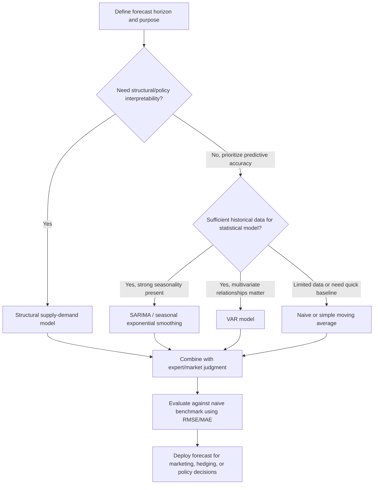

## Price Forecasting Methods

### Overview

Price forecasting methods are the systematic approaches used to project future agricultural commodity prices, drawing together the structural understanding developed in supply and demand estimation, elasticity analysis, price behavior/volatility, and spatial market integration into forward-looking predictive tools. Because agricultural prices are driven by a mix of predictable structural components (trend, seasonality, known supply/demand fundamentals) and inherently unpredictable shocks (weather, policy surprises), no forecasting method eliminates forecast error entirely; the choice of method instead reflects a tradeoff between structural economic interpretability, data requirements, forecast horizon, and the specific decision the forecast is intended to support.

### Core Concepts and Terminology

**Forecast Horizon**

The length of time between when a forecast is made and the future period being predicted, commonly categorized as short-run (days to a few months, relevant for marketing/hedging timing decisions), medium-run (one growing season to a few years, relevant for planting and enterprise decisions), and long-run (multi-year structural outlook, relevant for investment and policy analysis).

**Forecast Error**

The difference between the realized (actual) price and the forecasted price, commonly evaluated using metrics such as:

$$\text{RMSE} = \sqrt{\frac{1}{n}\sum_{t=1}^{n}(P_t - \hat{P}_t)^2} \quad \quad \text{MAE} = \frac{1}{n}\sum_{t=1}^{n}|P_t - \hat{P}_t|$$

where $P_t$ is the actual price, $\hat{P}_t$ is the forecasted price, RMSE is root mean squared error, and MAE is mean absolute error.

**Naive Forecast (Benchmark)**

The simplest possible forecast, typically the most recent observed price ($\hat{P}_{t+1} = P_t$) or a seasonally-naive equivalent; used as a baseline benchmark against which more sophisticated methods are compared, since a forecasting method that cannot outperform a naive benchmark provides limited practical value.

### Time Series (Statistical) Forecasting Methods

**Moving Averages**

A simple smoothing technique that averages the most recent $n$ observations to produce a forecast, reducing the influence of short-run noise but lagging behind genuine trend changes.

$$\hat{P}_{t+1} = \frac{1}{n}\sum_{i=0}^{n-1} P_{t-i}$$

**Exponential Smoothing**

Assigns geometrically declining weights to progressively older observations, giving more weight to recent data than a simple moving average while still smoothing short-run noise:

$$\hat{P}_{t+1} = \alpha P_t + (1-\alpha)\hat{P}_t$$

where $\alpha$ (the smoothing parameter, $0 < \alpha < 1$) controls the weight placed on the most recent observation versus the prior forecast; higher $\alpha$ values make the forecast more responsive to recent price changes at the cost of retaining more short-run noise.

**ARIMA (Autoregressive Integrated Moving Average) Models**

A widely used statistical framework combining autoregressive terms (price depends on its own past values), differencing (to address non-stationarity, i.e., a persistently trending or wandering series), and moving average terms (price depends on past forecast errors), commonly denoted ARIMA($p,d,q$) where $p$, $d$, and $q$ are the respective orders of each component.

**Seasonal ARIMA (SARIMA)**

An extension incorporating explicit seasonal autoregressive and moving average terms, appropriate for agricultural price series exhibiting the strong within-year harvest-cycle seasonality established under price behavior/volatility analysis.

### Structural (Econometric) Forecasting Methods

**Structural Supply-Demand Model Forecasting**

Directly uses the estimated structural supply and demand relationships (from supply and demand estimation) together with projected future values of the exogenous shifters (expected income growth, projected input costs, anticipated weather conditions or their historical distribution) to solve for the projected equilibrium price.

$$\hat{P}_{t+1} = h(\hat{Y}_{t+1}, \hat{P}_{i,t+1}, \hat{W}_{t+1}, \text{Policy}_{t+1})$$

This approach has the advantage of being economically interpretable (the forecast can be decomposed into the effect of each underlying driver) and is well suited for scenario/policy analysis, but requires reliable projections of the exogenous shifters themselves, which introduces an additional layer of forecast uncertainty beyond the structural model's own estimation error.

**Reduced-Form Regression Forecasting**

Rather than fully specifying and estimating separate supply and demand equations, a reduced-form approach directly regresses price on a set of predictive variables (which may include both supply and demand shifters, and lagged price/quantity terms) without imposing the full structural identification requirements discussed under supply and demand estimation, often prioritizing predictive accuracy over structural interpretability.

**Vector Autoregression (VAR) Models**

A multivariate time series approach in which each variable in a system (e.g., price, quantity, stocks, a related market's price) is modeled as a function of its own past values and the past values of all other variables in the system, allowing for rich dynamic interdependencies without requiring the researcher to impose a specific structural causal ordering in advance.

### Diagram: Forecasting Method Selection Framework

### Futures Prices as Forecasts

**Market-Based (Futures Price) Forecasting**

Because futures prices reflect the aggregated expectations of a large number of market participants (as established under price discovery mechanisms), the current futures price for a given future delivery month is widely used directly as a market-based price forecast for that period, on the theoretical basis that a sufficiently liquid, informationally efficient futures market should embed all currently available relevant information into the price.

$$\hat{P}_{t+h} \approx F_{t,t+h}$$

where $F_{t,t+h}$ is the futures price observed at time $t$ for delivery at time $t+h$. [Inference] The empirical accuracy of futures prices as unbiased forecasts of eventual spot prices has been extensively studied and is found to vary by commodity, time horizon, and market conditions; futures prices are generally considered a reasonable and widely used forecasting benchmark, but should not be treated as a guaranteed or bias-free prediction, particularly over longer horizons or during periods of unusual market stress.

### Judgmental and Combination Approaches

**Expert/Analyst Judgment**

Professional market analysts often adjust or override purely statistical/structural model output based on qualitative information not easily incorporated into formal models (emerging weather forecasts, geopolitical developments, informal industry intelligence), a practice common in commercial and government agricultural outlook reporting.

**Forecast Combination**

A well-established finding in the broader forecasting literature is that combining forecasts from multiple distinct methods (e.g., averaging a structural model forecast with a time series forecast and the current futures price) frequently produces a more accurate composite forecast than relying on any single method alone, since different methods tend to capture different, partially non-overlapping aspects of the underlying price-generating process.

### Illustration: Forecast Accuracy Across Methods and Horizons

**(svg_diagram) Illustrative Forecast Error Growth by Horizon and Method**

<svg xmlns="http://www.w3.org/2000/svg" viewBox="0 0 640 380" font-family="Helvetica, Arial, sans-serif">

<text x="320" y="24" text-anchor="middle" font-size="15" font-weight="bold" fill="`#1a1a1a`">Illustrative Forecast Error by Horizon (svg_diagram)</text>

<line x1="80" y1="320" x2="580" y2="320" stroke="#333" stroke-width="2" />
<line x1="80" y1="60" x2="80" y2="320" stroke="#333" stroke-width="2" />
<text x="560" y="345" font-size="11" fill="#333">Forecast Horizon</text>
<text x="35" y="60" font-size="11" fill="#333" transform="rotate(-90 35,60)">Forecast Error (RMSE)</text>
<path d="M 100 300 L 560 100" fill="none" stroke="#999" stroke-width="3" />
<text x="420" y="140" font-size="10" fill="#666">Naive forecast</text>
<path d="M 100 300 C 250 260, 400 180, 560 150" fill="none" stroke="#2874a6" stroke-width="3" />
<text x="380" y="230" font-size="10" fill="#2874a6">Structural/combined forecast</text>
</svg>

Forecast error typically grows with the forecast horizon under most methods, but structural and combined approaches often degrade more gracefully at longer horizons than purely naive extrapolation, since they can incorporate information about known future shifts in fundamentals (e.g., projected planted acreage) that a naive method cannot.

### Practical Considerations and Limitations

**Key Points**

- **Data quality and availability:** All forecasting methods are constrained by the quality, frequency, and length of available historical data; sparse or unreliable data (common in some developing-region or newly established markets) limits the feasibility of more data-intensive statistical methods.
- **Model risk and overfitting:** Complex statistical models risk overfitting historical data (capturing sample-specific noise rather than genuine underlying relationships), which can degrade genuine out-of-sample forecasting performance even when in-sample fit appears strong; out-of-sample validation against a holdout period is standard practice to guard against this.
- **Structural breaks:** As discussed under supply and demand estimation and price behavior/volatility, structural changes (major policy shifts, new technology adoption, shifts in trade patterns) can undermine forecasts based on relationships estimated from a historical period that no longer reflects current structural conditions.
- **Behavior may vary and combine multiple sources:** [Inference] No single forecasting method reliably dominates all others across every commodity, horizon, and market condition; practitioners commonly use a combination of structural, statistical, and market-based (futures-price) approaches, adjusted by expert judgment, and forecast performance should be evaluated on an ongoing basis specific to the commodity and application at hand, rather than assuming a fixed "best" method applies universally.

### Related Topics

- ARIMA and SARIMA model specification and diagnostic testing
- Vector Autoregression (VAR) modeling for multivariate commodity systems
- Forecast combination and ensemble methods
- Futures market efficiency and unbiasedness testing
- USDA and international agricultural outlook and baseline projection methodologies
- Out-of-sample forecast validation and backtesting procedures
- Structural break detection and its implications for forecast reliability
- Judgmental forecasting practices in commercial agricultural market analysis