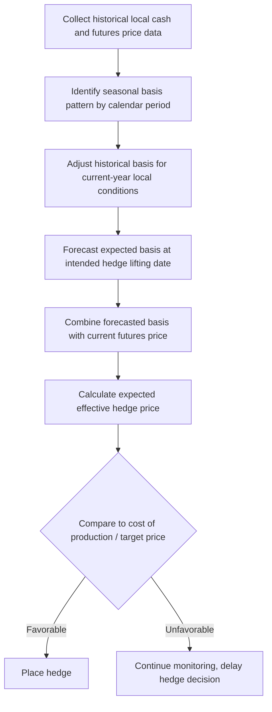

## Basis Analysis and Hedging Strategy

### Overview

Basis analysis is the practical application of basis behavior — introduced under futures/options hedging and spatial price relationships — to the specific decisions a hedger must make: when to place a hedge, which futures contract month to use, whether to hedge via futures or options, and when to lift or roll a hedge. Because a hedge locks in a futures price while the ultimate cash transaction occurs at a local cash price, the realized effectiveness of any hedge depends entirely on how the local basis behaves between the time the hedge is placed and the time it is lifted. Basis analysis converts the general concept of basis risk into an operational forecasting and decision-making discipline.

### Core Concepts and Terminology

**Basis (Restated)**

$$\text{Basis} = \text{Cash Price} - \text{Futures Price}$$

A basis that is negative (cash below futures) is common for many grain markets away from the delivery point and is sometimes described as the cash market trading "under" the futures; a positive basis ("over" futures) can occur in markets with strong local demand or tight local supply relative to the exchange-delivery specification.

**Historical (Normal) Basis**

The basis level typically observed for a specific local market, delivery point, and time of year, established by examining multiple years of historical local cash and futures price data for the same calendar period. This historical average or range serves as the primary forecasting tool for basis analysis, since basis is generally far more stable and predictable year-to-year than outright price levels.

**Basis Strengthening and Weakening**

- *Strengthening basis*: the cash price rises relative to the futures price (basis becomes less negative or more positive) — benefits a short hedger (seller) who locked in a futures price and later sells cash, since a stronger basis at the time of sale increases the effective price received relative to what was expected.
- *Weakening basis*: the cash price falls relative to the futures price — benefits a long hedger (buyer), since a weaker basis at purchase time lowers the effective cost paid relative to what was expected.

**Effective Hedge Price**

$$\text{Effective Price (Short Hedge)} = \text{Futures Price at Hedge Placement} + \text{Expected Basis at Lifting}$$

$$\text{Effective Price (Long Hedge)} = \text{Futures Price at Hedge Placement} + \text{Expected Basis at Lifting}$$

The identical formula applies to both hedge directions; what differs is which direction of basis movement benefits the hedger, as noted above.

### The Basis Forecasting Process

**Step 1: Assemble Historical Basis Data**

Collect several years (commonly 5+ years) of local cash prices at the specific delivery point and the corresponding nearby or relevant futures contract price, for the same calendar weeks/months across years, to establish the normal seasonal basis pattern.

**Step 2: Identify Seasonal Basis Pattern**

Basis typically follows a predictable seasonal pattern tied to the harvest/storage cycle: often weakest (most negative, reflecting maximum local supply pressure) at harvest, and strengthening through the storage year as local supplies are progressively drawn down — directly paralleling the seasonal price pattern discussed under commodity price behavior.

**Step 3: Adjust for Current-Year Conditions**

Historical average basis is adjusted for known current-year factors likely to shift basis away from its historical norm — local crop size relative to historical average, changes in local storage/processing capacity, transportation cost or infrastructure changes, and current local versus regional supply-demand balance.

**Step 4: Apply to Hedge Decision**

The forecasted basis, combined with the current futures price for the relevant contract month, produces an expected effective price, which is compared against the hedger's cost of production or target price to evaluate whether hedging at current levels is attractive.

### Contract Month Selection

**Matching Delivery Timing**

Hedgers generally select the futures contract month closest to, but not before, their expected cash transaction date, since futures prices for different delivery months of the same crop year can carry meaningfully different basis relationships to a given local cash market (reflecting different expected supply/demand conditions at each delivery point in time).

**Rolling Hedges**

When a hedge must cover a period extending beyond the nearest available or most liquid contract month, the hedger closes the near-month position and opens a new position in a more distant contract month (a "roll"), incurring both a transaction cost and exposure to the "roll basis" — the price difference between the two contract months at the time of the roll, which is itself a distinct source of basis-related risk beyond the local cash-to-futures basis.

### Basis Contracts as a Hedging Vehicle

**Mechanics**

Rather than hedging independently via a separate futures position, many producers use a basis contract offered directly by a local grain elevator or buyer: the futures price component is fixed at a date the producer chooses (by instructing the elevator to hedge/price against the futures market on the producer's behalf), while the local basis is fixed separately, at a time of the producer's choosing, according to the contract terms.

$$\text{Locked Cash Price} = \text{Futures Price (set by producer at chosen date)} + \text{Basis (set by producer at chosen date)}$$

This effectively separates the futures-price-discovery decision from the local-basis decision (echoing the formula pricing structure discussed under price discovery mechanisms), allowing a producer to fix each component independently based on their own basis and futures price outlook, though it introduces reliance on the local elevator's basis contract terms and creditworthiness rather than a direct exchange-cleared position.

### Illustration: Basis Behavior Across the Marketing Year

**(svg_diagram) Seasonal Basis Pattern and Hedge Timing**

<svg xmlns="http://www.w3.org/2000/svg" viewBox="0 0 640 380" font-family="Helvetica, Arial, sans-serif">

<text x="320" y="24" text-anchor="middle" font-size="15" font-weight="bold" fill="`#1a1a1a`">Seasonal Basis Pattern Over the Marketing Year (svg_diagram)</text>

<line x1="80" y1="200" x2="580" y2="200" stroke="#333" stroke-width="2" />
<line x1="80" y1="60" x2="80" y2="340" stroke="#333" stroke-width="2" />
<text x="560" y="225" font-size="11" fill="#333">Marketing Year</text>
<text x="30" y="60" font-size="11" fill="#333" transform="rotate(-90 30,60)">Basis (Cash − Futures)</text>

<text x="90" y="215" font-size="10" fill="#666">Harvest</text>

<text x="500" y="215" font-size="10" fill="#666">Pre-harvest (next year)</text>

<path d="M 100 260 C 200 290, 300 230, 400 140 C 460 100, 520 110, 560 130" fill="none" stroke="#c0392b" stroke-width="3" />
<text x="150" y="310" font-size="10" fill="#c0392b">Weakest basis at harvest</text>
<text x="400" y="115" font-size="10" fill="#c0392b">Strengthening through storage year</text>
</svg>

### Illustration: Basis Risk vs. Outright Price Risk Comparison

**(svg_diagram) Volatility Comparison — Basis vs. Outright Price**

<svg xmlns="http://www.w3.org/2000/svg" viewBox="0 0 620 320" font-family="Helvetica, Arial, sans-serif">

<text x="310" y="24" text-anchor="middle" font-size="15" font-weight="bold" fill="`#1a1a1a`">Basis Risk Is Typically Smaller Than Outright Price Risk (svg_diagram)</text>

<line x1="80" y1="270" x2="580" y2="270" stroke="#333" stroke-width="2" />
<line x1="80" y1="60" x2="80" y2="270" stroke="#333" stroke-width="2" />
<path d="M 100 240 C 180 100, 260 260, 340 90 C 420 250, 500 110, 560 230" fill="none" stroke="#999" stroke-width="2" />
<text x="380" y="70" font-size="10" fill="#666">Outright futures/cash price: high volatility</text>
<path d="M 100 200 C 180 190, 260 210, 340 195 C 420 205, 500 190, 560 200" fill="none" stroke="#27ae60" stroke-width="3" />
<text x="380" y="185" font-size="10" fill="#27ae60">Basis: comparatively stable</text>
</svg>

### Practical Application: Worked Basis Hedging Example

*Example:*

A soybean farmer's local elevator has a 5-year average harvest-time basis of $-\$0.35$/bushel relative to November futures. Current November futures price (in June) is $12.00/bushel.

- Expected effective price if hedged now via futures and basis holds to historical average: $\$12.00 - \$0.35 = \$11.65$/bushel.
- If, by harvest, local basis strengthens to $-\$0.20$ (better than historical average, perhaps due to a smaller-than-normal local crop): effective price becomes $\$12.00 - \$0.20 = \$11.80$/bushel — a $0.15/bushel gain versus the initial expectation, purely from favorable basis movement, with the futures price itself unchanged.
- If local basis weakens to $-\$0.55$ (worse than historical average, perhaps due to a larger-than-normal local crop or reduced local elevator capacity): effective price becomes $\$12.00 - \$0.55 = \$11.45$/bushel — a $0.20/bushel shortfall versus initial expectation.

This demonstrates that even a "successful" futures hedge (which fully offset any change in the outright futures price) still leaves the hedger exposed to the realized basis outcome, reinforcing that hedging substitutes basis risk for price risk rather than eliminating risk entirely.

### Key Considerations for Basis-Informed Hedging Strategy

**Key Points**

- **Basis is more predictable than price, but not risk-free:** Historical basis patterns provide a meaningfully more reliable forecasting anchor than outright price levels, but current-year deviations from historical norms (local crop size, infrastructure disruptions, changes in local processing demand) can still produce economically significant basis surprises.
- **Local market-specific analysis is essential:** Basis behavior is highly specific to the individual delivery point, local buyer, and regional supply/demand balance; basis patterns from one elevator or region should not be assumed to transfer directly to another location even for the same commodity.
- **Options do not eliminate basis risk:** As covered under futures/options hedging, options-based strategies (puts/calls) still settle against the underlying futures price, so the same local basis risk applies to an options-based hedge's ultimate cash market outcome as to a pure futures hedge.
- **Basis contracts shift, but do not remove, counterparty considerations:** Using a local elevator's basis contract transfers some administrative complexity away from the producer but introduces reliance on that elevator's specific contract terms and financial standing, distinct from the counterparty protection an exchange-cleared futures position provides.
- **Ongoing monitoring is standard practice:** [Inference] Because basis can be influenced by evolving local conditions throughout the marketing year, many experienced hedgers treat basis forecasting as an ongoing monitoring process rather than a single point-in-time estimate, revising expectations as new local information (harvest progress, local storage utilization, elevator basis quotes) becomes available; the specific frequency and method of this monitoring varies by operation and should be calibrated to the specific commodity and local market rather than applied as a fixed universal schedule.

### Related Topics

- Historical basis tables and local elevator basis reporting
- Basis contracts and deferred-pricing agreement mechanics
- Roll basis and contract month selection in rolling hedge strategies
- Minimum-variance hedge ratio estimation incorporating basis volatility
- Spatial price relationships and market integration as a basis-behavior foundation
- Cross-hedging basis considerations when no direct futures contract exists
- Elevator counterparty risk assessment in basis contract arrangements
- Seasonal storage economics and its link to seasonal basis patterns