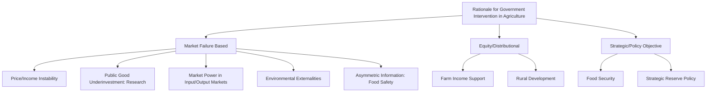

## Rationale for Government Intervention in Agriculture

### Overview

Government intervention in agricultural markets is justified in economic theory primarily through the identification of specific market failures and equity considerations that unregulated markets do not resolve efficiently on their own. Because agriculture exhibits several structural characteristics distinct from many other sectors — production risk from weather and biological lags, thin/imperfect competition at various supply chain stages, externalities from land and input use, and historically volatile farm income — a range of theoretical justifications have been developed for various forms of government involvement, from price and income support to research funding to environmental regulation. This topic surveys the principal economic rationales invoked across the agricultural policy literature, several of which connect directly to market failure concepts already introduced under risk, marketing structure, and price analysis topics.

### Core Concepts and Terminology

**Market Failure**

A situation in which the allocation of goods and services by a free, unregulated market is not economically efficient, often justifying consideration of government intervention as a corrective response — though the mere presence of a market failure does not automatically imply that intervention will improve outcomes, since government intervention carries its own implementation costs and potential failures.

**Public Good**

A good characterized by non-excludability (individuals cannot be effectively prevented from using it) and non-rivalry (one person's use does not diminish its availability to others), leading to systematic underprovision by private markets because individual producers cannot fully capture the value they create.

**Externality**

A cost or benefit of an economic activity that falls on parties not directly involved in the transaction generating it, causing the private market price to diverge from the true social cost or benefit and resulting in over- or under-production relative to the socially optimal level.

**Market Power**

The ability of a firm or group of firms to influence market price above (or below) the competitive level, as introduced under market structure and price transmission, which can justify regulatory intervention on efficiency and distributional grounds.

### Principal Rationales for Intervention

**1. Price and Income Instability**

Agricultural production is subject to substantial, often unpredictable, weather-driven yield variation combined with structurally inelastic short-run supply and demand (established under price elasticity analysis), producing price and farm income volatility considerably greater than in many other sectors. This instability rationale has historically motivated price support programs, buffer stock schemes, income stabilization payments, and government-facilitated risk management tools (subsidized crop insurance, as covered under crop insurance design).

**2. Underinvestment in Agricultural Research and Public Goods**

Basic agricultural research (crop breeding fundamentals, pest/disease science, soil science) often exhibits public-good characteristics — findings can be difficult to fully appropriate commercially, particularly for open-pollinated crop varieties or generally applicable agronomic knowledge — leading to systematic private underinvestment relative to the socially optimal research level, a classical justification for public agricultural research funding (e.g., land-grant university systems, public agricultural extension services).

**3. Market Power in Input Supply and Output Processing**

Concentration among input suppliers (seed, agrochemical companies) and output processors/buyers (meatpacking, grain processing) can create market power that distorts prices paid to or received by numerous, individually small farm producers, motivating antitrust enforcement and specific regulatory frameworks (such as the Packers and Stockyards Act, introduced under vertical coordination and contracting) intended to protect competitive market outcomes.

**4. Environmental Externalities**

Agricultural production can generate negative externalities not reflected in market prices — water quality degradation from nutrient runoff, soil erosion, greenhouse gas emissions, and biodiversity loss from land use conversion — as well as positive externalities in some cases (certain conservation and habitat practices), justifying regulation, taxation, or subsidy of specific practices to align private incentives with broader social costs and benefits.

$$\text{Social Cost} = \text{Private Cost} + \text{External Cost}$$

Without correction, producers facing only private costs will tend to over-produce activities generating negative externalities relative to the socially efficient output level.

**5. Asymmetric Information and Consumer Protection**

Food safety and quality attributes are frequently credence attributes (as established under branding and value-added marketing) that consumers cannot verify even after purchase and consumption, motivating government-mandated food safety inspection, labeling requirements, and certification oversight to address the information asymmetry between producers/processors and consumers.

**6. Structural Adjustment and Rural Development Concerns**

Historical and ongoing structural change in agriculture (farm consolidation, rural population decline, disparities between farm and non-farm household income in some periods and regions) has motivated policies aimed at supporting rural economic development, farm entry/exit transition assistance, and maintaining a broader policy objective of preserving a viable domestic agricultural sector.

**7. Food Security and Strategic Considerations**

Governments have historically cited food security — ensuring adequate, stable domestic food supply, particularly during international supply disruptions or conflict — as a rationale for maintaining domestic production capacity, strategic reserves, and trade policy tools, distinct from the purely market-failure-based rationales above and reflecting broader strategic/national policy objectives.

### Diagram: Taxonomy of Intervention Rationales

### Illustration: Externality Correction Logic

**(svg_diagram) Private vs. Social Cost with a Negative Production Externality**

<svg xmlns="http://www.w3.org/2000/svg" viewBox="0 0 620 380" font-family="Helvetica, Arial, sans-serif">

<text x="310" y="24" text-anchor="middle" font-size="15" font-weight="bold" fill="`#1a1a1a`">Private vs. Social Marginal Cost (svg_diagram)</text>

<line x1="80" y1="320" x2="580" y2="320" stroke="#333" stroke-width="2" />
<line x1="80" y1="60" x2="80" y2="320" stroke="#333" stroke-width="2" />
<text x="560" y="345" font-size="11" fill="#333">Quantity</text>
<text x="35" y="60" font-size="11" fill="#333" transform="rotate(-90 35,60)">Cost / Price</text>
<path d="M 100 300 L 500 100" fill="none" stroke="#2874a6" stroke-width="3" />
<text x="420" y="130" font-size="10" fill="#2874a6">Private Marginal Cost</text>
<path d="M 100 260 L 500 60" fill="none" stroke="#c0392b" stroke-width="3" />
<text x="420" y="80" font-size="10" fill="#c0392b">Social Marginal Cost (includes externality)</text>
<line x1="380" y1="320" x2="380" y2="145" stroke="#999" stroke-dasharray="3,3" />
<text x="330" y="335" font-size="10" fill="#666">Market (unregulated) quantity</text>
<line x1="300" y1="320" x2="300" y2="180" stroke="#27ae60" stroke-dasharray="3,3" />
<text x="220" y="335" font-size="10" fill="#27ae60">Socially optimal quantity</text>
</svg>

Where a negative externality exists, the private marginal cost curve understates the true social marginal cost, leading unregulated markets to overproduce relative to the socially efficient quantity — the standard theoretical basis for corrective taxes, regulation, or tradeable permit systems applied to specific agricultural environmental externalities.

### Critiques and Counter-Considerations

**Key Points**

- **Government failure risk:** The presence of a genuine market failure does not automatically justify intervention; government programs carry their own implementation costs, information limitations, and potential for capture by well-organized interest groups, and can introduce new distortions (e.g., production incentives that encourage overproduction or environmentally unfavorable land use) that were not present in the unregulated market.
- **Public choice considerations:** Agricultural policy in many countries has historically been influenced by the relative political organization and lobbying capacity of producer groups versus the more diffuse interests of consumers and taxpayers, a dynamic studied under public choice theory as a potential explanation for the persistence of some interventions beyond what a pure market-failure analysis alone would justify.
- **Second-best considerations:** Where multiple market distortions coexist (e.g., both a genuine externality and pre-existing market power), correcting one distortion in isolation does not guarantee an improvement in overall welfare, a caution generally referred to as the "theory of the second best" in the broader public economics literature.
- **Evolving justification emphasis:** [Inference] The relative policy emphasis placed on these different rationales (income stability versus environmental externalities versus food security, for instance) has shifted over time and differs across countries, reflecting changing economic conditions, political priorities, and international trade commitments; current policy design in any specific country should be assessed against up-to-date program details rather than assumed to reflect a fixed historical rationale.
- **Distinguishing efficiency from equity rationales:** Some interventions are justified primarily on efficiency grounds (correcting a market failure) while others are justified primarily on equity/distributional grounds (supporting farm household income or rural communities); conflating the two can lead to policy designs that are poorly targeted to either objective.

### Related Topics

- Public choice theory and agricultural interest group politics
- Theory of the second best in public economics
- Agricultural research funding models and land-grant university systems
- Environmental externality correction: taxes, regulation, and tradeable permits
- Food safety regulation and credence-attribute market failures
- Historical evolution of farm income support policy rationale
- Government failure and unintended consequences of agricultural intervention
- International comparison of agricultural policy rationale and design