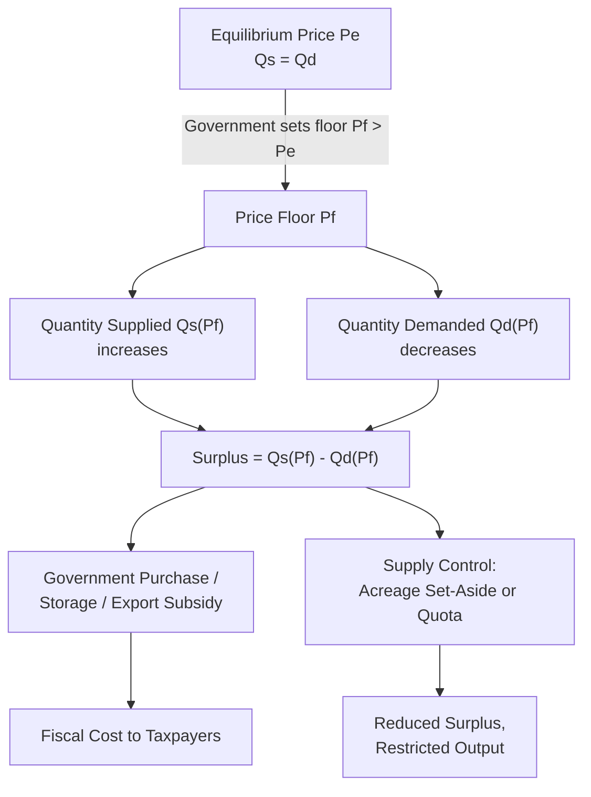
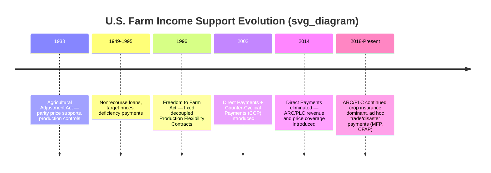

## Price Support and Income Support Programs

### Definition and Conceptual Framework

Price support and income support programs are government interventions designed to stabilize or raise farm returns, but they operate through fundamentally different mechanisms and produce different market distortions.

**Price support programs** intervene directly in the market by setting a minimum price (a "floor") for agricultural commodities. The government commits to purchasing surplus output, restricting supply, or otherwise ensuring that the market price does not fall below a designated support level.

**Income support programs** transfer income to farmers without necessarily altering the market price of the commodity. These payments are typically decoupled (fully or partially) from current production decisions, aiming to support farm household income while minimizing market distortion.

The distinction matters because of a core principle in agricultural policy: interventions that alter relative prices faced by producers change resource allocation decisions (what and how much to produce), while pure income transfers, if properly decoupled, theoretically leave production decisions unchanged.

---

### Price Support Mechanisms

#### Price Floors and Government Purchase

A price floor set above the equilibrium market price ($P_f > P_e$) creates a surplus, since quantity supplied exceeds quantity demanded at that price.

$$Q_s(P_f) - Q_d(P_f) = \text{Surplus}$$

To maintain the floor, the government must absorb this surplus, typically by purchasing it directly (as under historical U.S. dairy and grain support programs) and storing, exporting, or destroying it.

**Key Points**

- Creates deadweight loss from overproduction relative to the free-market equilibrium
- Requires storage costs, disposal costs, or export subsidies to clear the surplus
- Consumers pay higher prices at the retail level while also bearing taxpayer costs of storage/purchase
- Historically prone to chronic overproduction (e.g., EU's pre-reform "butter mountains" and "wine lakes" under the Common Agricultural Policy)

#### Loan Rate / Marketing Loan Programs

A variant used extensively in U.S. policy is the **nonrecourse loan** or **marketing loan** program. Farmers pledge their crop as collateral for a government loan at a per-unit "loan rate" ($L$). If the market price ($P_m$) falls below $L$, the farmer can forfeit the crop to the government instead of repaying the loan, effectively selling at the loan rate.

Under the **marketing loan** modification, rather than forfeiting the crop, the farmer repays the loan at the lower of the loan rate or the prevailing market price (the "loan repayment rate"), keeping the difference as a **marketing loan gain (MLG)** or receiving a **loan deficiency payment (LDP)** without ever taking out the loan.

$$\text{LDP} = (L - P_m) \times Q \quad \text{when } P_m < L$$

This design lets farmers sell into the market (rather than to the government), reducing government stock accumulation while still guaranteeing a floor return per unit.

#### Supply Management as a Complement

Because price floors induce surplus, they are frequently paired with **supply control instruments**:

- **Acreage set-asides / land retirement**: farmers must idle a percentage of base acreage to qualify for support
- **Production quotas**: a legal limit on quantity a producer may market at the supported price (historically used for U.S. tobacco and peanuts, and Canadian dairy/poultry supply management)
- **Marketing orders and quotas**: coordinated volume restrictions administered by producer boards

**Example**

Under a hypothetical quota system for a dairy cooperative, if the support price is set at $28/hundredweight (cwt) against a free-market equilibrium of $22/cwt, national output must be capped near the free-market quantity level to prevent surplus accumulation; each producer receives an individual quota (marketable permit) proportional to their historical output share.

---

### Income Support Mechanisms

#### Deficiency Payments

A **deficiency payment** bridges the gap between a legislated **target price** ($P_t$) and the market price (or loan rate, whichever is higher), paid directly to producers per unit of a fixed historical base (not necessarily current production).

$$\text{Deficiency Payment} = (P_t - \max(P_m, L)) \times \text{Base Quantity}$$

Because payment is based on historical base acreage/yield rather than current planting decisions, this mechanism is considered **partially decoupled** — it supports income without directly incentivizing current-year overproduction, though it can still distort long-run planting expectations if bases are periodically updated.

#### Direct Payments (Fully Decoupled)

**Fixed direct payments**, such as those under the U.S. 1996–2014 farm bills (Production Flexibility Contracts, then Direct Payments), are based entirely on historical base acres and yields, paid regardless of current prices, current production, or even whether the land is currently planted to the covered crop.

**Key Points**

- Theoretically production- and price-neutral (least trade-distorting)
- Classified as "Green Box" or minimally trade-distorting under WTO Agreement on Agriculture in many designs
- Criticized for accruing to landowners over time (capitalized into land values/rental rates) rather than benefiting active farm operators
- Politically vulnerable since payments continue even in high-price years, appearing as unnecessary transfers

#### Counter-Cyclical and Price-Loss Coverage Payments

**Counter-cyclical payments (CCP)** and successor programs like **Price Loss Coverage (PLC)** pay farmers when the *effective price* (higher of market price or loan rate) falls below a reference/target price, similar in logic to deficiency payments but often layered atop direct payments and marketing loans as part of a multi-tier safety net.

$$\text{CCP/PLC Payment} = (\text{Reference Price} - \text{Effective Price}) \times \text{Payment Rate} \times \text{Base Acres}$$

#### Revenue-Based Support

Modern U.S. policy (2014 Farm Bill onward) shifted toward **revenue support** rather than pure price support, recognizing that farm income risk stems from the *joint* variation of price and yield.

**Agriculture Risk Coverage (ARC)** guarantees a percentage (typically 86%) of benchmark revenue (a moving average of historical price × yield), paying the difference when actual revenue falls below the guarantee:

$$\text{ARC Payment} = \max(0, \text{Benchmark Revenue} \times 0.86 - \text{Actual Revenue})$$

This captures scenarios price-only programs miss — e.g., a drought year where price rises but yield collapses so severely that total revenue still falls.

#### Crop Insurance Premium Subsidies

Federally subsidized crop insurance (yield or revenue protection policies) functions as an income-smoothing mechanism where government subsidizes a substantial share (often 38–80%, varying by coverage level) of the premium a farmer pays a private insurer, with the government also reinsuring the insurer's risk. This has become the dominant U.S. farm safety net instrument by expenditure share since the mid-2010s.

---

### Comparative Economic Effects

| Dimension | Price Support | Coupled Income Support (Deficiency/CCP) | Decoupled Income Support (Direct Payments) |
| --- | --- | --- | --- |
| Market price effect | Raises consumer price | No direct price effect | No direct price effect |
| Production incentive | Strong incentive to overproduce | Moderate (tied to historical base, weaker signal) | Minimal/none |
| Government cost | Storage, purchase, disposal | Direct budget outlay | Direct budget outlay |
| Trade distortion (WTO) | High (Amber Box) | Moderate (Amber/Blue Box) | Low (Green Box) |
| Consumer burden | High (higher retail prices) | Low (only taxpayer cost) | Low (only taxpayer cost) |
| Beneficiary incidence | Producers + input suppliers | Producers (historical base holders) | Often landowners via capitalization |

**Key Points**

- Price supports transfer wealth from consumers *and* taxpayers to producers; income supports transfer primarily from taxpayers to producers
- The WTO Agreement on Agriculture classifies support into **Amber Box** (trade-distorting, subject to reduction commitments), **Blue Box** (coupled but with production-limiting conditions), and **Green Box** (minimally distorting, exempt from reduction commitments) — this taxonomy directly reflects the price-support/income-support distinction
- [Inference] The degree of decoupling achieved in practice is often less than in theory, since fixed historical payments can still affect farmers' expectations about future program design, influencing land-use and investment decisions at the margin

---

### Market Diagram: Price Floor and Surplus

Below is a supply-demand illustration of the price floor mechanism.

<svg xmlns="http://www.w3.org/2000/svg" viewBox="0 0 600 420">
<text x="300" y="25" font-family="Arial, sans-serif" font-size="16" font-weight="bold" text-anchor="middle" fill="#1a1a1a">Price Floor and Surplus (svg_diagram)</text>

<line x1="70" y1="360" x2="560" y2="360" stroke="#333" stroke-width="2" />
<line x1="70" y1="360" x2="70" y2="50" stroke="#333" stroke-width="2" />
<text x="315" y="395" font-family="Arial, sans-serif" font-size="13" text-anchor="middle" fill="#333">Quantity</text>
<text x="30" y="200" font-family="Arial, sans-serif" font-size="13" text-anchor="middle" fill="#333" transform="rotate(-90 30 200)">Price</text>

<line x1="120" y1="340" x2="480" y2="80" stroke="#2563eb" stroke-width="2.5" />
<text x="490" y="75" font-family="Arial, sans-serif" font-size="13" fill="#2563eb">S</text>

<line x1="120" y1="80" x2="480" y2="340" stroke="#dc2626" stroke-width="2.5" />
<text x="490" y="340" font-family="Arial, sans-serif" font-size="13" fill="#dc2626">D</text>

<circle cx="300" cy="210" r="4" fill="#1a1a1a" />
<line x1="300" y1="210" x2="300" y2="360" stroke="#999" stroke-width="1" stroke-dasharray="4,3" />
<line x1="70" y1="210" x2="300" y2="210" stroke="#999" stroke-width="1" stroke-dasharray="4,3" />
<text x="55" y="214" font-family="Arial, sans-serif" font-size="12" text-anchor="end" fill="#333">Pe</text>
<text x="300" y="378" font-family="Arial, sans-serif" font-size="12" text-anchor="middle" fill="#333">Qe</text>

<line x1="70" y1="140" x2="560" y2="140" stroke="#16a34a" stroke-width="2" stroke-dasharray="6,4" />
<text x="55" y="144" font-family="Arial, sans-serif" font-size="12" text-anchor="end" fill="#16a34a" font-weight="bold">Pf</text>

<line x1="240" y1="140" x2="240" y2="360" stroke="#dc2626" stroke-width="1" stroke-dasharray="3,2" />
<text x="240" y="378" font-family="Arial, sans-serif" font-size="12" text-anchor="middle" fill="#dc2626">Qd</text>

<line x1="370" y1="140" x2="370" y2="360" stroke="#2563eb" stroke-width="1" stroke-dasharray="3,2" />
<text x="370" y="378" font-family="Arial, sans-serif" font-size="12" text-anchor="middle" fill="#2563eb">Qs</text>

<line x1="240" y1="140" x2="370" y2="140" stroke="#f59e0b" stroke-width="4" />
<text x="305" y="128" font-family="Arial, sans-serif" font-size="12" font-weight="bold" text-anchor="middle" fill="#f59e0b">Surplus</text>

<rect x="380" y="200" width="14" height="14" fill="#f59e0b" opacity="0.8" />
<text x="400" y="211" font-family="Arial, sans-serif" font-size="11" fill="#333">Government-absorbed surplus (Qs − Qd)</text>
</svg>

---

### Fiscal and Trade Policy Considerations

**Key Points**

- Price supports historically generated large government-held stockpiles (e.g., U.S. Commodity Credit Corporation grain reserves in the mid-20th century), prompting shifts toward export subsidies to dispose of surplus, which in turn depressed world prices and drew WTO disputes from competing exporters
- The 1996 U.S. Farm Bill ("Freedom to Farm") and the EU's 1992 MacSharry Reform both marked historical pivots from price support toward direct/decoupled income payments, driven partly by GATT/WTO Uruguay Round commitments to reduce trade-distorting (Amber Box) support
- [Unverified] The precise magnitude of land-value capitalization from decoupled payments varies substantially across empirical studies and regions, and is sensitive to local land market conditions, rental market structure, and program permanence expectations
- Payment limitations (per-person or per-entity caps) and means-testing (adjusted gross income eligibility thresholds) are common design features intended to target support toward small and mid-sized operations, though enforcement complexity (e.g., through payment entities, trusts) has historically limited their effectiveness

---

### Policy Evolution: Illustrative U.S. Timeline

---

### International Variants

**Key Points**

- **European Union**: Common Agricultural Policy (CAP) shifted from price intervention and export refunds toward the **Single Farm Payment / Basic Payment Scheme**, a decoupled per-hectare payment, later layered with "greening" payments tied to environmental practices
- **India**: Relies heavily on **Minimum Support Price (MSP)** combined with government procurement (notably for rice and wheat via the Food Corporation of India), functioning as a classic price floor with direct state purchase
- **Canada**: Uses **supply management** (production quotas plus tariff-rate quotas on imports) for dairy, poultry, and eggs — a price-support model that avoids surplus by tightly capping domestic output rather than relying on government purchase
- [Inference] Countries with binding WTO Aggregate Measurement of Support (AMS) commitments face growing pressure to migrate from Amber Box price support toward Green Box income/decoupled instruments, though pace and depth of reform vary considerably by political economy context

---

### Practical Numerical Example

**Example**

Consider a wheat market with:

- Free-market equilibrium price: $5.00/bushel
- Government-set target price: $6.20/bushel
- Loan rate (price floor): $4.50/bushel
- Current market price: $4.80/bushel
- Farmer's base production: 10,000 bushels

Since market price ($4.80) exceeds the loan rate ($4.50), no loan deficiency payment applies. The deficiency/PLC-style payment is calculated against the *effective price* (here, the market price, since it exceeds the loan rate):

$$\text{Payment} = (6.20 - 4.80) \times 10{,}000 = \$14{,}000$$

If the market price instead fell to $4.20 (below the loan rate), the effective price becomes the loan rate of $4.50, and:

$$\text{Payment} = (6.20 - 4.50) \times 10{,}000 = \$17{,}000$$

This demonstrates how the "higher of market price or loan rate" mechanism sets a floor under the effective price used in the payment calculation, protecting farmers from the compounding of both low market prices and no supplemental payment.

---

### Common Critiques and Reform Debates

**Key Points**

- **Equity**: Payments tied to historical production or base acreage disproportionately benefit larger, established operations, since payment amounts scale with historical volume
- **Environmental**: Price and production-coupled supports have been linked to input-intensive monocropping incentives; reforms increasingly attach cross-compliance environmental conditions to payment eligibility
- **Trade distortion**: Even "decoupled" payments face scrutiny over whether they are truly production-neutral, since they can affect farmers' risk tolerance, access to credit, and willingness to remain in production ([Inference] some empirical work characterizes this as a "wealth effect" distinct from a direct price-incentive effect)
- **Budget exposure**: Revenue-based programs like ARC/PLC and crop insurance subsidies can generate highly variable federal outlays depending on price and weather shocks, complicating budget forecasting relative to fixed-payment schemes

---

**Related Topics**

- Agricultural price stabilization and buffer stock schemes
- WTO Agreement on Agriculture: Amber, Blue, and Green Box classifications
- Federal crop insurance design (yield protection vs. revenue protection policies)
- Common Agricultural Policy (CAP) reform history
- Marketing quotas and supply management systems (Canadian dairy/poultry model)
- Deadweight loss and welfare analysis of agricultural price interventions
- Payment limitation and means-testing policy design
- Land value capitalization effects of farm subsidy programs
- Minimum Support Price (MSP) and public procurement systems (India)
- Decoupling theory in agricultural trade policy