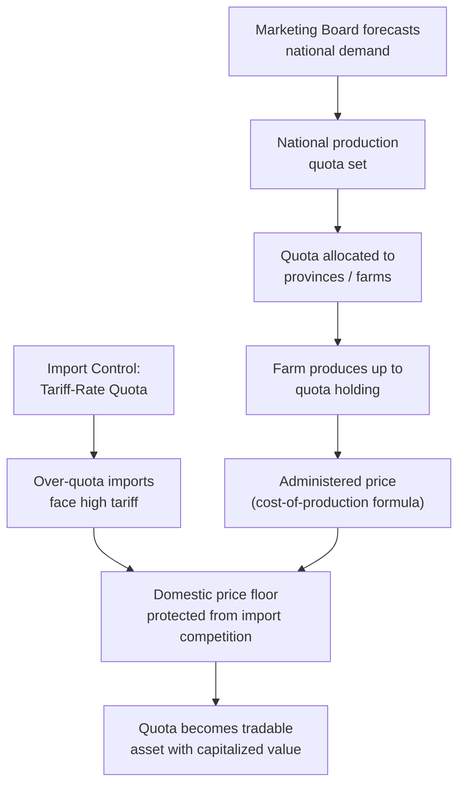
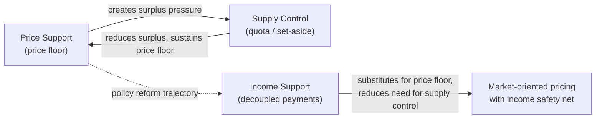

## Supply Control and Production Quotas

### Definition and Conceptual Framework

Supply control programs restrict aggregate output or marketable quantity of an agricultural commodity in order to raise or stabilize producer prices without requiring the government to purchase and store surplus output. Where price support alone (a price floor) generates chronic overproduction, supply control addresses the *quantity side* directly, either by limiting inputs (primarily land), capping marketable output through quotas, or coordinating withdrawal of existing stock from the market.

The underlying economic logic rests on the price elasticity of demand for agricultural commodities. Because demand for most staple agricultural products is relatively inelastic (own-price elasticity often between $-0.2$ and $-0.6$), a proportionally small reduction in quantity supplied produces a proportionally larger increase in market price, potentially raising total producer revenue even as output falls.

$$\%\Delta \text{Revenue} \approx \%\Delta Q \times (1 + \frac{1}{\epsilon_d})$$

where $\epsilon_d$ is the price elasticity of demand. When $|\epsilon_d| < 1$ (inelastic demand), a supply reduction increases total revenue.

---

### Instrument Taxonomy

#### Acreage Set-Asides and Land Retirement

Farmers are required or induced to remove a specified percentage of their base acreage from production of the supported crop, in exchange for eligibility to receive price or income support on their remaining (or historical) base.

**Key Points**

- Distinguishes between **mandatory set-asides** (a condition of program participation, common in pre-1996 U.S. policy) and **voluntary long-term retirement** (e.g., the Conservation Reserve Program, which pays rental rates for 10–15 year land idling, primarily for environmental rather than pure supply-control objectives, though it produces supply-reduction side effects)
- Set-asides are vulnerable to **slippage**: farmers idle their least productive land while intensifying input use (fertilizer, irrigation) on remaining acres, partially offsetting the intended output reduction — actual quantity reduction is typically well below the proportional acreage reduction
- [Inference] Empirical slippage rates vary by crop and region and depend on the flexibility farmers have in choosing which acres to retire; studies of U.S. set-aside programs have generally found slippage substantial enough to significantly blunt the intended supply effect

#### Marketing Quotas

A **marketing quota** legally restricts the *quantity* a producer may sell into regulated market channels, independent of how much they physically produce. This differs from acreage control by targeting output directly rather than an input proxy.

Historic U.S. examples include:

- **Tobacco quotas** (1938–2004): poundage or acreage allotments assigned to specific farms, tradable within limits, ended by the Tobacco Transition Payment Program ("tobacco buyout")
- **Peanut quotas** (until 2002 Farm Bill): quota holders received a higher supported price for quota-authorized peanuts versus a lower "additional" price for over-quota production

**Key Points**

- Quotas are typically allocated based on **historical production** ("grandfathering"), creating an asset with capitalized market value distinct from the land itself
- Because quotas become a tradable, scarce right, their market value reflects the discounted present value of the price premium they secure — a quota pound of tobacco could trade or lease for a price capturing years of future support-price differential
- Ending a quota program (a "buyout") requires compensating quota holders for this capitalized asset value, since the quota right itself, not just current production, has market value

#### Supply Management (Canadian Model)

**Supply management** is a comprehensive system combining three pillars: (1) production quotas allocated to individual producers, (2) administered pricing (a formula-based price reflecting cost of production), and (3) import controls (tariff-rate quotas) to prevent quota erosion from foreign competition.

Canada applies this to dairy, chicken, turkey, and eggs. National production quota is set by a supply-managed marketing board (e.g., the Canadian Dairy Commission) based on forecast domestic demand, then allocated to provinces and individual farms.

**Key Points**

- Without the import-control pillar, domestic supply restriction alone would be undermined by cheaper imports flowing in to meet the demand gap — this is why supply management is described as a three-pillar system, not merely a domestic production cap
- Quota values in Canadian dairy have historically been substantial per cow/hectolitre, representing a significant capital barrier to entry for new producers
- [Unverified] Precise current quota values fluctuate with policy and market conditions and are best confirmed against current provincial marketing board data rather than treated as fixed figures

#### Production Quotas as Tradable Permits

Where quotas are designed to be **transferable** (leasable or saleable, sometimes only within a region or province), the system functions analogously to a cap-and-trade mechanism: total output is capped, but the quota can migrate to the most efficient producers via market transactions, improving allocative efficiency relative to a rigid, non-transferable allocation.

$$\text{Total Supply} = \sum_{i=1}^{n} q_i \leq Q_{\text{national cap}}$$

where $q_i$ is the quota held by producer $i$, tradable subject to $\sum q_i \leq Q_{\text{national cap}}$.

---

### Marketing Orders and Coordinated Volume Control

U.S. **Federal Marketing Orders** (authorized under the Agricultural Marketing Agreement Act of 1937) allow producers of a specific commodity in a defined region to collectively regulate the volume, grade, size, or quality of product marketed, administered through producer-elected boards subject to USDA oversight.

**Key Points**

- Mechanisms include **volume regulation** (limiting the quantity that can be shipped to fresh market in a given period, common for California/Arizona citrus and other specialty crops historically) and **reserve pools** (diverting a share of the crop to secondary/processing markets to support fresh-market price)
- Requires a specified supermajority of affected producers to approve, and periodic producer referenda to continue
- Distinct from quotas in that marketing orders often regulate the *flow and quality* of marketed product rather than assigning fixed individual production rights

---

### Welfare and Efficiency Analysis

Supply control raises producer price and revenue (under inelastic demand) but imposes efficiency costs distinct from those of a simple price floor with government purchase.

**Key Points**

- **Consumer surplus loss**: consumers face a higher price and consume less, identical in direction to the effect of a price floor
- **No government stockpiling cost**: unlike price-floor-with-purchase programs, supply control does not require the government to buy, store, or dispose of surplus, since output is restricted at the source — this is often cited as a fiscal advantage over the historical U.S. nonrecourse loan/CCC storage model
- **Allocative inefficiency within the sector**: if quotas are non-transferable or poorly aligned with underlying productive efficiency, low-cost producers may be constrained below their efficient scale while high-cost producers continue operating, raising average industry production cost above what unrestricted competition would yield
- **Entry barriers**: because quota value is capitalized, new entrants face a substantial capital cost to acquire production rights *in addition to* land, equipment, and other conventional startup capital — this has been cited as a persistent barrier to generational renewal in supply-managed sectors

<svg xmlns="http://www.w3.org/2000/svg" viewBox="0 0 620 420">
<text x="310" y="25" font-family="Arial, sans-serif" font-size="16" font-weight="bold" text-anchor="middle" fill="#1a1a1a">Supply Control: Welfare Effects (svg_diagram)</text>
<line x1="70" y1="360" x2="580" y2="360" stroke="#333" stroke-width="2" />
<line x1="70" y1="360" x2="70" y2="50" stroke="#333" stroke-width="2" />
<text x="325" y="395" font-family="Arial, sans-serif" font-size="13" text-anchor="middle" fill="#333">Quantity</text>
<text x="30" y="200" font-family="Arial, sans-serif" font-size="13" text-anchor="middle" fill="#333" transform="rotate(-90 30 200)">Price</text>
<line x1="120" y1="340" x2="500" y2="80" stroke="#2563eb" stroke-width="2.5" />
<text x="510" y="75" font-family="Arial, sans-serif" font-size="13" fill="#2563eb">S (unrestricted)</text>
<line x1="120" y1="80" x2="500" y2="340" stroke="#dc2626" stroke-width="2.5" />
<text x="510" y="340" font-family="Arial, sans-serif" font-size="13" fill="#dc2626">D</text>

<circle cx="310" cy="210" r="4" fill="#1a1a1a" />
<line x1="310" y1="210" x2="310" y2="360" stroke="#999" stroke-width="1" stroke-dasharray="4,3" />
<line x1="70" y1="210" x2="310" y2="210" stroke="#999" stroke-width="1" stroke-dasharray="4,3" />
<text x="55" y="214" font-family="Arial, sans-serif" font-size="12" text-anchor="end" fill="#333">Pe</text>
<text x="310" y="378" font-family="Arial, sans-serif" font-size="12" text-anchor="middle" fill="#333">Qe</text>

<line x1="230" y1="60" x2="230" y2="360" stroke="#16a34a" stroke-width="2.5" stroke-dasharray="6,4" />
<text x="230" y="378" font-family="Arial, sans-serif" font-size="12" text-anchor="middle" fill="#16a34a" font-weight="bold">Qquota</text>

<circle cx="230" cy="152" r="4" fill="#1a1a1a" />
<line x1="70" y1="152" x2="230" y2="152" stroke="#999" stroke-width="1" stroke-dasharray="4,3" />
<text x="55" y="156" font-family="Arial, sans-serif" font-size="12" text-anchor="end" fill="#333">Pquota</text>

<polygon points="230,152 230,210 310,210" fill="#f59e0b" opacity="0.5" />
<text x="255" y="200" font-family="Arial, sans-serif" font-size="11" font-weight="bold" fill="#92400e">DWL</text>

<text x="90" y="65" font-family="Arial, sans-serif" font-size="11" fill="#333">Quota cap fixes marketed</text>

<text x="90" y="78" font-family="Arial, sans-serif" font-size="11" fill="#333">quantity below Qe, raising</text>

<text x="90" y="91" font-family="Arial, sans-serif" font-size="11" fill="#333">price along the demand curve.</text>

</svg>

---

### Numerical Example: Revenue Effect Under Inelastic Demand

**Example**

A regional dairy market has a free-market equilibrium of 100 million litres at $0.60/litre. Demand elasticity is estimated at $\epsilon_d = -0.4$. A marketing board restricts supply via quota to 90 million litres (a 10% reduction).

Approximate price change from the demand curve:

$$\%\Delta P \approx \frac{\%\Delta Q}{\epsilon_d} = \frac{-10\%}{-0.4} = 25\%$$

New price: $0.60 \times 1.25 = \$0.75$/litre

Revenue comparison:

- Free market: $100\text{M} \times \$0.60 = \$60\text{M}$
- Under quota: $90\text{M} \times \$0.75 = \$67.5\text{M}$

Despite a 10% reduction in quantity sold, total producer revenue rises by 12.5%, illustrating why supply-managed sectors have historically supported quota systems — the revenue gain from a higher price more than offsets the volume reduction when demand is sufficiently inelastic. [Inference] This result is sensitive to the elasticity estimate used; if demand were instead elastic ($|\epsilon_d| > 1$), the same 10% quantity reduction would reduce total revenue.

---

### International Comparison

| Country/Region | Instrument | Commodities | Import Protection |
| --- | --- | --- | --- |
| Canada | Supply management (3-pillar) | Dairy, poultry, eggs | Tariff-rate quotas |
| United States (historical) | Marketing quotas | Tobacco (to 2004), peanuts (to 2002) | Limited/none post-quota-era |
| European Union (historical) | Milk quotas (1984–2015) | Dairy | Common external tariff |
| United States | Federal marketing orders | Citrus, specialty crops (volume/quality regulation) | N/A (domestic volume tool) |

**Key Points**

- The **EU milk quota system** (1984–2015) capped national and individual farm milk production to address chronic surplus ("butter mountains," "milk lakes"); its 2015 abolition, part of broader CAP reform, led to short-term production increases and price volatility in several member states as previously constrained efficient producers expanded output
- [Inference] Comparative literature on quota abolition (EU dairy, U.S. tobacco) suggests transition periods generate significant redistribution — efficient/low-cost producers tend to expand while marginal quota holders exit or convert quota-buyout compensation into other investments, though the pace and magnitude are context-dependent

---

### Interaction with Price Support and Income Support

Supply control is rarely used in isolation; it is typically one leg of a broader policy architecture:

**Key Points**

- Historically, price floors and supply control were paired (U.S. pre-1996, EU pre-1992/2003 reforms) because a price floor alone is fiscally and administratively unsustainable without some output restriction
- The long-run reform trajectory in major agricultural economies has generally moved *away* from price-support-plus-quota systems and *toward* decoupled income support or revenue insurance, partly due to WTO Amber Box discipline, partly due to the administrative and economic costs of quota systems (entry barriers, capitalized asset values, slippage)
- Canada's dairy/poultry supply management remains a notable holdout among major economies, and its treatment (market access concessions) has been a recurring point of negotiation in trade agreements such as USMCA and CPTPP

---

### Design and Administrative Considerations

**Key Points**

- **Quota assignment basis**: historical production base ("grandfathering") versus auction-based allocation — grandfathering rewards incumbents and creates rents, while auctioning could in principle capture rent for the public sector but is rarely used in agricultural quota systems due to political economy resistance from incumbent producers
- **Transferability rules**: fully tradable quotas improve allocative efficiency (letting low-cost producers acquire additional quota) but can also accelerate consolidation and encourage speculative quota holding; non-transferable quotas preserve smallholder structure but lock in inefficiency
- **Quota review/adjustment mechanism**: periodic recalibration against demand forecasts is necessary to avoid chronic over- or under-supply relative to the cap itself; poorly calibrated caps can create either renewed surplus or artificial scarcity
- **Enforcement and monitoring costs**: verifying compliance (production audits, marketing channel tracking) is administratively more complex than a simple price-floor purchase program, requiring ongoing regulatory infrastructure (marketing boards, inspection systems)

---

**Related Topics**

- Price support mechanisms and nonrecourse loan programs
- WTO Agreement on Agriculture: Amber, Blue, and Green Box classifications
- Canadian supply management and its treatment under USMCA/CPTPP
- EU Common Agricultural Policy: milk quota system and 2015 abolition
- Cap-and-trade analogies in agricultural and environmental policy
- Land retirement and conservation set-aside programs (e.g., Conservation Reserve Program)
- Capitalization of policy rents into quota and land asset values
- Marketing order administration under the Agricultural Marketing Agreement Act
- Elasticity of demand and its role in agricultural revenue stabilization policy
- Transition and buyout compensation design for quota program termination