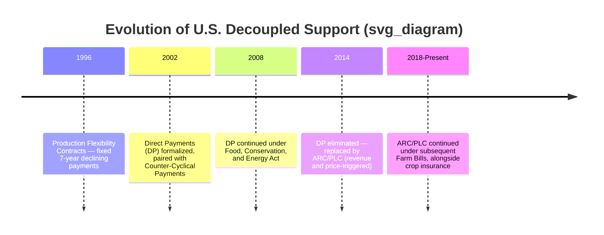
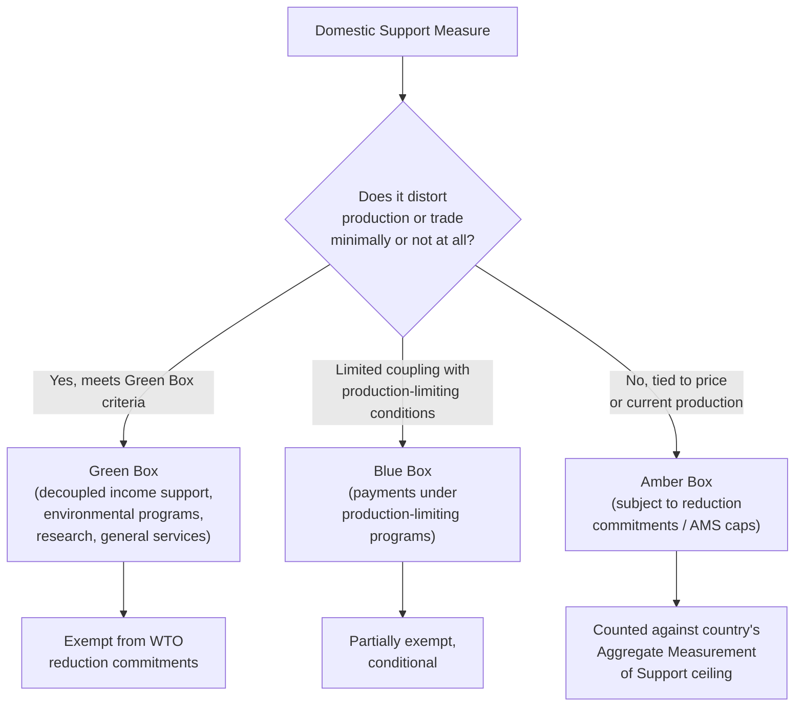

## Direct Payments and Decoupled Support

### Definition and Conceptual Framework

Decoupled support refers to government transfers to farmers that are calculated and disbursed independently of current-year production decisions — what is grown, how much is grown, or even whether the land is farmed at all in a given year. The defining test of decoupling is whether the payment alters the farmer's marginal incentive to produce a particular commodity at the margin.

$$\frac{\partial (\text{Payment})}{\partial (\text{Current Production Decision})} = 0 \quad \text{(theoretical full decoupling)}$$

**Direct payments** are the most prominent institutional expression of this concept: fixed, per-unit transfers calculated from a farm's historical base acreage and program yield, paid on a predetermined schedule regardless of current market prices, current output, or in some designs current planting.

This stands in contrast to **coupled support** (price supports, deficiency payments tied to current production, counter-cyclical payments based on current-year price gaps), where the payment mechanism directly responds to what and how much a farmer produces in the current period, creating a production incentive at the margin.

---

### Theoretical Basis for Decoupling

#### Production Neutrality Argument

The economic rationale for decoupled payments rests on separating two policy objectives that coupled programs conflate: (1) supporting farm household income, and (2) influencing production/market outcomes. A lump-sum or historically-fixed transfer is, in first-order theory, equivalent to a pure income effect with no substitution effect on current production choices — it shifts the farm household's budget constraint outward without changing relative prices faced at the margin.

**Key Points**

- This mirrors the general welfare economics principle that lump-sum transfers are more efficient than price-distorting interventions for achieving a given redistributive goal, since they avoid the deadweight loss associated with altering relative prices
- The WTO Agreement on Agriculture formalizes this distinction through its **Green Box** criteria, which require that support (a) be provided through a publicly funded program not involving transfers from consumers, (b) not have the effect of providing price support to producers, and (c) meet specific decoupling conditions (based on fixed, unchanging base period criteria, with no requirement to produce in order to receive payment)
- [Inference] Whether decoupled payments are *fully* neutral in practice is contested; the theoretical case is strongest when base periods are permanently fixed and payments carry no expectation of being tied to future production updates

#### Second-Order (Non-Neutral) Effects

Even well-designed decoupled payments can influence production and land markets through channels other than the direct current-period production incentive:

**Key Points**

- **Wealth effects**: a guaranteed income stream can reduce a risk-averse farmer's aversion to risk, indirectly encouraging investment in production capacity or willingness to plant higher-risk, higher-return crops — a mechanism distinct from a direct price incentive but still production-relevant
- **Credit market effects**: predictable payment streams can improve farmers' access to credit (serving as implicit collateral or income stability signal to lenders), enabling capital investment that affects future output capacity
- **Base update expectations**: if farmers believe future legislation may recalculate payment bases using more recent production data, they have an incentive to maintain or expand current production to influence a future base period — this is sometimes termed the **"base update effect"** or anticipatory coupling
- **Land value capitalization**: because the payment is tied to base acreage rather than the operator, the economic value of the payment stream tends to be capitalized into land values and cash rental rates over time, benefiting landowners (who may or may not be the active farm operator) rather than necessarily supporting active farm income as intended
- [Inference] The magnitude of capitalization varies by land tenure structure and local rental market competitiveness; regions with a higher share of rented (versus owner-operated) farmland tend to show a larger share of payment benefit flowing to landowners rather than operators, according to the general literature on this topic, though exact pass-through rates are empirically disputed and context-dependent

---

### U.S. Direct Payment Program Architecture (Historical Case Study)

#### Production Flexibility Contracts (1996–2002)

The 1996 Federal Agriculture Improvement and Reform Act ("Freedom to Farm") introduced fixed, declining annual payments under seven-year **Production Flexibility Contracts (PFCs)**, replacing the deficiency payment system. Payments were based on historical base acres and program yields established from a fixed reference period, paid regardless of current market prices or whether the covered crop was planted (farmers retained broad planting flexibility, hence the program's name).

#### Direct Payments (2002–2014)

The 2002 and 2008 Farm Bills continued this design as **Direct Payments (DP)**, calculated as:

$$\text{DP} = \text{Base Acres} \times 0.85 \times \text{Direct Payment Yield} \times \text{Direct Payment Rate}$$

The 85% factor ("payment acres") reflected a partial reduction relative to full base acreage, a budget-cost containment feature layered onto the decoupling design.

**Example**

A farm with 500 base acres of corn, a direct payment yield of 120 bushels/acre, and a direct payment rate of $0.28/bushel would receive:

$$\text{DP} = 500 \times 0.85 \times 120 \times 0.28 = \$14{,}280 \text{ per year}$$

This payment was owed regardless of whether the farm planted corn, soybeans, or left the land fallow that year (subject to conservation compliance and limited exceptions on fruit/vegetable planting restrictions).

#### Elimination in the 2014 Farm Bill

Direct Payments were eliminated by the Agricultural Act of 2014, replaced by revenue- and price-based programs (Agriculture Risk Coverage and Price Loss Coverage) that reintroduced a degree of coupling to current market conditions, though still calculated against historical base acres rather than current planted acres.

**Key Points**

- The elimination reflected political criticism that direct payments continued even during the 2007–2013 period of historically high commodity prices, undermining the "safety net" rationale for farm subsidy and drawing public criticism as an unconditional transfer
- [Inference] The shift from Direct Payments to ARC/PLC represents a partial re-coupling of U.S. farm policy to price/revenue outcomes, though both programs retain the historical-base-acreage design element that preserves a degree of production neutrality relative to current-year planting decisions

---

### European Union: Single Farm Payment / Basic Payment Scheme

The EU's 2003 CAP reform (Fischler Reform) introduced the **Single Farm Payment (SFP)**, later restructured as the **Basic Payment Scheme (BPS)** under the 2013 CAP reform, decoupling the bulk of direct support from production by converting historical coupled payments into a single per-hectare (or historical-entitlement-based) payment.

**Key Points**

- Entitlements were initially calculated using a **historical model** (based on a farm's past receipt of coupled payments during a reference period), a **regional flat-rate model** (a uniform per-hectare rate within a region), or **hybrid models** combining both — member states had discretion in implementation approach
- Post-2013 reform layered a **"greening payment"** (roughly 30% of the national direct payment envelope) conditional on specific environmental practices (crop diversification, maintaining permanent grassland, ecological focus areas), introducing a *conditional* but still largely production-decoupled element
- The 2023 CAP reform period shifted further toward "eco-schemes" and enhanced conditionality, continuing the trend of linking decoupled income support to environmental/climate performance criteria rather than production volume
- [Inference] Because BPS entitlements are tied to eligible hectares rather than a specific crop, the EU model is generally considered more thoroughly decoupled from crop-specific production decisions than the U.S. Direct Payment model was, though land management requirements (maintaining land in "good agricultural and environmental condition") still impose some behavioral conditions

---

### Green Box Classification Under WTO Rules

**Key Points**

- Green Box criteria specifically require that decoupled income support (Annex 2, paragraph 6 of the Agreement on Agriculture) be based on fixed and unchanging criteria in a defined base period, with no production required to receive the payment in years after the base period
- This classification gives countries a strong policy incentive to design support as decoupled, since Green Box measures face no quantitative reduction discipline under WTO commitments, while Amber Box measures are subject to Aggregate Measurement of Support (AMS) ceilings negotiated in the Uruguay Round
- [Unverified] Individual country AMS commitment levels and current utilization rates change with each notification cycle and are best confirmed against current WTO Committee on Agriculture notifications rather than assumed static

---

### Comparative Design Table

| Feature | Coupled Payment (e.g., CCP/PLC) | Decoupled Payment (e.g., Direct Payments, EU BPS) |
| --- | --- | --- |
| Trigger | Current market price or revenue shortfall | Fixed schedule, independent of price/output |
| Calculation basis | Current-year price/revenue gap | Historical base acres/yield (fixed reference period) |
| Planting requirement | Often tied to planted acres or program crop | Typically no requirement to plant a specific crop |
| Budget predictability | Variable (depends on market conditions) | Fixed and predictable |
| WTO classification | Amber or Blue Box | Green Box |
| Primary criticism | Encourages overproduction of supported crop | Capitalizes into land values; weak link to active farming |

---

### Empirical and Policy Debates

**Key Points**

- **Targeting efficiency**: because decoupled payments are based on historical production, farms that have since exited active farming, downsized, or converted land use may continue receiving payments tied to "phantom" historical acres — a frequently cited critique of the U.S. Direct Payment design, contributing to its 2014 elimination
- **Distributional concentration**: like most acreage- or yield-based support formulas, decoupled payments scale with historical farm size, meaning payment distribution is typically skewed toward larger operations with larger historical base acreage — a pattern common across most acreage/yield-indexed programs, not unique to decoupled design
- **Landlord–tenant payment split**: in cash-rent tenancy arrangements, the economic incidence of a decoupled payment nominally paid to the operator may be partially or substantially captured by the landowner through higher negotiated rents over time, a redistribution not always visible in program payment statistics
- **Policy durability**: decoupled payments have proven politically vulnerable precisely because their disconnection from current farm hardship (price/yield shocks) makes them harder to justify as risk-management tools during periods of strong farm income, a dynamic that contributed to their replacement by revenue/price-triggered programs in the U.S. 2014 Farm Bill

---

### Numerical Illustration: Decoupled vs. Coupled Payment Response to a Price Shock

**Example**

Compare how a coupled deficiency-style payment and a decoupled direct payment respond to a market price collapse, using a hypothetical wheat program with base acres of 1,000, program yield of 40 bu/acre, target price $5.50/bu, and direct payment rate $0.52/bu.

*Scenario: Market price falls from $5.00 to $3.50/bu*

Coupled (deficiency-style) payment, before shock:

$$(5.50 - 5.00) \times 40 \times 1{,}000 = \$20{,}000$$

Coupled (deficiency-style) payment, after shock:

$$(5.50 - 3.50) \times 40 \times 1{,}000 = \$80{,}000$$

Decoupled direct payment, before and after shock (unchanged):

$$0.52 \times 40 \times 1{,}000 = \$20{,}800$$

This demonstrates the core structural difference: the coupled payment automatically scales up as a risk-management response to the price shock, while the decoupled payment remains fixed regardless of market conditions — illustrating why decoupled payments alone are considered a weaker income *safety net* during acute price downturns, even though they avoid production-distorting incentives.

---

**Related Topics**

- WTO Agreement on Agriculture: Green Box, Blue Box, and Amber Box classification criteria
- Deficiency payments, counter-cyclical payments, and Price Loss Coverage design
- Land value capitalization and landlord-tenant incidence of farm subsidies
- EU Common Agricultural Policy: Basic Payment Scheme and eco-scheme conditionality
- Agriculture Risk Coverage (ARC) and revenue-based safety net design
- Base acreage update rules and anticipatory coupling effects
- Payment limitation and means-testing in decoupled support programs
- Historical transition from price support to income support policy models
- Risk aversion, wealth effects, and farm household production decisions
- Aggregate Measurement of Support (AMS) and country WTO notification obligations