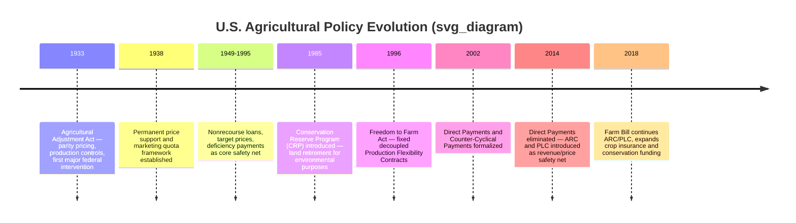
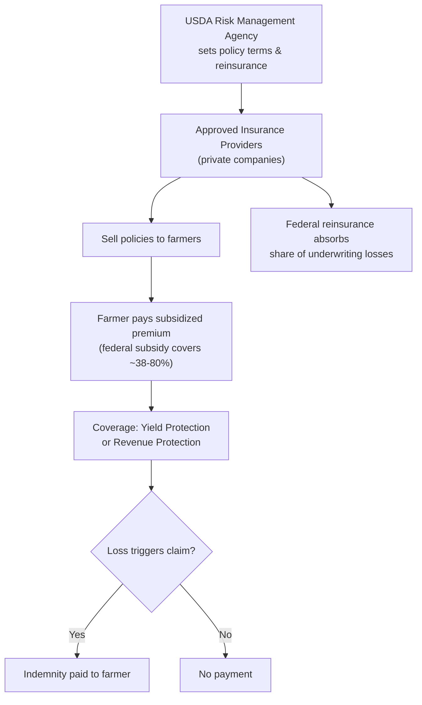

## Agricultural Policy in the United States

### Institutional and Legislative Framework

U.S. agricultural policy operates primarily through the recurring **Farm Bill**, an omnibus piece of legislation reauthorized roughly every five years, which bundles commodity support, crop insurance, conservation, trade, nutrition assistance (SNAP), rural development, credit, and research provisions into a single legislative vehicle. This bundling is itself a deliberate political-economy design: it links urban legislative interests (nutrition programs, which constitute the majority of Farm Bill outlays by dollar volume) with rural/farm interests (commodity and conservation programs), building the broad coalition needed for passage.

**Key Points**

- Administered primarily by the **U.S. Department of Agriculture (USDA)**, with key sub-agencies including the Farm Service Agency (FSA, administers commodity programs and direct farm loans), the Risk Management Agency (RMA, administers the Federal Crop Insurance Program), the Natural Resources Conservation Service (NRCS, administers conservation programs), and the Agricultural Marketing Service (AMS, administers marketing orders and grading standards)
- The Farm Bill's title structure typically includes: Commodities, Conservation, Trade, Nutrition, Credit, Rural Development, Research, Forestry, Energy, Horticulture, Crop Insurance, and Miscellaneous — the exact title count and naming vary slightly by bill cycle
- [Unverified] The most recent Farm Bill's exact status, expiration date, and any extension legislation should be verified against current congressional and USDA sources, since reauthorization timing and short-term extensions are subject to ongoing legislative activity

---

### Historical Evolution

**Key Points**

- The 1933 Agricultural Adjustment Act (AAA) established the foundational model of federal price support tied to supply management (production controls), introduced in response to severe overproduction and price collapse during the Great Depression, though the original AAA's processing-tax funding mechanism was struck down by the Supreme Court in *United States v. Butler* (1936), prompting a 1938 rewrite
- The policy trajectory since the mid-1990s has moved progressively from coupled price/production support toward decoupled income support and, since 2014, toward revenue- and insurance-based risk management — reflecting both domestic budget politics and WTO trade discipline pressures on trade-distorting (Amber Box) support
- [Inference] This overall arc — price support and supply management (1933–1995) → decoupled direct payments (1996–2013) → revenue/insurance-based safety net (2014–present) — represents a broad simplification; specific commodities (dairy, sugar, peanuts) retained distinct coupled or supply-managed features throughout this period, so the trajectory is not uniform across all commodities

---

### Core Policy Instruments (Current Framework)

#### Price Loss Coverage (PLC) and Agriculture Risk Coverage (ARC)

These are the two primary commodity title safety-net programs, offered as an election choice by covered commodity and base acreage (a producer chooses PLC or ARC per commodity, with limited ability to switch between Farm Bill cycles).

**PLC** pays when the effective price (higher of national average market price or loan rate) falls below a statutory reference price:

$$\text{PLC Payment} = (\text{Reference Price} - \text{Effective Price}) \times \text{Payment Yield} \times 0.85 \times \text{Base Acres}$$

**ARC-County (ARC-CO)** pays based on county-level revenue shortfalls relative to a benchmark (moving average of historical price × yield), while **ARC-Individual (ARC-IC)** aggregates revenue across all covered commodities on a farm rather than by commodity/county:

$$\text{ARC-CO Payment} = \max\left(0,\ \min\left(\text{Benchmark Revenue} \times 0.10,\ \text{Benchmark Revenue} \times 0.86 - \text{Actual County Revenue}\right)\right) \times 0.85 \times \text{Base Acres}$$

The 10% cap on benchmark revenue limits maximum per-acre payment exposure to the government in a severe revenue collapse.

#### Federal Crop Insurance Program

Administered by RMA through a **public-private partnership**: the federal government sets policy terms, subsidizes a substantial share of the premium, and reinsures private insurance companies ("Approved Insurance Providers") who sell and service policies and share in underwriting gains/losses.

**Key Points**

- Major policy types include **Yield Protection (YP)** (indemnifies against yield shortfalls relative to historical average) and **Revenue Protection (RP)** (indemnifies against revenue shortfalls from either price decline, yield shortfall, or both, using futures-market price discovery for the guarantee and harvest price)
- Premium subsidy rates vary by coverage level, generally higher (proportionally) at lower coverage levels (e.g., 50% coverage) and lower (proportionally) at higher coverage levels (e.g., 85% coverage), reflecting a design intent to encourage broad participation while moderating the marginal subsidy cost of very high coverage elections
- Since the 2014 Farm Bill, crop insurance has become the largest single commodity-risk-management expenditure category in the Farm Bill by outlay share, exceeding ARC/PLC in most years — reflecting both the shift away from fixed decoupled payments and steady expansion of insured acreage and coverage levels
- The **Whole-Farm Revenue Protection (WFRP)** policy extends revenue insurance to diversified and specialty crop operations not well served by single-commodity policies

#### Marketing Assistance Loans and Loan Deficiency Payments

Retained from earlier policy generations as a **price-floor backstop** beneath ARC/PLC, providing least-cost financing and a minimum effective price via the loan rate mechanism described under price support policy, functioning as the base layer of the multi-tier safety net.

#### Conservation Programs

**Key Points**

- **Conservation Reserve Program (CRP)**: voluntary long-term (10–15 year) land retirement, paying annual rental rates plus cost-share for establishing conservation cover, primarily targeting environmentally sensitive land (highly erodible land, riparian buffers)
- **Environmental Quality Incentives Program (EQIP)**: cost-share and technical assistance for conservation practices on working (actively farmed) land, contrasting with CRP's land-idling approach
- **Conservation Stewardship Program (CSP)**: rewards ongoing, farm-wide conservation performance on working land through annual payments tied to conservation activity levels
- These programs serve a dual function: environmental policy objectives and indirect supply management (CRP's land retirement reduces planted acreage, though this is now a secondary rather than primary programmatic goal)

#### Marketing Loans and Sugar Program

The U.S. **sugar program** remains one of the most explicitly supply-managed and price-supported commodity programs still in operation, combining a price support loan rate, **marketing allotments** (domestic quota limiting how much processors may sell), and **tariff-rate quotas** restricting imports — structurally similar to the Canadian dairy supply management model.

---

### Trade Policy Dimension

**Key Points**

- U.S. agricultural trade policy operates through bilateral/regional trade agreements (e.g., USMCA), multilateral WTO commitments (tariff bindings, Aggregate Measurement of Support ceilings), and export promotion programs (Market Access Program, Foreign Market Development Program) administered by USDA's Foreign Agricultural Service
- **Export credit guarantees** and periodic **ad hoc trade-relief payments** (such as the Market Facilitation Program payments issued during the 2018–2019 U.S.–China trade tensions) illustrate how discretionary executive/administrative action can supplement statutory Farm Bill programs in response to trade disputes
- [Unverified] Current tariff levels, active trade agreement provisions, and any ongoing trade disputes affecting specific commodities change frequently and should be verified against current USTR and USDA Foreign Agricultural Service sources rather than assumed static

---

### Nutrition Assistance as a Farm Bill Component

**Key Points**

- The **Supplemental Nutrition Assistance Program (SNAP)**, though a nutrition/welfare program rather than a farm-support program in economic substance, is included in the Farm Bill and constitutes the large majority of total Farm Bill outlays by dollar volume in most reauthorization cycles
- This inclusion is widely understood in the policy literature as a coalition-building mechanism: nutrition title spending secures urban/suburban congressional support necessary to pass the commodity, conservation, and crop insurance titles that primarily benefit rural constituencies
- [Inference] Because SNAP dominates Farm Bill spending by dollar volume, aggregate "Farm Bill cost" figures cited in public discourse can be misleading if used to characterize the scale of commodity/farm subsidy programs specifically; disaggregating by title is necessary for an accurate picture of farm-support spending alone

---

### Program Eligibility and Payment Limitation Rules

**Key Points**

- **Adjusted Gross Income (AGI) limitations**: producers exceeding a statutory AGI threshold (with separate thresholds historically applied to farm versus non-farm income in some Farm Bill versions) are ineligible for most commodity title payments, intended to target support away from very high-income individuals
- **Payment limitations**: per-person/per-entity caps apply to combined ARC/PLC and marketing loan gain payments, though enforcement complexity arises from "actively engaged in farming" determinations for multi-member farm entities, LLCs, and trusts, which can multiply the effective payment cap across related persons
- [Inference] Academic and GAO-style oversight literature has repeatedly raised concerns that entity structuring allows some large operations to exceed the intended per-person payment limitation in substance, though the degree to which this occurs varies by commodity, region, and farm structure and is difficult to quantify precisely from public program data alone

---

### Comparative Policy Architecture Summary

| Policy Era | Primary Instrument | Coupling to Current Production | WTO Box Classification |
| --- | --- | --- | --- |
| 1933–1995 | Price support (loan rates) + supply management | High | Amber Box |
| 1996–2013 | Fixed decoupled direct payments | None (by design) | Green Box |
| 2002–2013 | Counter-cyclical payments (parallel to DP) | Moderate (historical base, current price trigger) | Amber/Blue Box |
| 2014–present | ARC/PLC (revenue/price-triggered, historical base) | Moderate | Amber Box (generally) |
| 2014–present | Federal crop insurance (subsidized premiums) | Low-moderate (tied to current planting for coverage, but risk-pooling design) | Amber Box (product-specific support subject to de minimis provisions) |

---

### Numerical Illustration: Multi-Tier Safety Net Interaction

**Example**

A corn producer with a marketing loan rate of $2.20/bu, PLC reference price of $3.70/bu, and crop insurance revenue guarantee at 75% coverage on projected revenue of $4.50/bu × 180 bu/acre = $810/acre faces a year where market price falls to $3.00/bu and yield comes in at 160 bu/acre (actual revenue = $480/acre).

Layer 1 — Marketing loan: market price ($3.00) exceeds loan rate ($2.20), so no loan deficiency payment applies.

Layer 2 — PLC: effective price ($3.00, since it exceeds the loan rate) is below the reference price ($3.70):

$$(3.70 - 3.00) \times \text{Payment Yield} \times 0.85 \times \text{Base Acres}$$

Layer 3 — Crop insurance (Revenue Protection at 75% coverage): guarantee is $810 \times 0.75 = \$607.50$/acre; actual revenue ($480/acre) triggers an indemnity of $607.50 - 480 = \$127.50$/acre.

This layered structure illustrates how a single adverse year can trigger payments from multiple programs simultaneously, each calculated on a different basis (price-only for PLC, revenue-inclusive for crop insurance), which is a deliberate design feature intended to address different dimensions of farm income risk rather than redundant overlapping coverage. [Inference] The degree to which combined multi-program payments in a single bad year approach or exceed a farm's actual revenue shortfall is a recurring subject of GAO and CBO analysis, since program interaction effects are complex and payment stacking is not always fully netted against other programs' payouts.

---

**Related Topics**

- Price Loss Coverage and Agriculture Risk Coverage program mechanics
- Federal Crop Insurance Program design and premium subsidy structure
- Direct payments and the historical decoupling of U.S. farm support
- WTO Agreement on Agriculture and U.S. Aggregate Measurement of Support commitments
- Conservation Reserve Program and working-land conservation incentives
- Sugar program supply management and marketing allotments
- Farm Bill legislative process and coalition politics (nutrition-farm linkage)
- Payment limitation, AGI eligibility, and "actively engaged in farming" rules
- USDA Foreign Agricultural Service export promotion and trade policy
- Ad hoc trade-relief payment programs (e.g., Market Facilitation Program)