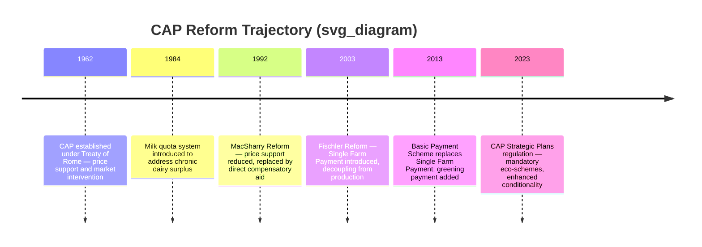
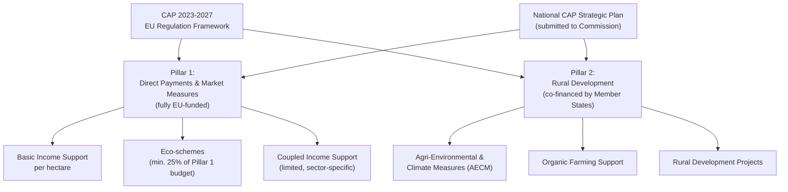

## Common Agricultural Policy of the European Union

### Institutional and Legislative Framework

The Common Agricultural Policy (CAP) is the European Union's oldest and, by budget share, largest common policy, administered jointly by the European Commission (policy design and oversight), the Council of the EU and European Parliament (co-legislation), and individual member states (national implementation and payment administration). Since the 2023–2027 reform period, the CAP operates through a **performance-based delivery model** in which each member state submits a national **CAP Strategic Plan (CSP)** to the Commission for approval, setting out how EU-level objectives will be pursued using national-level flexibility in instrument design.

**Key Points**

- The CAP consists of two "pillars": the first covers direct payments to farmers (often based on farm size, per hectare), market measures, and eco-schemes; the second covers rural development policy, including agri-environmental and climate measures (AECMs) and support for organic farming [Organicseurope](https://www.organicseurope.bio/what-we-do/cap-and-rural-development/)
- The current CAP reform can be summarized around three key ideas: simplification, increased subsidiarity, and increased environmental ambition, with each member state's national strategic plan setting out how it mobilizes the common toolbox to meet EU-level targets [Springer](https://link.springer.com/article/10.1007/s41130-023-00191-9)
- Some academic assessment has concluded that the shift toward national strategic plans has not necessarily delivered simplification in practice, with at least one review concluding the policy's complexity has instead increased [Springer](https://link.springer.com/article/10.1007/s41130-023-00191-9)

---

### Historical Evolution

**Key Points**

- The 1992 reform comprised the replacement of agricultural price support by the allocation of direct aid to compensate for price reductions, marking the CAP's foundational shift away from a purely price-support model [Robert Schuman Foundation](https://www.robert-schuman.eu/en/european-issues/0607-the-common-agricultural-policy-2023-2027-change-and-continuity)
- The CAP has subsequently undergone periodic revisions, most often linked to the multi-annual programming of the European Union budget, reflecting the policy's continued evolution rather than a single static design [Robert Schuman Foundation](https://www.robert-schuman.eu/en/european-issues/0607-the-common-agricultural-policy-2023-2027-change-and-continuity)
- The 1984 milk quota system (addressed in the Supply Control chapter item) and the 2003 Fischler Reform's introduction of the Single Farm Payment represent the two most consequential intermediate reforms bridging the 1992 shift and the current 2023–2027 framework

---

### Current Framework: CAP 2023–2027

The current CAP has been implemented since 1 January 2023 for a period running until 2027. This followed a political agreement reached by the European Council, Parliament, and Commission in June 2021, after more than three years of negotiation. [Springer](https://link.springer.com/article/10.1007/s41130-023-00191-9)[Springer](https://link.springer.com/article/10.1007/s13280-023-01861-0)

#### Two-Pillar Architecture

**Pillar 1 (Direct Payments and Market Measures)**

Pillar 1 covers direct payments to farmers, typically based on farm size (per hectare), plus market measures and eco-schemes. This pillar is fully EU-funded and delivers the bulk of income support to farmers. [Organicseurope](https://www.organicseurope.bio/what-we-do/cap-and-rural-development/)

**Pillar 2 (Rural Development)**

Pillar 2 covers rural development policy, including support for agri-environmental and climate measures (AECMs), including organic farming. Pillar 2 is co-financed by member states alongside EU funds, giving national governments greater discretion over specific measure design within EU-set parameters. [Organicseurope](https://www.organicseurope.bio/what-we-do/cap-and-rural-development/)

#### Eco-Schemes: The Central Green Architecture Innovation

The ecological programmes, referred to by the Commission as "eco-schemes," are the real novelty of the environmental part of the CAP, aiming to support climate- and environment-friendly farming practices such as organic farming, agro-forestry, or precision farming, as well as improved animal welfare. [Robert Schuman Foundation](https://www.robert-schuman.eu/en/european-issues/0607-the-common-agricultural-policy-2023-2027-change-and-continuity)

**Key Points**

- At least 25% of the Pillar 1 direct payments budget must be allocated to eco-schemes, providing stronger incentives for climate- and environmentally friendly farming practices and approaches such as organic farming, agro-ecology, and carbon farming [European Parliament](https://www.europarl.europa.eu/factsheets/en/sheet/294068/the-common-agricultural-policy-strategic-plans-regulation)
- A transitional minimum floor of 20% applied specifically in 2023 and 2024, before the full 25% ring-fencing requirement took effect [Britishagriculturebureau](https://www.britishagriculturebureau.co.uk/updates-and-information/common-agricultural-policy-2023-2027/)
- Each eco-scheme must incorporate at least two practices drawn from designated areas, including climate change mitigation (reduction of agricultural GHG emissions, maintenance of existing carbon stores, enhancement of carbon sequestration) and climate change adaptation (improving resilience of food production systems and biodiversity for disease/climate resistance), alongside water quality protection and soil degradation prevention criteria [Britishagriculturebureau](https://www.britishagriculturebureau.co.uk/updates-and-information/common-agricultural-policy-2023-2027/)
- During negotiation, the European Parliament had pushed for a higher 30% eco-scheme threshold (matching the Commission's original proposal), while the Council favored a lower 20% minimum; the final compromise settled on the 25% figure with a phased introduction [Robert Schuman Foundation](https://www.robert-schuman.eu/en/european-issues/0607-the-common-agricultural-policy-2023-2027-change-and-continuity)
- Eco-schemes represent a novel middle layer between baseline **conditionality** (mandatory minimum standards all recipients must meet to receive any direct payment) and voluntary, more demanding **Pillar 2 agri-environmental and climate measures (AECMs)** — this three-tier "green architecture" is a defining structural feature of the 2023–2027 reform

#### Conditionality and Social Requirements

**Key Points**

- Each member state's Strategic Plan is required to display greater environmental and climate ambition compared to the previous programming period under a "no backsliding" principle, and must be updated in line with any changes to climate and environmental legislation [European Parliament](https://www.europarl.europa.eu/factsheets/en/sheet/294068/the-common-agricultural-policy-strategic-plans-regulation)
- New social conditionality provisions, enhancing farmers' and farm workers' rights, became mandatory as of 2025 — linking receipt of direct payments to compliance with labor standards, a departure from the CAP's historically production/environment-focused conditionality criteria [Organicseurope](https://www.organicseurope.bio/what-we-do/cap-and-rural-development/)
- Conditionality functions as the mandatory floor beneath eco-schemes: failure to meet baseline standards (e.g., maintaining permanent grassland, crop rotation/diversification requirements, buffer strips along watercourses) can result in reduction or withholding of the basic direct payment itself, independent of any eco-scheme participation

#### Capping and Degressivity Debate

**Key Points**

- During negotiations, the European Parliament followed the Commission's proposal in seeking to make the capping of direct payments per farm, and their degressivity (progressive reduction at higher payment levels), compulsory — a measure the Council refused to accept as mandatory [Robert Schuman Foundation](https://www.robert-schuman.eu/en/european-issues/0607-the-common-agricultural-policy-2023-2027-change-and-continuity)
- This reflects a longstanding CAP policy tension: large landholders receive proportionally larger per-hectare-based payments, and repeated reform cycles have debated (without fully resolving) mandatory redistribution mechanisms to favor smaller and medium-sized farms
- [Inference] The final negotiated outcome generally left capping and degressivity as **optional** tools available to member states within their Strategic Plans rather than an EU-wide mandatory requirement, consistent with the broader subsidiarity principle governing the 2023–2027 reform, though exact national-level adoption varies by member state and should be checked against individual Strategic Plans for precise application

---

### Alignment with the European Green Deal

**Key Points**

- Negotiations on the CAP reform were initiated before the launch of the European Green Deal (EGD), but the final policy is understood as needing to align with it [Springer](https://link.springer.com/article/10.1007/s13280-023-01861-0)
- The CAP Strategic Plans serve as the delivery mechanism for alignment with the European Green Deal, including the Farm to Fork strategy and the Biodiversity strategy [Britishagriculturebureau](https://www.britishagriculturebureau.co.uk/updates-and-information/common-agricultural-policy-2023-2027/)
- The European Commission has noted that agricultural greenhouse gas emissions declined by 28.9% between 1990 and 2021 without a reduction in production levels, and the 2023–2027 CAP aims to build on this with strengthened climate mitigation support toward the EU's 2050 net-zero target [Agriculture Institute](https://agriculture.institute/agricultural-policy/evolution-common-agricultural-policy-eu/)
- Academic critique has questioned whether the green architecture is sufficiently ambitious: one assessment argues that, like its predecessors, the new policy will fail to deliver significant climatic and environmental benefits, and proposes that the three green-architecture instruments — conditionality, eco-schemes, and agri-environment/climate measures — could be used more consistently and effectively [Springer](https://link.springer.com/article/10.1007/s13280-023-01861-0)

---

### Comparative Table: CAP Reform Generations

| Reform Period | Core Mechanism | Decoupling Status | Environmental Integration |
| --- | --- | --- | --- |
| 1962–1991 (pre-MacSharry) | Price support, market intervention, export refunds | Fully coupled | Minimal/none |
| 1992 (MacSharry) | Direct compensatory aid replacing price cuts | Partially coupled | Early agri-environmental schemes introduced |
| 2003 (Fischler) | Single Farm Payment | Substantially decoupled | Cross-compliance conditionality introduced |
| 2013 | Basic Payment Scheme + Greening Payment | Decoupled + conditional greening | ~30% of direct payments tied to greening practices |
| 2023–2027 | Basic Income Support + mandatory Eco-schemes | Decoupled + conditional eco-schemes | Min. 25% of Pillar 1 to eco-schemes, enhanced conditionality, social conditionality |

---

### Structural Critiques and Ongoing Debate

**Key Points**

- Some legal analysis of the reform's definition of "agroecology" argues the definition is broad, opening leeway for potentially reduced ambition in implementation despite the framework's stated new environmental objectives [Springer](https://link.springer.com/article/10.1007/s41130-023-00191-9)
- Organic farming advocacy groups argue the CAP needs significant further reform to more effectively contribute to biodiversity protection and reductions in pesticide, antibiotic, and fertilizer use, alongside further growth in organic production and consumption, indicating continued stakeholder pressure for the next reform cycle beyond 2027 [Organicseurope](https://www.organicseurope.bio/what-we-do/cap-and-rural-development/)
- The tension between **subsidiarity** (member-state flexibility in Strategic Plan design) and **EU-wide policy coherence** remains a central design challenge: greater national discretion accommodates diverse farming systems and agro-climatic conditions across 27 member states, but risks uneven ambition and inconsistent environmental outcomes across the bloc
- [Inference] Given that CAP reform cycles have historically been renegotiated on a roughly seven-year Multiannual Financial Framework cycle, the post-2027 CAP reform process would be expected to begin in the mid-2020s; specific proposals and their content should be verified against current European Commission publications rather than assumed from the 2023–2027 framework's design alone

---

### Numerical Illustration: Eco-Scheme Budget Allocation

**Example**

A member state with a national Pillar 1 direct payments envelope of €5 billion annually must ring-fence at least 25% for eco-schemes under the 2023–2027 rules:

$$\text{Minimum Eco-Scheme Allocation} = €5{,}000{,}000{,}000 \times 0.25 = €1{,}250{,}000{,}000$$

If a farm holds 100 hectares and the national Basic Income Support rate is €200/hectare, with an eco-scheme payment of an additional €60/hectare for adopting two qualifying practices (e.g., crop diversification and reduced tillage):

$$\text{Total Direct Payment} = (100 \times €200) + (100 \times €60) = €20{,}000 + €6{,}000 = €26{,}000$$

This illustrates how eco-scheme participation functions as a **voluntary top-up** layered on the Basic Income Support floor, rather than a replacement for it — a farmer who declines eco-scheme practices still receives the base per-hectare payment (subject to meeting baseline conditionality) but forgoes the additional per-hectare eco-scheme premium.

---

**Related Topics**

- Direct payments and decoupled support (Basic Payment Scheme mechanics)
- Supply control and production quotas (EU milk quota system, 1984–2015)
- CAP Strategic Plans and the performance-based delivery model
- Cross-compliance and baseline conditionality requirements
- European Green Deal, Farm to Fork Strategy, and Biodiversity Strategy alignment
- Agri-environmental and climate measures (AECM) under Pillar 2
- Capping and degressivity debates in EU direct payment design
- Comparative analysis: CAP versus U.S. Farm Bill policy architecture
- Organic farming support and conversion incentives under the CAP
- Post-2027 CAP reform negotiation outlook