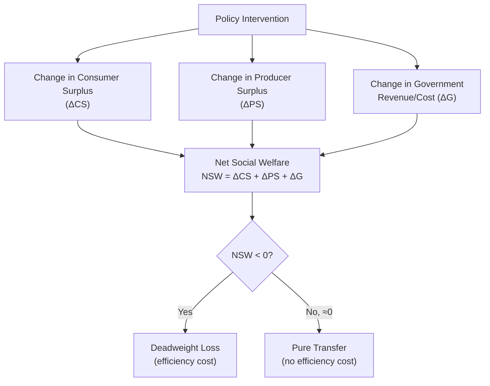

## Policy Analysis Using Welfare Economics

### Conceptual Framework

Welfare economics provides the analytical toolkit for evaluating agricultural policy interventions by quantifying gains and losses to distinct market participants — producers, consumers, and taxpayers — and aggregating these into a measure of net social welfare effect. The core method rests on **consumer surplus** and **producer surplus** as money-metric measures of welfare, evaluated under a partial equilibrium framework (analyzing a single market in isolation, holding other markets constant).

$$\text{Consumer Surplus (CS)} = \int_0^{Q^*} P_d(Q)\, dQ - P^* \times Q^*$$

$$\text{Producer Surplus (PS)} = P^* \times Q^* - \int_0^{Q^*} P_s(Q)\, dQ$$

where $P_d(Q)$ and $P_s(Q)$ are the inverse demand and supply functions, and $P^*, Q^*$ denote the market-clearing price and quantity.

**Key Points**

- Consumer surplus is the area below the demand curve and above the market price; producer surplus is the area above the supply curve and below the market price
- Under a free, undistorted competitive market, the sum of consumer and producer surplus is maximized, and any policy-induced deviation from the competitive equilibrium quantity generally reduces this sum — the reduction is termed **deadweight loss (DWL)**
- Partial equilibrium analysis is standard for single-commodity agricultural policy evaluation but implicitly assumes negligible cross-market feedback effects (e.g., ignoring how a corn policy might affect soybean or livestock feed markets), a simplifying assumption that should be flagged when cross-commodity linkages are economically significant

---

### The Standard Welfare Accounting Framework

Agricultural policy welfare analysis typically decomposes total welfare change into four accounts: **consumer surplus (ΔCS)**, **producer surplus (ΔPS)**, **government revenue or cost (ΔG)**, and, where relevant, **net social welfare change (NSW)**.

$$\text{NSW} = \Delta CS + \Delta PS + \Delta G$$

A negative NSW indicates a net efficiency loss from the policy (some welfare is destroyed, not merely redistributed); a value at or near zero would indicate the policy is a pure transfer with no efficiency cost — a case only achieved in the idealized "lump-sum" decoupled payment scenario.

---

### Welfare Analysis of a Price Floor (Price Support)

Consider a price floor $P_f$ set above the competitive equilibrium price $P_e$, with the government purchasing the resulting surplus $Q_s(P_f) - Q_d(P_f)$.

**Effects:**

- **Consumers**: pay a higher price ($P_f > P_e$) and consume less ($Q_d(P_f) < Q_e$); consumer surplus falls by the area between the two prices up to $Q_d(P_f)$, plus a triangular loss from reduced consumption
- **Producers**: receive the higher price on their full (increased) output $Q_s(P_f)$; producer surplus rises, capturing both a transfer from consumers/taxpayers and a production-expansion gain
- **Government**: bears the full cost of purchasing the surplus at price $P_f$: $\text{Cost} = P_f \times [Q_s(P_f) - Q_d(P_f)]$, plus any disposal/storage costs

$$\Delta CS = -\left[(P_f - P_e) \times Q_d(P_f) + \tfrac{1}{2}(P_f - P_e)(Q_e - Q_d(P_f))\right]$$

$$\Delta PS = (P_f - P_e) \times Q_e + \tfrac{1}{2}(P_f - P_e)(Q_s(P_f) - Q_e)$$

$$\Delta G = -P_f \times [Q_s(P_f) - Q_d(P_f)]$$

The net social welfare change is unambiguously negative, comprising two deadweight-loss triangles: one from the overproduction encouraged by the artificially high price (production beyond the point where marginal cost equals true marginal value), and one from the underconsumption caused by the higher consumer price.

<svg xmlns="http://www.w3.org/2000/svg" viewBox="0 0 640 440">
<text x="320" y="25" font-family="Arial, sans-serif" font-size="16" font-weight="bold" text-anchor="middle" fill="#1a1a1a">Welfare Effects of a Price Floor (svg_diagram)</text>
<line x1="70" y1="380" x2="600" y2="380" stroke="#333" stroke-width="2" />
<line x1="70" y1="380" x2="70" y2="50" stroke="#333" stroke-width="2" />
<text x="335" y="415" font-family="Arial, sans-serif" font-size="13" text-anchor="middle" fill="#333">Quantity</text>
<text x="30" y="215" font-family="Arial, sans-serif" font-size="13" text-anchor="middle" fill="#333" transform="rotate(-90 30 215)">Price</text>
<line x1="120" y1="360" x2="500" y2="90" stroke="#2563eb" stroke-width="2.5" />
<text x="510" y="85" font-family="Arial, sans-serif" font-size="13" fill="#2563eb">S</text>
<line x1="120" y1="90" x2="500" y2="360" stroke="#dc2626" stroke-width="2.5" />
<text x="510" y="360" font-family="Arial, sans-serif" font-size="13" fill="#dc2626">D</text>

<circle cx="310" cy="225" r="4" fill="#1a1a1a" />
<line x1="310" y1="225" x2="310" y2="380" stroke="#999" stroke-width="1" stroke-dasharray="4,3" />
<line x1="70" y1="225" x2="310" y2="225" stroke="#999" stroke-width="1" stroke-dasharray="4,3" />
<text x="55" y="229" font-family="Arial, sans-serif" font-size="12" text-anchor="end" fill="#333">Pe</text>
<text x="310" y="398" font-family="Arial, sans-serif" font-size="12" text-anchor="middle" fill="#333">Qe</text>

<line x1="70" y1="150" x2="600" y2="150" stroke="#16a34a" stroke-width="2" stroke-dasharray="6,4" />
<text x="55" y="154" font-family="Arial, sans-serif" font-size="12" text-anchor="end" fill="#16a34a" font-weight="bold">Pf</text>
<line x1="250" y1="150" x2="250" y2="380" stroke="#dc2626" stroke-width="1" stroke-dasharray="3,2" />
<text x="250" y="398" font-family="Arial, sans-serif" font-size="12" text-anchor="middle" fill="#dc2626">Qd</text>
<line x1="380" y1="150" x2="380" y2="380" stroke="#2563eb" stroke-width="1" stroke-dasharray="3,2" />
<text x="380" y="398" font-family="Arial, sans-serif" font-size="12" text-anchor="middle" fill="#2563eb">Qs</text>

<polygon points="120,90 250,150 250,225 120,225" fill="#dc2626" opacity="0.25" />

<polygon points="120,360 380,150 310,225 120,225" fill="#2563eb" opacity="0.2" />

<polygon points="250,150 380,150 380,380 250,380" fill="#f59e0b" opacity="0.4" />
<text x="315" y="170" font-family="Arial, sans-serif" font-size="11" font-weight="bold" fill="#92400e">Govt Cost</text>
<text x="300" y="184" font-family="Arial, sans-serif" font-size="10" fill="#92400e">Pf × (Qs−Qd)</text>

<polygon points="250,150 310,225 250,225" fill="#f59e0b" opacity="0.7" />
<polygon points="380,150 310,225 380,225" fill="#f59e0b" opacity="0.7" />
<text x="255" y="215" font-family="Arial, sans-serif" font-size="9" fill="#92400e">DWL</text>
<text x="345" y="215" font-family="Arial, sans-serif" font-size="9" fill="#92400e">DWL</text>
</svg>

---

### Welfare Analysis of Decoupled Income Support

A fully decoupled lump-sum payment, by construction, does not alter the market price or quantity traded — it shifts the budget constraint of recipient farmers without changing marginal incentives.

$$\Delta CS = 0, \quad \Delta PS = \text{Transfer amount}, \quad \Delta G = -\text{Transfer amount}$$

$$\text{NSW} = 0 + \text{Transfer} - \text{Transfer} = 0 \quad \text{(before accounting for tax-collection distortion)}$$

**Key Points**

- In the idealized case, decoupled payments are a pure transfer: taxpayers lose exactly what producers gain, with no deadweight loss in the commodity market itself, making this the theoretical efficiency benchmark against which coupled programs are compared
- This result requires qualification: raising government revenue through taxation is rarely costless in practice; the **marginal cost of public funds (MCF)** — reflecting the deadweight loss of the tax system used to finance the transfer — means $\Delta G$'s true social cost typically exceeds the nominal transfer amount by a factor MCF $> 1$
- [Inference] Because the MCF concept applies to the financing side of *any* government program (price support, coupled or decoupled income support alike), it does not by itself change the *relative* efficiency ranking between price support and decoupled support — it raises the absolute welfare cost of all public spending roughly proportionally, though the exact quantitative effect depends on the specific tax instruments assumed to finance the transfer

---

### Deficiency Payments: An Intermediate Case

Deficiency payments avoid the consumer-side distortion of a price floor (the market price consumers actually pay remains at or near $P_e$) but still create a production distortion because farmers receive an effective marginal price above the market price (target price minus market price paid as a supplement), incentivizing production expansion.

$$\Delta CS \approx 0 \quad (\text{market price unchanged, consumers unaffected})$$

$$\Delta PS = \text{(transfer)} + \text{(production-expansion surplus gain)}$$

$$\Delta G = -(\text{Target Price} - \text{Market Price}) \times Q_s(\text{effective price})$$

**Key Points**

- Because consumers face the unsubsidized market price, deficiency payments avoid the consumer-surplus loss inherent in price floors, making them less distortive to consumers, though they still create a producer-side deadweight loss from output expanding beyond the competitive equilibrium level
- This intermediate distortion profile is precisely why the WTO Agreement on Agriculture treats deficiency-payment-style programs less favorably than fully decoupled support (Amber/Blue Box rather than Green Box) but more favorably than price floors with mandatory government purchase
- [Inference] The magnitude of the producer-side deadweight loss under deficiency payments depends on the supply elasticity at the relevant price range; more elastic supply implies a larger output response to the effective price increase and, correspondingly, a larger deadweight-loss triangle

---

### Trade Policy Instruments: Import Tariffs and Export Subsidies

Welfare analysis extends naturally to trade instruments used alongside domestic support, which introduce a fourth account: the **large-country terms-of-trade effect**, relevant when a country is large enough that its policy changes affect world prices.

For a **small country** (price-taker in world markets) imposing an import tariff on an agricultural product:

$$\text{NSW} = \Delta CS + \Delta PS + \Delta G_{\text{tariff revenue}} = -(\text{DWL}_{\text{production}} + \text{DWL}_{\text{consumption}})$$

For a **large country**, an import tariff can generate a **terms-of-trade gain** (lower world price paid to foreign suppliers) that may partially or fully offset the domestic deadweight loss, though this comes at the expense of foreign producer welfare — a classic "beggar-thy-neighbor" welfare transfer at the international level.

**Key Points**

- Export subsidies (historically used to dispose of price-support-induced surpluses) impose a domestic deadweight loss *and* depress the world price faced by competing exporters, transferring welfare losses internationally — a key reason export subsidies faced early and stringent WTO reduction commitments relative to domestic support measures
- [Inference] The large-country/small-country distinction is analytically important but empirically graded rather than binary; most individual agricultural exporting/importing countries fall somewhere between the pure price-taker and pure price-setter extremes, so terms-of-trade effects should generally be treated as a matter of degree in applied policy analysis

---

### Distributional and Second-Best Considerations

**Key Points**

- Standard surplus-based welfare analysis is an **efficiency** measure and is silent on **distributional equity** — a policy with negative net social welfare (e.g., a price floor) may still be politically sustained because it concentrates gains on a well-organized producer constituency while diffusing losses across a much larger, less organized consumer/taxpayer base, a classic public-choice explanation for persistent inefficient agricultural policy
- **Second-best theory** cautions that removing one distortion in isolation does not guarantee a welfare improvement if other market distortions remain uncorrected elsewhere in the economy (e.g., pre-existing tax distortions, environmental externalities not priced into the market) — this is a standard qualification in applied welfare analysis, not specific to agriculture
- Externality-adjusted welfare analysis incorporates non-market effects — environmental costs of input-intensive production encouraged by coupled support, or environmental benefits from conservation set-asides — as additional terms in the NSW equation, since these are real welfare effects not captured by market-based consumer/producer surplus alone
- [Inference] Incorporating externalities meaningfully changes policy rankings in some cases (e.g., a coupled price support program that appears inefficient in a pure market-surplus framework may appear even more inefficient once negative environmental externalities from intensified production are added; conversely, land-retirement programs may appear more favorable once positive environmental externalities are counted), but the magnitude of this reranking is empirically sensitive to the externality valuation method used

---

### Comparative Welfare Ranking of Policy Instruments

| Instrument | ΔCS | ΔPS | ΔG (cost) | Consumer-side distortion | Producer-side distortion | Relative Efficiency |
| --- | --- | --- | --- | --- | --- | --- |
| Price floor + govt. purchase | Negative | Positive | Negative (large) | Yes | Yes | Lowest |
| Import tariff (small country) | Negative | Positive | Positive (tariff revenue) | Yes | Yes | Low |
| Deficiency payment | ≈0 | Positive | Negative | No | Yes | Moderate |
| Marketing quota / supply control | Negative | Positive (if inelastic demand) | ≈0 (no purchase cost) | Yes | Allocative (within-sector) | Moderate |
| Fully decoupled direct payment | 0 | Positive (= transfer) | Negative (= transfer) | No | No (theoretical) | Highest |

**Key Points**

- This ranking reflects the standard theoretical result that instruments minimizing the number of market prices distorted (consumer price, producer price, or both) tend to minimize deadweight loss for a given transfer of income to producers — a foundational insight motivating the multi-decade policy shift from price support toward decoupled income support across major agricultural economies
- [Inference] This ranking assumes away second-order effects covered elsewhere (wealth effects, land capitalization, base-update expectations under decoupled payments); a more complete applied analysis would need to weigh these second-order channels against the first-order efficiency ranking shown here

---

### Numerical Example: Comparing Two Policies for an Equivalent Producer Transfer

**Example**

Suppose policymakers want to transfer $50 million to producers in a market with linear supply $Q_s = 200 + 40P$ and linear demand $Q_d = 800 - 60P$ (in thousands of units), free-market equilibrium $P_e = \$6$, $Q_e = 440$ (thousand units).

*Option A — Price floor at $7.50, government purchases surplus:*

At $P_f = 7.50$: $Q_s = 200 + 300 = 500$; $Q_d = 800 - 450 = 350$; surplus $= 150$.

Government cost: $7.50 \times 150{,}000 = \$1{,}125{,}000$ thousand $= \$1.125$ billion — vastly exceeding the $50 million transfer target due to the cost of purchasing the entire surplus at the support price, illustrating why price floors are fiscally inefficient at delivering a targeted transfer amount.

*Option B — Direct payment of $50 million distributed across the 440,000-unit equilibrium production base:*

$$\text{Per-unit rate} = \frac{\$50{,}000{,}000}{440{,}000} \approx \$113.64 \text{ per unit (thousand)}$$

No change to market price or quantity; the $50 million transfer is delivered at essentially $50 million total cost (ignoring the marginal cost of public funds), versus over $1 billion for a comparable price-floor-based approach.

This stylized comparison illustrates the central efficiency argument for decoupled support: achieving a *given* producer income transfer objective via a price floor requires vastly larger government/consumer expenditure than achieving the same transfer via a direct payment, because the price floor's cost scales with the *entire* market quantity purchased at the support price, not merely the intended transfer amount.

---

**Related Topics**

- Price support and income support programs (mechanism-level detail)
- Deadweight loss measurement and consumer/producer surplus estimation methods
- WTO Amber/Blue/Green Box classification and its welfare-economic rationale
- Marginal cost of public funds and tax-financed transfer efficiency
- Terms-of-trade effects and large-country trade policy analysis
- Second-best theory and its application to agricultural policy sequencing
- Environmental externality valuation in agricultural policy cost-benefit analysis
- Public choice theory and the political economy of persistent inefficient policy
- General versus partial equilibrium modeling in agricultural policy analysis
- Empirical elasticity estimation for supply and demand in welfare calculations