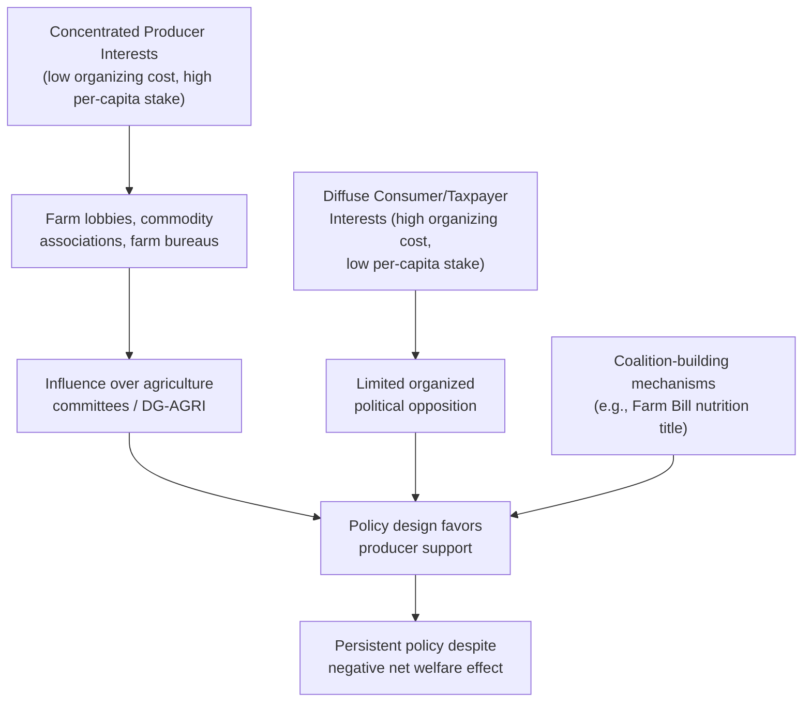

## Political Economy of Agricultural Policy

### Conceptual Framework

Political economy analysis of agricultural policy asks a question that standard welfare economics does not: why do governments persistently adopt and maintain policies that welfare analysis identifies as economically inefficient (net deadweight loss, regressive distributional effects)? The field treats policy outcomes not as the product of a benevolent social planner maximizing net social welfare, but as the equilibrium result of competition among interest groups operating within specific political institutions.

**Key Points**

- The central empirical puzzle motivating this field is the observed pattern that developed, industrialized economies tend to *support* (subsidize/protect) agriculture, while developing economies have historically tended to *tax* or under-invest in agriculture relative to other sectors — a pattern sometimes called the **"development paradox"** of agricultural protection
- Political economy models treat policy instruments themselves as endogenous outcomes to be explained, rather than exogenous inputs to a welfare-maximization exercise, shifting the analytical question from "what is the optimal policy?" to "why is this particular (possibly inefficient) policy politically sustained?"
- [Inference] This reframing does not replace welfare economics but complements it: welfare analysis identifies the efficiency cost of a given policy, while political economy analysis explains the political sustainability of that cost being borne

---

### Interest Group Theory and Collective Action

#### The Logic of Collective Action

The foundational insight, drawing on Mancur Olson's theory of collective action, is that policy outcomes are shaped by the relative ease with which different groups organize politically, not merely by the aggregate size of their economic stake.

**Key Points**

- **Farmers** in developed economies are typically a small, geographically concentrated, and increasingly homogeneous group (a shrinking share of the population as economies industrialize), facing relatively low costs of organizing collective political action (lobbying, farm bureaus, commodity associations) and capturing large *per-capita* gains from protective policy
- **Consumers and taxpayers** bear the cost of agricultural support, but this cost is spread thinly across a very large, diffuse population — the per-capita cost to any individual consumer/taxpayer is small, providing little individual incentive to organize opposition, even though the aggregate cost may be large
- This asymmetry — concentrated benefits, diffuse costs — is the standard political economy explanation for why agricultural protection persists in developed economies despite negative net social welfare effects identified by standard welfare analysis
- [Inference] The same logic operating in reverse helps explain agricultural taxation in developing economies: urban, politically influential constituencies (organized labor, urban consumers, sometimes an urban industrial base benefiting from artificially cheap food or foreign exchange policy) are concentrated and vocal, while a large, dispersed, often poorly organized farming population bears the cost — though the empirical strength and consistency of this "urban bias" pattern has been debated and revised in later development economics literature

#### The "Agricultural Treadmill" and Structural Transformation

**Key Points**

- As economies develop, agriculture's share of GDP and employment declines (a well-documented pattern of structural transformation), while the sector often maintains or even gains political influence disproportionate to its shrinking economic weight — a pattern political economists attribute partly to the collective-action advantages of a smaller, more concentrated group and partly to persistent cultural/historical narratives about family farming and food security
- Long-standing farm constituencies also benefit from institutional incumbency: existing farm organizations, congressional agriculture committees, and specialized agencies (e.g., USDA in the U.S., DG-AGRI in the EU) develop entrenched relationships and expertise that favor continuity of existing support structures over disruptive reform

---

### Institutional Structures Shaping Agricultural Policy

#### Legislative Design and Coalition-Building

**Key Points**

- The U.S. Farm Bill's bundling of commodity/farm-support programs with nutrition assistance (SNAP) is a textbook political economy mechanism: it links a large, diffuse urban/suburban beneficiary constituency (nutrition assistance recipients and their advocates) with a smaller, concentrated rural constituency, building the broad legislative coalition necessary for periodic reauthorization of a bill whose farm-specific provisions alone might lack sufficient support
- Committee structure matters: agricultural policy in many legislatures is drafted primarily within specialized agriculture committees whose membership is disproportionately drawn from rural/farm-state districts, creating an institutional channel through which concentrated farm interests exercise influence over policy design before it reaches a broader floor vote
- [Inference] This committee-based influence channel is a specific institutional mechanism through which the general collective-action advantage of concentrated interests translates into concrete legislative outcomes; the strength of this effect varies with electoral system design (e.g., malapportionment favoring rural districts in some systems) and committee assignment rules across different countries' legislatures

#### The EU's Multi-Level Governance Structure

**Key Points**

- CAP reform requires agreement among the European Commission, Council of the EU (representing member state governments), and European Parliament — a three-way negotiation (the "trilogue" process) that creates multiple veto points and tends to favor incremental adjustment over radical reform, since any one institutional actor can block or dilute significant change
- Member states with historically larger agricultural sectors or stronger farm political constituencies (which has varied over CAP history) have had disproportionate influence in Council negotiations relative to their population share, given the CAP's unanimity/qualified-majority requirements on key budgetary decisions
- The shift toward national CAP Strategic Plans under the 2023–2027 reform introduces an additional layer of domestic political economy: national governments now have greater discretion in allocating CAP funds among competing instruments (eco-schemes vs. coupled support vs. rural development), reintroducing domestic interest-group competition at the member-state level within the EU-wide framework

---

### Rent-Seeking and Capitalization Effects

**Key Points**

- Political economy analysis pays close attention to **rent-seeking**: resources expended by interest groups to influence policy (lobbying expenditure, campaign contributions, political mobilization) represent a real economic cost additional to the standard deadweight loss calculated in welfare economics, since these resources could otherwise be used productively
- The capitalization of policy benefits into scarce factors — land values under decoupled payments, quota values under supply management — creates a durable, self-reinforcing constituency: once a policy benefit is capitalized into an asset price, removing the policy imposes a capital loss on current asset holders (who purchased the asset at a price reflecting the expected policy benefit), generating strong political resistance to reform even from asset holders who did not directly "create" the original rent
- [Inference] This capitalization dynamic helps explain why agricultural policy reform, once a support mechanism has been in place long enough to be priced into land or quota values, tends to proceed through gradual transition/buyout mechanisms (e.g., the U.S. tobacco quota buyout, phased CAP reforms) rather than abrupt withdrawal, since abrupt withdrawal would impose concentrated capital losses on current asset holders, a politically costly outcome distinct from the diffuse benefit of ending an inefficient transfer

---

### Trade Policy and International Political Economy

**Key Points**

- Agricultural trade negotiations (WTO Doha Round agricultural negotiations, regional trade agreements) are shaped by the same domestic political economy dynamics operating at an international bargaining level: governments negotiating market access concessions face domestic political constraints from protected agricultural constituencies, which helps explain why agricultural trade liberalization has historically proven more difficult to negotiate than liberalization in many manufacturing sectors
- The persistence of instruments like Canadian dairy/poultry supply management in trade negotiations (USMCA, CPTPP) illustrates how domestically entrenched agricultural political economy translates into international negotiating positions, with governments seeking to preserve politically sensitive domestic support structures even when this constrains broader trade agreement ambitions
- [Inference] Cross-country comparative political economy literature suggests that agricultural protection tends to be higher in economies where the farm population, while small in absolute economic share, retains disproportionate political voice through specific institutional channels (malapportioned legislatures, agricultural committee structures, historically embedded farm party representation) — though isolating the causal weight of any single institutional channel from other confounding factors (national income level, historical path dependency, cultural attachment to rural life) is empirically challenging and subject to ongoing debate in the literature

---

### Reform Dynamics: Why and How Agricultural Policy Changes

**Key Points**

- Major reform episodes (U.S. 1996 Freedom to Farm, EU 1992 MacSharry Reform, EU 2003 Fischler Reform) have historically coincided with external pressure points: binding international trade negotiations (GATT Uruguay Round), significant government budget pressure, or shifts in the broader political coalition supporting the status quo (e.g., enlargement of the EU bringing in member states with different agricultural political economies)
- Reform tends to proceed via **compensation mechanisms** rather than outright withdrawal — converting price support into decoupled payments (rather than eliminating support altogether) is a strategy that reduces the *efficiency cost* of the policy while preserving the *income transfer* to the politically influential constituency, illustrating how reform is often shaped as much by the need to maintain political sustainability as by the pursuit of economic efficiency
- [Inference] This pattern suggests that political economy constraints, not purely technical/economic optimality considerations, substantially explain both the *sequencing* and the *design* of agricultural policy reform in practice — reforms that impose large concentrated losses on well-organized incumbents tend to be politically difficult regardless of their aggregate efficiency case, while reforms preserving transfer levels while improving efficiency (the price-support-to-decoupled-payment pattern) have proven more politically viable

---

### Comparative Political Economy Table

| Factor | Developed Economy Pattern | Developing Economy Pattern (Historical) |
| --- | --- | --- |
| Farm share of population/GDP | Small and declining | Large (though declining over time with development) |
| Farm political organization | Concentrated, well-resourced lobbies | Often fragmented, less resourced |
| Typical policy bias | Toward agricultural protection/support | Historically toward taxation/under-investment (urban bias) |
| Dominant interest group advantage | Producers (concentrated) | Urban consumers/industry (concentrated, politically proximate to capital) |
| Reform trigger | Trade negotiation pressure, budget constraints | Structural adjustment programs, food security crises |

**Key Points**

- [Inference] This table presents a stylized historical pattern rather than a rigid rule; many developing economies have since shifted toward increased agricultural support as they industrialize and farm populations shrink relative to national income, consistent with the general collective-action logic — country-specific analysis is necessary to assess where any given economy currently sits on this trajectory

---

### Illustrative Framework: Modeling Political Support Functions

A simplified political-economy model represents government policy choice as maximizing a weighted **political support function**, rather than pure social welfare:

$$W_{\text{political}} = \alpha \cdot \Delta PS + \beta \cdot \Delta CS - \gamma \cdot \Delta G$$

where $\alpha, \beta, \gamma$ are political weights reflecting the government's relative responsiveness to producer surplus, consumer surplus, and fiscal cost respectively, rather than equal (welfare-neutral) weights of 1 each as in standard welfare economics.

**Example**

If empirical estimation of a government's revealed policy choices suggests $\alpha = 2.5$, $\beta = 1.0$, and $\gamma = 0.8$ (producer surplus weighted 2.5 times as heavily as an equivalent dollar of consumer surplus, and fiscal cost discounted relative to its true budgetary weight), a policy generating $\Delta PS = +\$200\text{M}$, $\Delta CS = -\$150\text{M}$, $\Delta G = -\$100\text{M}$ would yield:

$$W_{\text{political}} = 2.5(200) + 1.0(-150) - 0.8(100) = 500 - 150 - 80 = 270$$

Despite a standard welfare-economics calculation showing $\text{NSW} = 200 - 150 - 100 = -50$ (a net efficiency loss), the political support function is positive, illustrating formally why a government responsive to politically-weighted interests would rationally adopt a policy that a neutral social-welfare-maximizing planner would reject. [Inference] This political support function framework (associated with the broader "political preference function" approach in agricultural policy literature) is a stylized modeling device for illustrating the mechanism; the specific numerical weights in any real economy would need to be econometrically estimated from observed policy choices rather than assumed, and such estimates carry substantial uncertainty.

---

**Related Topics**

- Welfare economics analysis of price support and income support instruments
- Collective action theory and interest group organization (Olson's logic of collective action)
- Rent-seeking behavior and its economic cost beyond standard deadweight loss
- Capitalization of policy benefits into land and quota asset values
- Comparative agricultural protection patterns across development levels
- WTO negotiation dynamics and domestic political constraints on trade liberalization
- Farm Bill legislative coalition-building and committee structure
- CAP multi-level governance and trilogue negotiation process
- Political preference function modeling in agricultural policy
- Historical case studies of major agricultural policy reform episodes