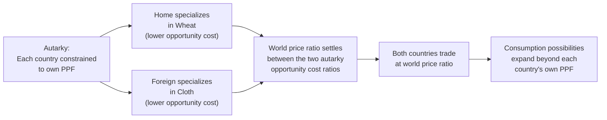

## Theory of Comparative Advantage

### Conceptual Framework

The theory of comparative advantage, originally formalized by David Ricardo, establishes that mutually beneficial trade can occur between two countries even when one country is more efficient than the other at producing *every* good — the key determinant of trade patterns is not **absolute advantage** (who can produce more output per unit of input) but **comparative advantage** (relative opportunity cost of producing one good in terms of the other good forgone).

**Key Points**

- A country has a comparative advantage in producing a good if its **opportunity cost** of producing that good (measured in units of the other good forgone) is lower than the other country's opportunity cost
- This is distinct from absolute advantage, which compares raw productivity (output per labor-hour or per unit of input) across countries without reference to what else that country could have produced with the same resources
- The theory's central and often counterintuitive implication is that a country with no absolute advantage in any good can still gain from trade, and a country with an absolute advantage in every good still benefits from specializing according to comparative, not absolute, advantage

---

### The Ricardian Model: Formal Structure

#### Basic Setup

Consider two countries (Home and Foreign) producing two goods (Wheat and Cloth) using a single factor of production (labor), under constant returns to scale. Let $a_{LW}$ and $a_{LC}$ denote the labor required per unit of wheat and cloth in Home, and $a^*_{LW}$, $a^*_{LC}$ the corresponding labor requirements in Foreign.

**Home has a comparative advantage in wheat** if:

$$\frac{a_{LW}}{a_{LC}} < \frac{a^*_{LW}}{a^*_{LC}}$$

This states that Home's opportunity cost of wheat (in terms of cloth forgone) is lower than Foreign's opportunity cost of wheat.

#### Numerical Illustration

**Example**

Suppose labor requirements per unit of output are:

|  | Wheat (hours/unit) | Cloth (hours/unit) |
| --- | --- | --- |
| Home | 2 | 4 |
| Foreign | 10 | 5 |

Home's opportunity cost of one unit of wheat is $2/4 = 0.5$ units of cloth forgone. Foreign's opportunity cost of one unit of wheat is $10/5 = 2$ units of cloth forgone.

Since $0.5 < 2$, Home has a comparative advantage in wheat (despite also having an *absolute* advantage in both goods, since Home requires fewer labor-hours per unit of both wheat and cloth). Foreign, conversely, has a comparative advantage in cloth: its opportunity cost of cloth ($5/10 = 0.5$ units of wheat forgone) is lower than Home's opportunity cost of cloth ($4/2 = 2$ units of wheat forgone).

$$\text{Home: } \frac{a_{LW}}{a_{LC}} = \frac{2}{4} = 0.5 \quad \text{vs.} \quad \text{Foreign: } \frac{a^*_{LW}}{a^*_{LC}} = \frac{10}{5} = 2.0$$

Even though Home is absolutely more efficient at producing *both* goods, both countries gain by each specializing in their comparative-advantage good and trading, because the relative efficiency gap (opportunity cost ratio) differs between the two countries — this is the theorem's core demonstration that absolute efficiency differences are irrelevant to the existence of gains from trade; only *relative* efficiency differences matter.

#### Production Possibility Frontiers and Autarky

Under autarky (no trade), each country's consumption is constrained to lie on or within its own production possibility frontier (PPF), whose slope reflects the domestic opportunity cost ratio (constant in the simple Ricardian model, given constant labor requirements per unit).

**Key Points**

- The equilibrium world relative price of wheat (in terms of cloth) under trade must settle somewhere between the two countries' autarky opportunity cost ratios (in the example, between 0.5 and 2.0 units of cloth per unit of wheat); if it settled outside this range, one country would have no incentive to specialize/trade
- At this world price, each country can consume combinations of wheat and cloth that lie outside its own autarky PPF, which is the formal representation of "gains from trade" — specialization plus exchange expands the consumption possibilities available to both trading partners simultaneously

---

### The Heckscher-Ohlin Extension: Factor Endowments

While the Ricardian model attributes comparative advantage entirely to technology/productivity differences (single-factor model), the **Heckscher-Ohlin (H-O) model** extends the framework to multiple factors of production (typically labor and capital, or in agricultural applications, land and labor), attributing comparative advantage instead to differences in relative **factor endowments** combined with differing **factor intensities** across goods.

**Key Points**

- The H-O theorem states that a country will have a comparative advantage in, and will export, the good that intensively uses its relatively abundant factor of production — a land-abundant country is predicted to have a comparative advantage in land-intensive agricultural goods, while a labor-abundant country is predicted to have a comparative advantage in labor-intensive goods
- This is particularly relevant to agricultural trade analysis, since agricultural production is often characterized as relatively land-intensive (and in some subsectors, labor-intensive) compared to manufactured goods, providing a factor-endowment-based explanation for why land-abundant countries (e.g., historically the U.S., Australia, Argentina, Canada in grain and livestock production) have tended to be significant agricultural exporters
- The **Stolper-Samuelson theorem**, a corollary of the H-O framework, predicts that trade liberalization raises the real return to a country's abundant factor and lowers the real return to its scarce factor — implying that agricultural trade liberalization in a land-abundant country would be predicted to raise land rents/returns while potentially lowering returns to the scarce factor (e.g., certain categories of labor or capital), a distributional prediction with direct relevance to domestic political economy responses to trade policy
- [Inference] Empirical testing of the H-O model (the "Leontief paradox" and subsequent literature) has found that the simple two-factor model does not always accurately predict real-world trade patterns once tested against actual data, suggesting that technology differences (as in the Ricardian model), increasing returns to scale, and product differentiation (as in later new trade theory models) also play meaningful roles alongside factor endowments in explaining actual observed trade patterns, including in agriculture

---

### Application to Agricultural Trade Policy Analysis

**Key Points**

- Comparative advantage theory provides the standard efficiency benchmark against which agricultural protectionism is evaluated: domestic price supports, tariffs, and production quotas that shield a country's agricultural sector from international competition are generally understood, within this framework, to divert resources toward production in which the country lacks comparative advantage, generating a global efficiency loss even where it protects domestic producer welfare
- Countries that heavily subsidize/protect land-intensive agriculture despite lacking a strong comparative advantage in it (e.g., due to climate, soil quality, or farm-size constraints) are, in this framework, sustaining production that would not occur under free trade at prevailing world prices — connecting directly to the political economy analysis of why such protection persists despite theoretical inefficiency
- Conversely, countries with strong natural comparative advantage in specific agricultural commodities (climate-suited crops, extensive arable land, favorable growing seasons) but facing trade barriers in destination markets (tariffs, tariff-rate quotas, sanitary and phytosanitary measures) may be prevented from fully realizing potential gains from specialization and trade — a core justification for agricultural trade liberalization advocacy in multilateral forums such as the WTO
- [Inference] The theoretical case for agricultural trade liberalization based on comparative advantage is generally robust at the level of aggregate global welfare, but does not by itself address the distributional consequences within any single country (which groups gain, which lose), nor food security concerns some countries raise regarding dependence on imported staple commodities — these considerations require separate analytical frameworks (the welfare economics and political economy frameworks covered elsewhere in this chapter) to fully evaluate real-world policy trade-offs

---

### Limitations and Extensions of the Basic Model

**Key Points**

- The simple Ricardian model assumes constant opportunity costs (linear PPF), perfect factor mobility within a country, no transportation costs, and perfect competition — assumptions that do not hold precisely in agricultural markets characterized by increasing marginal costs at high output levels (diminishing returns to land as production expands onto less suitable land), imperfect competition in some processing/marketing segments, and significant transport/logistics costs for bulky commodities
- **Dynamic comparative advantage** extends the static framework by recognizing that comparative advantage can shift over time due to technological change, infrastructure investment, human capital accumulation, or deliberate industrial policy — relevant to agricultural development where investment in irrigation, plant breeding, or supply chain infrastructure can alter a country's comparative advantage position over a multi-decade horizon
- [Inference] The static comparative advantage framework is best understood as a foundational baseline model rather than a complete predictive theory of actual agricultural trade flows; applied trade analysis typically supplements it with gravity models (incorporating distance, market size, and trade agreement effects), new trade theory (incorporating scale economies and product differentiation), and country-specific factor endowment and policy detail to explain observed trade patterns with greater precision

---

### Numerical Illustration: Gains from Trade

**Example**

Continuing the Home/Foreign example, suppose Home has 1,200 labor-hours available and Foreign has 1,500 labor-hours available.

*Under autarky*, if Home devotes labor equally: 150 units of wheat ($300 \text{ hours} / 2$) is not quite how autarky allocation works in practice (autarky allocation depends on domestic demand), but consider instead the *post-specialization* production maximum: Home, fully specializing in wheat, can produce $1{,}200 / 2 = 600$ units of wheat. Foreign, fully specializing in cloth, can produce $1{,}500 / 5 = 300$ units of cloth.

At a world price ratio of, say, 1 unit of wheat = 1 unit of cloth (within the 0.5–2.0 range established earlier), Home could trade some of its 600 units of wheat for cloth, and Foreign could trade some of its 300 units of cloth for wheat, with both countries able to reach consumption bundles containing more of *both* goods than would have been possible had each country tried to produce both goods domestically under autarky — this is the formal demonstration of mutual gains from trade under comparative advantage, independent of either country's absolute productivity levels.

---

**Related Topics**

- Heckscher-Ohlin model and factor endowment theory of trade
- Stolper-Samuelson theorem and distributional effects of trade liberalization
- Welfare economics analysis of tariffs and agricultural trade protection
- Political economy of agricultural trade policy and protectionism
- WTO Agreement on Agriculture and multilateral trade liberalization
- Gravity models of agricultural trade flows
- Dynamic comparative advantage and agricultural technology adoption
- Terms-of-trade effects and large-country trade policy
- Sanitary and phytosanitary measures as non-tariff trade barriers
- Food security considerations and import dependence in trade policy design