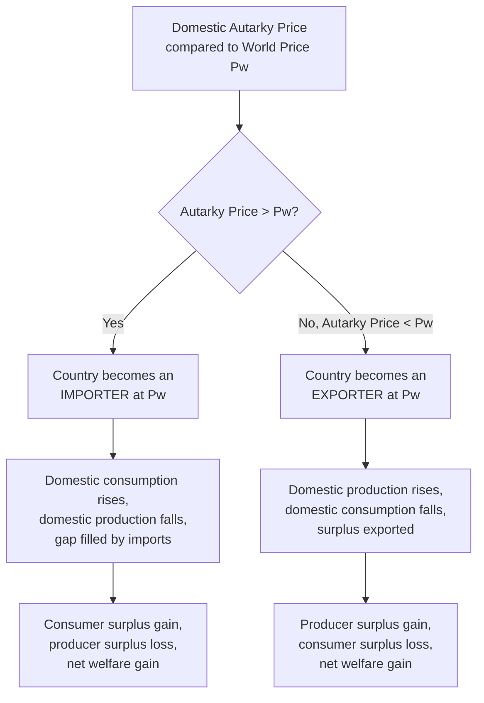
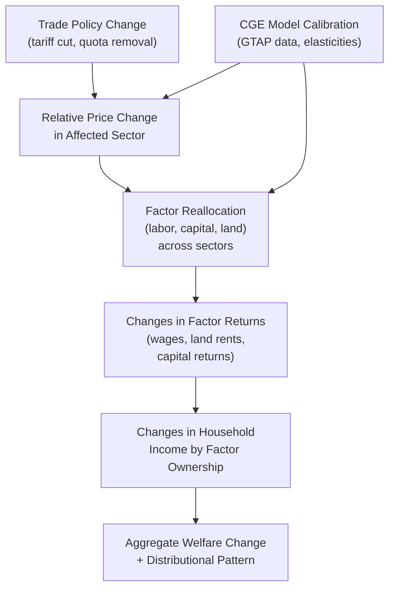

## Trade Models and Gains from Trade

### Conceptual Framework

Trade models formalize how opening an economy to international exchange reallocates production and consumption, and quantify the resulting welfare change. While the theory of comparative advantage (covered separately in this chapter) establishes the *qualitative* case that mutually beneficial trade exists, applied trade analysis requires specific model structures — partial equilibrium, general equilibrium, and empirically estimated variants — to quantify *how much* gain accrues, to *whom*, and under *what* policy conditions.

**Key Points**

- Trade models in agricultural economics are typically classified along two dimensions: **partial equilibrium** (analyzing a single commodity market in isolation) versus **general equilibrium** (analyzing interconnected markets and factor reallocation across the whole economy), and **small-country** versus **large-country** (whether the country's own trade volume is large enough to affect the world price)
- The choice of model depends on the policy question: partial equilibrium models are computationally simpler and well-suited to single-commodity tariff or subsidy analysis, while general equilibrium models are necessary when a policy change is large enough to induce significant resource reallocation across multiple sectors (e.g., major trade liberalization affecting both agriculture and manufacturing simultaneously)

---

### Partial Equilibrium Trade Model: Small Country Case

#### Basic Structure

For a small country (a price-taker unable to influence the world price $P_w$), the domestic market interacts with the world market as follows: if the domestic autarky price would exceed $P_w$, the country imports the difference between domestic quantity demanded and domestic quantity supplied at $P_w$; if the domestic autarky price would be below $P_w$, the country exports the surplus.

$$\text{Imports} = Q_d(P_w) - Q_s(P_w) \quad \text{(if domestic autarky price} > P_w\text{)}$$

#### Welfare Effects of Opening to Trade (Importing Case)

**Key Points**

- When a small country opens to trade and becomes an importer (world price below autarky price), domestic consumers gain (lower price, higher consumption) while domestic producers lose (lower price received, reduced output); the consumer gain exceeds the producer loss, yielding a positive **net national gain from trade**
- This net gain is the standard partial-equilibrium demonstration that free trade raises aggregate welfare in the importing country, even though it creates *within-country* redistribution from producers to consumers — a result that reappears directly in the political economy analysis of why import-competing domestic producers lobby for protection despite the aggregate national gain
- Symmetrically, in the exporting case, domestic producers gain more than domestic consumers lose, again yielding a positive net national gain, with the redistribution running in the opposite direction (from consumers to producers)

$$\text{Net National Gain} = \Delta CS + \Delta PS > 0 \quad \text{(free trade vs. autarky, small country, no distortions)}$$

<svg xmlns="http://www.w3.org/2000/svg" viewBox="0 0 640 440">
<text x="320" y="25" font-family="Arial, sans-serif" font-size="16" font-weight="bold" text-anchor="middle" fill="#1a1a1a">Small Country Opening to Trade: Importer Case (svg_diagram)</text>
<line x1="70" y1="380" x2="600" y2="380" stroke="#333" stroke-width="2" />
<line x1="70" y1="380" x2="70" y2="50" stroke="#333" stroke-width="2" />
<text x="335" y="415" font-family="Arial, sans-serif" font-size="13" text-anchor="middle" fill="#333">Quantity</text>
<text x="30" y="215" font-family="Arial, sans-serif" font-size="13" text-anchor="middle" fill="#333" transform="rotate(-90 30 215)">Price</text>
<line x1="120" y1="360" x2="500" y2="90" stroke="#2563eb" stroke-width="2.5" />
<text x="510" y="85" font-family="Arial, sans-serif" font-size="13" fill="#2563eb">S (domestic)</text>
<line x1="120" y1="90" x2="500" y2="360" stroke="#dc2626" stroke-width="2.5" />
<text x="510" y="360" font-family="Arial, sans-serif" font-size="13" fill="#dc2626">D (domestic)</text>

<circle cx="310" cy="225" r="4" fill="#1a1a1a" />
<line x1="70" y1="225" x2="310" y2="225" stroke="#999" stroke-width="1" stroke-dasharray="4,3" />
<text x="55" y="229" font-family="Arial, sans-serif" font-size="12" text-anchor="end" fill="#333">Pa (autarky)</text>

<line x1="70" y1="300" x2="600" y2="300" stroke="#16a34a" stroke-width="2" stroke-dasharray="6,4" />
<text x="55" y="304" font-family="Arial, sans-serif" font-size="12" text-anchor="end" fill="#16a34a" font-weight="bold">Pw</text>
<line x1="215" y1="300" x2="215" y2="380" stroke="#2563eb" stroke-width="1" stroke-dasharray="3,2" />
<text x="215" y="398" font-family="Arial, sans-serif" font-size="12" text-anchor="middle" fill="#2563eb">Qs(Pw)</text>
<line x1="400" y1="300" x2="400" y2="380" stroke="#dc2626" stroke-width="1" stroke-dasharray="3,2" />
<text x="400" y="398" font-family="Arial, sans-serif" font-size="12" text-anchor="middle" fill="#dc2626">Qd(Pw)</text>

<line x1="215" y1="300" x2="400" y2="300" stroke="#f59e0b" stroke-width="4" />
<text x="307" y="288" font-family="Arial, sans-serif" font-size="12" font-weight="bold" text-anchor="middle" fill="#f59e0b">Imports</text>

<polygon points="310,225 400,300 310,300" fill="#dc2626" opacity="0.35" />

<polygon points="310,225 215,300 310,300" fill="#2563eb" opacity="0.35" />
</svg>

---

### General Equilibrium Trade Models

#### Two-Sector, Multi-Factor Models

Where partial equilibrium analysis isolates a single market, general equilibrium (GE) models capture how trade-induced changes in one sector's relative price reallocate factors of production (labor, capital, land) across *all* sectors of the economy, and how this in turn affects factor returns economy-wide. The Heckscher-Ohlin framework (covered under comparative advantage) is the canonical two-factor GE trade model.

**Key Points**

- GE models are essential when analyzing trade liberalization large enough to shift substantial resources between agriculture and non-agricultural sectors — for example, a major multilateral agricultural trade agreement affecting both the agricultural sector directly and downstream/upstream sectors (input suppliers, food processing, transport) indirectly through factor-price and resource-reallocation channels
- **Computable General Equilibrium (CGE) models** are the standard empirical tool for quantifying these effects at scale, solving systems of equations representing production, consumption, and market-clearing conditions across many sectors and (often) many countries or regions simultaneously, calibrated to real-world data (input-output tables, trade flows, elasticity estimates)
- Prominent CGE frameworks used in agricultural trade policy analysis include variants built on the **GTAP (Global Trade Analysis Project)** database, which provides a standardized, multi-region, multi-sector dataset widely used as the empirical foundation for quantifying the effects of trade agreements, tariff changes, and agricultural subsidy reform on global trade flows and welfare
- [Inference] CGE model results are sensitive to the specific elasticity parameters, closure rules (assumptions about factor mobility, savings-investment balance, and macroeconomic aggregates held fixed or flexible), and functional form assumptions embedded in any given model; different modeling teams analyzing the same policy question can produce materially different quantitative welfare estimates, so CGE results are generally best interpreted as illustrative of plausible magnitude and direction rather than precise point forecasts

---

### Gains from Trade: Static vs. Dynamic Sources

**Key Points**

- **Static gains from trade** arise from the one-time reallocation of resources toward each country's comparative advantage, captured in the standard partial and general equilibrium welfare calculations described above
- **Dynamic gains from trade** refer to additional, longer-run channels through which trade openness may raise growth rates or productivity over time: exposure to international competition can accelerate technology adoption and productivity growth in the traded sector, larger export markets can allow firms to exploit **economies of scale** not achievable in a smaller domestic market alone, and trade can facilitate technology and knowledge transfer (e.g., adoption of improved seed varieties, precision agriculture technology, or processing techniques observed through trade relationships)
- [Inference] Empirical quantification of dynamic gains is considerably more contested than static gains, since isolating trade's causal contribution to productivity growth from other concurrent factors (domestic policy reform, general economic development, technology diffusion through non-trade channels) is methodologically difficult; the literature generally treats dynamic gains as plausible and potentially large but harder to measure with the same precision as static, model-based partial/general equilibrium welfare calculations

---

### New Trade Theory: Scale Economies and Product Differentiation

**Key Points**

- Traditional Ricardian and Heckscher-Ohlin models predict **inter-industry trade** (countries exporting entirely different goods based on comparative advantage), but a substantial share of real-world trade — including in processed and branded agricultural/food products — is **intra-industry trade** (countries simultaneously importing and exporting similar categories of goods, e.g., a country both exporting and importing different varieties of wine, cheese, or packaged foods)
- **New trade theory** (associated with Paul Krugman's work) explains intra-industry trade through **increasing returns to scale** and **product differentiation** under monopolistic competition: firms specialize in particular product varieties to exploit scale economies, and consumers in all trading countries gain access to a wider variety of differentiated products than any single country's market alone could support
- This model extension is particularly relevant to processed food and branded agricultural product trade, where product differentiation (geographic indications, quality certifications, brand identity) plays a larger role in explaining trade patterns than the relatively homogeneous bulk-commodity framework assumed in classical Ricardian/H-O models

---

### Trade Agreements and Preferential Liberalization

**Key Points**

- **Multilateral liberalization** (WTO-negotiated, most-favored-nation tariff reductions applying equally to all member countries) is generally considered, in standard trade theory, to be efficiency-superior to **preferential/regional liberalization** (free trade agreements or customs unions granting tariff-free access only to specific partner countries), because preferential agreements can generate **trade diversion** — importing from a higher-cost partner-country producer instead of a lower-cost non-member producer, purely because of the tariff preference — alongside the efficiency-improving **trade creation** effect of increased trade with the low-cost partner
- The net welfare effect of any specific preferential trade agreement depends empirically on the relative magnitude of trade creation versus trade diversion, which varies by agreement design, product coverage, and the relative cost competitiveness of member versus non-member producers — a question that generally requires case-specific quantitative analysis (often using the CGE modeling approaches described above) rather than being resolvable from theory alone
- [Inference] Agricultural products are frequently subject to more extensive carve-outs, longer phase-in periods, or exclusion from full liberalization within regional/preferential trade agreements compared to manufactured goods, reflecting the domestic political economy sensitivities around agricultural protection discussed elsewhere in this material; the specific product-level exceptions negotiated in any given agreement should be verified against that agreement's actual text and schedules rather than assumed uniform across all agricultural products

---

### Comparative Summary of Trade Model Types

| Model Type | Scope | Best Suited For | Key Limitation |
| --- | --- | --- | --- |
| Partial equilibrium (small country) | Single commodity market | Tariff/quota analysis on one good, price-taker assumption | Ignores cross-sector and factor-market feedback |
| Partial equilibrium (large country) | Single commodity market, world-price-affecting | Major exporter/importer policy analysis (terms-of-trade effects) | Still ignores broader economy-wide reallocation |
| Heckscher-Ohlin (2-factor GE) | Whole economy, 2 goods, 2 factors | Distributional analysis of trade liberalization (Stolper-Samuelson) | Stylized; simplifying factor/goods assumptions limit direct empirical mapping |
| CGE (multi-sector, multi-region) | Whole economy or multi-country system | Large trade agreement impact assessment, global commodity market interactions | Sensitive to calibration assumptions; results vary across modeling teams |
| New trade theory (monopolistic competition) | Differentiated product markets | Intra-industry trade, branded/processed food trade patterns | Less applicable to homogeneous bulk commodity trade |

---

### Numerical Example: Small-Country Welfare Gain from Trade Liberalization

**Example**

A small country's rice market has domestic supply $Q_s = 100 + 20P$ and demand $Q_d = 500 - 30P$ (thousand tons), yielding an autarky equilibrium at $P_a = \$8$/unit, $Q_a = 260$ (thousand tons). The world price is $P_w = \$6$/unit (below autarky price, so the country becomes an importer upon opening to trade).

At $P_w = 6$: $Q_s(6) = 100 + 120 = 220$; $Q_d(6) = 500 - 180 = 320$; imports $= 320 - 220 = 100$ (thousand tons).

Change in consumer surplus (gain, price falls from $8 to $6):

$$\Delta CS = \tfrac{1}{2}(260 + 320)(8-6) = \tfrac{1}{2}(580)(2) = 580 \text{ (thousand \$ equivalent, in appropriate units)}$$

Change in producer surplus (loss, price falls from $8 to $6):

$$\Delta PS = -\tfrac{1}{2}(260 + 220)(8-6) = -\tfrac{1}{2}(480)(2) = -480$$

Net national gain from trade:

$$\Delta CS + \Delta PS = 580 - 480 = 100$$

This positive net gain of 100 (in the model's units) demonstrates the standard partial-equilibrium result: opening to trade produces an unambiguous net welfare improvement for the small importing country, even though the $480-unit loss to domestic producers is a real and often politically salient distributional cost that helps explain producer-side resistance to trade liberalization despite the positive aggregate result.

---

**Related Topics**

- Theory of comparative advantage (Ricardian and Heckscher-Ohlin foundations)
- Welfare economics analysis applied to tariffs and trade barriers
- Computable General Equilibrium (CGE) modeling and GTAP database applications
- Trade creation versus trade diversion in preferential trade agreements
- New trade theory, monopolistic competition, and intra-industry trade
- Political economy of agricultural trade protection and liberalization resistance
- Terms-of-trade effects in large-country trade policy
- Stolper-Samuelson theorem and distributional impacts of trade liberalization
- WTO multilateral negotiation frameworks versus regional trade agreements
- Dynamic gains from trade: productivity, technology transfer, and scale economies