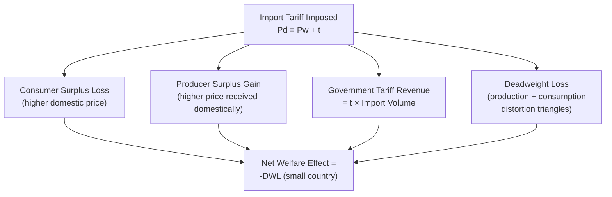

## Tariffs, Quotas, and Non-Tariff Barriers

### Conceptual Framework

Trade policy instruments restrict or regulate the flow of agricultural commodities across borders through mechanisms that differ in their point of intervention (border price versus quantity versus regulatory standard), their revenue implications, and their welfare effects. This section covers the three principal categories: **tariffs** (price-based border taxes), **quotas** (quantity-based border restrictions), and **non-tariff barriers (NTBs)** (regulatory, technical, and administrative measures that restrict trade without directly taxing or capping quantity).

**Key Points**

- All three instrument categories share a common welfare-analytic feature: they drive a wedge between the world price and the domestic price, but they differ in *who captures* the resulting price wedge (government tariff revenue, quota license holders, or no one — pure resource cost in the case of most NTBs), which is central to their comparative welfare ranking
- Agricultural trade has historically been characterized by more extensive and more persistent use of these instruments than manufacturing trade, reflecting the political economy dynamics (concentrated producer interests, food security sensitivities) covered elsewhere in this material

---

### Tariffs

#### Specific and Ad Valorem Tariffs

A **specific tariff** is a fixed monetary charge per physical unit imported (e.g., $50 per ton), while an **ad valorem tariff** is a percentage of the good's value (e.g., 15% of import value). **Compound tariffs** combine both elements.

$$P_d = P_w + t \quad \text{(specific tariff, } t \text{ in currency units per physical unit)}$$

$$P_d = P_w(1 + \tau) \quad \text{(ad valorem tariff, } \tau \text{ as a proportion)}$$

where $P_d$ is the domestic price and $P_w$ the world price.

**Key Points**

- Specific tariffs provide more stable *per-unit* protection regardless of price fluctuations but their *ad valorem equivalent* protection erodes during periods of rising world prices (a fixed $50/ton tariff is a smaller percentage protection when world price rises from $200 to $400/ton than when it was $200/ton)
- Ad valorem tariffs maintain constant percentage protection regardless of price level but generate more volatile absolute revenue and protection levels when world prices are volatile — a relevant consideration for agricultural commodities subject to significant price volatility
- Many countries convert historical non-ad-valorem tariffs (specific or compound) into **ad valorem equivalents (AVEs)** for WTO tariff-binding and negotiation purposes, since this facilitates cross-country and cross-commodity comparison of protection levels

#### Welfare Effects of an Import Tariff (Small Country)

For a small, price-taking country imposing a tariff, the domestic price rises above the world price by the tariff amount, generating four distinct welfare components.

**Key Points**

- Unlike a domestic price floor (which requires government purchase of the full surplus), a tariff's price wedge revenue accrues to the government as **tariff revenue** on the (smaller) import volume, not as a purchase cost on domestic production — making tariffs fiscally less costly to the government than price-floor-with-purchase programs for achieving a comparable domestic price increase
- For a small country, the net welfare effect of a tariff is unambiguously negative (two deadweight-loss triangles: one from production distortion, one from consumption distortion), since the country cannot influence the world price and therefore captures no offsetting terms-of-trade gain
- For a **large country** capable of affecting the world price, an "optimal tariff" can theoretically exist at a level below the prohibitive tariff, where the terms-of-trade gain (lower price paid to foreign exporters) exceeds the domestic deadweight loss — though this optimal-tariff argument for the imposing country comes at the direct expense of foreign producer welfare and, if replicated by trading partners in retaliation, can result in a mutually damaging tariff war with no country better off, which is the standard game-theoretic rationale for multilateral tariff-binding commitments under the WTO

---

### Tariff-Rate Quotas (TRQs)

A **tariff-rate quota** combines the two instrument categories: a specified quantity ("in-quota" volume) may be imported at a low or zero tariff rate, while any import volume above that threshold ("over-quota" imports) faces a substantially higher tariff rate.

$$t_{\text{applied}} = \begin{cases} t_{\text{in-quota}} & \text{if } Q_{\text{import}} \leq Q_{\text{quota}} \\ t_{\text{over-quota}} & \text{if } Q_{\text{import}} > Q_{\text{quota}} \end{cases}$$

**Key Points**

- TRQs became the dominant instrument for converting non-tariff quantitative restrictions into a WTO-compatible tariff structure following the Uruguay Round's "tariffication" process, which required countries to convert existing quotas and other non-tariff barriers into bound tariff equivalents, often implemented as TRQs to preserve some element of guaranteed minimum market access
- The economic effect of a TRQ depends critically on whether the in-quota volume is fully utilized ("filled"): if in-quota imports are below the quota ceiling, the TRQ functions economically like a simple low tariff on all imports; if imports would exceed the quota ceiling absent the higher over-quota tariff, the TRQ functions as a binding quantitative restriction, with the over-quota tariff effectively prohibitive at the margin
- **Quota administration method** (first-come-first-served, license-on-demand, historical allocation, auctioning, or state-trading enterprise allocation) significantly affects who captures the **quota rent** (the price gap between the low in-quota price and the higher domestic market price) — auctioning can in principle transfer this rent to the government, while administrative allocation to specific importers/exporters can create valuable, sought-after import licenses that generate rent-seeking behavior
- [Inference] TRQ fill rates vary substantially by product and country and change from year to year depending on relative price movements and administrative practices; specific current fill-rate data for any given commodity/country TRQ should be verified against current WTO notification data rather than assumed constant over time

---

### Import Quotas (Pure Quantitative Restriction)

A pure import quota fixes the maximum quantity that may be imported, regardless of price, without the two-tier tariff structure of a TRQ.

**Key Points**

- Economically, a binding import quota produces welfare effects on consumers and domestic producers similar to an equivalent-restriction tariff (same import volume reduction, same domestic price increase), but the **quota rent** — the gap between the world price and the domestic price on the quota volume — accrues to whoever holds the import license (which may be domestic importers, foreign exporters if licenses are allocated to them, or the government if quotas are auctioned) rather than necessarily to the domestic government as tariff revenue
- Because of this "who captures the rent" difference, an import quota is generally considered **less transparent and potentially less economically efficient** than an equivalent tariff, particularly when license allocation is not competitive or auction-based, since rent-seeking behavior to obtain quota licenses represents an additional resource cost not present under a simple tariff
- Pure import quotas (as opposed to TRQs) have become considerably less common in agricultural trade since the WTO Uruguay Round's tariffication requirement, though **quantitative restrictions can still arise informally** through the practical operation of restrictive non-tariff barriers described below, even where a formal quota is not in place

---

### Non-Tariff Barriers (NTBs)

Non-tariff barriers encompass a heterogeneous set of regulatory, technical, and administrative measures that restrict trade without a direct price or quantity mechanism, making their welfare effects and even their *detection* more complex than tariffs or quotas.

#### Sanitary and Phytosanitary (SPS) Measures

**Key Points**

- SPS measures are regulations addressing food safety, animal health, and plant health risks (e.g., maximum pesticide residue limits, restrictions on imports from regions with livestock disease outbreaks, quarantine requirements for plant material) — governed multilaterally by the WTO SPS Agreement, which requires that such measures be based on scientific risk assessment and not be more trade-restrictive than necessary to achieve their legitimate health/safety objective
- SPS measures present a genuine **dual-use challenge** in trade policy analysis: they can serve legitimate public health and biosecurity objectives, but the same regulatory tools can also be used, deliberately or through de facto effect, as disguised protectionism against competitive imports — distinguishing legitimate risk-based regulation from protectionist application is often contentious and has been the subject of numerous WTO dispute settlement cases
- [Inference] Because SPS measures operate through regulatory approval processes, testing requirements, and compliance costs rather than an explicit price or quantity mechanism, their trade-restrictive effect is generally harder to quantify precisely than a tariff's ad valorem rate; empirical trade-cost studies typically estimate SPS-related trade costs through gravity-model residuals or compliance-cost surveys rather than a directly observable tariff-equivalent rate, and such estimates carry more uncertainty than tariff-line data

#### Technical Barriers to Trade (TBT)

**Key Points**

- TBT measures cover technical regulations, standards, labeling requirements, and conformity assessment procedures not primarily related to food safety/health risk (e.g., packaging and labeling standards, quality grading requirements, organic certification equivalence rules) — governed by the separate WTO TBT Agreement
- Divergent national labeling or certification standards (e.g., differing rules on genetically modified organism labeling, differing organic certification standards) can function as a substantial NTB even absent any protectionist intent, simply because compliance with multiple divergent national standards raises fixed costs for exporters, particularly burdensome for smaller producers/exporters relative to large multinational firms with the scale to absorb multi-market compliance costs

#### Other Administrative and Structural NTBs

**Key Points**

- **State trading enterprises (STEs)**: government-sanctioned entities holding exclusive or special import/export rights for specific commodities can function as a de facto trade barrier through their pricing, purchasing, and allocation decisions, even without an explicit tariff or quota
- **Customs valuation and procedural barriers**: complex, slow, or inconsistently applied customs procedures, documentation requirements, and valuation methods can impose substantial *de facto* trade costs, particularly burdensome for perishable agricultural products where delays directly translate into spoilage losses
- **Domestic content or geographic indication requirements**: rules restricting use of specific product names to defined geographic origins (e.g., "Champagne," "Parmigiano-Reggiano") function partly as intellectual property protection and partly as a market-access constraint on producers outside the designated region using similar production methods
- **Rules of origin**: requirements determining which country a product is deemed to originate from (relevant for preferential tariff treatment under trade agreements) can be designed restrictively enough to limit the practical benefit of nominal tariff preferences, particularly for agricultural products with complex international supply chains

---

### Comparative Instrument Table

| Instrument | Price Mechanism | Quantity Mechanism | Rent/Revenue Capture | WTO Treatment |
| --- | --- | --- | --- | --- |
| Specific/ad valorem tariff | Direct price wedge | Indirect (via demand response) | Government tariff revenue | Bound tariff schedules, subject to negotiated ceilings |
| Tariff-rate quota (TRQ) | Two-tier price wedge | Direct cap on in-quota volume | Depends on administration method (govt., importers, or STE) | Post-Uruguay Round standard mechanism for market access commitments |
| Pure import quota | Indirect (via quantity restriction) | Direct cap on volume | License holder (variable) | Largely phased out under WTO tariffication requirement |
| SPS/TBT measures | Indirect (compliance cost) | Indirect (compliance-driven exclusion) | No one (pure resource cost / deadweight loss) | Separate WTO SPS and TBT Agreements; science-based justification required |

**Key Points**

- The general economic ranking of these instruments, for delivering an *equivalent* level of domestic protection, typically places tariffs as the most transparent and administratively efficient, quotas as less efficient due to rent-seeking and administration costs, and NTBs as potentially the least efficient overall, since compliance costs under NTBs are frequently pure resource costs captured by no party (unlike tariff revenue or even quota rents, which at least transfer value to some domestic or foreign party) — this is why multilateral trade negotiations have generally prioritized "tariffication" of quotas and pursued disciplines on NTB application, even while accepting continued tariff protection as the more transparent, more negotiable remaining instrument

---

### Numerical Example: TRQ Fill Analysis

**Example**

A country sets a TRQ for imported beef: 50,000 tons at an in-quota tariff of 5%, and any volume above that at an over-quota tariff of 40%. World price is $4,000/ton.

*In-quota landed cost*: $4{,}000 \times 1.05 = \$4{,}200$/ton

*Over-quota landed cost*: $4{,}000 \times 1.40 = \$5{,}600$/ton

If domestic demand at the in-quota landed price of $4,200/ton, combined with domestic supply response, implies desired imports of 65,000 tons, but the quota caps in-quota imports at 50,000 tons, the remaining 15,000 tons (if imported at all) would face the $5,600/ton over-quota cost — a landed-cost jump of 33% at the margin. This price discontinuity at the quota threshold is the defining economic signature of a binding TRQ: importers face a sharp cost increase for volume beyond the in-quota allocation, distinguishing this case from an unfilled or non-binding TRQ where the low in-quota rate applies to essentially all actual trade.

$$\text{Quota Rent (on in-quota volume)} = (\text{Domestic market price} - \text{In-quota landed cost}) \times Q_{\text{quota}}$$

If the domestic market-clearing price settles at $5,000/ton (reflecting the scarcity created by the binding quota), the quota rent on the 50,000-ton in-quota volume would be:

$$(5{,}000 - 4{,}200) \times 50{,}000 = \$40{,}000{,}000$$

This $40 million in quota rent accrues to whichever party holds the in-quota import licenses — illustrating why the *administration method* for allocating TRQ licenses is not a minor technical detail but a substantial determinant of who captures a significant economic value.

---

**Related Topics**

- Welfare economics analysis applied to price support and trade instruments
- WTO Agreement on Agriculture: tariffication history and Uruguay Round commitments
- WTO SPS and TBT Agreements and dispute settlement precedent
- Comparative advantage theory and the efficiency case for trade liberalization
- Quota rent allocation methods and rent-seeking behavior
- Political economy of agricultural trade protection
- Rules of origin and preferential trade agreement design
- State trading enterprises in agricultural commodity markets
- Terms-of-trade effects and the large-country optimal tariff argument
- Geographic indications and intellectual property in agricultural trade