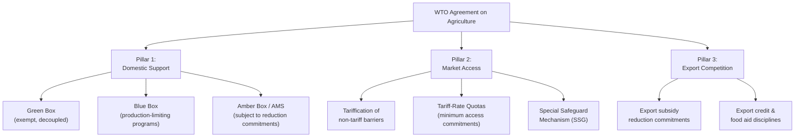
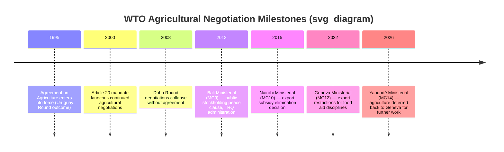

## World Trade Organization Agriculture Agreements

### Institutional Framework

The **WTO Agreement on Agriculture (AoA)**, concluded as part of the 1994 Uruguay Round and entering into force with the WTO's establishment in 1995, is the foundational multilateral agreement governing agricultural trade among WTO member countries. It restructured agricultural trade policy disciplines around three core "pillars": **domestic support**, **market access**, and **export competition**, supplemented by separate but closely linked agreements on **Sanitary and Phytosanitary Measures (SPS)** and **Technical Barriers to Trade (TBT)**.

**Key Points**

- The AoA was historically significant because agriculture had been largely exempted from the disciplines of the pre-WTO General Agreement on Tariffs and Trade (GATT), permitting extensive use of quotas, export subsidies, and domestic support measures that had been progressively curtailed in non-agricultural trade
- Article 20 of the AoA established a mandate for continued negotiations toward further liberalization, which has structured the ongoing (and, per subsequent developments, still largely unresolved) agricultural negotiating agenda since 2000
- Agricultural negotiations have largely been at an impasse since the collapse of the Doha Round in July 2008, with members struggling to fulfil the Article 20 mandate in its entirety; substantive outcomes since then have been limited to specific, narrower agreements — notably on Public Stockholding and TRQ administration at the 2013 Bali Ministerial (MC9), on Export Competition at the 2015 Nairobi Ministerial (MC10), and on export restrictions for food aid at the Geneva Ministerial (MC12)

---

### The Three Pillars of the Agreement on Agriculture

#### Pillar 1: Domestic Support

Domestic support measures are classified by their trade-distorting potential into color-coded "boxes," a classification directly connected to the welfare-economic distinction between coupled and decoupled support covered elsewhere in this material.

**Key Points**

- **Green Box** measures (Annex 2 of the AoA) are considered minimally or non-trade-distorting — they must be government-funded (not from consumers via higher prices) and must not have the effect of providing price support to producers; qualifying measures include decoupled income support, general services (research, extension, infrastructure), and environmental/conservation payments meeting specific criteria — Green Box support is exempt from reduction commitments
- **Blue Box** measures (Article 6.5) cover direct payments made under production-limiting programs — support that is coupled to production but constrained by limits on area or livestock numbers — a category created largely to accommodate the EU's post-MacSharry compensatory payment design during the Uruguay Round negotiations
- **Amber Box** measures encompass all other trade-distorting domestic support (price supports, input subsidies, deficiency-payment-style programs not qualifying for Blue Box treatment), aggregated into a country-specific **Aggregate Measurement of Support (AMS)** figure subject to negotiated reduction commitments and bound ceilings
- A **de minimis** provision exempts Amber Box support below a specified percentage of production value (historically 5% for developed countries, 10% for developing countries) from counting toward the AMS ceiling, providing some flexibility for smaller-scale coupled support programs

#### Pillar 2: Market Access

**Key Points**

- The Uruguay Round required the **"tariffication"** of existing non-tariff quantitative restrictions (quotas, variable levies, discretionary import licensing) — converting them into bound tariff equivalents, which became the standard mechanism connecting this pillar directly to the tariff and TRQ instruments covered in the preceding chapter item
- **Minimum access commitments**, implemented largely through tariff-rate quotas, required countries to guarantee a specified minimum level of import access (often expressed as a percentage of domestic consumption) at low or no tariff, addressing situations where tariffication alone might otherwise permit near-total import exclusion via a prohibitively high bound tariff
- The **Special Safeguard Mechanism (SSG)**, available under Article 5 of the AoA to countries that tariffied non-tariff barriers, allows a temporary additional tariff to be applied when import volume surges above a trigger level or import price falls below a trigger price — distinct from the general WTO safeguard mechanism in that it does not require a formal injury determination, a procedural simplification specific to agriculture
- A proposed **new Special Safeguard Mechanism for developing countries** has been a longstanding, still-unresolved element of the post-Doha agricultural negotiating agenda, remaining one of the persistent sticking points in current negotiations

#### Pillar 3: Export Competition

**Key Points**

- The AoA originally established reduction commitments on **export subsidies** (direct subsidies contingent on export performance, which had been used extensively, particularly by the EU under pre-reform CAP mechanisms, to dispose of price-support-induced surpluses)
- The 2015 Nairobi Ministerial Decision (MC10) represented a substantive breakthrough on this pillar specifically, with WTO members agreeing to eliminate agricultural export subsidies entirely (with limited transition periods for some developing countries), alongside new disciplines on export credits, export credit guarantees, international food aid, and agricultural exporting state trading enterprises
- This pillar's disciplines connect directly to the welfare-economic analysis of export subsidies covered under trade models: the AoA's export competition rules specifically target the international terms-of-trade transfer effect (depressing world prices faced by competing exporters) that made export subsidies a particular focus of early and relatively successful multilateral discipline, in contrast to the more persistently contentious domestic support and market access pillars

---

### Public Stockholding for Food Security Purposes

**Key Points**

- **Public stockholding programs** — government procurement and storage of food staples at administered (support) prices, used by several developing countries (notably India) for food security purposes — raised a specific tension with AoA accounting rules, since procurement at administered prices above a fixed historical reference price can generate large notional AMS figures under the standard calculation methodology, even where the program's practical trade-distorting effect on world markets may be limited
- The 2013 Bali Ministerial Decision (MC9) established an interim **"peace clause"** shielding developing countries' public stockholding programs for traditional staple crops from formal WTO dispute action over AMS breaches, pending a permanent solution to be negotiated — this permanent solution has remained elusive and continues to be a central, unresolved item on the agricultural negotiating agenda
- [Inference] The public stockholding issue exemplifies a broader methodological critique raised by developing countries: that the AMS calculation framework, built around a fixed historical external reference price, does not adequately account for inflation and general price-level changes since the reference period was established, potentially overstating the actual trade-distorting effect of contemporary support measured against that outdated benchmark — though the precise scale of this overstatement is a matter of ongoing technical and political dispute among members rather than a settled empirical consensus

---

### Recent Negotiating History and the 14th Ministerial Conference (MC14)

**Key Points**

- Agricultural negotiations in the lead-up to the WTO's 14th Ministerial Conference (MC14), held in Yaoundé, Cameroon from 26–29/30 March 2026 (the first WTO Ministerial hosted on the African continent aside from one prior instance), centered on four recurring unresolved priorities: developing countries' public stockholding programs, further reduction of trade-distorting domestic support, a special safeguard mechanism for developing countries, and disciplines on export restrictions affecting food security
- In the run-up to MC14, the Chair of the agricultural negotiations circulated a revised draft text intended to serve as a basis for consensus, and WTO members tabled several new negotiating submissions covering food security instruments, the development dimension of domestic support (including cotton), and transparency/monitoring of agricultural markets — reflecting renewed, though still incomplete, negotiating momentum ahead of the conference
- MC14 ultimately concluded without a comprehensive agricultural outcome: agriculture, alongside WTO reform, e-commerce, and fisheries subsidies, was deferred back to Geneva for further work, with reporting indicating the United States had specifically blocked progress on agriculture during the conference and called for a fundamental reset of the negotiations
- [Unverified] Given the fluid and still-unfolding nature of post-MC14 developments, the precise next steps, timeline, and substantive direction of the agricultural negotiations should be verified against current WTO Committee on Agriculture (Special Session) notifications and General Council reporting rather than treated as settled, since the negotiating landscape was described as being actively redirected back to Geneva-level technical work at the time of MC14's conclusion

---

### Interaction with Domestic Policy Architectures Covered Elsewhere

**Key Points**

- The Green/Blue/Amber Box classification directly shapes domestic program design incentives discussed under direct payments and decoupled support: countries have structured reforms (U.S. shift from deficiency payments to Direct Payments, EU shift from price support to the Basic Payment Scheme) partly to reclassify support from Amber to Green Box status, reducing exposure to binding AMS reduction commitments
- The persistent unresolved status of the Special Safeguard Mechanism and public stockholding negotiations reflects the same underlying political economy dynamics covered in this chapter's political economy analysis: food security sensitivities and concentrated domestic agricultural constituencies in both developed and developing WTO members create strong domestic political constraints on negotiators' flexibility, contributing to the multilateral agricultural negotiations' extended stalemate since 2008
- [Inference] The practical effect of this prolonged multilateral stalemate has been a partial shift of agricultural trade liberalization activity toward regional and preferential trade agreements (as noted in WTO Secretariat analysis of RTAs and agricultural market access), though these agreements have generally been found to eliminate a smaller share of agricultural tariff lines than non-agricultural tariff lines, suggesting agriculture remains more protected even within the preferential liberalization track than in manufacturing trade

---

### Comparative Summary Table

| Pillar | Core Discipline | Key Unresolved Issue (as of MC14) |
| --- | --- | --- |
| Domestic Support | Green/Blue/Amber Box classification, AMS ceilings | Further reduction of trade-distorting support; AMS calculation methodology (external reference price) |
| Market Access | Tariffication, TRQs, Special Safeguard (Article 5) | New Special Safeguard Mechanism for developing countries |
| Export Competition | Export subsidy elimination (2015), export credit/food aid disciplines | Export restrictions on food during supply shocks; food security-related export bans |
| Cross-cutting | Public stockholding peace clause (2013, interim) | Permanent solution for public stockholding for food security purposes |

---

**Related Topics**

- Price support and income support programs (domestic policy design connecting to Green/Amber Box classification)
- Direct payments and decoupled support (Green Box qualifying criteria in practice)
- Tariffs, quotas, and non-tariff barriers (market access pillar mechanics)
- Welfare economics analysis of export subsidies and terms-of-trade effects
- Political economy of agricultural policy (domestic constraints on multilateral negotiators)
- Public stockholding programs and food security policy design
- Special Safeguard Mechanism proposals for developing countries
- Regional and preferential trade agreements as an alternative liberalization track
- WTO dispute settlement precedent on SPS/TBT agricultural measures
- Cotton subsidies and the development dimension of domestic support negotiations