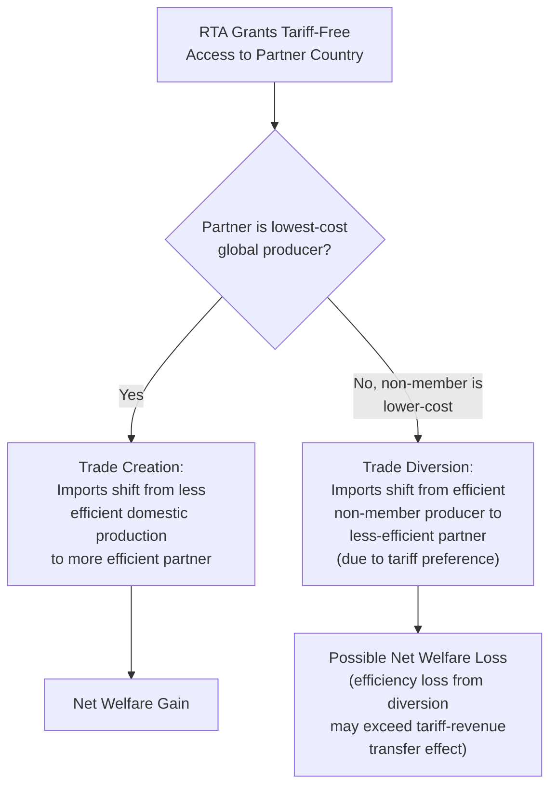

## Regional Trade Agreements and Agriculture

### Conceptual Framework

Regional trade agreements (RTAs) — encompassing free trade agreements (FTAs), customs unions, and broader economic integration agreements — represent preferential liberalization among a subset of countries, contrasted with the multilateral, most-favored-nation (MFN) liberalization pursued through the WTO. Agricultural provisions within RTAs have historically been among the most contentious and heavily carved-out elements of these negotiations, reflecting the same domestic political economy dynamics that have stalled multilateral agricultural liberalization at the WTO.

**Key Points**

- RTAs are permitted under WTO rules as an exception to the MFN principle, subject to conditions under GATT Article XXIV (for goods) requiring that substantially all trade between the parties be liberalized and that the agreement not raise overall barriers against non-member countries
- WTO Secretariat analysis presented in the lead-up to the 14th Ministerial Conference found that RTAs eliminate tariffs on a large share of agricultural tariff lines, though this proportion is significantly lower than the corresponding share for non-agricultural goods — a quantitative confirmation that agriculture remains disproportionately protected even within the preferential liberalization track, not merely at the multilateral level
- This pattern connects directly to the political economy analysis covered earlier in this material: concentrated agricultural producer interests exercise influence over RTA negotiating mandates just as they do over multilateral negotiating positions, producing systematically incomplete agricultural liberalization across both tracks

---

### Trade Creation and Trade Diversion in Agricultural RTAs

The standard analytical framework for evaluating any RTA's welfare effect, introduced under trade models, applies with particular force to agriculture given the sector's frequent status as the most heavily protected and therefore most price-distorted category of goods entering an RTA negotiation.

**Key Points**

- Agricultural trade diversion risk is particularly salient because many RTA partner countries are chosen on the basis of geographic proximity, historical relationship, or broader strategic/political considerations rather than being the lowest-cost global producer of a given agricultural commodity — increasing the likelihood that preferential access diverts trade away from more efficient non-member exporters
- The net welfare effect of any specific agricultural RTA provision is an empirical question requiring case-specific quantitative analysis (often using Computable General Equilibrium modeling, as covered under trade models), since the relative magnitude of trade creation versus trade diversion effects cannot be determined from the agreement's structure alone
- [Inference] Agricultural product categories subject to the longest phase-in periods, largest tariff-rate-quota carve-outs, or explicit exclusion from an RTA's general liberalization commitments are, by that same design choice, the categories where the underlying domestic political economy resistance was strongest — making the pattern of agricultural exceptions within any given RTA text a useful, if indirect, indicator of where protected domestic constituencies retained the most negotiating leverage

---

### Common Design Features for Agriculture in RTAs

#### Tariff-Rate Quotas and Phase-In Schedules

**Key Points**

- Rather than immediate, full tariff elimination, agricultural provisions in RTAs frequently employ **tariff-rate quotas with staged expansion** (an initial limited duty-free volume that grows over a multi-year or multi-decade phase-in period) and **long tariff-phase-out schedules** (sometimes spanning 15–20 years for the most sensitive product categories), mirroring the TRQ mechanism covered under tariffs, quotas, and non-tariff barriers but implemented bilaterally/regionally rather than as a multilateral WTO commitment
- **Sensitive product designations** allow negotiating parties to exclude specific agricultural categories from full liberalization entirely, or to apply substantially longer phase-in periods than the agreement's general schedule — a formal mechanism for accommodating the political economy reality that full, immediate agricultural liberalization is often not domestically achievable even when a government is otherwise committed to an RTA

#### Rules of Origin

**Key Points**

- Rules of origin determine which country a product is deemed to originate from for purposes of qualifying for the RTA's preferential tariff treatment, and are particularly consequential for processed agricultural and food products with multi-country supply chains (e.g., a processed food product using imported sugar, packaging, or intermediate ingredients from outside the RTA)
- Restrictively designed rules of origin (requiring a high percentage of regional value content, or specific "substantial transformation" criteria) can significantly limit the practical trade-liberalizing benefit of a nominal tariff preference, effectively functioning as a partial non-tariff barrier even where the headline tariff commitment appears fully liberalizing
- **Tariff-rate quota "TRQ-within-RTA" stacking** can occur where an RTA partner's preferential access operates alongside the country's separate multilateral WTO TRQ commitments, creating layered market-access rules that require careful interpretation to determine the effective landed cost for any specific import transaction

#### Sanitary and Phytosanitary Provisions

**Key Points**

- Many modern RTAs include dedicated SPS chapters that go beyond baseline WTO SPS Agreement commitments, establishing bilateral/regional cooperation mechanisms, mutual recognition arrangements, or expedited dispute consultation procedures specifically for agricultural health and safety regulatory issues
- Because SPS measures can function as either legitimate health protection or disguised protectionism (as discussed under non-tariff barriers), RTA SPS chapters often aim to increase transparency and scientific-basis requirements between the specific parties to the agreement, potentially reducing SPS-related trade friction between RTA partners beyond what the general multilateral SPS Agreement achieves — though the degree of practical improvement varies considerably by agreement and by the specific regulatory relationship between the parties involved

---

### Case Illustration: Supply-Managed Sectors in Trade Negotiations

**Key Points**

- Canada's dairy, poultry, and egg supply management system (covered under supply control and production quotas) has been a recurring, prominently contested issue in Canadian RTA negotiations, including the United States-Mexico-Canada Agreement (USMCA) and the Comprehensive and Progressive Agreement for Trans-Pacific Partnership (CPTPP)
- Rather than eliminating supply management, Canada has generally negotiated to preserve the underlying domestic system while granting negotiated increases in tariff-rate-quota access for specific partner countries — an outcome illustrating how deeply entrenched, capitalized domestic agricultural policy architectures (recall the quota capitalization dynamic discussed under supply control) can constrain the scope of agricultural liberalization achievable even within an otherwise comprehensive regional agreement
- [Inference] This pattern — preserving a politically entrenched domestic support structure while granting incremental, negotiated market-access concessions at the margin — is a recurring template observable across multiple countries' politically sensitive agricultural sectors in RTA negotiations, reflecting the broader political economy principle that capitalized policy rents generate strong resistance to abrupt structural change, making incremental concession more politically achievable than wholesale reform

---

### Comparative Table: Multilateral vs. Regional Agricultural Liberalization

| Dimension | Multilateral (WTO) | Regional/Preferential (RTA) |
| --- | --- | --- |
| Scope of liberalization | All WTO members (MFN basis) | Limited to agreement parties |
| Negotiating pace (agriculture) | Stalled since 2008 (Doha collapse); incremental outcomes only | Generally faster, though still incomplete for agriculture |
| Typical agricultural coverage | Bound tariffs, TRQs, AMS ceilings | Phase-in schedules, sensitive product exclusions, RTA-specific TRQs |
| Trade diversion risk | Not applicable (non-discriminatory by design) | Present; empirically variable by agreement |
| Political economy dynamic | Diffuse across 160+ members; consensus-based, slow | Concentrated between fewer parties; faster but still shaped by strongest domestic lobbies |
| Dispute mechanism | WTO Dispute Settlement (currently constrained by non-functioning Appellate Body) | Agreement-specific dispute mechanisms, variable in strength |

---

### Interaction with the Broader Multilateral Stalemate

**Key Points**

- The prolonged stalemate in multilateral agricultural negotiations at the WTO — including the outcome at the 14th Ministerial Conference (MC14) in Yaoundé, where agriculture was deferred back to Geneva for further work without a substantive multilateral outcome — has contributed to a broader shift in agricultural trade liberalization activity toward the regional/preferential track, as governments seeking further agricultural market access pursue bilateral and regional agreements where multilateral consensus has proven elusive
- This shift carries an efficiency trade-off relative to multilateral liberalization: RTA-based liberalization, even where successful, generates the trade-diversion risk described above and produces a fragmented landscape of overlapping preferential rules (rules of origin, differing TRQ schedules, differing SPS cooperation arrangements) — sometimes termed the **"spaghetti bowl" effect** — that can raise compliance complexity for exporters navigating multiple simultaneous preferential arrangements with different rules
- [Inference] Given the continued incompleteness of multilateral agricultural liberalization following MC14, the relative importance of the regional/preferential track for agricultural market access is likely to remain significant in the near term, though the specific trajectory of any individual RTA negotiation is contingent on country-specific political and economic developments that should be tracked through current trade policy reporting rather than assumed static

---

### Numerical Illustration: RTA Tariff Phase-In for a Sensitive Product

**Example**

An RTA negotiation designates dairy as a "sensitive product," with the general agreement schedule calling for immediate tariff elimination on 90% of tariff lines but a 15-year staged phase-out for dairy specifically, alongside an initial TRQ of 5,000 tons duty-free access growing by 3% annually.

$$Q_{\text{TRQ}}(t) = 5{,}000 \times (1.03)^t \quad \text{tons, in year } t \text{ after entry into force}$$

At year 10: $Q_{\text{TRQ}}(10) = 5{,}000 \times (1.03)^{10} \approx 6{,}719$ tons — illustrating how even a nominally "included" sensitive product can see market access expand only gradually over the agreement's implementation period, in contrast to the immediate liberalization applied to the RTA's non-sensitive tariff lines. This gradual, negotiated expansion pattern is the practical mechanism through which RTAs accommodate politically sensitive agricultural sectors without either fully excluding them or fully exposing them to immediate competitive pressure — a middle path directly comparable to the phase-in and TRQ mechanisms used in multilateral WTO market-access commitments, but customized to the specific bilateral/regional political negotiation.

---

**Related Topics**

- Tariffs, quotas, and non-tariff barriers (TRQ and rules-of-origin mechanics)
- World Trade Organization agriculture agreements (multilateral market access pillar)
- Supply control and production quotas (Canadian supply management case)
- Trade models and gains from trade (trade creation/diversion framework)
- Political economy of agricultural policy (domestic constraints on negotiators)
- USMCA and CPTPP agricultural market access provisions
- Sanitary and phytosanitary cooperation mechanisms in RTAs
- Computable General Equilibrium modeling of RTA welfare effects
- The "spaghetti bowl" effect and overlapping preferential trade rules
- Sensitive product designations and phase-in schedule design in trade negotiations