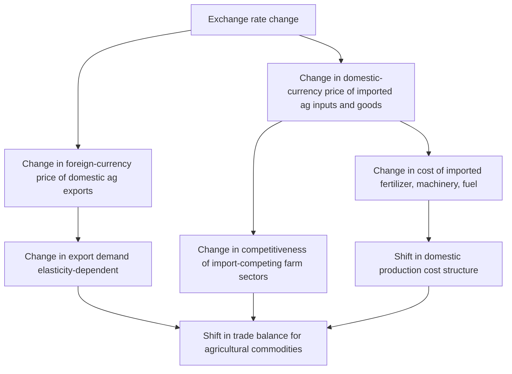

## Exchange Rates and Agricultural Competitiveness

### Overview

**Key Points**

- Exchange rate movements alter the relative price of a country's agricultural output in world markets independent of any change in production costs, yields, or quality.
- Agricultural competitiveness in international trade is jointly determined by real production efficiency (comparative advantage) and the nominal/real exchange rate that translates domestic costs into foreign-currency prices.
- Because agricultural commodities are largely tradable, homogeneous, and price-sensitive, agricultural trade flows tend to be highly responsive to currency movements relative to many manufactured or service sectors.

### Exchange Rate Fundamentals

#### Nominal vs. Real Exchange Rates

The **nominal exchange rate** ($e$) is the price of one currency in terms of another, e.g., pesos per US dollar. A change in $e$ shifts the foreign-currency price of a good without any change in domestic production cost.

The **real exchange rate** ($RER$) adjusts the nominal rate for relative price levels between two countries:

$$RER = e \times \frac{P^*}{P}$$

where $P^*$ is the foreign price level and $P$ is the domestic price level. The real exchange rate is the theoretically correct measure of competitiveness because it captures purchasing power, not just currency conversion. A country can experience nominal depreciation but see no competitiveness gain if domestic inflation offsets it.

#### Appreciation and Depreciation Effects

| Currency Movement | Effect on Domestic Agricultural Exports | Effect on Agricultural Imports |
| --- | --- | --- |
| Domestic currency depreciates | Exports become cheaper in foreign currency → more competitive | Imports become more expensive in domestic currency |
| Domestic currency appreciates | Exports become more expensive in foreign currency → less competitive | Imports become cheaper in domestic currency |

**Example**

If the Philippine peso depreciates from ₱50/$1 to ₱56/$1, a Philippine banana exporter selling at ₱28/kg now only needs $0.50/kg to break even in dollar terms (down from $0.56/kg), making the exporter more price-competitive against, say, Ecuadorian bananas priced in dollars — with no change in farm-level productivity.

### Transmission Mechanism to Agricultural Trade

Three simultaneous channels operate:

1. **Export-price channel** — depreciation lowers the foreign-currency price of exportables, raising foreign demand (subject to elasticity).
2. **Import-cost channel** — depreciation raises the domestic-currency cost of imported agricultural inputs (fertilizer, pesticides, fuel, machinery, feed grains), which can offset gains by raising production costs.
3. **Import-competition channel** — depreciation makes imported food and agricultural products more expensive domestically, protecting import-competing farmers (e.g., domestic rice vs. imported rice).

### Elasticity Considerations

The competitiveness effect of a currency movement depends on the price elasticity of demand and supply for the commodity in question.

- **Elastic export demand** (many substitute suppliers, homogeneous commodity — e.g., soybeans, wheat, cotton): a small depreciation produces a large volume response, strongly boosting export revenue and market share.
- **Inelastic export demand** (differentiated or branded products, geographic indications, niche high-value goods — e.g., specialty coffee, certain wines, protected-origin cheeses): exchange rate changes have a muted effect on volumes; competitiveness rests more on quality/branding than price.
- **Supply response lags**: agricultural supply is often slow to respond to price signals due to biological production cycles (planting seasons, perennial crop maturation, livestock herd rebuilding), so short-run competitiveness gains from depreciation may not translate into export volume increases within the same season. [Inference]

$$\%\Delta Q_x = \eta_x \times \%\Delta P_x^{*}$$

where $\eta_x$ is the price elasticity of export demand and $P_x^{*}$ is the foreign-currency export price.

### The J-Curve Effect in Agricultural Trade

Following a depreciation, a country's trade balance often initially worsens before improving — the **J-curve effect** — because:

1. Existing export/import contracts are denominated and lag in adjusting to new prices.
2. Import volumes remain temporarily unchanged while import bills (in domestic currency) rise immediately.
3. Export volume responses require time due to production and shipping lags, particularly acute in agriculture given planting/harvest cycles.

[Inference] The magnitude and duration of the J-curve dip in agriculture is generally considered longer than in manufacturing, given planting-to-harvest lags and existing forward contracts common in commodity trade, though the empirical evidence varies by commodity and country.

### Cost-Side Effects: Imported Inputs

Modern agriculture is import-input-intensive even in exporting nations. Key imported inputs whose cost is exchange-rate sensitive:

- **Fertilizers** (especially urea, potash, phosphates — often internationally traded and priced in USD)
- **Agrochemicals** (pesticides, herbicides)
- **Fuel and diesel** for machinery and irrigation pumps
- **Farm machinery and spare parts**
- **Feed grains** (soybean meal, corn) for livestock and aquaculture operations

A depreciation that boosts export competitiveness on the output side can simultaneously raise input costs, compressing farm margins. Net competitiveness depends on:

$$\Delta \pi = \Delta R_{exports} - \Delta C_{imported\ inputs}$$

where $\Delta \pi$ is the net change in farm profitability, $\Delta R_{exports}$ is the change in export revenue, and $\Delta C_{imported\ inputs}$ is the change in imported input costs.

For countries where agriculture is a net input importer relative to export value (common in intensive livestock or high-input horticulture systems), depreciation can be net negative for competitiveness despite the nominal export-price advantage. [Inference]

### Real Effective Exchange Rate (REER) and Agricultural Competitiveness

Because countries trade agricultural goods with many partners simultaneously, analysts use the **Real Effective Exchange Rate (REER)** — a trade-weighted average of bilateral real exchange rates against major trading partners:

$$REER = \prod_{i=1}^{n} \left( RER_i \right)^{w_i}$$

where $w_i$ is the trade weight of partner $i$ (such that $\sum w_i = 1$) and $RER_i$ is the bilateral real exchange rate with partner $i$.

A rising REER indicates real appreciation and loss of aggregate agricultural competitiveness across all trading partners combined; a falling REER indicates real depreciation and competitiveness gains. REER is generally preferred over any single bilateral rate for assessing a country's overall agricultural trade position because export destinations and input-source countries are typically diversified.

### Dutch Disease and Agricultural Competitiveness

**Dutch Disease** describes a phenomenon where a resource or commodity export boom (e.g., oil, minerals) causes currency appreciation that damages the competitiveness of other tradable sectors, notably agriculture and manufacturing.

Mechanism:

1. A commodity boom (e.g., oil exports) generates large foreign exchange inflows.
2. The domestic currency appreciates in real terms.
3. Non-boom tradable sectors (agriculture) become less price-competitive internationally.
4. Resources (labor, capital) may also shift toward the booming sector, further eroding agricultural output ("resource movement effect").

This is a well-documented concern for oil- or mineral-exporting economies with significant agricultural sectors, such as Nigeria and Venezuela historically. [Unverified — country-specific magnitude and current policy context should be checked against current data]

### Exchange Rate Regimes and Agricultural Policy Interaction

| Regime | Implication for Agricultural Competitiveness |
| --- | --- |
| **Fixed/pegged** | Insulates agricultural prices from short-run currency volatility but risks prolonged misalignment (over/undervaluation) if the peg is not adjusted to reflect fundamentals |
| **Floating** | Allows continuous market-driven adjustment but exposes farm revenue and input costs to exchange rate volatility and uncertainty, complicating planning for long-gestation crops |
| **Managed float / crawling peg** | Attempts to balance stability with gradual adjustment; common in many agricultural exporting emerging markets |

Governments sometimes intervene in currency markets or use capital controls partly to manage agricultural trade competitiveness, though this is one of several macroeconomic objectives (inflation control, capital flow management) competing for policy priority. [Inference]

### Currency Risk Management for Agricultural Traders

**Key Points**

- Agricultural exporters and importers face **transaction exposure** (risk on specific contracted future payments/receipts) and **economic exposure** (risk to long-run competitive position from sustained currency shifts).
- Common hedging instruments include:
  - **Forward contracts**: lock in an exchange rate for a future transaction date, commonly used by grain trading houses and cooperatives.
  - **Futures contracts**: standardized, exchange-traded currency contracts.
  - **Options**: provide the right (not obligation) to exchange at a set rate, preserving upside if the currency moves favorably.
  - **Natural hedging**: matching foreign-currency revenues with foreign-currency-denominated input costs or debt.
- Many smallholder farmers and cooperatives in developing countries lack access to formal hedging instruments and bear currency risk directly or through intermediaries (traders, exporters) who adjust farm-gate prices accordingly. [Inference]

### Empirical Considerations and Measurement

- **Terms of trade** for agriculture combine exchange rate effects with underlying commodity price movements; a depreciation coinciding with a global commodity price slump may not yield net competitiveness gains.
- **Pass-through rates** — the degree to which exchange rate changes are reflected in traded prices — are often incomplete in agriculture due to pricing-to-market behavior by exporters, existing distribution contracts, and market power of intermediaries (grain traders, processors, retailers). [Inference]
- Farm-gate price transmission of exchange rate changes is frequently partial and delayed, particularly in countries with underdeveloped marketing infrastructure, meaning currency-driven competitiveness gains at the border do not always reach producers proportionally. [Inference]

### Policy Tools Affecting Agricultural Exchange Rate Exposure

- **Export taxes/subsidies**: can be adjusted to offset or amplify exchange-rate-driven competitiveness shifts (e.g., export taxes on grain during depreciation episodes to manage domestic food price inflation).
- **Strategic reserves and buffer stocks**: used to decouple domestic food prices from currency-driven import cost volatility.
- **Exchange rate stabilization funds**: some agriculture-dependent economies maintain stabilization mechanisms tied to commodity export revenues.
- **Multilateral and regional trade agreements**: while these primarily address tariffs and non-tariff barriers, they do not neutralize exchange rate effects, which operate independently of trade policy instruments.

### Worked Example

**Example**

Suppose Country A exports rice and imports fertilizer, both priced internationally in USD. Country A's currency depreciates 10% in nominal terms, while domestic inflation is 4% and foreign (partner) inflation is 2% over the same period.

Real exchange rate change:

$$\%\Delta RER \approx \%\Delta e + \%\Delta P^{*} - \%\Delta P = 10\% + 2\% - 4\% = 8\%$$

This 8% real depreciation improves Country A's real competitiveness. If export demand elasticity for rice is $\eta_x = -1.5$, the expected export volume response is approximately:

$$\%\Delta Q_x \approx 1.5 \times 8\% = 12\%$$

However, if fertilizer constitutes 20% of production cost and its domestic-currency price rises with the full 10% nominal depreciation, farm costs rise by approximately $0.20 \times 10\% = 2\%$, partially offsetting the competitiveness gain on the revenue side. Net effect on farm profitability requires comparing the 12% volume/revenue gain against the 2% cost increase — in this stylized case, net competitiveness improves, but the margin is narrower than the export-price effect alone would suggest.

### Diagram: Net Competitiveness Determination (svg_diagram)

<svg xmlns="http://www.w3.org/2000/svg" viewBox="0 0 720 380">
\<style\>
.box { fill: #f5f5f5; stroke: #333; stroke-width: 1.5; }
.boxAlt { fill: #e8f0e8; stroke: #333; stroke-width: 1.5; }
.label { font-family: Arial, sans-serif; font-size: 13px; fill: #111; }
.title { font-family: Arial, sans-serif; font-size: 15px; font-weight: bold; fill: #111; }
.arrow { stroke: #333; stroke-width: 1.5; marker-end: url(#arrow); fill: none; }
\</style\>
<text x="360" y="24" text-anchor="middle" class="title">Net Agricultural Competitiveness Determination (svg_diagram)</text>

<rect x="30" y="55" width="200" height="60" class="box" />
<text x="130" y="80" text-anchor="middle" class="label">Currency Depreciation</text>
<text x="130" y="98" text-anchor="middle" class="label">(Real Exchange Rate ↓)</text>
<rect x="490" y="55" width="200" height="60" class="box" />
<text x="590" y="80" text-anchor="middle" class="label">Currency Appreciation</text>
<text x="590" y="98" text-anchor="middle" class="label">(Real Exchange Rate ↑)</text>
<rect x="30" y="160" width="200" height="60" class="boxAlt" />
<text x="130" y="182" text-anchor="middle" class="label">Export Revenue Effect</text>
<text x="130" y="200" text-anchor="middle" class="label">(+) via lower foreign price</text>
<rect x="260" y="160" width="200" height="60" class="box" />
<text x="360" y="182" text-anchor="middle" class="label">Imported Input Cost Effect</text>
<text x="360" y="200" text-anchor="middle" class="label">(−) via higher input prices</text>
<rect x="490" y="160" width="200" height="60" class="boxAlt" />
<text x="590" y="182" text-anchor="middle" class="label">Import-Competing Effect</text>
<text x="590" y="200" text-anchor="middle" class="label">(+) domestic market protected</text>
<rect x="210" y="280" width="300" height="70" class="box" />
<text x="360" y="305" text-anchor="middle" class="label">Net Competitiveness =</text>
<text x="360" y="325" text-anchor="middle" class="label">Δ Export Revenue − Δ Input Costs</text>
<text x="360" y="343" text-anchor="middle" class="label">+ Δ Import-Substitution Gains</text>
<path d="M130,115 L130,160" class="arrow" />
<path d="M590,115 L590,160" class="arrow" />
<path d="M230,190 L490,190" class="arrow" />
<path d="M130,220 L280,280" class="arrow" />
<path d="M360,220 L360,280" class="arrow" />
<path d="M590,220 L440,280" class="arrow" />
</svg>

### Common Misconceptions

- **"Depreciation always helps agricultural exporters"** — incomplete; it depends on input import intensity, elasticity of demand, and whether inflation erodes the real (not just nominal) exchange rate gain.
- **"Exchange rate is the primary determinant of agricultural competitiveness"** — real competitiveness also depends fundamentally on productivity, infrastructure (ports, cold chain, logistics), quality standards compliance, and non-tariff barriers; exchange rate is one of several determinants. [Inference]
- **"A weak currency is a deliberate trade strategy"** — in most floating-rate economies, exchange rates are market-determined and influenced by capital flows, interest rate differentials, and broader macroeconomic conditions rather than being a direct agricultural policy lever. [Inference]

### Conclusion

Exchange rate movements affect agricultural competitiveness through multiple, sometimes offsetting channels: export-price effects, imported input cost effects, and import-competition effects. The real (inflation-adjusted) and effective (trade-weighted) exchange rate are more accurate competitiveness indicators than the nominal bilateral rate. Structural factors — input dependency, demand elasticity, supply response lags, and market pass-through — determine how fully currency movements translate into actual trade and farm income outcomes. Policymakers and agribusiness strategists must therefore assess exchange rate exposure jointly with underlying productivity fundamentals rather than treating currency movements as a stand-alone competitiveness lever.

**Related Topics**

- Terms of trade and agricultural commodity price cycles
- Purchasing Power Parity (PPP) and its limitations in agricultural pricing
- Dutch Disease case studies in resource-rich agricultural economies
- Agricultural export taxes and quantitative restrictions as competitiveness tools
- Currency hedging instruments for commodity trading houses and cooperatives
- Price transmission and farm-gate pass-through in developing country supply chains
- WTO Agreement on Agriculture and its interaction with exchange-rate-driven trade distortions
- Global value chains in agri-food trade and currency exposure across supply chain stages