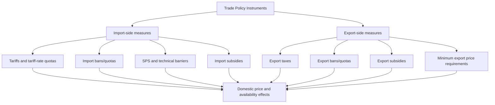

## Food Security and Trade Policy

### Overview

**Key Points**

- Food security is defined by the FAO across four pillars: **availability**, **access**, **utilization**, and **stability**, and trade policy interacts with each pillar differently, sometimes reinforcing and sometimes undermining food security objectives.
- Trade can enhance food security by allowing countries to source food from lower-cost producers and buffer domestic production shocks, but excessive trade dependence creates exposure to global price volatility and supply disruptions.
- The tension between **open trade** (efficiency, diversification of supply) and **self-sufficiency** (insulation from external shocks) is a central and recurring policy debate in agricultural trade.

### The Four Pillars of Food Security and Trade Linkages

| Pillar | Definition | Trade Policy Linkage |
| --- | --- | --- |
| **Availability** | Sufficient quantities of food supplied through production, stocks, and trade | Imports supplement domestic shortfalls; export restrictions can reduce global availability |
| **Access** | Ability of individuals/households to obtain food through income, prices, or entitlements | Tariffs and trade barriers raise domestic food prices, reducing purchasing power access |
| **Utilization** | Adequate nutrition through food safety, diversity, and biological absorption | Trade affects dietary diversity by enabling access to varied food categories (SPS standards matter here) |
| **Stability** | Consistent access to food over time, without disruptive shocks | Trade can stabilize supply across harvest failures in different regions, or destabilize via sudden trade policy shifts |

### Trade Openness and Food Security: Competing Views

#### The Comparative Advantage / Efficiency View

Standard trade theory holds that countries should specialize according to comparative advantage and trade for the rest, which:

- Increases global food production efficiency by allocating cultivation to lower-cost, higher-yield regions.
- Lowers average world food prices and expands access for import-dependent, food-deficit countries.
- Diversifies supply sources, reducing exposure to any single country's production shock (weather, pests, disease).

#### The Food Sovereignty / Self-Sufficiency View

Critics argue that heavy reliance on imports for staple foods:

- Exposes food-import-dependent countries to global price spikes and supply shocks outside domestic control.
- Creates vulnerability when major exporters impose export restrictions during crises (a well-documented pattern during the 2007–2008 and 2010–2011 global food price crises).
- Undermines domestic agricultural sectors and rural livelihoods if cheap imports displace local production.

$$SSR = \frac{Q_{domestic\ production}}{Q_{domestic\ consumption}} \times 100$$

The **Self-Sufficiency Ratio (SSR)** is a commonly used metric; an SSR below 100% indicates net import dependence for that commodity.

### Trade Policy Instruments Affecting Food Security

#### Import-Side Measures

- **Tariffs**: raise domestic prices of imported food, protecting domestic producers but reducing consumer access (a direct availability-vs-access tradeoff).
- **Tariff-rate quotas (TRQs)**: allow a fixed quantity at low/no tariff, with higher tariffs beyond the quota — used to balance protection with minimum market access commitments (common under WTO Agreement on Agriculture commitments).
- **Import bans/quotas**: used to protect domestic producers or respond to sanitary/phytosanitary (SPS) concerns, but can restrict availability during domestic shortfalls if imports are needed.
- **SPS and technical barriers to trade (TBT)**: legitimate food-safety measures that can also function as disguised protectionism; the WTO SPS Agreement requires such measures be science-based.

#### Export-Side Measures

- **Export taxes**: used to keep domestic food prices lower by discouraging exports (raises domestic availability, may depress producer incentives to plant more).
- **Export bans and quotas**: frequently imposed during price spikes or domestic shortages to protect domestic consumers; empirically, these have often amplified global price volatility because major exporters exiting the market simultaneously reduces world supply and triggers panic buying by importers. [Inference]
- **Export subsidies**: historically used to dispose of surplus production (e.g., EU Common Agricultural Policy pre-reform, US commodity programs); now heavily disciplined under WTO rules due to trade-distorting effects on world prices.
- **Minimum export price (MEP) requirements**: set a floor price for exports, sometimes used to manage export volumes indirectly (e.g., India's historical use for onions and rice).

### Case Study Pattern: Export Restrictions During Price Crises

**Example**

During the 2007–2008 global food price crisis, more than 30 countries implemented some form of export restriction (bans, taxes, or licensing requirements) on staple grains including rice, wheat, and maize. Major rice exporters restricting exports contributed to a rapid escalation in world rice prices, disproportionately harming import-dependent food-deficit countries. This pattern illustrates a **coordination failure**: export restrictions are individually rational for a food-exporting government seeking to protect domestic consumers, but collectively they remove supply from the world market precisely when global demand for imports is highest, amplifying the price spike they were intended to mitigate. [Inference — this is a widely cited explanation in the trade policy literature, though the precise quantitative contribution of export restrictions versus other factors, such as biofuel demand and speculative activity, remains debated among researchers]

### The WTO Framework and Food Security

#### Agreement on Agriculture (AoA) Pillars

1. **Market access**: tariff reductions and TRQ commitments.
2. **Domestic support**: classification of subsidies into "boxes" by trade-distorting potential:
   - **Amber Box**: trade-distorting domestic support subject to reduction commitments (e.g., price supports).
   - **Blue Box**: production-limiting support, exempted from reduction.
   - **Green Box**: minimally trade-distorting support (research, infrastructure, decoupled income support, food security stockholding under specific conditions), exempt from reduction commitments.
3. **Export competition**: disciplines on export subsidies.

#### Public Stockholding for Food Security Purposes

A significant ongoing WTO negotiating issue concerns developing countries' public stockholding programs (procuring food at administered prices for food security reserves), which can exceed Amber Box de minimis thresholds under AoA accounting rules. The 2013 Bali "Peace Clause" provides a temporary safeguard against dispute settlement challenges for such programs pending a permanent solution, which remains under negotiation. [Unverified — current negotiating status should be checked, as WTO Agreement on Agriculture reform discussions are ongoing and subject to change]

### Food Security Stability Mechanisms Involving Trade

- **Strategic grain reserves**: domestically held stocks used to buffer against trade disruptions or domestic production shortfalls; costly to maintain (storage, spoilage, opportunity cost of capital) but reduce reliance on import timing.
- **Regional trade integration and food security**: regional agreements can pool production risk across geographically diverse members with different climate/weather exposure, potentially improving aggregate regional food security stability compared to full autarky. [Inference]
- **Diversified import sourcing**: policies encouraging multiple supplier countries reduce single-source disruption risk (a supply-chain risk management principle applied to national food security).
- **Early warning and market information systems**: e.g., the **Agricultural Market Information System (AMIS)**, established after the 2007–2008 crisis by G20 countries, improves transparency on stock levels and production forecasts to reduce panic-driven export restrictions.

### Analytical Framework: Trade Policy Tradeoff Matrix

| Policy Goal | Trade Liberalization | Trade Protection/Restriction |
| --- | --- | --- |
| Consumer price access (short run) | Generally improves | Generally worsens |
| Domestic producer incentives | Can be undermined by cheap imports | Generally protected |
| Supply diversification / stability | Improves via multiple sourcing | Reduces (reliance on domestic production only) |
| Exposure to global price volatility | Increases | Decreases (for imports); but export restrictions increase global volatility for others |
| Fiscal cost | Generally lower (no subsidy outlay) | Can be high (subsidies, stockholding costs) |
| Compliance with WTO commitments | Generally supportive | May require exemptions or violate commitments |

### Food Security Indicators Relevant to Trade Analysis

- **Import dependency ratio**: share of domestic consumption met by imports.
- **Cereal import bill as % of export earnings**: a measure of trade vulnerability — a rising ratio signals worsening ability to finance food imports from export revenue.
- **Global Food Security Index (GFSI)**: composite index incorporating affordability, availability, quality/safety, and natural resource resilience, published by Economist Impact.
- **Prevalence of Undernourishment (PoU)**: FAO's core hunger metric, used alongside trade data to assess whether trade openness correlates with improved nutrition outcomes in a given country context.

### Diagram: Food Security–Trade Policy Interaction (svg_diagram)

<svg xmlns="http://www.w3.org/2000/svg" viewBox="0 0 720 400">
\<style\>
.box { fill: #f5f5f5; stroke: #333; stroke-width: 1.5; }
.boxAlt { fill: #eaf0fa; stroke: #333; stroke-width: 1.5; }
.boxWarn { fill: #faf0ea; stroke: #333; stroke-width: 1.5; }
.label { font-family: Arial, sans-serif; font-size: 12.5px; fill: #111; }
.title { font-family: Arial, sans-serif; font-size: 15px; font-weight: bold; fill: #111; }
.arrow { stroke: #333; stroke-width: 1.5; marker-end: url(#arrow2); fill: none; }
\</style\>
<text x="360" y="24" text-anchor="middle" class="title">Food Security–Trade Policy Interaction (svg_diagram)</text>

<rect x="270" y="45" width="180" height="50" class="box" />
<text x="360" y="75" text-anchor="middle" class="label">Trade Policy Decision</text>
<rect x="60" y="130" width="180" height="55" class="boxAlt" />
<text x="150" y="152" text-anchor="middle" class="label">Liberalize</text>
<text x="150" y="170" text-anchor="middle" class="label">(lower tariffs, open imports)</text>
<rect x="480" y="130" width="180" height="55" class="boxWarn" />
<text x="570" y="152" text-anchor="middle" class="label">Restrict</text>
<text x="570" y="170" text-anchor="middle" class="label">(export ban, high tariff)</text>
<rect x="30" y="230" width="200" height="60" class="box" />
<text x="130" y="252" text-anchor="middle" class="label">↑ Access (lower prices)</text>
<text x="130" y="270" text-anchor="middle" class="label">↑ Import dependence risk</text>
<rect x="260" y="230" width="200" height="60" class="box" />
<text x="360" y="252" text-anchor="middle" class="label">Domestic producers</text>
<text x="360" y="270" text-anchor="middle" class="label">face import competition</text>
<rect x="490" y="230" width="200" height="60" class="box" />
<text x="590" y="252" text-anchor="middle" class="label">↓ Global availability</text>
<text x="590" y="270" text-anchor="middle" class="label">↑ World price volatility</text>
<rect x="210" y="330" width="300" height="55" class="boxAlt" />
<text x="360" y="352" text-anchor="middle" class="label">Net food security outcome depends on</text>
<text x="360" y="370" text-anchor="middle" class="label">net importer/exporter status + income distribution</text>
<path d="M320,95 L170,130" class="arrow" />
<path d="M400,95 L560,130" class="arrow" />
<path d="M150,185 L150,230" class="arrow" />
<path d="M150,185 L360,230" class="arrow" />
<path d="M570,185 L590,230" class="arrow" />
<path d="M570,185 L360,230" class="arrow" />
<path d="M130,290 L300,330" class="arrow" />
<path d="M360,290 L360,330" class="arrow" />
<path d="M590,290 L420,330" class="arrow" />
</svg>

### Common Misconceptions

- **"Free trade always improves food security"** — depends critically on whether a country is a net food importer or exporter, the income distribution effects on the poor, and the resilience of global supply chains during shocks. [Inference]
- **"Self-sufficiency guarantees food security"** — self-sufficiency does not eliminate vulnerability to domestic production shocks (drought, pests, disease) and can raise average consumer prices if domestic production costs exceed world prices.
- **"Export bans protect global food security"** — export bans protect the banning country's domestic consumers in the short run but transfer and often amplify scarcity and price volatility onto the rest of the world market. [Inference]

### Conclusion

Food security and trade policy interact through a persistent tension between the efficiency gains of open trade and the resilience benefits of self-sufficiency and diversified sourcing. No single policy stance is universally optimal: outcomes depend on a country's net trade position, the specific commodity's tradability and elasticity, the distributional impact on vulnerable consumers versus domestic producers, and the coordination behavior of other trading partners during crises. The WTO Agreement on Agriculture provides a partial multilateral framework governing these instruments, but significant negotiating gaps remain, particularly around public stockholding and the treatment of export restrictions during emergencies.

**Related Topics**

- WTO Agreement on Agriculture: domestic support boxes in depth
- Global food price crises (2007–2008, 2010–2011): causal analysis
- Agricultural Market Information System (AMIS) and price transparency mechanisms
- Strategic grain reserves: design and fiscal cost tradeoffs
- Regional trade agreements and food security pooling (e.g., ASEAN, ECOWAS)
- Special and Differential Treatment (SDT) for developing countries in agricultural trade rules
- Food price volatility and speculative activity in commodity futures markets
- Nutrition-sensitive trade policy and dietary diversity outcomes