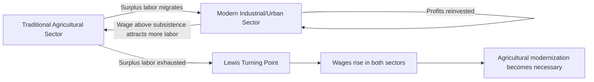

## Structural Transformation and Agriculture's Role

### Overview

**Key Points**

- Structural transformation refers to the long-run reallocation of economic activity — labor, capital, and output — away from agriculture toward manufacturing and services as an economy develops.
- Agriculture plays a dual role in this process: it must raise its own productivity to release labor and generate surplus, while simultaneously providing food, raw materials, capital, and market demand to support the growth of non-agricultural sectors.
- The pace and success of structural transformation shape poverty reduction, urbanization patterns, and the risk of "premature deindustrialization" in developing economies.

### Defining Structural Transformation

Structural transformation is the process by which an economy's sectoral composition shifts, typically characterized by:

1. A declining share of agriculture in GDP and employment.
2. A rising share of manufacturing (historically) and/or services in GDP and employment.
3. Rural-to-urban migration accompanying the sectoral shift.
4. Rising labor productivity as workers move from lower-productivity agriculture to higher-productivity non-agricultural sectors.

$$Structural\ Transformation\ Rate = \frac{\Delta(Share_{non-ag})}{\Delta t}$$

This pattern was first systematically documented by Simon Kuznets and later formalized in dual-economy models, most notably the **Lewis Model**.

### The Lewis Dual-Economy Model

**W. Arthur Lewis (1954)** framed development as the transfer of labor from a low-productivity traditional (agricultural) sector to a high-productivity modern (industrial) sector.

Key assumptions:

- The agricultural sector has **surplus labor** — labor whose marginal product is at or near zero, meaning it can be withdrawn without reducing total agricultural output.
- The modern sector pays a wage slightly above the rural subsistence wage to attract migrants.
- As long as surplus labor exists, the modern sector can expand employment at a roughly constant wage, generating profits that are reinvested, fueling further growth (this phase is sometimes called the "unlimited supply of labor" phase).
- The **Lewis turning point** occurs when surplus agricultural labor is exhausted, after which wages in both sectors begin rising together as the economy becomes more integrated.

**[Inference]** The Lewis model's assumption of zero marginal product labor in agriculture has been empirically challenged; many studies find agricultural labor's marginal product, while low, is generally positive, which affects how directly the model's predictions apply to specific country contexts.

### Agriculture's Multiple Contributions to Structural Transformation

Agricultural economist **Bruce Johnston and John Mellor (1961)** formalized agriculture's contributions to overall development, commonly summarized as four (sometimes five) linkages:

#### 1. Product (Food) Contribution

Agriculture supplies food for a growing non-agricultural population. Rising agricultural productivity keeps food prices stable/low, which:

- Prevents food price inflation from eroding real wages in the non-agricultural sector.
- Frees up household budget share for non-food goods, stimulating demand for manufactured products (linked to Engel's Law — the share of income spent on food declines as income rises).

#### 2. Market Contribution

Rising farm incomes create domestic demand for non-agricultural goods (consumer goods, agricultural inputs, machinery), stimulating industrial and service sector growth — sometimes called **agricultural demand-led industrialization (ADLI)**.

#### 3. Factor Contribution

Agriculture releases resources needed elsewhere:

- **Labor contribution**: surplus rural labor migrates to urban/industrial employment.
- **Capital contribution**: agricultural surplus (savings, taxation, or terms-of-trade transfers) can finance industrial investment.

#### 4. Foreign Exchange Contribution

Agricultural exports earn foreign currency that can finance imports of capital goods, machinery, and technology needed for industrialization, particularly important in early development stages before manufactured exports become competitive.

#### 5. (Sometimes added) Environmental/Ecosystem Contribution

Agricultural land use interacts with broader ecosystem services (water regulation, biodiversity), an increasingly emphasized dimension in contemporary development economics though not part of Johnston-Mellor's original 1961 framework. [Inference]

### Structural Transformation Patterns: Stylized Facts

| Development Stage | Agriculture's GDP Share | Agriculture's Employment Share | Key Dynamic |
| --- | --- | --- | --- |
| Low-income/early transformation | High (30–50%+) | Very high (50–80%+) | Subsistence-oriented, low productivity, high labor share |
| Middle-income/transformation phase | Declining (10–25%) | Declining but often still substantial (20–50%) | Productivity gap between ag and non-ag narrows slowly |
| High-income/post-transformation | Low (1–5%) | Low (1–5%) | Highly capital-intensive, mechanized agriculture; small labor share but high output per worker |

A persistent empirical regularity is that agriculture's **employment share** declines more slowly than its **GDP share**, meaning agricultural labor productivity typically remains below economy-wide average productivity throughout much of the transformation process — a pattern often called the **"agricultural productivity gap."**

$$Productivity\ Gap = \frac{(GDP_{ag}/L_{ag})}{(GDP_{non-ag}/L_{non-ag})}$$

Empirical studies across developing countries consistently find this ratio well below 1, though the interpretation (genuine productivity gap vs. measurement/selection issues, such as unmeasured non-farm income earned by farm households) remains debated in the literature. [Unverified — the precise magnitude varies substantially by country and dataset; consult current empirical studies for specific figures]

### Structural Transformation and Poverty Reduction

Because agriculture typically employs a disproportionate share of the poor in developing economies, agricultural productivity growth tends to have a strong poverty-reducing effect through several channels:

- **Direct income effect**: raises farm household incomes directly.
- **Food price effect**: increased food supply moderates prices, benefiting net food-buying poor households (including many landless rural and urban poor).
- **Labor market effect**: rising agricultural wages from increased farm labor demand.
- **Multiplier effect**: increased farm income spent locally on non-tradable goods and services generates rural non-farm employment.

**[Inference]** Cross-country empirical work (e.g., by researchers such as Christiaensen, Demery, and others) generally finds that GDP growth originating in agriculture reduces poverty more per unit of growth than equivalent growth originating in industry or services in low-income, agriculture-dependent economies, though this relationship is not universal and depends on land distribution and labor market structure.

### Risks and Complications in Structural Transformation

#### Premature Deindustrialization

Some developing economies are seeing manufacturing employment shares peak and decline at much lower income levels than historical industrializers (e.g., the UK, US, East Asian "tigers"), a pattern termed **premature deindustrialization** (associated with economist Dani Rodrik's work). This raises concerns that labor released from agriculture may move directly into low-productivity informal services rather than higher-productivity manufacturing, weakening the traditional structural transformation pathway. [Unverified — this remains an active area of debate in development economics, and country-specific evidence should be checked]

#### Urban Bias and Policy Distortions

Historically, many developing country governments implemented policies that taxed agriculture (via marketing boards, overvalued exchange rates, export taxes) to subsidize urban industrialization — a pattern documented extensively by economists such as **Robert Bates** in African contexts. This "urban bias" can suppress agricultural productivity growth and slow the very structural transformation process it was intended to support, by reducing farmer incentives to invest and innovate. [Inference]

#### Jobless Agricultural Growth Transition

If agricultural mechanization outpaces the creation of non-farm employment opportunities, labor can be displaced from agriculture faster than it is absorbed elsewhere, leading to rising urban unemployment/underemployment rather than productive structural transformation. [Inference]

### The Role of Agricultural Productivity Growth as a Precondition

A central debate in development economics concerns sequencing: whether agricultural productivity growth is a **necessary precondition** for successful industrialization, or whether industrialization can proceed independent of agricultural transformation (e.g., through resource exports or foreign aid-financed food imports).

Historical evidence from East Asian economies (Japan, South Korea, Taiwan) generally supports the view that agricultural productivity growth (often preceded by land reform and green revolution technology adoption) preceded and enabled successful industrialization by:

- Releasing labor without triggering food price crises.
- Generating rural savings later channeled into industrial investment.
- Building initial human capital and institutional capacity in rural areas.

[Inference] This sequencing pattern is influential in development policy but is not universally observed; some economies have pursued alternative paths, and the applicability of the East Asian sequence to other regional contexts (e.g., Sub-Saharan Africa) remains an active research and policy question.

### Diagram: Structural Transformation Pathway (svg_diagram)

<svg viewBox="0 0 740 420" xmlns="http://www.w3.org/2000/svg">
\<style\>
.box { fill: #f5f5f5; stroke: #333; stroke-width: 1.5; }
.boxAlt { fill: #eaf5ea; stroke: #333; stroke-width: 1.5; }
.boxWarn { fill: #f5eaea; stroke: #333; stroke-width: 1.5; }
.label { font-family: Arial, sans-serif; font-size: 12px; fill: #111; }
.title { font-family: Arial, sans-serif; font-size: 15px; font-weight: bold; fill: #111; }
.arrow { stroke: #333; stroke-width: 1.5; marker-end: url(#arrow3); fill: none; }
\</style\>
<defs>
<marker id="arrow3" markerWidth="10" markerHeight="10" refX="8" refY="3" orient="auto" markerUnits="strokeWidth">
<path d="M0,0 L0,6 L9,3 z" fill="#333"/>
</marker>
</defs>

<text x="370" y="24" text-anchor="middle" class="title">Structural Transformation Pathway (svg_diagram)</text>

<rect x="30" y="55" width="200" height="55" class="boxAlt"/>
<text x="130" y="78" text-anchor="middle" class="label">Agricultural</text>
<text x="130" y="95" text-anchor="middle" class="label">Productivity Growth</text>
<rect x="270" y="55" width="200" height="55" class="box"/>
<text x="370" y="78" text-anchor="middle" class="label">Food Surplus &</text>
<text x="370" y="95" text-anchor="middle" class="label">Released Labor</text>
<rect x="510" y="55" width="200" height="55" class="box"/>
<text x="610" y="78" text-anchor="middle" class="label">Stable Food Prices</text>
<text x="610" y="95" text-anchor="middle" class="label">& Rural Income Growth</text>
<rect x="30" y="160" width="200" height="55" class="box"/>
<text x="130" y="183" text-anchor="middle" class="label">Rural-Urban Labor</text>
<text x="130" y="200" text-anchor="middle" class="label">Migration</text>
<rect x="270" y="160" width="200" height="55" class="boxAlt"/>
<text x="370" y="183" text-anchor="middle" class="label">Industrial/Service Sector</text>
<text x="370" y="200" text-anchor="middle" class="label">Employment Growth</text>
<rect x="510" y="160" width="200" height="55" class="box"/>
<text x="610" y="183" text-anchor="middle" class="label">Demand for</text>
<text x="610" y="200" text-anchor="middle" class="label">Manufactured Goods</text>
<rect x="150" y="265" width="200" height="55" class="box"/>
<text x="250" y="288" text-anchor="middle" class="label">Rising Economy-wide</text>
<text x="250" y="305" text-anchor="middle" class="label">Labor Productivity</text>
<rect x="390" y="265" width="200" height="55" class="boxWarn"/>
<text x="490" y="288" text-anchor="middle" class="label">Risk: Premature</text>
<text x="490" y="305" text-anchor="middle" class="label">Deindustrialization</text>
<rect x="230" y="355" width="280" height="50" class="boxAlt"/>
<text x="370" y="375" text-anchor="middle" class="label">Structural Transformation</text>
<text x="370" y="392" text-anchor="middle" class="label">(Sustained Poverty Reduction)</text>
<path d="M230,82 L270,82" class="arrow"/>
<path d="M470,82 L510,82" class="arrow"/>
<path d="M130,110 L130,160" class="arrow"/>
<path d="M370,110 L370,160" class="arrow"/>
<path d="M610,110 L610,160" class="arrow"/>
<path d="M230,187 L270,187" class="arrow"/>
<path d="M470,187 L510,187" class="arrow"/>
<path d="M200,215 L250,265" class="arrow"/>
<path d="M400,215 L400,265" class="arrow"/>
<path d="M610,215 L520,265" class="arrow"/>
<path d="M300,320 L330,355" class="arrow"/>
<path d="M480,320 L420,355" class="arrow"/>
</svg>

### Common Misconceptions

- **"Structural transformation means agriculture disappears"** — agriculture's share shrinks relatively, but absolute agricultural output typically continues rising due to productivity gains even as its economic share falls.
- **"Industrialization alone drives transformation"** — agricultural productivity growth is generally viewed as a complementary, often necessary, enabling condition rather than a competing alternative to industrial growth. [Inference]
- **"All surplus agricultural labor has zero marginal product"** — a core simplifying assumption of the original Lewis model, widely qualified in subsequent empirical and theoretical literature.

### Conclusion

Structural transformation describes the long-run reallocation of labor and output from agriculture toward manufacturing and services, a pattern closely associated with rising incomes and declining poverty. Agriculture's role in this process extends well beyond simple food production: it supplies labor, capital, foreign exchange, and market demand that enable non-agricultural growth, per the Johnston-Mellor framework built on Lewis's dual-economy insight. However, the process is neither automatic nor risk-free — premature deindustrialization, urban policy bias, and jobless agricultural mechanization can all disrupt the classic transformation pathway, making agricultural productivity policy a continuing priority even in economies pursuing industrial and service-sector growth.

**Related Topics**

- Green Revolution technology adoption and productivity growth
- Agricultural productivity gap: measurement debates and explanations
- Premature deindustrialization (Dani Rodrik) and its implications for labor absorption
- Land reform as a precondition for agricultural productivity growth
- Rural non-farm economy and off-farm employment linkages
- Engel's Law and food demand elasticity across income levels
- East Asian development model: sequencing of agricultural and industrial policy
- Urban bias in agricultural pricing and marketing board policy history